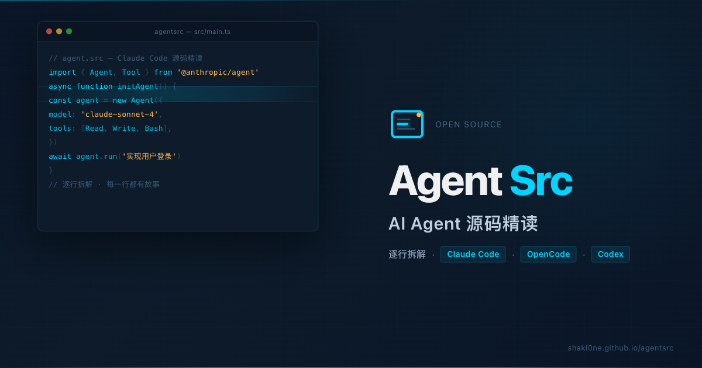

# Agent Src — AI Agent 源码精读

  

> 不教你"怎么用"，而是拆开源码，讲清 **Claude Code × OpenCode × Codex × DeepSeek Harness** 这些终端编程 Agent 为什么这么设计。

当所有人都在教你「怎么写 Prompt、怎么调 Agent API」——这个站点带你**拆开它**。每一篇都基于真实源码逐行走读，配架构图与权衡分析，追的是"为什么这么实现"，而不是"怎么用"。

## 阅读

- 站点：**https://shakl0ne.github.io/agentsrc/**

## 这个站点有什么不同

**不做使用教程，不做 Prompt 技巧合集**，专注于生产级 Agent 系统的骨架。

| 特色 | 说明 |
|------|------|
| **源码级精读** | 不搬运源码、不贴文档，逐行走读核心模块，追溯每个设计决策的动机与权衡 |
| **设计哲学而非使用指南** | 从主循环、上下文压缩到权限管线，提炼可迁移到任何 Agent 框架的设计原则 |
| **四款 Agent × 一条研究线** | Claude Code（Anthropic 官方）· OpenCode（TypeScript）· Codex（Rust）· DeepSeek Harness 全拆解，另设 Reading 专栏解读论文 |

**目前已拆解**

| 指标 | 数量 |
|------|------|
| 专栏文章 | 34 篇 |
| 覆盖 Agent 框架 | 4（Claude Code / OpenCode / Codex / DeepSeek Harness） |
| 精读框架 | TypeScript、Rust、Bun + React/Ink、Effect-TS、Cordis 插件框架 |

## 快速导航

- **看某款 Agent 的整体架构** → 从各专栏的 `01-overview` 读起
- **想做横向对比** → Codex vs Claude Code 设计哲学对比（`codex/08-philosophy`）
- **要看应用** → 子智能体编排、上下文压缩、工具权限管线，各专栏均有专文
- **想看论文与工程交叉** → Reading 专栏

## 适合谁

| 读者 | 收获 |
|------|------|
| **架构师** | Agent 设计空间全景与工程权衡 |
| **工程师** | 主循环、工具系统、上下文压缩的底层实现 |
| **Agent 使用者** | 理解设计意图，更有效地用它 |

## 内容目录

| 专栏 | 说明 |
|------|------|
| `claudecode/` | Claude Code 源码精读（10 篇） |
| `opencode/` | OpenCode 源码精读（7 篇） |
| `codex/`   | Codex 源码精读（8 篇） |
| `deepseek/`| DeepSeek Harness 源码精读（8 篇） |
| `reading/` | 论文解读与阅读随笔 |

## Star & 反馈

读到哪篇觉得有用，点个 Star。想提建议、纠错，或想让我拆开讲某个 Agent 机制，欢迎提 GitHub Issuses 或者在文章页下方评论区留言。

## License

[MIT](LICENSE)