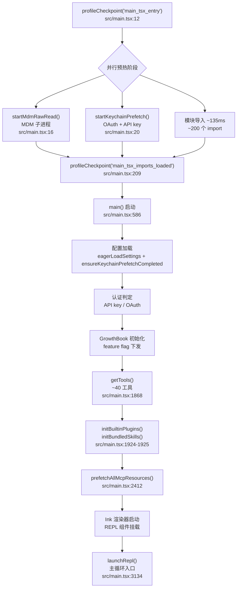
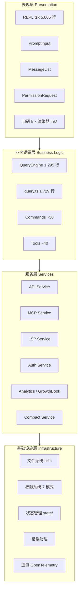

# Claude Code 整体架构：51 万行源码全景

Claude Code 是 Anthropic 官方出品的终端 AI 编程助手，也是当前最成熟的终端编程 Agent 之一。本系列开篇从宏观视角切入：先看清它的技术栈、源码组织、启动流程与分层架构，再为后续逐章精读奠定骨架。本文所有源码引用均可在 `src/` 目录下 grep 验证。

## 一、项目概览

### 1.1 定位与规模

Claude Code 是一个**纯客户端应用**：全部代码运行在用户本机，自身不包含任何模型推理逻辑，只负责构造请求、调用 Anthropic API、解析流式响应、调度工具并渲染终端 UI。模型能力完全来自远端，本地只做编排（orchestration）。

源码规模经实测统计（`src/` 下所有 `.ts`/`.tsx`）：

- 代码总量约 **512,664 行 TypeScript**
- 文件数量约 **1,884 个**
- 顶层条目 **53 个**（35 个目录 + 18 个文件）
- 入口文件 `src/main.tsx` 单文件 **4,683 行**

这个体量在终端 Agent 中属于第一梯队。作为对照，下表横向比较 Claude Code、OpenCode 与 Codex 三个同类工具：

| 维度 | Claude Code | OpenCode | Codex |
|------|-------------|----------|-------|
| 代码规模 | ~512k 行 TS / 1,884 文件 | ~440k 行 TS / 2,100 文件 | ~950k 行 Rust（含 vendored） |
| 运行时 | Bun | Bun / Node.js | 原生二进制（Rust 编译） |
| UI 框架 | React + Ink（自研 `ink/`） | SolidJS + `@opentui/solid` | ratatui（Rust TUI） |
| 状态管理 | 自定义 store + React Context | SolidJS 信号（`solid-primitives`） | Tokio + 原生结构体 |
| 工具数量 | ~40 | ~25 | ~20 |
| 主循环风格 | continuation-driven polling | 事件驱动 + async 流式 | Tokio event loop |
| 沙箱 | 无 | 无 | 跨平台沙箱 |
| 开源状态 | 未公开 | 开源 | 开源 |

需要特别说明的是：OpenCode 并未使用 React + Ink，而是采用 **SolidJS + `@opentui/solid`** 构建终端 UI——这是三者中技术选型差异最大的一处。Codex 则是纯 Rust 实现，借助 `ratatui` + `tokio` 走编译型原生路线。

### 1.2 纯客户端的本质

理解 Claude Code 的第一原则是：**它是一个编排器（orchestrator），不是推理引擎**。本地代码承担四件事：

1. 组织上下文（系统提示、历史消息、工具定义、记忆文件）
2. 向 Anthropic API 发起流式请求
3. 解析返回的 `tool_use` 块，在本地执行工具（读写文件、运行命令、调用 MCP）
4. 把工具结果回填为 `tool_result`，继续下一轮流式调用，直到模型返回 `message_stop`

这条「请求—工具—回填—再请求」的链路构成整个 Agent 的心跳。后文的主循环、工具系统、压缩机制都是围绕它展开的。

需要强调的一点是「纯客户端」并不等于「单进程」。Claude Code 内部仍会派生子进程执行 shell 命令、调用 MCP server、运行 LSP；但所有这些子进程都是**工具执行的载体**，而非模型推理的承载者。模型能力始终来自远端 API，本地只决定「什么时候调、调什么工具、怎么把结果拼回去」。这种「重编排、轻计算」的定位，直接决定了它为何能把 51 万行代码几乎全部花在 UI、工具、权限、上下文管理与流程编排上，而几乎没有自研模型相关代码。

## 二、技术栈细节

### 2.1 Bun 运行时与 `bun:bundle` 死代码消除

Claude Code 选择 **Bun** 而非 Node.js 作为运行时，原因有三：

- **启动速度**：Bun 启动开销显著低于 Node.js，配合下文将看到的并行预热策略，能把首屏时间压到数百毫秒级。
- **原生 TypeScript**：无需单独的编译/转译步骤，直接执行 `.ts`/`.tsx`。
- **编译期死代码消除**：这是最关键的一项。

Bun 提供 `bun:bundle` 模块的 `feature()` 函数，用于在打包时按 feature flag 裁剪代码。`src/main.tsx` 顶部即导入它：

```ts
import { feature } from 'bun:bundle';        // src/main.tsx:22
```

随后大量模块以「条件 require」的形式引入，使未启用的特性在最终产物中完全消失：

```ts
// Dead code elimination: conditional import for COORDINATOR_MODE
const coordinatorModeModule = feature('COORDINATOR_MODE')
  ? require('./coordinator/coordinatorMode.js') as typeof import('./coordinator/coordinatorMode.js')
  : null;

// Dead code elimination: conditional import for KAIROS (assistant mode)
const assistantModule = feature('KAIROS')
  ? require('./assistant/index.js') as typeof import('./assistant/index.js')
  : null;
const kairosGate = feature('KAIROS')
  ? require('./assistant/gate.js') as typeof import('./assistant/gate.js')
  : null;
```

上述片段位于 `src/main.tsx:74-81`。注意三个细节：

1. 用 `require()` 而非 `import`，是为了**避免循环依赖**——`main.tsx` 是顶层入口，很多模块会反向引用它，顶层 `import` 会立即执行副作用形成环；`require()` 推迟到运行时按需求值。
2. `as typeof import('...')` 是一个「类型保留、运行时按需」的技巧：编译期保留完整类型信息供 TypeScript 检查，运行期只有 `feature()` 为真时才真正加载模块。
3. 仓库内能 grep 到的 feature flag 至少有十余个：`COORDINATOR_MODE`、`KAIROS`、`KAIROS_BRIEF`、`KAIROS_CHANNELS`、`TRANSCRIPT_CLASSIFIER`、`DIRECT_CONNECT`、`SSH_REMOTE`、`LODESTONE`、`BG_SESSIONS`、`CHICAGO_MCP`、`WEB_BROWSER_TOOL`、`PROACTIVE`、`BRIDGE_MODE`、`AGENT_MEMORY_SNAPSHOT`、`CCR_MIRROR`、`UDS_INBOX`、`UPLOAD_USER_SETTINGS`。它们对应 Coordinator 协调模式、Kairos 助手模式、转录 AI 分类器、SSH 远程、内置浏览器工具等仍处于灰度阶段的特性。

### 2.1.1 条件 require 为何规避循环依赖

`main.tsx` 是整个进程的顶层入口，几乎所有业务模块（工具、命令、服务、UI 组件）都会反向引用它导出的全局状态或工具集合。如果用顶层 `import` 加载这些模块，ESM 的静态导入会在模块求值阶段立即执行被导入模块的顶层副作用，而此刻 `main.tsx` 自身尚未完成求值，于是形成「main 依赖子模块、子模块又依赖 main」的环。

`require()` 把求值推迟到运行期：只有当 `feature()` 在编译期为真、且代码真正运行到该 `require` 调用时，子模块才被加载。配合 `as typeof import('...')` 的类型断言，编译期依然能拿到完整的类型信息供 TypeScript 校验，运行期则完全规避了环依赖的求值死锁。这是 Bun/Node 混合模块系统下一种典型的「类型静态、求值动态」手法。

值得对比的是，传统 CommonJS 也能用 `require()` 规避循环依赖，但缺少静态类型；纯 ESM 则只能靠动态 `await import()` 规避，而 `await` 会把调用点变成异步函数、向上传染 `async`。Claude Code 选用 `require()` + `as typeof import` 的组合，在「同步求值」与「静态类型」之间取到了平衡——这种取舍在 51 万行、上千模块的体量下尤为关键。

### 2.2 React + Ink 终端 UI

终端 UI 基于 **React + Ink**。但 Claude Code 并非直接用上游 Ink，而是在 `src/ink/` 下维护了一份自研渲染层（含 `Ansi.tsx`、`dom.ts`、`frame.ts`、`focus.ts`、`components/`、`events/` 等）。它本质是一个**终端 React 渲染器**——把 React 组件树渲染成 ANSI 转义序列输出到 stdout，而非浏览器 DOM 或 SSR/SSG。

最大的 UI 文件是 `src/screens/REPL.tsx`，单文件 **5,005 行**，承载了主交互界面（输入框、消息列表、权限请求、流式输出、工具调用卡片等几乎所有可见元素的编排）。

之所以在终端里引入 React，是因为 Claude Code 的 UI 状态高度耦合：流式 token 逐字到达、工具调用卡片需要根据权限状态切换形态、消息列表要支持滚动与历史回看、用户输入与模型输出交错出现。用命令式代码手工管理这些状态会迅速失控；React 的声明式渲染 + Hooks 模型恰好匹配这种「状态多、更新频繁、可组合」的场景。自研 `ink/` 的存在则说明上游 Ink 不能完全满足需求——Claude Code 对 ANSI 控制序列、焦点管理、双向文本（`bidi.ts`）、帧布局（`frame.ts`）有更精细的要求，因此选择分叉维护。

### 2.3 其余核心依赖

| 库 | 作用 |
|------|------|
| `@commander-js/extra-typings` | CLI 参数解析（类型增强版 Commander.js） |
| `zod`（v4） | schema 校验，工具入参/配置/命令参数统一用它约束 |
| `lodash-es` | `mapValues` / `pickBy` / `uniqBy` 等函数式工具 |
| `@anthropic-ai/sdk` | Anthropic 官方 SDK，封装流式 API |
| `@modelcontextprotocol/sdk` | MCP 协议客户端，接入外部工具/资源 |
| `chalk` | 终端着色 |
| GrowthBook（`src/services/analytics/growthbook.ts`） | feature flag / AB 测试，运行期动态下发 |
| OpenTelemetry + gRPC | 遥测上报 |

`src/main.tsx` 顶部的 import 段落即可印证上述选型：Commander、chalk、lodash-es、React、GrowthBook 初始化、API bootstrap、MCP 官方注册表预取都在其中。

其中几项的作用值得点明：**Zod v4** 是全栈的 schema 守门员——工具入参、命令参数、MCP 配置、权限规则都先经 Zod 校验再进入业务逻辑，这把「运行期类型错误」前移为「解析期失败」，在动态拼接大量工具定义的场景下尤为关键。**GrowthBook** 与编译期 `feature()` 互补：`feature()` 决定代码是否被打包，GrowthBook 决定已打包代码在运行期是否启用，后者支持按用户/组织维度做 AB 实验与渐进发布。**OpenTelemetry + gRPC** 则把启动阶段的 `profileCheckpoint` 打点、工具调用耗时、API 请求延迟统一上报，形成可观测闭环——这也是为什么启动流程里能看到如此密集的 `profileCheckpoint` 调用，它们最终都汇入遥测管线供性能分析。

## 三、源码目录结构

### 3.1 顶层组织

`src/` 下共 53 个顶层条目（35 个目录 + 18 个文件）。按职责可归为九层：

| 层 | 关键路径 | 规模 | 职责 |
|------|---------|------|------|
| 入口/引导 | `main.tsx`、`entrypoints/`、`setup.ts` | main.tsx 4,683 行；setup.ts 477 行 | 进程入口、CLI 解析、初始化 |
| UI/表现 | `screens/`、`components/`、`ink/` | REPL.tsx 5,005 行；components/ 144 条目 | React + Ink 终端组件 |
| 业务逻辑 | `QueryEngine.ts`、`query.ts`、`commands.ts` | 1,295 / 1,729 / 754 行 | 查询引擎、流式循环、命令注册 |
| 工具系统 | `Tool.ts`、`tools.ts`、`tools/` | Tool.ts 792 行；tools.ts 389 行；tools/ 43 条目 | 工具接口、注册、~40 个工具 |
| 服务层 | `services/` | 36 条目（20 子目录 + 16 文件） | API、MCP、LSP、Compact、Analytics 等 |
| 状态 | `state/` | 6 文件 | AppState、store、selectors |
| Hooks | `hooks/` | 104 文件（85 顶层条目） | React Hook 驱动的业务逻辑 |
| IDE 桥接 | `bridge/` | 31 文件 | JSON-RPC over WebSocket，IDE 扩展 |
| 记忆/任务 | `memdir/`、`tasks/` | tasks/ 9 条目 | 持久化记忆、后台任务 |

### 3.2 各层要点

**入口/引导层**：`entrypoints/` 包含 `cli.tsx`（CLI 入口）、`init.ts`（初始化）、`mcp.ts`（MCP server 模式入口）、`agentSdkTypes.ts`、`sandboxTypes.ts` 以及 `sdk/` 子目录。`setup.ts`（477 行）负责首启环境检测与补全。

**UI/表现层**：`screens/` 只有三个文件——`REPL.tsx`（主界面）、`Doctor.tsx`（诊断）、`ResumeConversation.tsx`（会话恢复）。`components/` 含 144 个条目，是组件库。`ink/` 是自研的终端 React 渲染器。

**业务逻辑层**：三个大文件构成核心。`QueryEngine.ts`（1,295 行）封装「构造请求—流式接收—工具调度」的引擎；`query.ts`（1,729 行）是更底层的流式查询实现；`commands.ts`（754 行）负责斜杠命令注册。约 70 个命令、约 40 个工具都挂在这里被调度。

**工具系统**：`Tool.ts`（792 行）定义统一的 `Tool` 接口与生命周期；`tools.ts`（389 行）的 `getTools()` 聚合所有内置工具；`tools/` 下 43 个条目（42 个工具子目录 + 索引文件）每个对应一个工具实现。

**服务层**：`services/` 共 36 个条目，按功能域拆分为 API（`api/`）、MCP（`mcp/`）、LSP（`lsp/`）、Compact（压缩）、Analytics（`analytics/` 含 GrowthBook）、OAuth、文件等 20 个子目录。服务层是「无状态能力提供者」，被业务逻辑层调用。

**状态层**：`state/` 仅 6 个文件：`AppState.tsx`、`AppStateStore.ts`、`store.ts`、`selectors.ts`、`onChangeAppState.ts`、`teammateViewHelpers.ts`。Claude Code 没有引入 Zustand/Redux，而是自研了一个基于 React Context 的轻量 store。

**Hooks 层**：`hooks/` 共 104 个文件（85 个顶层条目），是 Claude Code 的一大特色——大量业务逻辑以 React Hook 形式实现，挂在组件树里随生命周期运行，而非放在独立的服务对象中。

**桥接层**：`bridge/` 31 个文件，用于 IDE 扩展（VS Code 等）通信，基于 JSON-RPC over WebSocket，也支撑远程会话与 SDK 适配。

**记忆/任务层**：`memdir/` 提供跨会话持久化记忆；`tasks/` 9 个条目对应 6 种后台任务（`DreamTask`、`InProcessTeammateTask`、`LocalAgentTask`、`LocalMainSessionTask`、`LocalShellTask`、`RemoteAgentTask`）加 3 个辅助文件，是后台异步执行的基础设施。

### 3.3 目录组织的设计取向

从目录结构可以读出 Claude Code 的两个组织取向。

其一，**逻辑与状态分离**。业务逻辑大量沉淀在 `hooks/`（104 个文件）而非 `services/` 中——服务层保持无状态、只提供能力，真正的业务流程（何时调用何种服务、如何串联工具与权限）由 Hook 在组件树内编排。这种「Hook 即业务」的风格让逻辑天然随 UI 生命周期运行，也意味着理解任何一个功能都需要在 `hooks/` 与对应组件之间来回跳转。

其二，**工具与命令的一等公民地位**。`tools/` 下每个工具独占一个子目录（如 `tools/BashTool/`、`tools/FileEditTool/`），内部包含该工具的提示词、Schema、实现与权限描述；`commands/` 下每个斜杠命令同样自成模块。这种「一工具一目录」的布局便于隔离变更、独立测试，也使得工具数量从几个增长到四十余个时，目录结构依然扁平可读。

相比之下，`state/` 只有 6 个文件——状态管理刻意保持轻量，全局状态收敛在 `AppStateStore.ts`，派生状态由 `selectors.ts` 计算，跨组件同步靠 `onChangeAppState.ts` 的监听。没有引入 Redux/Zustand 这类外部状态库，说明 Claude Code 的共享状态规模可控，主要矛盾不在状态而在流程编排。

## 四、启动流程

启动流程是理解 Claude Code 的关键。它不是线性的「加载—渲染」，而是一段精心编排的**并行预热 + 分阶段初始化**。

### 4.1 预热阶段：与模块导入抢时间

`src/main.tsx` 开头的注释直接点明了设计意图（`src/main.tsx:1-8`）：

```text
// These side-effects must run before all other imports:
// 1. profileCheckpoint marks entry before heavy module evaluation begins
// 2. startMdmRawRead fires MDM subprocesses (plutil/reg query) so they run in
//    parallel with the remaining ~135ms of imports below
// 3. startKeychainPrefetch fires both macOS keychain reads (OAuth + legacy API
//    key) in parallel — isRemoteManagedSettingsEligible() otherwise reads them
//    sequentially via sync spawn inside applySafeConfigEnvironmentVariables()
//    (~65ms on every macOS startup)
```

对应代码：

```ts
import { profileCheckpoint, profileReport } from './utils/startupProfiler.js';
profileCheckpoint('main_tsx_entry');                              // src/main.tsx:12

import { startMdmRawRead } from './utils/settings/mdm/rawRead.js';
startMdmRawRead();                                                  // src/main.tsx:16

import { ensureKeychainPrefetchCompleted, startKeychainPrefetch } from './utils/secureStorage/keychainPrefetch.js';
startKeychainPrefetch();                                            // src/main.tsx:20
```

关键点：

1. **`profileCheckpoint`** 贯穿整个启动过程，是一个轻量的时间戳打点器（`src/utils/startupProfiler.js`），用于事后还原启动耗时。
2. **`startMdmRawRead()`** 触发 MDM（移动设备管理）配置读取子进程（macOS 用 `plutil`、Windows 用 `reg query`），让它们在后台与后续约 **135ms** 的模块导入并行跑。
3. **`startKeychainPrefetch()`** 并行预取 macOS 钥匙串中的 OAuth token 与 API key——否则这些读取会在配置加载阶段被同步串行调用，每次启动多耗约 **65ms**。

这三个副作用在所有 `import` 之前执行，把「IO 等待」与「CPU 导入」重叠起来。等到模块导入完成时，钥匙串和 MDM 数据通常已就绪：

```ts
profileCheckpoint('main_tsx_imports_loaded');                       // src/main.tsx:209
```

### 4.2 配置与认证

模块就绪后进入 `main()` 函数（`profileCheckpoint('main_function_start')`，`src/main.tsx:586`），随后：

- **配置加载**：`eagerLoadSettings`（`src/main.tsx:502-516`）读取全局配置、项目配置、MCP 配置；`ensureKeychainPrefetchCompleted()` 在此处 await 预取结果。
- **认证**：判定客户端类型（API key 直连 vs OAuth token），`profileCheckpoint('main_client_type_determined')`（`src/main.tsx:849`）标记完成。
- **Feature flag**：`initializeGrowthBook()`（来自 `src/services/analytics/growthbook.ts`）拉取 GrowthBook 远端配置，决定哪些 `feature()` 在运行期为真。

### 4.3 工具、插件、MCP、技能注册

进入 Commander action handler 后，依次：

1. **工具注册**：`let tools = getTools(toolPermissionContext)`（`src/main.tsx:1868`），加载全部约 40 个内置工具。注意此处在调用前已初始化 `toolPermissionContext`，使工具能感知当前权限模式——这决定了每个工具的 `isEnabled()` 在不同模式下返回不同结果，例如 `plan` 模式下写工具会被禁用。注册完成后立即 `profileCheckpoint('action_tools_loaded')`（`src/main.tsx:1878`）打点。

2. **插件与技能**：`initBuiltinPlugins()`（`src/main.tsx:1924`）与 `initBundledSkills()`（`src/main.tsx:1925`）紧邻执行——内置插件与打包技能在同一阶段就绪。源码注释（`src/main.tsx:1918-1922`）说明提前到此处的原因是**时序**而非依赖：这两个调用是「纯内存数组 push（<1ms，零 IO）」，但如果延后到 `setup()` 内部执行，`setup()` 里有约 20ms 的 await 点，与它并行的 `getCommands()` 会在这段 await 间隙记忆到一个空列表。注意此处两调用被 `if (process.env.CLAUDE_CODE_ENTRYPOINT !== 'local-agent')` 守卫包裹，即 `local-agent` 入口路径下跳过。此处还可能把 `SyntheticOutputTool` 追加进工具数组（`src/main.tsx:1888` 注释说明它在 `getTools()` 过滤之后单独添加），用于合成特定的输出行为。

3. **MCP 连接预取**：`prefetchAllMcpResources(regularMcpConfigs)`（`src/main.tsx:2412`）并行连接所有配置的 MCP server，预取它们提供的工具/命令/资源。此处有去重逻辑：源码注释（`src/main.tsx:2422`）指出「Merge with dedup by name」——同一名称的 MCP 资源在不同配置来源下会被合并去重，避免工具列表里出现重复项。MCP 连接的耗时取决于远端 server 响应，是启动阶段最不可控的一段，因此被设计为并行预取而非串行等待。

这三步构成「能力装配」阶段：工具是本地能力、插件是扩展能力、MCP 是远端能力，三者在进入主循环前必须全部就绪，否则用户首条输入可能触发未注册工具的调用。

### 4.4 UI 渲染与主循环入口

最后启动 Ink 渲染器、挂载 REPL 组件，并调用：

```ts
await launchRepl(root, appProps, replProps, renderAndRun);          // src/main.tsx:3134
```

`launchRepl`（来自 `src/replLauncher.tsx`）是整个交互主循环的入口，此后控制权移交 continuation-driven 的查询引擎。仓库内 `launchRepl` 共有三处调用（`src/main.tsx:3134`、`3176`、`3242`），分别对应正常交互、特定会话恢复、特殊入口三种启动路径。

### 4.4.1 为何把 IO 预热藏进导入时间

`profileCheckpoint` 的打点数据揭示了启动优化的核心矛盾：模块导入是 CPU 密集且不可压缩的（Bun 仍需解析、求值上千个模块），而钥匙串读取与 MDM 查询是 IO 等待、天然可并行。如果把这两项留到导入完成后再串行执行，每次 macOS 启动会额外多耗约 65ms（钥匙串）加上 MDM 子进程时间，而这段等待里 CPU 是空闲的。

把 IO 预热提到所有 `import` 之前、以「发射即忘」的方式启动子进程与钥匙串读取，等于把 IO 等待「塞进」CPU 导入的间隙。等到 `eagerLoadSettings` 真正需要这些数据时，它们大概率已就绪，只需 `ensureKeychainPrefetchCompleted()` 做一次轻量 await 即可。这是用「并行」换「串行」的典型启动优化，代价只是代码可读性——顶层副作用在多数代码规范里是反模式，因此源码专门用 `// eslint-disable-next-line custom-rules/no-top-level-side-effects` 逐行豁免，并配顶部注释说明三步的意图。

### 4.4.2 continuation-driven polling 的伏笔

注意 `launchRepl` 之后整个主循环并不由 `main.tsx` 驱动，而是由 `QueryEngine` 在每一轮 API 响应返回后决定是否构造下一轮。`main.tsx` 在 `launchRepl` 处把控制权完全交出，自身只负责「把环境准备好、把 REPL 挂上去」。这种「入口即交接点」的设计，与 OpenCode 在主函数里用显式循环驱动、Codex 在 Tokio runtime 里 spawn 任务的风格形成鲜明对照——也是第 2 篇将要展开的 continuation-driven polling 架构在启动阶段的伏笔。

### 4.5 启动时序图

下图把上述阶段按「并行 / 串行」关系展开：



上图清晰展示了 Claude Code 启动的两个关键设计：**顶部三路并行预热**把 IO 等待藏进了模块导入时间；**中段严格串行**保证配置→认证→特性→工具→MCP 的依赖顺序。`profileCheckpoint` 在每个关键节点打点，使整条链路可观测、可优化。

## 五、分层架构

### 5.1 四层划分

把 `src/` 的目录组织抽象化，Claude Code 是一个清晰的四层架构：

这种四层划分的依据是**依赖方向**而非功能域：上层依赖下层，下层不反向依赖上层。表现层依赖业务逻辑层提供的 QueryEngine 与命令，业务逻辑层依赖服务层提供的外部能力，服务层依赖基础设施层的状态与工具函数。划分的边界与目录边界基本对齐——`screens/`+`components/`+`ink/` 属表现层，`QueryEngine.ts`+`commands.ts`+`tools/` 属业务层，`services/` 属服务层，`utils/`+`state/`+`hooks/` 属基础设施层。依赖方向的一致性是这套架构能支撑 51 万行规模而不崩塌的根本原因。

| 层 | 组成 | 职责 |
|------|------|------|
| 表现层 Presentation | `screens/`、`components/`、`ink/` | React 组件 + Ink 渲染器，负责终端交互与可视化 |
| 业务逻辑层 Business Logic | `QueryEngine.ts`、`query.ts`、`commands.ts`、`Tool.ts`、`tools/` | 查询引擎、输入预处理、~70 命令、~40 工具 |
| 服务层 Services | `services/` 下 API、MCP、LSP、Auth、Analytics、Compact 等 | 无状态能力提供者，封装外部交互 |
| 基础设施层 Infrastructure | `utils/`、`state/`、`hooks/`、`memdir/`、权限系统、遥测 | 文件系统、权限、状态、错误处理、OTel |

### 5.1.1 九层与四层的映射

前文 §3.1 的「九层」是按目录粒度展开的物理组织视图，「四层」是按依赖方向归并后的逻辑视图。两者并非并列，而是细化与归并的关系。下表显式对齐每一层：

| 九层（物理） | 四层（逻辑） | 说明 |
|------|------|------|
| 入口/引导层（`main.tsx`、`entrypoints/`、`setup.ts`） | 基础设施层 | 引导代码不属表现/业务/服务，作为启动期基础设施下沉 |
| UI/表现层（`screens/`、`components/`、`ink/`） | 表现层 | 一一对应 |
| 业务逻辑层（`QueryEngine.ts`、`query.ts`、`commands.ts`） | 业务逻辑层 | 一一对应 |
| 工具系统（`Tool.ts`、`tools.ts`、`tools/`） | 业务逻辑层 | 工具是业务逻辑的执行单元，归并 |
| 服务层（`services/`） | 服务层 | 一一对应 |
| 状态（`state/`） | 基础设施层 | 全局状态下沉为基础设施 |
| Hooks（`hooks/`） | 基础设施层（横切至表现层） | Hook 是横切三层的胶水，物理上归基础设施 |
| IDE 桥接（`bridge/`） | 基础设施层 | 远程/SDK 通信作为基础设施下沉 |
| 记忆/任务（`memdir/`、`tasks/`） | 基础设施层 | 持久化与后台任务下沉 |

需要说明两点越界：其一，`hooks/` 物理上属基础设施层，但运行期绑定在组件树上、横跨至表现层甚至调用业务逻辑与服务层，是事实上的跨层胶水（详见 §5.4）；其二，`bridge/` 与 `tasks/` 在九层中单列，归并到四层后属基础设施层，不再单列。其余未纳入九层的目录（如 `coordinator/`、`assistant/`、`voice/`、`vim/`、`buddy/`、`migrations/`、`native-ts/`、`plugins/`、`skills/`、`constants/`、`schemas/`、`types/`、`context/`、`keybindings/`、`cli/`、`remote/`、`server/` 等）多为 feature-flag 门控的实验性模块、构建迁移工具或配置常量，规模较小或尚未稳定，不在核心架构骨架内，待相关章节展开时单独说明。

### 5.2 架构示意



### 5.3 各层职责说明

**表现层**：核心是 `REPL.tsx`，它把输入框（`PromptInput`）、消息列表（`MessageList`）、权限请求弹层（`PermissionRequest`）与流式输出组织成一棵组件树，交给自研 `ink/` 渲染器输出 ANSI。表现层只关心「怎么显示」，不直接发起 API 调用。

**业务逻辑层**：`QueryEngine` 是心脏——它接收已预处理好的用户输入，构造 Anthropic API 请求，接收流式响应，遇到 `tool_use` 块时交由工具系统执行，再把 `tool_result` 回填进入下一轮。`commands.ts` 注册约 70 个斜杠命令（`/commit`、`/review`、`/mcp`、`/memory` 等），`Tool.ts` 定义统一工具接口。

**服务层**：是「能力提供者」，不含业务状态。API Service 封装 Anthropic SDK 调用，MCP Service 管理外部工具连接，LSP Service 接入语言服务器，Compact Service 负责对话压缩（本系列第 4 篇主题），Analytics + GrowthBook 负责遥测与特性开关。

**基础设施层**：权限系统是其中最有特色的部分——它共有 **7 种权限模式**（见 `src/types/permissions.ts:16-28`）：5 个外部模式 `acceptEdits` / `bypassPermissions` / `default` / `dontAsk` / `plan`，加 2 个内部模式 `auto` / `bubble`。用户按 Shift+Tab 循环的实际路径是 `default → acceptEdits → plan → bypassPermissions → (auto 若可用 else default)`（见 `src/utils/permissions/getNextPermissionMode.ts:39-77`）；其中 `auto` 模式由 AI 转录分类器驱动、被 `TRANSCRIPT_CLASSIFIER` feature flag 门控（`src/utils/permissions/autoModeState.ts:2` 注释明确说明「conditionally require() it on feature('TRANSCRIPT_CLASSIFIER')」），`dontAsk` 与 `bubble` 是尚未在 UI 暴露的内部模式。状态管理依赖 `state/` 下的轻量自研 store，配合 `hooks/` 的 104 个 Hook 把逻辑织入组件树。

### 5.4 层与层之间的真实调用关系

分层图给出的「表现→业务→服务→基础设施」是理想化的单向依赖，实际代码中存在几处值得注意的「越界」：

- **表现层直达服务层**：`REPL.tsx` 等组件在渲染流式输出时，会直接调用 Analytics、Compact 等服务做埋点与压缩触发，绕过业务逻辑层。这是因为埋点与压缩是渲染的副作用，不改变业务流程。
- **Hook 横跨多层**：`hooks/` 下的 Hook 既是表现层的一部分（绑定在组件上），又承载业务逻辑（决定何时调 QueryEngine）、还会调用服务层能力。Hook 是事实上打通三层的「胶水」，理解它的双向位置是读懂 Claude Code 的关键。
- **权限系统被多层共享**：业务逻辑层在执行工具前查权限，服务层在调 MCP 前查权限，连表现层在渲染权限请求弹层时也要读当前模式。权限不是一个「层」，而是一条贯穿各层的横切关注点（cross-cutting concern），这也是它被放在 `utils/permissions/` 而非 `services/` 的原因。

把握这三点越界关系，就能解释为什么 `REPL.tsx` 会膨胀到 5,005 行——它不只是表现层组件，还承担了大量本应下沉的编排职责。这种「大组件」是 Claude Code 架构上可改进的地方，也是后续版本拆分的重点。

## 六、用户请求生命周期预览

本节简要勾勒一次完整请求的流转，作为后续各章的索引。详细拆解留待第 2 篇主循环章。

1. **用户输入**：在终端 `PromptInput` 中键入文本并回车。
2. **输入预处理**：`processUserInput.ts` 解析斜杠命令、补全上下文标记、判断是否需要走命令路径而非模型路径。
3. **上下文准备**：`context.ts` 汇集系统提示、历史消息、工具定义、记忆文件（claude.md / memdir），构造 API 请求体。
4. **QueryEngine 调用**：`QueryEngine.ts` 发起流式 API 请求，逐 token 接收响应。
5. **工具执行 + 权限检查**：响应中出现 `tool_use` 时，按当前权限模式决定是否放行；放行后在本地执行工具（读文件、运行 bash、调 MCP 等）。
6. **结果处理**：工具输出封装为 `tool_result`，回填进消息列表。
7. **循环或终止**：若有待执行工具，回到第 4 步继续下一轮流式调用；若模型返回 `message_stop`，则渲染最终响应，等待下一次用户输入。

这条链路的关键在于它是 **continuation-driven** 的——循环体本身是 `query.ts:307` 的一个 `while(true)`，但它的分支由 API 返回的 `stop_reason` 与待执行工具列表决定（而非固定步骤序列），每一轮流式调用结束后构造新的 `State` 再 `continue` 回循环顶。第 2 篇将深入剖析这套 continuation 机制。

逐展开七个步骤，能更清楚地看到每一步在分层架构中的落点：

1. **用户输入**：`PromptInput` 组件捕获回车事件，把原始文本交给预处理层。这一步纯表现层，不含业务判断。

2. **输入预处理**：`processUserInput.ts` 首先做**命令分流**——若输入以 `/` 开头，解析为斜杠命令（如 `/commit`、`/clear`），直接路由到 `commands.ts` 注册的处理器，不进入模型调用路径。只有非命令输入才进入后续的模型流程。这一步同时完成 `@` 文件引用展开、`#` 记忆引用注入等上下文标记的预处理。

3. **上下文准备**：`context.ts` 汇集四类信息——系统提示词（含工具使用规范、环境信息）、历史消息（已被压缩服务裁剪过）、工具定义（当前权限模式下可见的工具子集）、记忆文件（claude.md 与 memdir 持久化内容）。这一步决定模型「能看到什么」，是上下文工程的核心，也是第 10 篇的主题。

4. **QueryEngine 调用**：`QueryEngine.ts` 把上述上下文打包成 Anthropic API 请求，发起**流式**调用。响应以 SSE 方式逐 token 到达，每收到一个 token 就触发渲染更新，让用户看到「打字机」效果。

5. **工具执行 + 权限检查**：当流式响应中出现完整的 `tool_use` 块，`QueryEngine` 暂停该轮接收，按当前权限模式（用户可见循环为 `default` / `acceptEdits` / `plan` / `bypassPermissions`，`auto` 由 AI 分类器插入）决定是否需要用户确认。`default` 模式下大部分写操作需弹层确认；`auto` 模式下 AI 分类器评估风险、低风险自动放行；`bypassPermissions` 则全量放行。放行后在本地执行工具。

6. **结果处理**：工具输出（成功结果或错误）被封装为 `tool_result` 消息，追加进消息列表。这一步可能触发副作用：写文件后更新 LSP、运行命令后解析输出、调用 MCP 后缓存资源。

7. **循环或终止**：`QueryEngine` 检查本轮 API 返回的 `stop_reason`——若为 `tool_use` 且仍有待执行工具，则携带新的 `tool_result` 发起下一轮流式调用；若为 `end_turn`（模型认为回答完成），则停止渲染，把控制权交还 REPL 等待下一次输入。整个「继续或终止」的判断完全基于返回值，而非外部循环变量。

## 七、关键差异：CC 与 OpenCode / Codex 的不同

把 Claude Code 放回横向对比中，有六处差异最能体现其设计取舍：

**1. 源码是否公开**。Claude Code 是三者中唯一未公开源码的实现（本系列基于泄漏源码分析），OpenCode 与 Codex 均在 GitHub 公开。源码未公开带来的直接影响是 `feature()` 死代码消除被大量使用——Anthropic 可以在同一个代码库里维护尚未公开的特性，打包时按 flag 裁剪出不同产物。这也解释了为何 `main.tsx` 里能 grep 到近二十个 feature flag：Coordinator、Kairos、SSH_REMOTE、CHICAGO_MCP 等都是仍在灰度、尚未对全部用户开放的能力。源码不公开的代价是社区无法审计实现细节、贡献修复；好处是产品迭代节奏可控、未成熟特性不会过早暴露。

**2. continuation-driven polling 主循环**。这是 Claude Code 最独特的架构选择。OpenCode 走事件驱动 + async 流式，Codex 走 Tokio event loop，二者都有显式的循环结构或事件分发器。Claude Code 也有 `while(true)`（`query.ts:307`），但它的特殊之处在于「是否继续下一轮」的决策完全交给 API 返回的 `stop_reason` 与待执行工具列表——循环体内没有固定步骤序列，而是由 API 响应内容在同一个函数体内分支处理，构造新的 `State` 后 `continue` 回顶。这种风格的好处是**没有忙等**——每一轮都 `await` 流式响应，API 调用间隙进程完全空闲、不消耗 CPU；代价是控制流隐式分散在多个 `continue` 路径中，调试与可观测性更依赖 `profileCheckpoint` 这类打点。第 2 篇会详解这套机制及其 7 条 continue 路径，以及对中断、取消、超时的处理。

**3. 无沙箱**。Codex 内置跨平台沙箱（文件系统隔离、命令沙箱化），是三者中安全模型最重的。Claude Code 与 OpenCode 都没有沙箱，转而依赖**权限系统**来约束工具执行。无沙箱意味着工具（如 BashTool）直接以用户权限运行命令，风险完全由权限系统的「确认/放行」决策承担。这是一个重要的取舍：沙箱能兜底防越权，但会牺牲「直接操作用户真实环境」的便利——Claude Code 选择了后者，把安全责任上移到权限决策点。Claude Code 的权限系统是三者中最精细的——下一点详述。

**4. 最精细的权限系统**。Claude Code 有 **7 种权限模式**（5 个外部 `default` / `acceptEdits` / `plan` / `bypassPermissions` / `dontAsk`，加 2 个内部 `auto` / `bubble`，见 `src/types/permissions.ts:16-28`），其中用户按 Shift+Tab 循环的实际路径是 `default → acceptEdits → plan → bypassPermissions → (auto 若可用 else default)`，`auto` 模式由 AI 转录分类器实时判断每个工具调用是否安全、自动放行低风险操作，被 `TRANSCRIPT_CLASSIFIER` feature flag 门控（`src/utils/permissions/autoModeState.ts`）。`plan` 模式则把 Agent 限制为「只读规划」——可调用查询类工具，但所有写操作需用户在规划完成后批准。`dontAsk` 与 `bubble` 是尚未在 UI 暴露的内部模式。相比之下，OpenCode 的权限模型更简单（基于规则的白名单/黑名单），Codex 则把安全重点放在沙箱而非权限分级上。Claude Code 用「多态 + AI 分类器」把权限粒度做到工具调用级别，是其能在无沙箱前提下仍保证一定安全性的关键。

**5. Agent 支持较新**。Codex 原生支持成熟的 Agent Tree（多 agent 编排、父子任务），OpenCode 也有 subagent 机制。Claude Code 的 agent 能力（Coordinator 协调模式、Teammate 进程内协作、Agent Swarms）由 `COORDINATOR_MODE`、`KAIROS` 等 feature flag 门控，相对更新、成熟度仍在迭代，本系列第 5 篇专门讨论。这种「Agent 能力仍在灰度」的状态，与其迭代策略一致——大改动先以 feature flag 软发布，验证后再逐步默认启用。

**6. Bun `feature()` 编译期裁剪**。前文已述，这是 Bun 独有的能力——OpenCode 虽也用 Bun 但未如此重度使用 `feature()`（其特性切换更多依赖运行期配置而非编译期裁剪），Codex 是 Rust 编译、用条件编译（`#[cfg]`）实现类似效果但机制完全不同。Claude Code 对 `feature()` 的重度依赖，使其产物能按发布渠道（稳定版/内测版/企业版）裁剪出不同体积与能力集合，这是成熟产品工程化的重要工具。下表汇总：

| 差异点 | Claude Code | OpenCode | Codex |
|--------|-------------|----------|-------|
| 源码公开 | 未公开（泄漏分析） | 开源 | 开源 |
| 主循环 | continuation-driven polling | 事件驱动 + async 流式 | Tokio event loop |
| 沙箱 | 无 | 无 | 跨平台沙箱 |
| 权限模型 | 5 外部 + 2 内部模式 + AI 分类器 | 简单分级 | 沙箱优先 |
| Agent 成熟度 | 较新（feature flag 门控） | subagent 机制 | 原生 Agent Tree |
| 死代码消除 | `bun:bundle` feature() | 未重度使用 | Rust `#[cfg]` 条件编译 |

## 八、小结

Claude Code 是一个 51 万行级别的纯客户端终端 Agent：Bun 运行时 + React/Ink 自研渲染层 + continuation-driven 主循环 + 多态权限系统（5 外部 + 2 内部模式）+ 编译期 feature flag 裁剪。它的启动流程把钥匙串与 MDM 读取藏进模块导入时间，初始化严格按配置→认证→特性→工具→MCP 顺序串行推进，最终在 `launchRepl` 处交棒给查询引擎。

后续章节将沿这条骨架逐层下钻：第 2 篇剖析 `QueryEngine` 的 continuation 机制与流式工具调度，第 3 篇展开工具系统，第 4 篇拆解五级压缩，第 5 篇进入 Agent 协作，第 7 篇聚焦权限系统的 AI 分类器。每一篇都回到本文建立的分层与启动框架，从宏观走向微观。

理解 Claude Code 的最佳路径，是把本文的三个结论作为后续阅读的坐标：其一，它是纯客户端编排器，所有复杂度集中在「如何组织上下文、如何调度工具、如何管控权限」三件事上；其二，它的启动是一个「并行预热 + 串行装配」的过程，`profileCheckpoint` 打点让每个阶段可观测；其三，它的架构本质是 continuation-driven——没有忙等循环，流程推进完全由 API 返回值驱动。把握住这三点，后续每一篇源码精读都能在正确的抽象层级上展开。

## 章节小测

<script setup>
const q = [
  {
    question: 'Claude Code 选择 Bun 而非 Node.js 作为运行时，最关键的原因是什么？',
    options: [
      '启动速度更快',
      '原生支持 TypeScript 无需转译',
      '编译期死代码消除（bun:bundle feature()）',
      '更好的 npm 兼容性'
    ],
    correct: 2,
    explanation: '三个原因都成立，但编译期死代码消除是最关键的——它让 Claude Code 能在同一个代码库维护尚未公开的特性（如 Coordinator、Kairos 等近二十个 feature flag），打包时按 flag 裁剪出不同产物。这是能支撑 51 万行代码规模且灰度策略灵活的工程基础。'
  },
  {
    question: 'Claude Code 分层架构中，`hooks/` 目录的 104 个文件在分层中扮演什么角色？',
    options: [
      '纯粹属于表现层，负责组件渲染逻辑',
      '纯粹属于业务逻辑层，负责调用服务层 API',
      '物理上属基础设施层，运行期跨表现层和业务逻辑层，是跨层胶水',
      '属于独立的一层，不归入四层架构'
    ],
    correct: 2,
    explanation: 'hooks/ 物理上在基础设施层，但运行期绑定在组件树上，既调用业务逻辑层的 QueryEngine，又调用服务层的各种服务，还属于表现层的一部分。它是事实上的跨层胶水，CC 的「Hook 即业务」风格让逻辑天然随 UI 生命周期运行。'
  },
  {
    question: 'Claude Code 启动流程中，`startKeychainPrefetch()` 和 `startMdmRawRead()` 被放在所有 import 之前执行的主要目的是什么？',
    options: [
      '避免循环依赖',
      '在模块导入的 CPU 密集阶段并行执行 IO 操作，把等待时间藏进导入时间',
      '确保钥匙串数据在模块求值前可用',
      '满足安全合规要求，必须先验证身份再加载模块'
    ],
    correct: 1,
    explanation: '这三个副作用在所有 import 之前执行，把「IO 等待」与「CPU 导入」重叠起来。钥匙串读取和 MDM 查询是 IO 等待、天然可并行，而模块导入是 CPU 密集且不可压缩的。等到模块导入完成时，这些 IO 操作通常已就绪，只需轻量 await。'
  },
  {
    question: '对比 Claude Code、OpenCode 和 Codex，Claude Code 最独特的架构特征是？',
    options: [
      '采用 React + Ink 渲染终端 UI',
      'continuation-driven polling 主循环',
      '内置跨平台沙箱',
      '使用 Rust 编译型二进制'
    ],
    correct: 1,
    explanation: 'Claude Code 的主循环是 continuation-driven polling——循环走向完全由 API 响应内容驱动，模型返回 tool_use 就继续，end_turn 就终止。这与 OpenCode 的显式 7 步循环和 Codex 的 Tokio event loop 形成根本差异。核心原因是 Anthropic 流式 API 天然适合「边收边处理」的模式。'
  }
]
</script>

<Quiz :questions="q"></Quiz>
