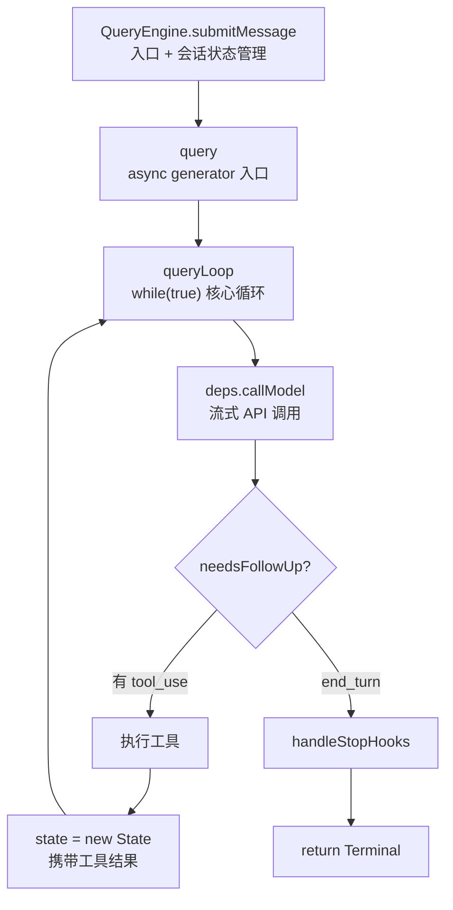
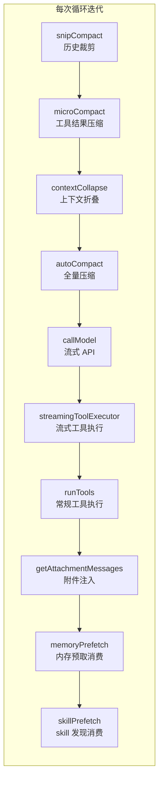
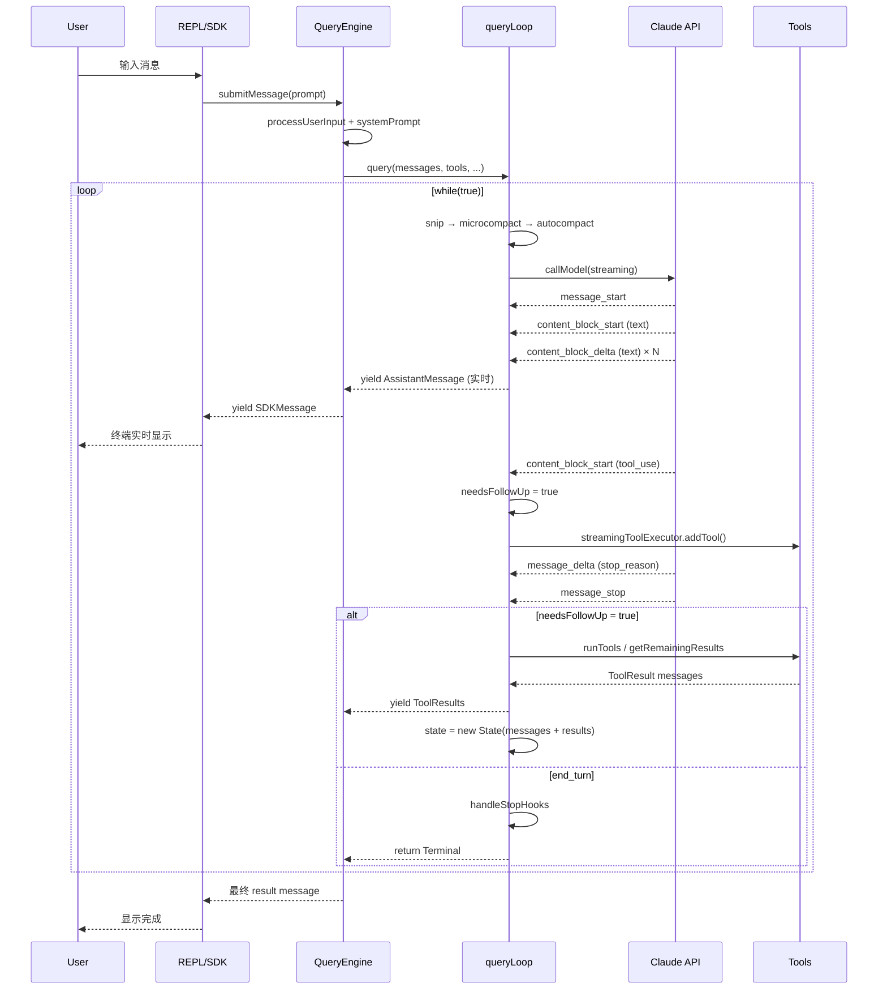

# Claude Code 主循环：QueryEngine 与 Continuation-Driven 架构

上一篇我们从宏观俯瞰了 Claude Code 的 51 万行源码全景。这一篇深入它的心脏——**主循环**。

每一个 AI 编程 Agent 都需要一个循环：接收输入 → 调用 LLM → 执行工具 → 重复 → 返回结果。看起来简单，但实现方式的差异折射出完全不同的工程哲学。主流终端编程 Agent 目前有三种循环范式：

- **OpenCode**：`while(true)` 显式步骤循环，配合 Effect-TS 函数式架构，每次迭代跑完固定的 7 个步骤，流程确定、步骤清晰
- **Codex**：事件驱动 Reactor，通过 Tokio channel 的 `Receiver<Submission>` 被动响应消息，没有显式循环函数，20 多种操作类型统一排队分发
- **Claude Code**（以下简称 CC）：**continuation-driven polling**，围绕 Anthropic 流式 API 构建的 async generator 循环，循环走向由 API 响应内容驱动

CC 的方式最特别——它既不是 OpenCode 那种「跑完 7 步看要不要继续」的确定性流程，也不是 Codex 那种「往 channel 里扔消息等 Reactor 处理」的事件分发。它是一个 `while(true)` 循环，但循环的分支由 API 流式响应的内容决定：模型返回了 `tool_use` 块就继续，返回 `end_turn` 就终止。每一次「继续」都携带新的状态（消息 + 工具结果），像尾递归一样把上下文传递给下一次迭代。

为什么 CC 选择这种方式？因为 Anthropic 的流式 API 天然适合「边收边处理」的模式。模型输出的每一个 content block 都可以独立处理——文本块实时显示，tool_use 块立即注册执行。循环不需要等整条消息结束才开始下一步工作。这种「流式优先」的设计贯穿了整个主循环的实现。

但「流式优先」也带来了复杂度。在非流式模式下，API 返回一个完整的 response 对象，循环只需要检查 `stop_reason` 就知道该不该继续。但在流式模式下，response 是一条条 SSE 事件拼出来的——`message_start` 给你 usage，`content_block_delta` 给你文本增量，`message_delta` 才给你 `stop_reason`。循环必须在这些碎片化的事件中维护状态，判断「这一轮到底有没有工具调用」「模型是不是说完了」。CC 用 `needsFollowUp` 标志和 `assistantMessages` 数组来追踪这些信息——前者在看到第一个 `tool_use` 块时设为 true，后者累积所有 assistant 消息用于后续拼接。

另一个让 CC 选择 continuation-driven 的原因是**错误恢复的复杂性**。在一个 agent 对话中，至少有 7 种情况需要循环「不走寻常路」：上下文太长要压缩、输出截断要恢复、stop hook 要拦截、模型过载要 fallback、预算用完要停止、用户中断要清理、token 预算没用完要续跑。如果用 OpenCode 的显式步骤模式，每种异常都要在步骤序列里插一个分支判断，7 步会膨胀成 20 步。CC 的方式是把所有异常处理集中在 `while(true)` 的 continue 路径里——正常走 `next_turn`，异常走各自的恢复路径，恢复后 `continue` 回到循环顶部重新开始。这让正常路径的代码保持简洁，异常路径互不干扰。

这篇文章会带你从源码视角拆解这套机制，涉及两个核心文件：`QueryEngine.ts`（1,295 行）和 `query.ts`（1,729 行）。前者管理会话状态和输入预处理，后者是纯粹的循环逻辑。两个文件的行数加起来约 3,000 行，是 CC 整个代码库中最核心的部分——所有其他模块（工具、命令、MCP、bridge）都是在这套循环之上构建的。

## 一、主循环的两层结构

CC 的主循环不是一个函数，而是两层结构的协作：



- **外层 `QueryEngine`**（`src/QueryEngine.ts`）：管理会话状态（消息历史、usage 累积、权限拒绝记录），负责用户输入预处理、system prompt 组装、skill 和 plugin 加载，然后把准备好的参数传给 `query()`
- **内层 `queryLoop`**（`src/query.ts`）：纯粹的循环逻辑——调 API、处理流、执行工具、决定是否继续。它不关心会话持久化，不关心 SDK 消息格式，只管把消息 yield 出去

两层之间通过 **async generator** 通信：`queryLoop` 是一个 `async function*`，每产生一条消息就 `yield`，`QueryEngine.submitMessage` 用 `for await` 消费这些消息并做持久化、SDK 消息转换等处理。这种设计把「循环逻辑」和「会话管理」彻底解耦——`queryLoop` 可以被单独测试，不需要真实的文件系统或 SDK 运行时。

### 1.1 QueryEngine：会话状态的拥有者

`QueryEngine` 是一个类，每个对话对应一个实例。它的类注释说得很清楚：

> One QueryEngine per conversation. Each submitMessage() call starts a new turn within the same conversation. State (messages, file cache, usage, etc.) persists across turns.

它的核心配置类型定义了循环所需的全部输入：

```ts
// src/QueryEngine.ts:130
export type QueryEngineConfig = {
  cwd: string
  tools: Tools
  commands: Command[]
  mcpClients: MCPServerConnection[]
  agents: AgentDefinition[]
  canUseTool: CanUseToolFn               // 权限检查函数
  getAppState: () => AppState
  setAppState: (f: (prev: AppState) => AppState) => void
  initialMessages?: Message[]
  readFileCache: FileStateCache
  customSystemPrompt?: string
  appendSystemPrompt?: string
  userSpecifiedModel?: string
  fallbackModel?: string
  thinkingConfig?: ThinkingConfig
  maxTurns?: number                       // 可选，不设则无上限
  maxBudgetUsd?: number
  taskBudget?: { total: number }
  jsonSchema?: Record<string, unknown>
  // ... 更多 SDK 相关选项
}
```

注意 `maxTurns` 是可选的。与很多人直觉不同，CC 的主循环**没有默认 turn 上限**——不设 `maxTurns` 时，循环会一直跑到模型返回 `end_turn` 或发生错误。turn 限制主要用于子 Agent（`forkSubagent.ts` 中硬编码为 200）和 SDK 调用方显式指定的场景。这是一个有意思的设计选择：CC 信任模型自己决定什么时候结束，而不是用外部硬限截断。当然，`maxBudgetUsd` 作为成本安全阀仍然存在。

这种「不设 turn 上限」的设计在交互式 REPL 场景下是合理的——用户随时可以按 Ctrl+C 中断。但在无人值守的 SDK 场景下（比如 CI/CD 集成），如果模型陷入循环（反复调用同一个工具却不改变行为），没有 turn 上限可能导致无限循环。CC 的应对策略是：在 SDK 层面让调用方可以显式传 `maxTurns`，在循环层面用 `maxBudgetUsd` 做成本兜底，在工具层面用「denial tracking」追踪被拒绝的工具调用。三道防线配合，降低失控风险。

`submitMessage` 是核心方法，签名是一个 async generator：

```ts
// src/QueryEngine.ts:209
async *submitMessage(
  prompt: string | ContentBlockParam[],
  options?: { uuid?: string; isMeta?: boolean },
): AsyncGenerator<SDKMessage, void, unknown>
```

它做的事情很多，但主线流程可以概括为 5 步：

1. 解构配置，包装 `canUseTool` 以追踪权限拒绝——每次工具被拒绝时记录到 `this.permissionDenials`，最终在 result 消息里返回给 SDK 调用方
2. 获取 system prompt（`fetchSystemPromptParts`）——包括默认 prompt、自定义 prompt、append prompt、memory mechanics prompt 的组合
3. 处理用户输入（`processUserInput`）——解析斜杠命令、创建用户消息、处理附件
4. 持久化 transcript（用户消息先写入，保证 kill 后可 resume）——这个顺序很重要，代码注释解释了原因：如果在 API 响应前进程被杀，transcript 里至少有用户消息可以 resume
5. **调用 `query()` 并 `for await` 消费流**

关键的第五步，是内外层交接的地方：

```ts
// src/QueryEngine.ts:675
for await (const message of query({
  messages,
  systemPrompt,
  userContext,
  systemContext,
  canUseTool: wrappedCanUseTool,
  toolUseContext: processUserInputContext,
  fallbackModel,
  querySource: 'sdk',
  maxTurns,
  taskBudget,
})) {
  // 根据 message.type 做不同处理
}
```

这个 `for await` 循环就是 QueryEngine 消费 `query()` 产出的地方。每条消息——无论是流式文本块、工具调用、压缩边界还是 API 错误——都从这里流过，被持久化、转换、yield 给上层 SDK 调用方。`QueryEngine` 在这里做的 switch 分发逻辑相当丰富：

- `assistant` 消息：push 到 `mutableMessages`，持久化到 transcript（fire-and-forget，不阻塞流），yield 给 SDK
- `stream_event`：在 `message_start` 时重置 currentMessageUsage，在 `message_delta` 时累积 usage 和捕获 stop_reason，在 `message_stop` 时把 currentMessageUsage 累积到 totalUsage
- `attachment`：处理 `max_turns_reached`（返回 error result）、`structured_output`（提取结构化输出数据）、`queued_command`（作为 user 消息 replay）
- `system`：处理 `compact_boundary`（释放压缩前的消息供 GC）、`api_error`（分类后 yield 重试信息）

### 1.2 ask()：一次性便捷封装

除了 `QueryEngine` 类，文件还导出一个 `ask()` 函数（`src/QueryEngine.ts:1186`），是对 `QueryEngine` 的便捷封装，用于不需要跨 turn 管理会话状态的场景：

```ts
export async function* ask({ commands, prompt, cwd, tools, ... }): AsyncGenerator<SDKMessage, void, unknown> {
  const engine = new QueryEngine({ /* ... */ })
  yield* engine.submitMessage(prompt)
}
```

`ask()` 创建一个临时 `QueryEngine`，跑一次 `submitMessage`，完事即销毁。SDK 的 `--print` 模式（非交互式单次调用）就是走这条路径。这个设计让交互式 REPL 和 headless SDK 共享同一套循环逻辑，只是会话管理的生命周期不同。

## 二、queryLoop：while(true) 的真正核心

进入 `query.ts`，这里是循环逻辑的本体。导出的 `query()` 函数是个薄包装，真正干活的是 `queryLoop()`：

```ts
// src/query.ts:219
export async function* query(params: QueryParams): AsyncGenerator<...> {
  const consumedCommandUuids: string[] = []
  const terminal = yield* queryLoop(params, consumedCommandUuids)
  for (const uuid of consumedCommandUuids) {
    notifyCommandLifecycle(uuid, 'completed')
  }
  return terminal
}
```

`query()` 做的唯一额外事情是：在 `queryLoop` 正常返回后，把循环过程中消费的命令标记为 `completed`。这个生命周期通知对 UI 层很重要——它让命令进度条知道哪些命令已经处理完毕。如果 `queryLoop` 抛异常或被 `.return()` 中断，这个通知不会执行，命令会停留在 `started` 状态。

### 2.1 循环状态结构

`queryLoop` 是一个 `async function*`，内部是 `while(true)` 循环。先看它的状态结构：

```ts
// src/query.ts:204
type State = {
  messages: Message[]                    // 消息历史（跨迭代累积）
  toolUseContext: ToolUseContext         // 工具执行上下文
  autoCompactTracking: AutoCompactTrackingState | undefined
  maxOutputTokensRecoveryCount: number   // 输出 token 恢复计数
  hasAttemptedReactiveCompact: boolean   // 是否已尝试响应式压缩
  maxOutputTokensOverride: number | undefined
  pendingToolUseSummary: Promise<ToolUseSummaryMessage | null> | undefined
  stopHookActive: boolean | undefined
  turnCount: number                      // 当前 turn 数
  transition: Continue | undefined       // 上一次 continue 的原因
}
```

`State` 是跨迭代传递的可变状态。每次 `continue` 时，代码会构造一个新的 `State` 对象赋给 `state` 变量，而不是原地修改——这让每次迭代的状态流转清晰可追踪。`transition` 字段记录了「为什么继续」，便于测试断言和日志追踪恢复路径。这个设计的好处是：在阅读代码时，每个 `continue` 位置的状态变更都是显式的、局部的，不需要追踪全局变量的修改历史。

### 2.2 循环体的主干

循环体的主干结构（省略了大量细节）：

```ts
// src/query.ts:241
async function* queryLoop(params, consumedCommandUuids): AsyncGenerator<...> {
  const { systemPrompt, userContext, systemContext, canUseTool,
          fallbackModel, querySource, maxTurns, ... } = params
  const deps = params.deps ?? productionDeps()
  
  let state: State = { /* 初始状态 */ }
  
  // 整个 turn 只触发一次的内存预取（using 语法确保退出时清理）
  using pendingMemoryPrefetch = startRelevantMemoryPrefetch(...)
  
  while (true) {
    // 1. 解构当前状态
    let { toolUseContext } = state
    const { messages, autoCompactTracking, turnCount, ... } = state
    
    // 2. 预取 skill 发现（与模型流并行执行）
    const pendingSkillPrefetch = skillPrefetch?.startSkillDiscoveryPrefetch(...)
    
    yield { type: 'stream_request_start' }
    
    // 3. 压缩管线：snip → microcompact → contextCollapse → autocompact
    let messagesForQuery = [...getMessagesAfterCompactBoundary(messages)]
    // ... 4 级压缩依次执行，前一级释放足够空间则后续跳过
    
    // 4. 调用模型（流式）
    for await (const message of deps.callModel({ messages, systemPrompt, tools, ... })) {
      yield message  // 实时透传给外层
      if (message.type === 'assistant') {
        // 收集 tool_use 块，设置 needsFollowUp
      }
    }
    
    // 5. 判断是否需要继续
    if (!needsFollowUp) {
      // end_turn — 处理 stop hooks，返回 Terminal
      return { reason: 'completed' }
    }
    
    // 6. 执行工具
    const toolUpdates = runTools(toolUseBlocks, assistantMessages, canUseTool, toolUseContext)
    for await (const update of toolUpdates) {
      yield update.message
      toolResults.push(...)
    }
    
    // 7. 检查 maxTurns
    if (maxTurns && nextTurnCount > maxTurns) {
      yield { type: 'max_turns_reached', maxTurns, turnCount }
      return { reason: 'max_turns' }
    }
    
    // 8. 构造下一次迭代的状态，继续循环
    state = {
      messages: [...messagesForQuery, ...assistantMessages, ...toolResults],
      turnCount: nextTurnCount,
      transition: { reason: 'next_turn' },
      // ... 重置其他字段
    }
  }
}
```

这就是 CC 主循环的骨架。它的核心特征是：**循环的走向由 API 响应内容驱动**。`needsFollowUp` 标志在流式处理过程中被设置——只要看到 `tool_use` 类型的 content block，就标记需要后续。如果没有 tool_use，说明模型认为任务完成（`stop_reason: end_turn`），循环终止。

注意第 3 步的压缩管线——它在每次迭代的**开头**执行，而不是在上下文溢出时才触发。这是一个预防性设计：每次调 API 前先检查是否需要压缩，而不是等到 API 返回 413 错误才反应。当然，如果预防性压缩没生效（比如消息突然变大），还有响应式压缩作为兜底。这种「预防 + 兜底」的双层设计在 CC 中很常见——autoCompact 是预防性的，reactiveCompact 是兜底性的，两者配合确保上下文不会溢出。

另一个值得注意的细节是第 2 步的 `using` 关键字。`using pendingMemoryPrefetch = startRelevantMemoryPrefetch(...)` 使用了 TC39 的 Explicit Resource Management 提案（Bun 原生支持）。`using` 声明的变量在离开作用域时自动调用 `[Symbol.dispose]()` 方法——就像 Python 的 `with` 或 Rust 的 `Drop`。这确保了内存预取的清理逻辑在 generator 的所有退出路径（正常返回、抛异常、`.return()` 中断）都能执行。如果没有 `using`，就需要在多个 `return` 和 `catch` 里手动调用 dispose，很容易遗漏。

## 三、Continuation Pattern：为什么不是递归

有人可能会把 CC 的循环描述为「递归调用 query()」——因为每次工具执行后，带着工具结果再次进入循环。但实际源码用的是 `while(true)` + `state` 赋值 + `continue`，不是函数递归调用。这是一个重要的区别，我把它叫做 **continuation-driven** 而非 recursive。

### 3.1 什么是 continuation-driven

「continuation」这个术语来自函数式编程——它指的是「程序接下来的计算」。在 CC 的语境下，每次 `continue` 都携带一个新的 `State`，这个 State 包含了「接下来要传给 API 的消息」。**概念上类似尾递归**（每次迭代把新状态传递给下一次迭代），但实现上是循环 + 状态赋值——避免了递归栈溢出，同时保留了「每次迭代携带新上下文」的语义清晰度：

```
// 伪代码：尾递归形式（概念上）
function query(messages) {
  const response = callAPI(messages)
  if (response.hasToolUse) {
    const toolResults = executeTools(response.toolUseBlocks)
    return query([...messages, response, ...toolResults])  // 尾递归
  }
  return response
}

// 实际实现：循环形式
while (true) {
  const response = callAPI(state.messages)
  if (!response.hasToolUse) return response
  const toolResults = executeTools(response.toolUseBlocks)
  state = { messages: [...state.messages, response, ...toolResults] }
  // continue → 下一次迭代
}
```

JavaScript 引擎除 Safari 外不做尾调用优化，所以用循环实现是正确的工程选择——参数不通过函数调用栈传递，而是通过循环变量赋值，等价但不爆栈。

### 3.2 多条 continue 路径

CC 的循环不是简单的「有工具就 continue，没工具就 return」。它有 **7 个不同的 continue 路径**，每个对应一种恢复或重试场景。这是整个循环设计中最精巧的部分：

| Continue 路径 | transition.reason | 触发条件 |
|---|---|---|
| `next_turn` | 正常工具回合 | API 返回 tool_use，工具执行完毕 |
| `collapse_drain_retry` | context-collapse 溢出恢复 | 流式响应被截断（413），先尝试排空 staged collapses |
| `reactive_compact_retry` | 响应式压缩 | 413 或 media 错误后，触发 reactive compact 压缩上下文 |
| `max_output_tokens_escalate` | 输出 token 升级 | 默认 8k 输出上限不够，升级到 64k 重试 |
| `max_output_tokens_recovery` | 输出 token 恢复 | 64k 也不够，注入「继续」消息让模型接着说（最多 3 次） |
| `stop_hook_blocking` | stop hook 阻断 | stop hook 返回阻断错误，注入错误消息让模型修正 |
| `token_budget_continuation` | token 预算续跑 | 500k token 预算未用完，注入 nudge 消息让模型继续 |

每个 continue 路径构造的 `State` 不同。比如 `max_output_tokens_recovery` 会注入一条 meta 消息，指示模型从中断处继续：

```ts
// src/query.ts:1224
const recoveryMessage = createUserMessage({
  content: 'Output token limit hit. Resume directly — no apology, '
         + 'no recap of what you were doing. Pick up mid-thought if '
         + 'that is where the cut happened. Break remaining work into '
         + 'smaller pieces.',
  isMeta: true,
})
const next: State = {
  messages: [...messagesForQuery, ...assistantMessages, recoveryMessage],
  maxOutputTokensRecoveryCount: maxOutputTokensRecoveryCount + 1,
  transition: { reason: 'max_output_tokens_recovery', attempt: ... },
}
state = next
continue
```

注意 `isMeta: true`——这条消息对模型可见但不计入用户可见的对话历史。模型看到的是一个系统指令「从中断处继续」，而不是一个新的用户请求。这种设计让模型的行为更自然——不会因为看到「输出超限」就道歉或重述上下文。

`stop_hook_blocking` 是另一个有趣的路径。stop hooks 是 CC 在模型返回 `end_turn` 后执行的检查——可以拦截模型的「完成」决定，注入错误让模型修正。比如一个 hook 检测到代码修改不完整，就会返回 blocking error，循环把错误注入消息后 continue，模型在下一轮看到这个错误并尝试修正。但代码注释特别强调了一个陷阱：

```ts
// Preserve the reactive compact guard — if compact already ran and
// couldn't recover from prompt-too-long, retrying after a stop-hook
// blocking error will produce the same result. Resetting to false
// here caused an infinite loop: compact → still too long → error →
// stop hook blocking → compact → … burning thousands of API calls.
hasAttemptedReactiveCompact,
```

如果不保持 `hasAttemptedReactiveCompact` 标志，循环会陷入死循环：压缩 → 还是太长 → 错误 → stop hook 阻断 → 再次压缩 → 还是太长……这种在实践中发现的 bug，通过一个标志位的保持来修复，体现了循环路径之间相互影响的复杂性。

### 3.3 与 OpenCode / Codex 的对比

三种循环范式的根本差异在于**流程控制权在谁手里**。这个差异不是风格偏好，而是技术栈和 API 约束的自然结果。

**OpenCode** 的 `runLoop` 是确定性的：每次迭代跑固定的 7 个步骤（创建消息 → filterCompacted → 准备工具 → 调模型 → 执行工具 → 检查 Doom Loop → 返回）。流程的走向由代码逻辑决定，模型只负责每一步内部的具体内容。这种方式的好处是可预测——每一步做什么、什么时候做，都写在代码里。代价是灵活性较差——如果模型的行为不符合预期，循环结构不会自适应。OpenCode 选择这种方式，是因为它基于 Effect-TS 构建——Effect 的 generator 语义天然适合「按步骤跑」的模式，每一步都是可组合、可中断的 Effect。

```ts
// OpenCode 的 runLoop（简化）
while (true) {
  const msgs = yield* MessageV2.filterCompactedEffect(sessionID)  // Step 1
  const prepared = yield* prepareTools(msgs)                      // Step 2
  const response = yield* callModel(prepared)                    // Step 3
  if (!response.toolUse) break                                   // Step 4: 退出判断
  const results = yield* executeTools(response.tools)             // Step 5
  if (isDoomLoop()) break                                        // Step 6: 安全阀
  // Step 7: 循环
}
```

**CC** 的 `queryLoop` 是数据驱动的：循环体是一个连续的流程，但流程的分支由 API 响应内容决定。模型说「我要用工具」就继续，说「我做完了」就停。7 个 continue 路径也都是对 API 响应的应对——413 就压缩、max_output_tokens 就升级或恢复、stop hook 阻断就注入错误。这种方式更灵活，但也更难预测——循环的走向取决于模型的行为。

**Codex** 连循环都没有：它是一个事件 Reactor（`submission_loop`），从 channel 里拿 `Submission` 消息，根据 `Op` 类型分发到不同 handler。用户输入、工具审批、压缩触发都是往 channel 里扔消息。流程控制完全交给消息排队和 handler 路由。这种方式最解耦——每个 handler 独立处理一种操作，不需要关心其他操作的状态。代价是流程的「整体感」被打散了，要理解一次完整 turn 的生命周期，需要在多个 handler 之间跳转。

```rust
// Codex 的 submission_loop（简化）
while let Ok(sub) = rx_sub.recv().await {
    match sub.op {
        Op::UserInput { .. } => user_input_or_turn(&sess, ...).await,
        Op::Compact => compact(&sess, ...).await,
        Op::Interrupt => interrupt(&sess).await,
        // ... 20+ 种 Op
    }
}
```

CC 的方式介于 OpenCode 和 Codex 之间：它有显式的 `while(true)`（像 OpenCode），但循环的分支逻辑是 API 响应驱动的（像 Codex 的消息驱动）。7 个 continue 路径相当于 7 个「隐含的 Op handler」，只不过它们不是通过消息分发触发的，而是通过检查 API 响应内容在同一个函数体内分支处理的。这个设计选择与 Anthropic 的流式 API 设计紧密相关——SSE 事件流天然适合「边收边判断边处理」的模式。

## 四、query.ts：不只是循环

`query.ts` 有 1,729 行，比 `QueryEngine.ts` 还大。如果说 `QueryEngine` 是「what」（循环要做什么），`query.ts` 就是「how」（怎么编排）。它的 import 列表揭示了职责的复杂度：

```ts
// src/query.ts 的关键 import（简化）
import { isAutoCompactEnabled } from './services/compact/autoCompact.js'
import { buildPostCompactMessages } from './services/compact/compact.js'
import { reactiveCompact } from './services/compact/reactiveCompact.js'      // feature-gated
import { contextCollapse } from './services/contextCollapse/index.js'         // feature-gated
import { skillPrefetch } from './services/skillSearch/prefetch.js'            // feature-gated
import { StreamingToolExecutor } from './services/tools/StreamingToolExecutor.js'
import { runTools } from './services/tools/toolOrchestration.js'
import { getAttachmentMessages } from './utils/attachments.js'
import { startRelevantMemoryPrefetch } from './utils/attachments.js'
import { FallbackTriggeredError } from './services/api/withRetry.js'
import { handleStopHooks } from './query/stopHooks.js'
import { buildQueryConfig } from './query/config.js'
import { createBudgetTracker, checkTokenBudget } from './query/tokenBudget.js'
```

很多 import 用了 `feature('XXX') ? require(...) : null` 的条件导入模式——这是 Bun 的 `bun:bundle` 提供的编译时 feature gate，让未启用的功能在打包时被 tree-shake 掉。比如 `HISTORY_SNIP`、`CONTEXT_COLLAPSE`、`REACTIVE_COMPACT`、`EXPERIMENTAL_SKILL_SEARCH` 都是 feature-gated 的。这意味着同一个 `query.ts` 文件在不同构建配置下产出的代码大小不同。

`query.ts` 在循环内编排的子系统和它们的执行时机：



关键子系统的职责：

- **压缩管线**（4 级）：snip → microcompact → contextCollapse → autocompact，每次迭代按序执行。这 4 级压缩的粒度不同——snip 裁剪历史中的冗余标记，microcompact 压缩工具结果（按 tool_use_id 操作），contextCollapse 折叠连续的同类消息，autocompact 做全量摘要。前一级释放足够空间则后续级别自动跳过，避免重复工作
- **流式工具执行**（`StreamingToolExecutor`）：工具在模型还在流式输出时就开始执行，而不是等整条消息结束。这是 CC 相比 OpenCode/Codex 的一个显著优势——减少了「模型说完 → 执行工具」的串行等待。当模型在输出第 3 个 tool_use 块时，前 2 个工具可能已经在执行了
- **附件注入**（`getAttachmentMessages`）：工具执行后注入额外的上下文——文件变更通知、队列命令、任务完成通知等。这让模型在下一轮能看到工具执行的外部影响（比如文件被其他进程修改了）
- **内存预取**（`startRelevantMemoryPrefetch`）：在整个 turn 开始时触发，在循环迭代中零等待消费（settled 才读，不阻塞）。如果预取还没完成就跳过这一轮，下一轮迭代再尝试——这种「不阻塞主循环」的设计让内存注入不会拖慢工具执行

`query.ts` 还引入了 `QueryDeps` 抽象——把可替换的依赖抽成接口，便于测试时 mock：

```ts
// src/query/deps.ts
export type QueryDeps = {
  callModel: (params) => AsyncGenerator<StreamEvent | Message>
  autocompact: (messages, ctx, cache, source, tracking, snipFreed) => Promise<{...}>
  microcompact: (messages, ctx, source) => Promise<{...}>
  uuid: () => string
}
```

这个设计让 `queryLoop` 的核心逻辑可以脱离真实 API 和文件系统测试——`productionDeps()` 走真实路径，测试传 mock deps。在 1,729 行的复杂函数里，可测试性是至关重要的——没有依赖注入，任何一个分支的测试都需要真实的 API key 和文件系统。

## 五、流式事件处理

CC 的循环围绕 Anthropic 的 SSE（Server-Sent Events）流式 API 构建。流式处理在 `claude.ts` 的 `queryModelWithStreaming` 函数中（`src/services/api/claude.ts:752`），它内部调用 `queryModel` 消费 Anthropic SDK 的 stream。

SSE 流会发送 5 种事件类型，CC 对每种的处理方式不同：

```ts
// src/services/api/claude.ts:1979（简化）
switch (part.type) {
  case 'message_start':           // 消息开始
    partialMessage = part.message
    ttftMs = Date.now() - start    // 首 token 延迟（TTFT，重要性能指标）
    usage = updateUsage(usage, part.message?.usage)
    break
    
  case 'content_block_start':     // 新 content block 开始
    switch (part.content_block.type) {
      case 'tool_use':            // 工具调用块——初始化 input 为空字符串
        contentBlocks[part.index] = { ...part.content_block, input: '' }
        break
      case 'text':                // 文本块——初始化 text 为空（delta 会增量填充）
        contentBlocks[part.index] = { ...part.content_block, text: '' }
        break
      case 'thinking':            // 思考块——初始化 thinking + signature
        contentBlocks[part.index] = { ...part.content_block, thinking: '', signature: '' }
        break
    }
    break
    
  case 'content_block_delta':    // 增量内容——这是实时显示的核心
    // 根据 delta.type 累积到对应 contentBlock：
    // - text_delta: contentBlock.text += delta.text
    // - input_json_delta: contentBlock.input += delta.partial_json
    // - thinking_delta: contentBlock.thinking += delta.thinking
    // - signature_delta: contentBlock.signature += delta.signature
    break
    
  case 'message_delta':          // 消息级增量
    // stop_reason 在这里到达，不在 content_block_stop
    if (part.delta.stop_reason != null) {
      // 设置真实的 stop_reason
    }
    break
    
  case 'message_stop':           // 消息结束
    break
}
```

一个关键的实现细节：**`stop_reason` 不在 `content_block_stop` 时设置，而是在 `message_delta` 事件中到达**。这是因为流式 API 的设计——content block 级别的事件不携带消息级元数据。CC 的代码注释特别标注了这一点：

```ts
// src/QueryEngine.ts:802-805
// Capture stop_reason from message_delta. The assistant message
// is yielded at content_block_stop with stop_reason=null; the
// real value only arrives here (see claude.ts message_delta
// handler).
```

这个细节在实际开发中容易踩坑——如果假设 `stop_reason` 在 content_block 时就有值，会在流式处理中得到 null。CC 通过在 `message_delta` 时更新来解决这个问题，并把更新后的 stop_reason 存到 `lastStopReason` 变量供最终 result 消息使用。

在 `queryLoop` 中，流式消息通过 `for await` 消费，每条消息同时被 `yield` 给外层（实时显示）和被检查是否包含 `tool_use`：

```ts
// src/query.ts:659
for await (const message of deps.callModel({ messages, systemPrompt, tools, ... })) {
  yield message  // 实时透传给 QueryEngine → SDK → 终端
  
  if (message.type === 'assistant') {
    assistantMessages.push(message)
    const msgToolUseBlocks = message.message.content.filter(
      content => content.type === 'tool_use'
    ) as ToolUseBlock[]
    if (msgToolUseBlocks.length > 0) {
      toolUseBlocks.push(...msgToolUseBlocks)
      needsFollowUp = true  // 标记需要继续
    }
    // 流式工具执行：工具块一到就加入 executor
    if (streamingToolExecutor) {
      for (const toolBlock of msgToolUseBlocks) {
        streamingToolExecutor.addTool(toolBlock, message)
      }
    }
  }
}
```

注意 `streamingToolExecutor.addTool()` 的调用位置——它在模型还在流式输出时就注册了工具调用。配合 `streamingToolExecutor.getCompletedResults()`，已完成工具的结果可以在模型还没说完时就被 yield 出去。这就是 CC 的「流式工具执行」机制：模型在输出第 3 个 tool_use 块时，前 2 个工具可能已经执行完毕，结果已经被 push 到 `toolResults` 数组里了。

还有一个值得注意的设计：**可恢复错误的延迟 yield**。当流式响应包含 prompt-too-long 或 max-output-tokens 错误时，CC 不会立即 yield 这个错误消息，而是先「扣留」它（withheld），等确认恢复路径是否能成功：

```ts
// src/query.ts:799（简化）
let withheld = false
if (contextCollapse?.isWithheldPromptTooLong(message, ...)) {
  withheld = true
}
if (reactiveCompact?.isWithheldPromptTooLong(message)) {
  withheld = true
}
if (isWithheldMaxOutputTokens(message)) {
  withheld = true
}
if (!withheld) {
  yield yieldMessage  // 只有非扣留的消息才立即 yield
}
```

如果恢复成功（压缩后重试或升级输出限制后重试），这个错误消息永远不会被 yield——用户看不到中间的错误，只看到最终的成功结果。如果恢复失败，错误才被 yield 出来。这种「先试恢复再报错」的设计让用户体验更干净——不会看到一堆中间错误闪烁。但它也带来一个风险：如果恢复路径有 bug，用户可能完全不知道发生了什么。CC 通过 `transition.reason` 字段在内部记录恢复路径，让开发者在日志和测试中可以追踪——但对终端用户来说，中间的错误是不可见的。这是一个「内部可观测性」与「外部用户体验」的权衡。

完整的消息流如下：



## 六、权限模式对循环的影响

CC 共有 **7 种权限模式**（5 个外部 `default` / `acceptEdits` / `plan` / `bypassPermissions` / `dontAsk`，加 2 个内部 `auto` / `bubble`，见 `src/types/permissions.ts:16-28`），用户按 Shift+Tab 循环的实际路径是 `default → acceptEdits → plan → bypassPermissions → (auto 若可用 else default)`。它们直接影响循环中工具执行的路径。权限检查通过 `useCanUseTool.tsx` 中的 `CanUseToolFn` 实现：

```ts
// src/hooks/useCanUseTool.tsx:27
export type CanUseToolFn<Input> = (
  tool: ToolType,
  input: Input,
  toolUseContext: ToolUseContext,
  assistantMessage: AssistantMessage,
  toolUseID: string,
  forceDecision?: PermissionDecision<Input>,
) => Promise<PermissionDecision<Input>>
```

`canUseTool` 在循环中的调用时机：当 `runTools` 或 `StreamingToolExecutor` 准备执行一个工具时，先调用 `canUseTool` 检查权限。返回值有三种行为（`allow` / `deny` / `ask`），分别走不同路径：

```ts
// src/hooks/useCanUseTool.tsx:37（简化）
const result = await hasPermissionsToUseTool(tool, input, ...)

switch (result.behavior) {
  case 'allow':   // 直接放行——工具立即执行
    resolve(ctx.buildAllow(result.updatedInput ?? input))
    break
  case 'deny':    // 直接拒绝——返回拒绝结果，模型看到错误
    resolve(result)
    break
  case 'ask':     // 需要用户确认——循环暂停等待
    // 1. 先尝试 coordinator 权限（swarm 模式下 coordinator 代答）
    // 2. 再尝试 swarm worker 权限
    // 3. 再尝试 bash 分类器（auto 模式的 AI 分类器预判）
    // 4. 最终走交互式权限对话框
    handleInteractivePermission({ ctx, description, result, ... }, resolve)
    break
}
```

5 种外部模式如何影响循环（`auto` 见下文，`dontAsk`/`bubble` 为内部模式尚未在 UI 暴露）：

| 模式 | allow 规则 | deny 规则 | ask 规则 | 对循环的影响 |
|------|-----------|----------|---------|------------|
| `default` | 配置的 always-allow 规则 | 配置的 deny 规则 | 其余全部 ask | 每个工具都可能暂停循环等用户确认 |
| `acceptEdits` | 文件编辑类工具自动放行 | 配置的 deny 规则 | 非编辑类操作 ask | 文件改动不中断循环，命令类仍确认 |
| `plan` | 只读工具 allow | 写操作 deny | 不适用 | 循环只做分析，不修改文件 |
| `bypassPermissions` | 全部 allow | 不 deny | 不 ask | 循环全程无中断，风险最高 |
| `auto` | AI 分类器判定低风险 → allow | AI 分类器判定高风险 → deny | 中风险 → ask | 大部分工具自动执行，循环几乎不中断 |

`auto` 模式是 CC 的特色——它用一个 AI 分类器（bash classifier）来判断 Bash 命令的风险等级。分类器在模型流式输出时就开始预判（speculative check），在工具实际执行前完成判定。这种「投机式权限检查」让大部分 Bash 命令不需要等待用户确认。需要区分两个不同的 feature flag：**`BASH_CLASSIFIER`** 门控 Bash 命令的投机式预判（`useCanUseTool.tsx:98/116/126/135`），**`TRANSCRIPT_CLASSIFIER`** 门控 auto 模式整体的 denial 记录与通知（`useCanUseTool.tsx:43/77`，以及 `autoModeState` 模块的加载 `main.tsx:171`）。前者是「这个 Bash 命令安不安全」，后者是「auto 模式拒绝时要不要记一笔」：

```ts
// src/hooks/useCanUseTool.tsx:126（简化）
if (feature("BASH_CLASSIFIER") && result.pendingClassifierCheck && tool.name === BASH_TOOL_NAME) {
  const speculativePromise = peekSpeculativeClassifierCheck(input.command)
  if (speculativePromise) {
    // 最多等 2 秒，超时回退到交互式确认
    const raceResult = await Promise.race([
      speculativePromise,
      new Promise(res => setTimeout(res, 2000, { type: 'timeout' }))
    ])
    if (raceResult.type === 'result' && raceResult.result.matches 
        && raceResult.result.confidence === 'high') {
      // 分类器高置信度判定可以放行
      resolve(ctx.buildAllow(input, { decisionReason: { type: 'classifier', ... } }))
      return
    }
  }
}
```

这个设计让 `auto` 模式在大多数场景下不阻塞循环——分类器在 2 秒内返回高置信度结果就自动放行，超时才回退到交互式确认。2 秒的超时是一个权衡：太短会让分类器来不及返回（导致频繁弹出确认框），太长会让用户感觉工具执行卡顿。

`QueryEngine` 在 `submitMessage` 里还包装了 `canUseTool`，用来追踪权限拒绝：

```ts
// src/QueryEngine.ts:244
const wrappedCanUseTool: CanUseToolFn = async (tool, input, ...) => {
  const result = await canUseTool(tool, input, ...)
  if (result.behavior !== 'allow') {
    this.permissionDenials.push({
      tool_name: sdkCompatToolName(tool.name),
      tool_use_id: toolUseID,
      tool_input: input,
    })
  }
  return result
}
```

拒绝记录最终在 result 消息里返回给 SDK 调用方，让调用方知道这次对话中有哪些工具被拒绝执行了。

## 七、错误处理与重试

CC 的错误处理分两层：API 层的 `withRetry` 处理网络和服务器错误，循环层的 continue 路径处理结构性错误（上下文溢出、输出截断等）。

### 7.1 withRetry：API 调用重试

`src/services/api/withRetry.ts` 的 `withRetry` 是一个 async generator，包裹所有 API 调用。它的最大重试次数是 10 次（`DEFAULT_MAX_RETRIES = 10`），处理的错误类型和策略：

| HTTP 状态码 | 错误类型 | 处理策略 |
|------------|---------|---------|
| 401 | 认证失败 | 刷新 OAuth token，重新获取 client |
| 403 | OAuth token 被撤销 | 同 401，调用 `handleOAuth401Error` |
| 429 | 限流 | 指数退避重试（读取 `retry-after` header） |
| 529 | 服务过载 | 重试 3 次后触发 `FallbackTriggeredError` |
| ECONNRESET/EPIPE | 连接断开 | 禁用 keep-alive，重新连接 |
| Bedrock/Vertex auth | 云平台认证错误 | 清除 credential 缓存，重新获取 |

529 过载的处理特别值得注意——连续 3 次 529 后，如果有 fallback 模型配置，会抛出 `FallbackTriggeredError`：

```ts
// src/services/api/withRetry.ts:335
if (consecutive529Errors >= MAX_529_RETRIES) {
  if (options.fallbackModel) {
    throw new FallbackTriggeredError(options.model, options.fallbackModel)
  }
}
```

这个异常被 `queryLoop` 捕获后，会切换到 fallback 模型重试整个请求。注意这里有个细节——不是所有 query source 都会重试 529。`FOREGROUND_529_RETRY_SOURCES` 定义了哪些来源值得重试：

```ts
// src/services/api/withRetry.ts:62
const FOREGROUND_529_RETRY_SOURCES = new Set<QuerySource>([
  'repl_main_thread', 'sdk', 'agent:custom', 'agent:default',
  'compact', 'hook_agent', 'side_question', 'auto_mode',
  // ...
])
```

后台任务（标题生成、建议生成等）在 529 时直接放弃——代码注释解释了原因：「在容量级联期间，每次重试是 3-10 倍的网关放大，用户根本看不到这些失败」。这是一个面向生产环境的设计：在服务过载时，优先保证用户直接等待的请求，牺牲后台任务。

### 7.2 循环层的错误恢复

除了 API 层重试，`queryLoop` 自己也有多条错误恢复路径。错误首先被 `categorizeRetryableAPIError` 分类：

```ts
// src/services/api/errors.ts:1163
export function categorizeRetryableAPIError(error: APIError): SDKAssistantMessageError {
  if (error.status === 529 || error.message?.includes('"type":"overloaded_error"')) {
    return 'rate_limit'
  }
  if (error.status === 429) return 'rate_limit'
  if (error.status === 401 || error.status === 403) return 'authentication_failed'
  if (error.status >= 408) return 'server_error'
  return 'unknown'
}
```

分类后的错误通过 `SystemAPIErrorMessage` yield 给 SDK，同时在循环层触发恢复：

- **`prompt_too_long`（413）**：先尝试 context-collapse 排空 staged collapses（保留粒度更细的上下文），失败后触发 `reactiveCompact`（全量摘要压缩）。两种恢复都构造新的 `State` 并 `continue`。如果两种都失败，直接 yield 错误并返回——不进入 stop hooks，因为「模型从未产生有效响应，hooks 评估它只会造成死循环」
- **`max_output_tokens`**：先尝试升级到 64k 输出上限（`max_output_tokens_escalate`），不够再注入「继续」消息让模型接着说（最多 3 次，`max_output_tokens_recovery`，由 `MAX_OUTPUT_TOKENS_RECOVERY_LIMIT = 3` 控制）。3 次后仍然不够，才 yield 被扣留的错误
- **stop hook 阻断**：stop hook 返回的错误被注入消息，让模型在下一轮自我修正。但如前所述，需要保持 `hasAttemptedReactiveCompact` 标志避免死循环

`autoCompact` 还有熔断机制——连续失败 3 次后停止重试，避免无意义的 API 调用：

```ts
// src/services/compact/autoCompact.ts:70
const MAX_CONSECUTIVE_AUTOCOMPACT_FAILURES = 3
```

代码注释给出了这个阈值的数据依据：「BQ 2026-03-10: 1,279 个会话有 50+ 次连续失败（最高 3,272 次），每天浪费约 250K API 调用」。这种用真实生产数据驱动阈值调优的做法，体现了 CC 作为大规模生产系统的成熟度。

### 7.3 中断与取消：AbortController 贯穿全链路

前面两种恢复都属「异常路径」，但还有一类「用户主动路径」——用户按 Ctrl+C 中断、SDK 调用方取消、超时触发。CC 用一个 `AbortController` 把取消信号贯穿流式调用、工具执行、权限检查三个环节。

`QueryEngine` 持有唯一的 `abortController`（`QueryEngine.ts:187`，初始化于 `:203` `this.abortController = config.abortController ?? createAbortController()`），调用方可以外部传入也可以由引擎自建。当用户按 Ctrl+C 时，`QueryEngine.ts:1159` 的 `this.abortController.abort()` 被触发，信号通过三条路径传播：

```ts
// src/query.ts:664 — 信号注入流式 API 调用
signal: toolUseContext.abortController.signal,

// src/query.ts:1046 — 循环层检查 abort reason
if (toolUseContext.abortController.signal.reason !== 'interrupt') {
```

第一条路径是**流式 API 调用**：`callModel` 把 `abortController.signal` 透传给 Anthropic SDK（`query.ts:664`），SDK 在收到 abort 时中断 SSE 流，`for await` 随即抛出。第二条路径是**循环层守卫**：`queryLoop` 在多个 continue 路径前检查 `signal.aborted`（`query.ts:1015/1485`），避免 abort 后还发起新一轮 API 调用；并检查 `signal.reason` 区分中断类型（`:1046` `reason !== 'interrupt'`），不同中断源走不同清理逻辑。

第三条路径最容易被忽略——**权限检查的中断感知**。`useCanUseTool.tsx` 在权限流程的每个 await 点都调用 `ctx.resolveIfAborted(resolve)`（`:34/40/61/110/132`，共 5 处）：

```ts
// src/hooks/useCanUseTool.tsx:34（简化）
if (ctx.resolveIfAborted(resolve)) {
  return  // 已 abort，立即短路返回，不再继续权限流程
}
```

这是因为权限检查是异步的（等用户点确认、等分类器预判、等 coordinator 代答），如果用户在等待期间按了 Ctrl+C，权限流程必须立即短路而非等用户确认完才退出。`resolveIfAborted` 在每次 await 前检查一次，把 abort 信号变成「即时返回」。

最后，generator 的 `.return()` 配合 `using` 声明（见 §2.2）保证清理逻辑在所有退出路径执行——无论 `queryLoop` 是正常返回、抛异常、还是被外层 `.return()` 中断，`using pendingMemoryPrefetch` 的 `[Symbol.dispose]()` 都会触发，释放预取资源。这套「一个 AbortController + 多点守卫 + using 清理」的设计让中断能在任何时机安全传播，不会留下半执行的工具调用或泄漏的预取句柄。

## 八、成本追踪

CC 在循环过程中持续追踪 API 调用成本。核心在 `cost-tracker.ts`（323 行）和 `costHook.ts`（22 行）。

### 8.1 Token 与成本累积

每次 API 响应的 usage 通过 `updateUsage` 和 `accumulateUsage` 累积。在 `QueryEngine.submitMessage` 的 `for await` 循环中，stream_event 的 `message_start` 和 `message_delta` 事件触发 usage 更新：

```ts
// src/QueryEngine.ts:810（在 message_stop 事件处理中）
if (message.event.type === 'message_stop') {
  this.totalUsage = accumulateUsage(this.totalUsage, currentMessageUsage)
}
```

`updateUsage`（`claude.ts:2924`）处理一个细节：`message_delta` 事件可能发送 `0` 值覆盖 `message_start` 的真实值，所以用 `> 0` 守卫防止覆盖：

```ts
// src/services/api/claude.ts:2924（简化）
export function updateUsage(usage, delta) {
  if (delta.input_tokens > 0) usage.input_tokens = delta.input_tokens
  if (delta.output_tokens > 0) usage.output_tokens = delta.output_tokens
  if (delta.cache_read_input_tokens > 0) usage.cache_read_input_tokens = ...
  if (delta.cache_creation_input_tokens > 0) usage.cache_creation_input_tokens = ...
}
```

成本的 4 个维度对应 Anthropic API 的计费模型：`input_tokens`（输入 token，单价最低）、`output_tokens`（输出 token，单价最高）、`cache_read_input_tokens`（缓存读取，单价约为输入的 10%）、`cache_creation_input_tokens`（缓存创建，单价约为输入的 125%）。每个维度乘以模型对应的单价得到 USD 成本，`calculateUSDCost`（`utils/modelCost.ts`）负责这个计算。

### 8.2 预算检查与循环控制

成本追踪不只是显示——它还参与循环控制。`QueryEngine.submitMessage` 在每条消息处理后检查 USD 预算：

```ts
// src/QueryEngine.ts:972
if (maxBudgetUsd !== undefined && getTotalCost() >= maxBudgetUsd) {
  yield {
    type: 'result',
    subtype: 'error_max_budget_usd',
    is_error: true,
    total_cost_usd: getTotalCost(),
    errors: [`Reached maximum budget ($${maxBudgetUsd})`],
  }
  return
}
```

这个检查在 `for await` 循环内部，意味着即使模型还在执行工具，只要累计成本超过预算，循环就会立即终止。这是一个硬性安全阀——防止失控的 Agent 消耗过多 API 费用。

`costHook.ts` 则在进程退出时保存会话成本快照：

```ts
// src/costHook.ts:6
export function useCostSummary(getFpsMetrics?: () => FpsMetrics): void {
  useEffect(() => {
    const f = () => {
      if (hasConsoleBillingAccess()) {
        process.stdout.write('\n' + formatTotalCost() + '\n')
      }
      saveCurrentSessionCosts(getFpsMetrics?.())
    }
    process.on('exit', f)
    return () => { process.off('exit', f) }
  }, [])
}
```

这是一个 React Hook（在 Ink 终端 UI 中使用），监听 `process.on('exit')` 事件。进程退出时打印总成本并保存到项目配置里，让下次启动时可以看到历史会话的成本。

## 九、三种主循环对比

把 CC、OpenCode、Codex 的主循环放在一起对比：

| 维度 | Claude Code | OpenCode | Codex |
|------|------------|----------|-------|
| **循环模式** | continuation-driven polling | while-true 显式步骤 | event-driven reactor |
| **核心函数** | `queryLoop` (query.ts:241) | `runLoop` (prompt.ts:1244) | `submission_loop` (handlers.rs:738) |
| **流程控制** | API 响应驱动分支 | 7 步确定性序列 | channel 消息分发 |
| **循环体结构** | 单一连续流程 + 7 个 continue 路径 | 7 个显式 step | match Op 枚举 20+ 分支 |
| **工具执行** | 流式 + 串行（StreamingToolExecutor） | 串行（per-turn） | 并行 + 串行混合 |
| **错误恢复** | 循环内 7 条 continue 路径 | Effect-TS Channel | supervisor + thread rollback |
| **Turn 限制** | 可选，默认无上限 | 隐式（Doom Loop 检测） | 可配置 |
| **流式处理** | Anthropic SSE 事件 | AI SDK stream | OpenAI SSE |
| **状态传递** | State 对象（跨迭代） | Effect 生成器上下文 | Arc<Session> 共享 |
| **压缩触发** | 循环内 4 级管线 | 循环内 2 级 | pre-sampling + reactive |
| **并发安全** | abortController | ensureRunning 包装 | channel 串行化 |
| **代码规模** | query.ts 1,729 行 | prompt.ts ~1,500 行 | handlers.rs ~900 行 |

三个设计选择的深层原因可以归结为各自的技术栈和 API 约束：

**CC 选择 continuation-driven**，因为 Anthropic 的流式 API 天然适合「边收边处理」的模式。模型输出的每一个 content block 都可以独立处理——文本块实时显示，tool_use 块立即注册执行。循环不需要等整条消息结束才开始下一步工作。7 个 continue 路径的存在，本质上是因为流式 API 的响应内容决定了循环的走向——413 要压缩，max_output_tokens 要升级，stop hook 要拦截——这些都是 API 响应驱动的分支。

**OpenCode 选择显式步骤**，因为 Effect-TS 的函数式架构鼓励把副作用隔离到明确的步骤中。每一步都是 `Effect` generator，可组合、可测试、可中断。7 步的划分让 Doom Loop 检测（循环不产出有效工作）有了自然的插入点——每次迭代结束时检查是否有进展。这种方式的可预测性更强，但灵活性较差——如果模型的行为不符合预期，循环结构不会自适应。

**Codex 选择事件 Reactor**，因为 Rust 的 async 生态（Tokio）天然适合 channel-based 并发。把所有操作统一为 `Submission` 消息，让 20+ 种 Op 类型自然排队，不需要锁就能保证串行化。每个 handler 独立处理一种操作，解耦彻底。代价是流程的「整体感」被打散了——要理解一次完整 turn 的生命周期，需要在 `user_input_or_turn` → `run_turn` → `run_sampling_request` → 工具执行等多个 handler 之间跳转。

从代码规模看，CC 的 `query.ts`（1,729 行）是三者中最大的单文件循环——因为 7 个 continue 路径的逻辑都集中在一个函数体内。OpenCode 的 `prompt.ts` 通过 Effect 的组合性分散了复杂度，Codex 的 `handlers.rs` 通过 match 分发分散了复杂度。CC 选择集中是为了保持循环流程的「线性可读性」——从头到尾读完 `queryLoop` 函数，就能理解整个循环的所有分支。虽然 1,729 行很长，但它的控制流是线性的：从循环顶部到底部，每个 `continue` 和 `return` 都在一个可见的位置，不需要跨函数跳转。

但这种方式也有代价——`queryLoop` 函数太长了，新功能（如 `TOKEN_BUDGET`、`CONTEXT_COLLAPSE`、`HISTORY_SNIP`）的加入让 continue 路径越来越多。CC 用 `feature()` gate 来控制功能的启停，让不需要的功能在构建时被 tree-shake 掉，但这只是缓解了代码体积问题，没有解决函数复杂度问题。如果 continue 路径继续增长，未来可能需要重构为类似 Codex 的分发模式。

## 十、总结

CC 的主循环设计有几个值得学习的关键点：

1. **async generator 作为循环骨架**：`while(true)` + `yield` 的组合让流式输出、工具执行、状态传递都在同一个函数体内，避免了回调地狱和状态散落。generator 的 `yield` 天然适合流式场景——每产生一条消息就推送出去，不需要缓冲整个响应

2. **continuation-driven 的状态流转**：7 个 continue 路径每个构造不同的 `State`，让恢复逻辑集中且可追踪。`transition.reason` 字段让调试和测试都能精确断言执行路径。每次 `continue` 携带的新 `State` 等价于尾递归的参数传递，但用循环实现避免了栈溢出

3. **流式工具执行**：`StreamingToolExecutor` 让工具在模型还没说完时就开始执行，把「模型说话 → 工具执行」的串行等待变成了并行。这在多工具调用场景下显著降低了 turn 延迟

4. **分层错误恢复**：API 层 `withRetry` 处理瞬态错误（429/529/连接断开），循环层处理结构性错误（413 压缩、max_output_tokens 截断、stop hook 阻断），职责清晰。扣留机制让可恢复错误不暴露给用户——先试恢复，成功则用户无感，失败才报错

5. **QueryDeps 依赖注入**：把可替换的依赖抽成接口，让核心循环逻辑可测试——这在 1,729 行的复杂函数里尤为重要。没有依赖注入，任何一个分支的测试都需要真实的 API key 和文件系统

下一篇会深入 CC 的工具系统——40+ 内置工具的接口设计、Tool 接口的 `checkPermissions` / `isReadOnly` / `validation` 三态模型，以及 MCP 扩展是如何融入这个体系的。工具系统是 CC 主循环的「执行端」——循环决定了「什么时候调工具」，工具系统决定了「工具怎么执行、结果怎么返回」。理解了主循环和工具系统的配合，才算真正理解了 CC 的 agent 机制。

## 源码参考

| 文件 | 行数 | 职责 |
|------|------|------|
| `src/QueryEngine.ts` | 1,295 | 会话状态管理、system prompt 组装、SDK 消息转换 |
| `src/query.ts` | 1,729 | queryLoop 核心循环、压缩管线编排、工具执行调度 |
| `src/hooks/useCanUseTool.tsx` | 203 | 权限检查 CanUseToolFn、4 种模式的分支处理 |
| `src/services/api/claude.ts` | 3,419 | 流式 API 调用、SSE 事件处理、usage 累积 |
| `src/services/api/withRetry.ts` | 822 | API 重试逻辑、fallback 模型切换、OAuth 刷新 |
| `src/services/api/errors.ts` | 1,207 | 错误分类 categorizeRetryableAPIError、错误消息常量 |
| `src/services/compact/autoCompact.ts` | 351 | 自动压缩阈值计算、熔断机制 |
| `src/cost-tracker.ts` | 323 | 成本追踪、token 计数、模型用量统计 |
| `src/costHook.ts` | 22 | 进程退出时的成本快照保存 |
