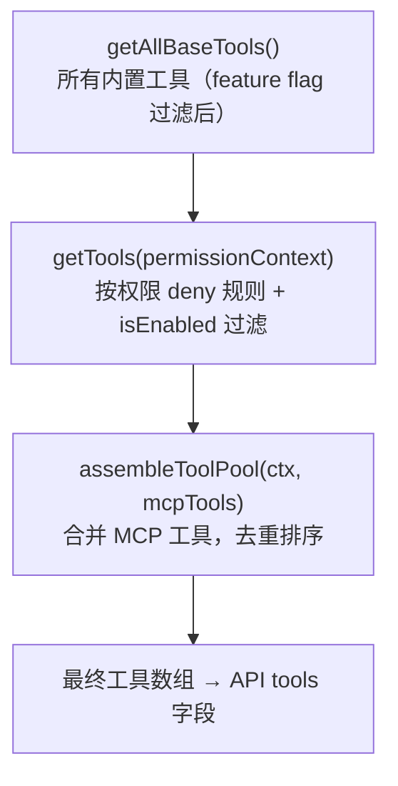
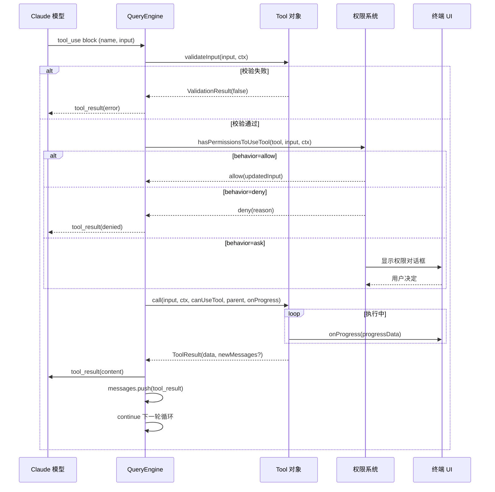
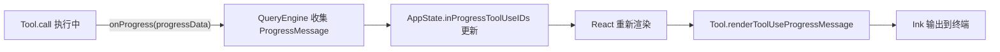

# Claude Code 工具系统：50+ 内置工具设计

> Tool 接口、注册机制与内置工具目录的源码级解读

上一篇我们把主循环 `QueryEngine` 走了一遍，看到 Claude 每返回一个 `tool_use` block，调度器就要找到对应工具、做权限检查、执行、收集 `ToolResult`、再喂回模型。这一篇聚焦这个调度过程里被反复触达的核心对象——**Tool 本身**：它的接口形状、它如何被注册到模型上下文、它如何被权限系统拦截、它如何把进度推回终端 UI。

Claude Code 整个工具系统的源头只有两个文件：`src/Tool.ts`（792 行）定义 `Tool` 接口和 `buildTool` 工厂；`src/tools.ts`（389 行）负责把所有具体工具组装成一个数组。前者是契约，后者是装配线。所有具体工具位于 `src/tools/` 下 42 个子目录中（40 个工具实现 + `shared/` 共享代码 + `testing/` 测试辅助），顶层另有一个 `utils.ts`（工具共享的工具函数）。

## 一、为什么不是「写死在系统提示里」

很多终端 Agent 框架会把工具的描述以自然语言塞进系统提示，然后让模型按格式输出 JSON。Claude Code 不走这条路——它**把工具的 JSON Schema 直接作为 API 的 `tools` 字段提交**给 Anthropic Messages API。

这意味着工具对模型来说是一等公民：

- 工具的参数类型、必填项、描述由 `input_schema`（Zod 推导出的 JSON Schema）严格声明
- 模型按 Anthropic 的 `tool_use` block 协议产出结构化参数，而不是「自由生成 JSON 再由应用解析」
- 工具的 `description` 是动态函数，可以基于具体 input 上下文返回不同描述，比 Codex 的静态 trait 描述更精细
- `prompt` 字段提供一份面向模型的使用说明，会拼到工具 schema 里

这是个看似工程性、实则影响深远的设计选择：模型的工具调用错误率因此下降，因为模型不需要从自由文本里反推格式。同时，工具的添加和修改变得安全——改一个工具的 schema 不会意外破坏系统提示的格式，因为它们是分离的。这也是为什么 Claude Code 能在不重启进程的情况下动态接入 MCP server 暴露的几十个工具——schema 是数据，不是硬编码的提示文本。

## 二、Tool 接口的全貌

`src/Tool.ts` 中真正的 `Tool` 类型是一个泛型类型别名，签名是：

```typescript
export type Tool<
  Input extends AnyObject = AnyObject,
  Output = unknown,
  P extends ToolProgressData = ToolProgressData,
> = { ... }
```

三个类型参数：输入 schema（Zod 类型）、输出类型、进度数据类型。下面把它拆成几组字段来读。

### 2.1 身份与描述

```typescript
readonly name: string
aliases?: string[]
searchHint?: string
userFacingName(input: Partial<Input> | undefined): string
userFacingNameBackgroundColor?(input: Partial<Input> | undefined): keyof Theme | undefined
description(
  input: z.infer<Input>,
  options: {
    isNonInteractiveSession: boolean
    toolPermissionContext: ToolPermissionContext
    tools: Tools
  },
): Promise<string>
prompt(options: {
  getToolPermissionContext: () => Promise<ToolPermissionContext>
  tools: Tools
  agents: AgentDefinition[]
  allowedAgentTypes?: string[]
}): Promise<string>
```

- `name` 是工具的稳定标识，模型在 `tool_use.name` 中使用它
- `aliases` 用于工具改名后的向后兼容
- `searchHint` 是 3–10 个词的能力短语，给 `ToolSearchTool` 做关键词匹配用（详见后文延迟加载）
- `userFacingName` 在终端 UI 里展示，可随 input 变化（例如 `Bash` 工具会显示具体命令）
- `description(input)` 接收 input 作为参数——这意味着同一个工具，对不同输入可以给出不同描述。Codex 的 trait 描述是静态字符串，无法做到这点
- `prompt()` 返回给模型的「使用说明」，会拼到 schema 旁边

### 2.2 输入与输出 schema

```typescript
readonly inputSchema: Input
readonly inputJSONSchema?: ToolInputJSONSchema
outputSchema?: z.ZodType<unknown>
maxResultSizeChars: number
readonly strict?: boolean
```

`inputSchema` 是 Zod schema，会被转换成 JSON Schema 提交给 API。`inputJSONSchema` 是给 MCP 工具用的旁路：MCP 服务器返回的 schema 已经是 JSON Schema 形态，没必要绕一圈 Zod。

`maxResultSizeChars` 是个关键的工程参数：当工具输出超过这个字符数时，结果会被持久化到磁盘，模型只收到一个带文件路径的预览。注意 `FileReadTool` 把它设成 `Infinity`——因为持久化 Read 的结果会形成「Read→文件→Read」的环，而且 Read 自己已经有内置的截断策略。

`strict` 字段在 `tengu_tool_pear` 特性开启时让 API 更严格地校验工具参数。

### 2.3 执行与并发

```typescript
call(
  args: z.infer<Input>,
  context: ToolUseContext,
  canUseTool: CanUseToolFn,
  parentMessage: AssistantMessage,
  onProgress?: ToolCallProgress<P>,
): Promise<ToolResult<Output>>
isConcurrencySafe(input: z.infer<Input>): boolean
isReadOnly(input: z.infer<Input>): boolean
isDestructive?(input: z.infer<Input>): boolean
interruptBehavior?(): 'cancel' | 'block'
isOpenWorld?(input: z.infer<Input>): boolean
requiresUserInteraction?(): boolean
isEnabled(): boolean
```

`call` 是工具的主入口。注意几个特点：

1. **进度回调显式传入**：`onProgress` 是第五个参数，工具可以在执行中随时回调推进度
2. **`canUseTool` 作为参数注入**：工具内部如果需要二次确认（例如 Bash 在执行中遇到破坏性命令），可以直接调用这个函数
3. **`parentMessage`** 让工具拿到触发自己的 assistant 消息上下文
4. `ToolResult` 不只返回 `data`，还能返回 `newMessages`（追加到对话历史）和 `contextModifier`（修改后续 context，仅对非并发安全的工具生效）

并发相关的字段决定了 `toolExecution.ts` 调度器能否并行运行多个工具实例：

- `isConcurrencySafe(input)` 返回 true 时，调度器可以并行执行多个同类工具
- `isReadOnly` / `isDestructive` 是给权限系统和 UI 分类用的元信息
- `interruptBehavior` 决定用户在工具运行时按回车提交新消息会怎样：`'cancel'` 中断当前工具，`'block'` 阻塞新消息直到工具完成

### 2.4 权限相关

```typescript
validateInput?(
  input: z.infer<Input>,
  context: ToolUseContext,
): Promise<ValidationResult>
checkPermissions(
  input: z.infer<Input>,
  context: ToolUseContext,
): Promise<PermissionResult>
preparePermissionMatcher?(
  input: z.infer<Input>,
): Promise<(pattern: string) => boolean>
getPath?(input: z.infer<Input>): string
```

注意这里没有「`permissions: { required: PermissionType[] }`」这种声明式结构。Claude Code 走的是**函数式权限判定**：

- `validateInput` 在权限检查之前先做语义校验（例如路径是否合法、参数是否互斥）
- `checkPermissions` 是工具自己的「我是否需要问用户」逻辑，返回 `PermissionResult`，其 `behavior` 字段是 `'allow' | 'deny' | 'ask' | 'passthrough'`
- `preparePermissionMatcher` 给 hook 的 `if` 条件用：例如配置了 `Bash(git *)` 这条规则，需要一个匹配器把 `git push` 命令匹配到这条规则上
- `getPath` 让权限系统能把「这个工具操作的是哪个文件」抽象出来，统一做路径规则的匹配

### 2.5 UI 渲染

Claude Code 是 React + Ink 渲染终端 UI 的（详见系列第 1 篇）。Tool 接口里和渲染相关的方法非常多：

```typescript
renderToolUseMessage(
  input: Partial<z.infer<Input>>,
  options: { theme: ThemeName; verbose: boolean; commands?: Command[] },
): React.ReactNode

renderToolResultMessage?(
  content: Output,
  progressMessagesForMessage: ProgressMessage<P>[],
  options: { style?: 'condensed'; theme: ThemeName; tools: Tools; verbose: boolean; isTranscriptMode?: boolean; isBriefOnly?: boolean; input?: unknown },
): React.ReactNode

renderToolUseProgressMessage?(
  progressMessagesForMessage: ProgressMessage<P>[],
  options: { tools: Tools; verbose: boolean; terminalSize?: { columns: number; rows: number }; inProgressToolCallCount?: number; isTranscriptMode?: boolean },
): React.ReactNode

renderToolUseQueuedMessage?(): React.ReactNode
renderToolUseRejectedMessage?(input, options): React.ReactNode
renderToolUseErrorMessage?(result, options): React.ReactNode
renderToolUseTag?(input: Partial<z.infer<Input>>): React.ReactNode
renderGroupedToolUse?(toolUses, options): React.ReactNode | null

mapToolResultToToolResultBlockParam(content: Output, toolUseID: string): ToolResultBlockParam
extractSearchText?(out: Output): string
isResultTruncated?(output: Output): boolean
getToolUseSummary?(input: Partial<z.infer<Input>>): string | null
getActivityDescription?(input: Partial<z.infer<Input>>): string | null
toAutoClassifierInput(input: z.infer<Input>): unknown
```

简要说明：

- `renderToolUseMessage` 渲染「模型决定调用这个工具」的提示行（例如 `● Read(src/foo.ts)`）
- `renderToolResultMessage` 渲染工具执行完的结果展示
- `renderToolUseProgressMessage` 在工具运行期间持续渲染进度
- `renderGroupedToolUse` 把多个并行同类工具合并展示（例如 5 个 Grep 并行时合成一组）
- `mapToolResultToToolResultBlockParam` 把工具输出转成 API 的 `tool_result` block
- `extractSearchText` 给 transcript 搜索索引用，必须返回真正会渲染到屏幕的文本（否则会出现「索引到但屏幕没有」的 phantom bug）
- `getActivityDescription` 给 spinner 显示「Reading src/foo.ts」「Running bun test」这样的活动描述
- `toAutoClassifierInput` 是给 auto 模式的安全分类器看的精简输入

### 2.6 延迟加载与 MCP 元信息

```typescript
readonly shouldDefer?: boolean
readonly alwaysLoad?: boolean
isMcp?: boolean
isLsp?: boolean
mcpInfo?: { serverName: string; toolName: string }
```

这是 Claude Code 工具系统一个非常工程化的设计：

- 当 `ToolSearchTool` 启用时，所有 `shouldDefer: true` 的工具不会出现在初始 prompt 里——它们的 schema 通过 `defer_loading: true` 标记发给 API，模型必须先用 `ToolSearch` 找到它们才能调用
- `alwaysLoad` 是反例：MCP 工具可以通过 `_meta['anthropic/alwaysLoad']` 声明自己必须在第一轮就出现在 prompt 里
- `mcpInfo` 记录 MCP 工具的原始 server/tool 名（未经前缀化），方便权限规则按 server 维度匹配

### 2.7 ToolUseContext：执行时的世界

`Tool.call` 的第二个参数 `ToolUseContext` 是一个 40+ 字段的大对象（含 options 子对象内还有 15+ 字段），几乎把整个会话状态都暴露给工具了。关键字段：

```typescript
export type ToolUseContext = {
  options: {
    commands: Command[]
    tools: Tools
    mcpClients: MCPServerConnection[]
    mcpResources: Record<string, ServerResource[]>
    agentDefinitions: AgentDefinitionsResult
    refreshTools?: () => Tools  // MCP 服务器中途连接时刷新工具列表
    // ...
  }
  abortController: AbortController
  readFileState: FileStateCache  // 文件状态缓存，Edit 依赖它判断文件是否被外部修改
  getAppState(): AppState
  setAppState(f: (prev: AppState) => AppState): void
  setAppStateForTasks?: (f: (prev: AppState) => AppState) => void  // 异步 agent 共享的状态通道
  setToolJSX?: SetToolJSXFn
  messages: Message[]
  agentId?: AgentId  // 子 agent 才有，主线程为 undefined
  agentType?: string
  contentReplacementState?: ContentReplacementState  // tool result 预算管理
  // ... 还有 20 多个字段
}
```

这个 context 是工具访问外部世界的唯一入口。值得注意的是 `setAppStateForTasks`：主线程的 `setAppState` 在异步 agent 里被替换成 no-op，但 `setAppStateForTasks` 永远指向根 store——这样无论 agent 嵌套多深，后台 bash 任务都能被正确注册和清理。

另一个值得展开的字段是 `readFileState: FileStateCache`。这是一个 LRU 缓存，记录每个文件最近一次被 Read 时的状态（mtime、内容哈希等）。它的核心消费者是 `FileEditTool`：当 Edit 尝试匹配 `old_string` 时，如果匹配不到，Edit 会检查 `readFileState` 里记录的文件 mtime 是否和当前磁盘上的文件一致——如果不一致，说明文件被外部修改了，Edit 会拒绝执行并提示用户重新 Read。这避免了「基于过期的文件内容做编辑」导致的数据损坏。

`contentReplacementState` 是上下文预算管理的状态。当对话历史里的 tool result 累积过多时，`query.ts` 会根据这个状态把早期的 tool result 替换成摘要或文件路径引用。主线程在 REPL 启动时初始化一次，永不重置（陈旧的 UUID key 是惰性的，不会造成问题）；子 agent 通过 `createSubagentContext` 克隆父 agent 的状态——这是为了让 cache-sharing fork 做出和父 agent 一致的内容替换决策。

`renderedSystemPrompt` 是 fork subagent 实验路径专用的字段。它把父 agent 在 turn 开始时渲染好的系统提示字节流冻结下来，传给 fork 出来的子 agent。注释解释了为什么需要这个字段：「re-calling getSystemPrompt() at fork-spawn time can diverge (GrowthBook cold→warm) and bust the cache」——如果在 fork 时重新生成系统提示，GrowthBook feature flag 的状态可能已经从 cold 变成 warm，导致生成的提示和父 agent 不一致，从而破坏 prompt cache。

### 2.8 ToolResult 的扩展能力

```typescript
export type ToolResult<T> = {
  data: T
  newMessages?: (UserMessage | AssistantMessage | AttachmentMessage | SystemMessage)[]
  contextModifier?: (context: ToolUseContext) => ToolUseContext
  mcpMeta?: { _meta?: Record<string, unknown>; structuredContent?: Record<string, unknown> }
}
```

`newMessages` 让工具能向对话历史注入额外消息（不只是返回结果）。`contextModifier` 只对非并发安全的工具生效——它让工具能修改后续工具调用的 context，例如临时修改权限模式。`mcpMeta` 让 MCP 工具能把 server 端的 `_meta` 和 `structuredContent` 透传给 SDK 消费者。

## 三、buildTool 与 ToolDef：工厂模式与默认值

直接实现 `Tool` 接口需要写 ~30 个方法，大多数工具并不需要全部自定义。`Tool.ts` 提供了 `ToolDef` 和 `buildTool` 来缓解这个问题。

```typescript
type DefaultableToolKeys =
  | 'isEnabled'
  | 'isConcurrencySafe'
  | 'isReadOnly'
  | 'isDestructive'
  | 'checkPermissions'
  | 'toAutoClassifierInput'
  | 'userFacingName'

export type ToolDef<...> = Omit<Tool<...>, DefaultableToolKeys> &
  Partial<Pick<Tool<...>, DefaultableToolKeys>>

const TOOL_DEFAULTS = {
  isEnabled: () => true,
  isConcurrencySafe: (_input?: unknown) => false,
  isReadOnly: (_input?: unknown) => false,
  isDestructive: (_input?: unknown) => false,
  checkPermissions: (input, _ctx?) =>
    Promise.resolve({ behavior: 'allow', updatedInput: input }),
  toAutoClassifierInput: (_input?: unknown) => '',
  userFacingName: (_input?: unknown) => '',
}

export function buildTool<D extends AnyToolDef>(def: D): BuiltTool<D> {
  return {
    ...TOOL_DEFAULTS,
    userFacingName: () => def.name,
    ...def,
  } as BuiltTool<D>
}
```

注意默认值是 **fail-closed** 的：`isConcurrencySafe` 默认 false（假设不安全）、`isReadOnly` 默认 false（假设写）、`toAutoClassifierInput` 默认空字符串（安全相关的工具必须主动重写以加入分类器）。这是典型的「保守默认 + 显式开放」模式——新工具默认不被并发执行、默认被当成会写、默认不进入 auto 模式分类器，所有放宽都需要显式声明。这种策略让新增工具的成本集中在「需要被放宽的部分」，而不是「需要被收紧的部分」。

工具实现时通常会写 `} satisfies ToolDef<InputSchema, Output>)`，例如 `MCPTool.ts` 末尾就是这种写法。`satisfies` 既保证了类型安全，又让 `buildTool` 能填充默认值。

`BuiltTool<D>` 那段类型体操值得展开讲一下。它的定义是：

```typescript
type BuiltTool<D> = Omit<D, DefaultableToolKeys> & {
  [K in DefaultableToolKeys]-?: K extends keyof D
    ? undefined extends D[K]
      ? ToolDefaults[K]
      : D[K]
    : ToolDefaults[K]
}
```

这段映射类型做的事情是：对每个可默认的字段，如果调用方提供了具体实现（且不是 optional 的），就用调用方的类型；如果调用方省略了或写成 optional，就用 `TOOL_DEFAULTS` 里的类型。这是个在 TypeScript 类型层面模拟运行时 `{...TOOL_DEFAULTS, ...def}` 行为的技巧——保证了 `buildTool` 返回的工具对象在类型上永远有完整的方法签名，调用方不需要 `?.()` 或 `??` 默认值。

源码注释里写得很直白：「The type semantics are proven by the 0-error typecheck across all 60+ tools」——60+ 个工具的类型检查零错误，证明这套类型推导是正确的。

## 四、工具注册中心：tools.ts

### 4.1 三层装配

`src/tools.ts` 提供三个层次的装配函数：



`getAllBaseTools()` 是源头——它返回所有内置工具的数组，每个工具是否包含在内由 feature flag、环境变量、运行时条件决定。

### 4.2 条件导入的三种模式

`tools.ts` 用三种不同的条件导入方式来处理不同情况：

**模式 1：直接 import + 运行时过滤**

```typescript
import { BashTool } from './tools/BashTool/BashTool.js'
import { FileReadTool } from './tools/FileReadTool/FileReadTool.js'
// ... 直接 import 的工具

// 运行时通过 isEnabled() 或条件展开过滤
...(isTodoV2Enabled()
  ? [TaskCreateTool, TaskGetTool, TaskUpdateTool, TaskListTool]
  : []),
...(isWorktreeModeEnabled() ? [EnterWorktreeTool, ExitWorktreeTool] : []),
```

**模式 2：feature() 编译期决定**

`feature()` 来自 `bun:bundle`，是 Bun 的死代码消除机制——在打包时根据 feature flag 决定是否包含代码。Anthropic 内部构建会开启某些 flag，对外发布的版本则不会：

```typescript
const SleepTool =
  feature('PROACTIVE') || feature('KAIROS')
    ? require('./tools/SleepTool/SleepTool.js').SleepTool
    : null

const cronTools = feature('AGENT_TRIGGERS')
  ? [
      require('./tools/ScheduleCronTool/CronCreateTool.js').CronCreateTool,
      require('./tools/ScheduleCronTool/CronDeleteTool.js').CronDeleteTool,
      require('./tools/ScheduleCronTool/CronListTool.js').CronListTool,
    ]
  : []
```

REPLTool、SuggestBackgroundPRTool 这种内部工具走 `process.env.USER_TYPE === 'ant'` 判断，只有 Anthropic 内部用户构建才会包含。

**模式 3：lazy require 打破循环依赖**

TeamCreateTool、TeamDeleteTool、SendMessageTool 三个工具会反向引用 `tools.ts`，形成循环依赖。解决方案是 lazy require：

```typescript
const getTeamCreateTool = () =>
  require('./tools/TeamCreateTool/TeamCreateTool.js')
    .TeamCreateTool as typeof import('./tools/TeamCreateTool/TeamCreateTool.js').TeamCreateTool

const getSendMessageTool = () =>
  require('./tools/SendMessageTool/SendMessageTool.js')
    .SendMessageTool as typeof import('./tools/SendMessageTool/SendMessageTool.js').SendMessageTool
```

注意这里用了一个有趣的类型技巧：`require().X as typeof import('...').X`。`require` 是运行时调用（打破循环），但通过 `as typeof import(...)` 把它的类型签名强制对齐到静态 import 的类型——既绕开了循环依赖，又不丢失类型信息。

### 4.3 getTools 的过滤逻辑

```typescript
export const getTools = (permissionContext: ToolPermissionContext): Tools => {
  // Simple mode: only Bash, Read, and Edit tools
  if (isEnvTruthy(process.env.CLAUDE_CODE_SIMPLE)) {
    // ... 返回精简工具集
  }

  const specialTools = new Set([
    ListMcpResourcesTool.name,
    ReadMcpResourceTool.name,
    SYNTHETIC_OUTPUT_TOOL_NAME,
  ])

  const tools = getAllBaseTools().filter(tool => !specialTools.has(tool.name))
  let allowedTools = filterToolsByDenyRules(tools, permissionContext)

  // REPL 模式下隐藏被 REPL 包装的原始工具
  if (isReplModeEnabled()) {
    // ...
  }

  const isEnabled = allowedTools.map(_ => _.isEnabled())
  return allowedTools.filter((_, i) => isEnabled[i])
}
```

三层过滤：

1. **specialTools 过滤**：把 MCP 资源工具和 SyntheticOutputTool 从默认列表移除（它们有专门的使用路径）
2. **deny 规则过滤**：`filterToolsByDenyRules` 用和运行时权限检查同样的 matcher，把被 blanket deny 的工具在 schema 提交前就剔除——这样模型压根看不到这些工具
3. **isEnabled() 过滤**：每个工具自己声明当前是否可用（例如 `LSPTool` 检查 `ENABLE_LSP_TOOL` 环境变量）

### 4.4 assembleToolPool：合并 MCP 工具

```typescript
export function assembleToolPool(
  permissionContext: ToolPermissionContext,
  mcpTools: Tools,
): Tools {
  const builtInTools = getTools(permissionContext)
  const allowedMcpTools = filterToolsByDenyRules(mcpTools, permissionContext)

  const byName = (a: Tool, b: Tool) => a.name.localeCompare(b.name)
  return uniqBy(
    [...builtInTools].sort(byName).concat(allowedMcpTools.sort(byName)),
    'name',
  )
}
```

注意这里的排序策略不是简单的「按名字排序」：内置工具先各自排序，MCP 工具再各自排序，然后 concat 起来。`uniqBy('name')` 在出现名字冲突时保留前面的（即内置工具优先）。

注释解释了为什么：服务端的 `claude_code_system_cache_policy` 会在最后一个 prefix-matched 内置工具后面放置一个全局 cache breakpoint。如果做扁平 sort，MCP 工具会插到内置工具中间，导致下游所有 cache key 在 MCP 工具顺序变化时全部失效。这种排序策略保证了 cache 的稳定性。

这个细节体现了 Claude Code 对 prompt cache 的极致优化。Anthropic API 的 prompt caching 是按前缀匹配的——只要前缀完全一致，就能命中缓存。工具 schema 是 prompt 的重要组成部分，工具顺序的任何变化都会破坏 cache。所以内置工具被固定为「按名字排序的连续前缀」，MCP 工具作为「可变后缀」接在后面。当用户接入或断开一个 MCP server 时，只有 MCP 部分的 cache 失效，内置工具部分依然能命中。

### 4.5 两个辅助函数的分工

除了 `assembleToolPool`，`tools.ts` 还导出了 `getMergedTools`：

```typescript
export function getMergedTools(
  permissionContext: ToolPermissionContext,
  mcpTools: Tools,
): Tools {
  const builtInTools = getTools(permissionContext)
  return [...builtInTools, ...mcpTools]
}
```

两者的区别在于：`assembleToolPool` 会做 deny 规则过滤和去重，是给「真正要发给 API 的工具列表」用的；`getMergedTools` 只做简单拼接，是给「需要统计完整工具数量」的场景用的（例如计算 ToolSearch 的阈值、做 token 计数）。注释里写得很清楚：「Use getTools() only when you specifically need just built-in tools」。三个函数各有适用场景，不能混用。

## 五、工具分类与目录

下面按功能域列出主要工具，每类挑几个讲设计要点。

### 5.1 文件操作类

| 工具 | 输入 | 输出 | 说明 |
|------|------|------|------|
| `FileReadTool` | `file_path`, `offset`, `limit` | text / image / pdf / notebook | 支持四种文件类型，分别走不同解析路径 |
| `FileWriteTool` | `file_path`, `content` | 写入结果 | 创建或覆盖文件 |
| `FileEditTool` | `file_path`, `old_string`, `new_string` | diff 摘要 | 字符串替换；`replaceAll` 可批量替换 |
| `NotebookEditTool` | `notebook_path`, `cell_id`, `new_source` | 编辑结果 | Jupyter notebook 专用 |

`FileReadTool` 的 `outputSchema` 是个 union：text 文件返回 `{type:'text', file:{path, content}}`，image 返回 `{type:'image', file:{path, mediaType, base64}}`，notebook 返回 `{type:'notebook', filePath, cells}`，pdf 返回 `{type:'pdf', file:{base64}}`。模型据此知道返回内容如何解读。

`FileReadTool` 的 `maxResultSizeChars` 设为 `Infinity`——如前所述，持久化 Read 结果会形成「Read→文件→Read」的环。其他工具的默认上限是 30K 字符左右。

### 5.2 代码搜索类

| 工具 | 底层 | 说明 |
|------|------|------|
| `GlobTool` | 内置 glob 实现 | 按文件名模式匹配，受 `globLimits.maxResults` 限制 |
| `GrepTool` | ripgrep 子进程 | 内容搜索，支持 `-i`、`-l`、`include` 等参数 |
| `ToolSearchTool` | 内置 | 关键词搜索工具列表，返回工具名+描述 |

`hasEmbeddedSearchTools()` 检查 Bun 二进制是否内置了 bfs/ugrep——如果有，`GlobTool` 和 `GrepTool` 不会注册（shell 里的 find/grep 会被 alias 到这些内置工具）。这是性能优化：当内置工具更快时，避免双倍维护成本。

`ToolSearchTool` 是延迟加载体系的核心。当 `isToolSearchEnabledOptimistic()` 返回 true 时，`ToolSearchTool` 会被加进工具列表，同时其他工具通过 `shouldDefer: true` 标记为延迟加载——它们的 schema 以 `defer_loading: true` 形式提交给 API，模型必须先调 `ToolSearch` 找到它们才能调用。这降低了初始 prompt 的 token 占用。

延迟加载的设计动机是工具数量爆炸。Claude Code 内置工具已经 50+（含 feature-gated 工具），接入一个 MCP server 后可能再增加几十个。如果所有工具的完整 schema 都塞进初始 prompt，不仅 token 消耗巨大，模型的注意力也会被稀释——它会在一堆不相关的工具 schema 中徘徊。`shouldDefer` 让「冷门工具」退居二线，只在模型主动搜索时才暴露完整 schema。

`alwaysLoad` 是这个机制的反向逃生口。某些工具必须在第一轮就被模型看到——例如 MCP server 通过 `_meta['anthropic/alwaysLoad']` 声明自己的核心工具必须在初始 prompt 里。这种设计让 MCP server 的作者有控制权：他们可以决定哪些工具是「必备」的，哪些是「按需」的。

`searchHint` 字段服务于 ToolSearch 的关键词匹配。它要求 3–10 个词，且「prefer terms not already in the tool name」——例如 NotebookEdit 的 searchHint 是 `'jupyter'`，因为工具名里没有 jupyter 这个词，模型搜 jupyter 时才能命中。这是个很小但很实用的细节。

### 5.3 命令执行类

| 工具 | 平台 | 说明 |
|------|------|------|
| `BashTool` | Unix | 默认 shell，支持后台执行、sed 模拟、sandbox |
| `PowerShellTool` | Windows | 通过 `isPowerShellToolEnabled()` 判断启用 |
| `REPLTool` | ant-only | REPL 模式下包装 Bash/Read/Edit 等 |

BashTool 是最复杂的工具之一，后面会单独深潜。

### 5.4 Web 类

| 工具 | 功能 |
|------|------|
| `WebSearchTool` | 调用 Anthropic 的 web search API |
| `WebFetchTool` | 抓取 URL 内容，支持 `prompt` 提取 |
| `WebBrowserTool` | feature flag `WEB_BROWSER_TOOL` 控制，可能基于 Playwright |

### 5.5 Agent 与协作类

| 工具 | 说明 |
|------|------|
| `AgentTool` | spawn 子 agent，支持 fork subagent、teammate、background agent |
| `TeamCreateTool` | 创建 agent team（lazy require，依赖 `isAgentSwarmsEnabled()`） |
| `TeamDeleteTool` | 删除 agent team |
| `SendMessageTool` | agent 间消息传递 |

AgentTool 的细节留到系列第 5 篇。

### 5.6 MCP 集成类

| 工具 | 说明 |
|------|------|
| `MCPTool` | 调用 MCP server 的工具——这是一个**壳**，真正实现在 `src/services/mcp/client.ts` |
| `ListMcpResourcesTool` | 列出 MCP server 暴露的资源 |
| `ReadMcpResourceTool` | 读取 MCP server 资源 |
| `McpAuthTool` | 处理 MCP server 的 OAuth 认证流程 |

`MCPTool.ts` 本身只有 77 行，所有方法都是空壳：

```typescript
export const MCPTool = buildTool({
  isMcp: true,
  name: 'mcp',
  maxResultSizeChars: 100_000,
  async description() { return DESCRIPTION },
  async prompt() { return PROMPT },
  async call() { return { data: '' } },
  // ...
} satisfies ToolDef<InputSchema, Output>)
```

注释里反复出现 "Overridden in services/mcp/client.ts"——因为 MCP server 暴露的工具是动态的，需要在运行时根据 server 注册情况生成具体的 Tool 实例。`MCPTool` 是壳，真正的工具实例在 `src/services/mcp/client.ts:1767` 处通过对象展开 `{ ...MCPTool, name: ..., mcpInfo: ..., async description() {...}, ... }` 动态生成——每个 MCP server 暴露的 tool 都会基于 `MCPTool` 创建一个重写了 `name`/`description`/`call`/`checkPermissions` 等方法的具体实例，而非一个独立的工厂函数。

### 5.7 任务管理类

| 工具 | 说明 |
|------|------|
| `TaskCreateTool` | 创建后台任务（`isTodoV2Enabled()` 才启用） |
| `TaskUpdateTool` | 更新任务状态 |
| `TaskListTool` | 列出任务 |
| `TaskGetTool` | 获取任务详情 |
| `TaskStopTool` | 停止任务 |
| `TaskOutputTool` | 获取任务输出 |
| `TodoWriteTool` | 写待办列表（更新面板） |

`TodoWriteTool` 的 `renderToolResultMessage` 是空的——它的结果不渲染到 transcript，而是更新一个独立的 todo 面板。这是 `renderToolResultMessage` 可选的原因。

### 5.8 模式切换类

| 工具 | 说明 |
|------|------|
| `EnterPlanModeTool` | 进入 plan 模式 |
| `ExitPlanModeV2Tool` | 退出 plan 模式（V2 版本） |
| `EnterWorktreeTool` | 进入 worktree 模式 |
| `ExitWorktreeTool` | 退出 worktree 模式 |

这类工具的特殊之处在于 `contextModifier`：它们会修改后续 context 的权限模式。

### 5.9 其他

`AskUserQuestionTool`、`SkillTool`、`LSPTool`、`ConfigTool`、`SyntheticOutputTool`、`BriefTool` 是基础设施类工具。

Ant-only 工具很多，包括 `REPLTool`、`SuggestBackgroundPRTool`、`SleepTool`、`CronCreateTool`、`CronDeleteTool`、`CronListTool`、`MonitorTool`、`RemoteTriggerTool`、`SendUserFileTool`、`PushNotificationTool`、`SubscribePRTool`、`TungstenTool` 等，分别对应 Anthropic 内部的实验性功能。这些工具在公开发布的构建中通过 `feature()` 编译期排除，不会出现在二进制里。

## 六、工具生命周期与权限流程

一个工具从「模型决定调用」到「结果回到对话历史」的完整流程：



### 6.1 Schema 注册阶段

工具的 JSON Schema 在 API 调用前被组装：

1. `assembleToolPool` 合并内置工具 + MCP 工具
2. `filterToolsByDenyRules` 在 schema 提交前剔除被 deny 的工具
3. 工具的 `inputSchema`（Zod）被转成 JSON Schema
4. 工具的 `description()` 和 `prompt()` 提供说明文本
5. `shouldDefer: true` 的工具通过 `defer_loading: true` 标记

### 6.2 权限判定阶段

`useCanUseTool.tsx` 是权限判定的入口。它返回一个 `canUseTool` 函数，签名是：

```typescript
type CanUseToolFn = (
  tool: Tool,
  input: unknown,
  toolUseContext: ToolUseContext,
  assistantMessage: AssistantMessage,
  toolUseID: string,
  forceDecision?: PermissionDecision,
) => Promise<PermissionDecision>
```

`forceDecision` 用于 speculation 等场景强制走某条路径。函数内部会调用 `hasPermissionsToUseTool` 拿到 `PermissionResult`，然后按 `behavior` 分支：

- `allow`：直接放行，记录 `decisionReason`
- `deny`：记录 denial，返回拒绝
- `ask`：进入交互流程——可能触发 coordinator 自动检查、swarm worker 协议、bash classifier、最终才弹对话框
- `passthrough`：表示工具自己要求权限系统判定（MCPTool 默认走这条）

`PermissionResult` 的 `updatedInput` 字段允许权限系统修改输入（例如规范路径、剥离危险参数）。

### 6.3 执行阶段

`Tool.call` 被调用时拿到完整的 `ToolUseContext`。工具执行过程中可以：

1. 通过 `onProgress` 回调推送进度数据（见下一节）
2. 通过 `setAppState` 修改全局状态（例如更新 todo 面板）
3. 通过 `setToolJSX` 直接接管终端 UI（BashTool 在执行期间会用这个渲染实时输出）
4. 通过 `abortController.signal` 响应中断
5. 通过 `readFileState` 检查文件状态（EditTool 依赖这个防止编辑被外部修改的文件）
6. 通过 `toolUseContext.options.refreshTools` 重新拉取工具列表（用于 MCP 服务器中途连接）

`abortController` 是中断机制的核心。用户按 Ctrl+C 或者在权限对话框选择「拒绝并停止」时，`abortController.abort()` 会被调用。工具内部应该检查 `signal.aborted` 或在 await 时让 signal 透传下去——BashTool 把 signal 传给 `runShellCommand`，后者再传给 spawn 的子进程；MCPTool 把 signal 传给 `client.callTool` 的 options。如果工具自己不响应 abort，调度器会在超时后强制终止。

`refreshTools` 是一个有趣的字段。MCP 服务器可能在对话进行中连接完成（异步握手），这时工具列表需要更新。`refreshTools` 是一个回调，调用它会重新执行 `assembleToolPool`，把新连接的 MCP server 暴露的工具加进来。但当前轮次的 API 请求已经在进行中，新工具要等到下一次 `query()` 才会出现在 schema 里——这是个软更新，不是热替换。

### 6.4 结果返回阶段

工具返回 `ToolResult` 后：

1. `mapToolResultToToolResultBlockParam` 把输出转成 API 的 `tool_result` block
2. 如果输出超过 `maxResultSizeChars`，结果持久化到磁盘，模型只拿到文件路径预览
3. `newMessages` 被追加到对话历史
4. `contextModifier`（如果有）被应用到后续 context
5. `QueryEngine` 把 `tool_result` push 到 messages 数组，构造新 `State` 后 `continue` 回到 `while(true)` 循环顶（详见第 2 篇）

这个「工具结果超长就落盘」的设计是上下文管理的关键一环。BashTool 跑一个 `npm test` 可能输出几万行日志，如果全部塞回 messages 数组，几轮工具调用就会把上下文窗口撑爆。落盘策略让模型拿到一个文件路径 + 摘要预览，需要看完整内容时再用 FileReadTool 读特定行。这和系列第 4 篇要讲的对话压缩系统是互补关系——压缩管对话历史，落盘管单次工具结果。

`contextModifier` 是一个容易被忽略但很重要的机制。它的签名是 `(context: ToolUseContext) => ToolUseContext`，只对非并发安全的工具生效。`EnterPlanModeTool` 用它把后续 context 的 `toolPermissionContext.mode` 改成 `'plan'`，`ExitPlanModeTool` 用它恢复原模式。这种「工具改变后续执行环境」的能力让模式切换成为可能，但也意味着这类工具必须串行执行——并发修改 context 会产生竞态。

### 6.5 渲染阶段

工具执行的全过程都会在终端 UI 上反映出来。Claude Code 用 React + Ink 渲染终端，工具的每个生命周期阶段都有对应的渲染方法：

| 阶段 | 渲染方法 | 时机 |
|------|---------|------|
| 排队中 | `renderToolUseQueuedMessage` | 工具被排队等待执行 |
| 开始执行 | `renderToolUseMessage` | 工具开始执行，渲染 input 摘要 |
| 执行中 | `renderToolUseProgressMessage` | `onProgress` 被调用时 |
| 完成 | `renderToolResultMessage` | 工具返回结果 |
| 被拒绝 | `renderToolUseRejectedMessage` | 权限被拒绝 |
| 出错 | `renderToolUseErrorMessage` | 工具抛异常 |
| 附加标签 | `renderToolUseTag` | 显示 timeout、model 等元信息 |

`renderToolUseMessage` 接收的是 `Partial<Input>`——因为工具参数是流式从 API 返回的，可能在参数还没完全解析时就要开始渲染。这是终端 UI 流式体验的关键：用户不需要等模型把整个 `tool_use` block 生成完，就能看到「哦，它要读 src/foo.ts 了」。

`renderGroupedToolUse` 是个优化：当多个同类工具并行执行时（例如模型一次发起 5 个 Grep），可以把它们合并成一个分组渲染，避免终端被 5 行重复的「● Grep(...)」刷屏。这个方法返回 null 时回退到逐个渲染。

## 七、关键工具深潜

### 7.1 BashTool：最复杂的工具

`src/tools/BashTool/` 下有 18 个文件，是所有工具里最复杂的。BashTool.tsx 主文件 1143 行。

**输入 schema 的关键字段**：

```typescript
const InputSchema = z.object({
  command: z.string(),
  run_in_background: z.boolean().optional(),
  timeout: z.number().optional(),
  // ...
})
```

**call() 的核心流程**：

```typescript
async call(input, toolUseContext, _canUseTool, parentMessage, onProgress) {
  // 1. 处理模拟 sed 编辑
  if (input._simulatedSedEdit) {
    return applySedEdit(input._simulatedSedEdit, toolUseContext, parentMessage)
  }

  // 2. 创建 stdout 累加器（截断式）
  const stdoutAccumulator = new EndTruncatingAccumulator()

  // 3. 通过 generator 流式执行 shell 命令
  const commandGenerator = runShellCommand({
    input,
    abortController,
    setAppState: toolUseContext.setAppStateForTasks ?? setAppState,
    setToolJSX,
    preventCwdChanges: !isMainThread,
    toolUseId: toolUseContext.toolUseId,
    agentId: toolUseContext.agentId,
  })

  // 4. 消费 generator，每个 chunk 推一次进度
  do {
    generatorResult = await commandGenerator.next()
    if (!generatorResult.done && onProgress) {
      onProgress({
        toolUseID: `bash-progress-${progressCounter++}`,
        data: {
          type: 'bash_progress',
          output: progress.output,
          fullOutput: progress.fullOutput,
          elapsedTimeSeconds: progress.elapsedTimeSeconds,
          totalLines: progress.totalLines,
          totalBytes: progress.totalBytes,
          taskId: progress.taskId,
          timeoutMs: progress.timeoutMs,
        },
      })
    }
  } while (!generatorResult.done)

  // 5. 收集最终结果
  result = generatorResult.value
  trackGitOperations(input.command, result.code, result.stdout)

  // 6. 解释命令语义（git push 是否成功、test 是否通过等）
  interpretationResult = interpretCommandResult(
    input.command, result.code, result.stdout || '', ''
  )

  // 7. 标注 sandbox 违规
  const outputWithSbFailures = SandboxManager.annotateStderrWithSandboxFailures(
    input.command, result.stdout || ''
  )

  // 8. 返回结构化结果
}
```

几个工程亮点：

- **`EndTruncatingAccumulator`**：尾部保留的累加器——stdout 流式累加，但保留尾部最新内容（用户最关心的通常是最近的输出）。如果超过长度限制，从中间截断
- **`runShellCommand` 是个 generator**：每个 yield 是一段 stdout chunk，调用方可以边消费边推送进度
- **sed 模拟**：BashTool 检测到 `sed -i` 编辑时会走 `applySedEdit` 直接应用变更，而不是真的执行 sed——这样用户预览的 diff 和实际写入的内容完全一致
- **sandbox 违规标注**：`SandboxManager.annotateStderrWithSandboxFailures` 会扫描输出，标注哪些操作被 sandbox 拦截了
- **后台执行**：`run_in_background: true` 时通过 `spawnShellTask` 注册到 `LocalShellTask`，分配 `backgroundTaskId`，输出写到 `getTaskOutputPath` 指定的文件
- **assistant 模式自动后台化**：超过 `ASSISTANT_BLOCKING_BUDGET_MS`（15 秒）的命令会被自动后台化，避免阻塞主对话

BashTool 还有几个值得注意的辅助模块。`bashCommandHelpers.ts` 负责命令解析——把一行 shell 命令拆解成可分析的结构，用于判断命令的语义类型（git 操作、test 运行、文件操作等）。`destructiveCommandWarning.ts` 检测破坏性命令模式——`rm -rf`、`git push --force`、`drop table` 这类命令会触发额外的用户确认。`commandSemantics.ts` 定义了命令的语义解释规则——例如 `git push` 失败时如何给模型一个有用的错误消息，`npm test` 通过时如何让模型知道测试结果。

`interpretCommandResult` 是这些规则的调度入口。它接收命令、退出码、stdout，返回一个 `{isError, message}` 结构。这让 BashTool 不仅能返回原始 stdout，还能返回「命令失败了，原因是 X」这样的语义化反馈——模型据此能做出更聪明的下一步决策。

`preventCwdChanges` 是个安全相关的 flag。主线程允许 `cd` 命令改变工作目录（因为这是用户的预期行为），但子 agent 不允许——子 agent 改变 cwd 会影响主线程的后续操作。这个 flag 会让 BashTool 在执行后检查 cwd 是否被改变，如果是就 reset 回项目根目录。

### 7.2 FileReadTool：多类型文件处理

`FileReadTool.ts` 的核心是按文件类型分发：

```typescript
async call(input, toolUseContext) {
  const readResult = await readFile(input, toolUseContext.readFileState)
  switch (readResult.type) {
    case 'text':
      // 返回 {type:'text', file:{path, content}}
    case 'image':
      // 返回 {type:'image', file:{path, mediaType, base64}}
    case 'notebook':
      // 返回 {type:'notebook', filePath, cells}
    case 'pdf':
      // 返回 {type:'pdf', file:{base64}}
  }
}
```

各类型的处理路径：

- **text**：直接读文件，受 `fileReadingLimits.maxTokens` / `maxSizeBytes` 限制
- **image**：通过 `imageProcessor` 处理，可能 resize 后 base64 编码
- **notebook**：用 `parseNotebook` 解析成 cells 数组
- **pdf**：通过 `extractPDFPages` / `readPDF` 提取，每页可能 resize 后转 base64

`readFileState` 是个 LRU 缓存——记录每个文件的「上次读取时的 mtime/hash」。EditTool 依赖它判断文件是否被外部修改：如果 `old_string` 匹配不到，可能是因为文件被外部修改，会提示用户重新 Read。

这个缓存的设计有个微妙之处：它是 LRU 而不是无限大的 Map。在繁忙的会话里（例如 AgentTool 串行调用很多次 Read），LRU 会驱逐早期读取的文件状态。这意味着如果模型先 Read 了 A 文件、做了一堆其他操作、再尝试 Edit A 文件，可能 A 的状态已经被驱逐了——这时 Edit 会要求重新 Read。这是个保守的设计：宁可多读一次，也不基于可能过期的状态做编辑。

PDF 处理路径值得单独说一下。`readPDF` 会读取整个 PDF，`getPDFPageCount` 拿到页数，`extractPDFPages` 可以提取指定页范围。每页会被 resize（避免单页图片过大），然后 base64 编码塞进 `tool_result` 的 `content` 数组。这意味着 Read 一个 100 页的 PDF 会产生 100 个 image content block——模型能看到每一页的视觉内容。这种设计让 Claude Code 能处理「读 PDF 报告」「看设计稿」这类多模态任务。

### 7.3 MCPTool：壳与实体的分离

前面提到 `MCPTool.ts` 本身是壳。真正的实现在 `src/services/mcp/client.ts` 的 `callMCPTool` 函数：

```typescript
async function callMCPTool({
  client: { client, name, config },
  tool,
  args,
  meta,
  signal,
  onProgress,
}): Promise<{ content: MCPToolResult; _meta?; structuredContent? }> {
  const toolStartTime = Date.now()
  let progressInterval: NodeJS.Timeout | undefined

  try {
    // 1. 设置进度日志（每 30 秒打一次 debug）
    progressInterval = setInterval(/* ... */, 30000, toolStartTime, name, tool)

    // 2. 设置超时
    const timeoutMs = getMcpToolTimeoutMs()
    const timeoutPromise = new Promise<never>((_, reject) => {
      timeoutId = setTimeout(/* ... reject timeout error ... */, timeoutMs, ...)
    })

    // 3. 调用 MCP server 的 callTool 方法
    const result = await Promise.race([
      client.callTool(
        { name: tool, arguments: args, _meta: meta },
        CallToolResultSchema,
        {
          signal,
          timeout: timeoutMs,
          onprogress: onProgress
            ? sdkProgress => {
                onProgress({
                  type: 'mcp_progress',
                  status: 'progress',
                  serverName: name,
                  toolName: tool,
                  progress: sdkProgress.progress,
                  total: sdkProgress.total,
                  progressMessage: sdkProgress.message,
                })
              }
            : undefined,
        },
      ),
      timeoutPromise,
    ]).finally(() => {
      clearTimeout(timeoutId)
      clearInterval(progressInterval)
    })

    return result
  } catch (error) {
    // 处理 URL elicitation 重试...
  }
}
```

`client.callTool` 是 MCP SDK 提供的方法，底层走 JSON-RPC。关键设计：

- **`Promise.race` 超时**：SDK 自己的超时不一定可靠（例如 SSE 流断开时），所以外面再套一层
- **`onprogress` 透传**：MCP SDK 的 progress notification 通过 `onProgress` 回调推送给调用方
- **URL elicitation 重试**：当 server 返回 `ErrorCode.UrlElicitationRequired` 时，最多重试 3 次，每次让用户完成 OAuth 流程
- **`callMCPToolWithUrlElicitationRetry` 包装层**：在 `callMCPTool` 外面再套一层处理 URL elicitation

`callMCPTool` 还处理了 MCP server 的超时和进度日志。每 30 秒会打一次 debug 日志记录「Tool 'X' still running (Ys elapsed)」——这对于诊断卡住的 MCP server 很有用。超时时间通过 `getMcpToolTimeoutMs()` 获取，这是个可配置的值，让不同部署环境能调整 MCP 工具的超时阈值。

`onprogress` 是 MCP SDK 提供的进度通知机制。MCP server 在执行长任务时可以通过 JSON-RPC 的 progress notification 推送进度，SDK 把这些 notification 转成 `sdkProgress` 对象传给 `onprogress` 回调。Claude Code 再把它转成自己的 `MCPProgress` 类型，推送给 UI。这种「server 主动推进度 → SDK 转发 → 工具转发 → UI 渲染」的链路，让 MCP server 也能享受 Claude Code 的实时进度展示——前提是 server 实现了 progress notification。

### 7.4 AgentTool：子 agent 调度

AgentTool 的 `call()` 实现很长（约 1000 行），核心是调用 `runAgent()`：

```typescript
async call({ subagent_type, prompt, description, ... }, toolUseContext, ...) {
  // 1. 禁止 teammate 嵌套
  if (teammateName && toolUseContext.agentId) {
    throw new Error('Teammates cannot spawn other teammates — the team roster is flat.')
  }

  // 2. 查找 agent 定义
  const agentDef = subagent_type
    ? toolUseContext.options.agentDefinitions.activeAgents.find(a => a.agentType === subagent_type)
    : undefined

  // 3. 决定 effective type（fork subagent 实验）
  const effectiveType = subagent_type
    ?? (isForkSubagentEnabled() ? undefined : GENERAL_PURPOSE_AGENT.agentType)

  // 4. 调用 runAgent
  const result = await runAgent({
    agentType: effectiveType,
    prompt,
    // ... 大量参数
  })

  return {
    data: result.summary,
    // ...
  }
}
```

`runAgent` 内部会 `createSubagentContext` 创建隔离的 context，启动新的 `QueryEngine` 循环，子 agent 完成后返回摘要。Fork subagent 是个实验路径：子 agent 共享父 agent 的 prompt cache（通过 `renderedSystemPrompt` 字段），避免重新生成系统提示。

AgentTool 的细节（包括 teammate 模式、background agent、agent swarms）留到系列第 5 篇展开。

## 八、进度回调系统

每个工具可以在 `call()` 执行过程中通过 `onProgress` 回调推送进度。进度数据的类型定义在 `src/types/tools.js`（注意：实际文件路径，从 Tool.ts 的 import 路径推断）：

```typescript
export type ToolProgressData =
  | BashProgress
  | MCPProgress
  | AgentToolProgress
  | SkillToolProgress
  | TaskOutputProgress
  | WebSearchProgress
  | REPLToolProgress

// 示例：BashProgress
type BashProgress = {
  type: 'bash_progress'
  output: string          // 当前 chunk
  fullOutput: string       // 累积输出
  elapsedTimeSeconds: number
  totalLines: number
  totalBytes: number
  taskId?: string          // 后台任务 ID
  timeoutMs?: number
}

// 示例：MCPProgress
type MCPProgress = {
  type: 'mcp_progress'
  status: 'progress'
  serverName: string
  toolName: string
  progress?: number
  total?: number
  progressMessage?: string
}
```

进度回调的工作流：



每个工具通过 `renderToolUseProgressMessage` 自定义进度 UI。BashTool 会显示「实时滚动的 stdout + 经过时间」；WebSearchTool 显示「Searching...」；AgentTool 显示子 agent 的活动状态。

`setInProgressToolUseIDs` 维护一个 Set，记录当前正在执行的工具 ID。`setHasInterruptibleToolInProgress` 标记是否有可中断的工具在跑（影响用户按回车的行为）。

`filterToolProgressMessages` 这个工具函数把 `ProgressMessage` 数组里非工具进度（即 hook progress）的消息过滤掉——只有真正的工具进度才送给 `renderToolUseProgressMessage`。

## 九、与 OpenCode / Codex 的对比

把三个框架的工具系统并排比较：

| 维度 | Claude Code | OpenCode | Codex |
|------|-------------|----------|-------|
| 接口类型 | `Tool<Input, Output, P>` 泛型类型别名 | `Tool.Def` 接口 | `Tool` trait（Rust） |
| Schema 来源 | Zod schema（`inputSchema`） | Zod schema | JSON Schema 直接定义 |
| 描述生成 | 动态函数 `description(input, ctx)` | 静态字段 | 静态字符串 |
| 进度回调 | 函数式 `onProgress(progressData)` | 回调式 `onProgress` | 无（只有最终结果） |
| 权限模型 | 工具自实现 `checkPermissions` + 全局规则 | 三档（allow/ask/deny）配置 | `ExecPolicy` 沙箱 |
| MCP 支持 | 原生（壳+实体分离） | 插件式 | 原生 |
| UI 渲染 | React + Ink，每个工具自带渲染方法 | 无 React，纯文本拼接 | 无 React |
| 默认值机制 | `buildTool(ToolDef)` 工厂 | 接口默认实现 | trait 默认方法 |
| 延迟加载 | `shouldDefer` + ToolSearch | 无 | 无 |
| 后台执行 | `run_in_background` + LocalShellTask | 无 | 有 |
| 工具数量 | 50+（含 feature-gated） | ~15 | ~10 |

几个关键差异：

1. **动态描述 vs 静态描述**：Claude Code 的 `description(input)` 能基于具体输入返回不同描述。例如 BashTool 对 `git push` 和 `ls -la` 可以返回不同的风险提示。OpenCode 和 Codex 都是静态描述
2. **进度回调的精细度**：Claude Code 的进度数据是强类型的（每种工具有自己的 Progress 类型），UI 渲染也是每个工具自己实现。Codex 完全没有进度回调
3. **权限判定的位置**：Claude Code 把权限判定放在工具接口里（`checkPermissions`），让工具自己决定；OpenCode 用三档配置；Codex 用沙箱策略
4. **UI 渲染的灵活性**：Claude Code 的每个工具有 8 个渲染方法（renderToolUseMessage、renderToolResultMessage、renderToolUseProgressMessage 等），可以让 BashTool 显示实时滚动的 stdout、让 AgentTool 显示子 agent 的活动状态。这是 React + Ink 架构的红利
5. **延迟加载**：Claude Code 独有的 `shouldDefer` + `ToolSearch` 机制，让大量工具不必一开始就占满 prompt token。这在工具数量爆炸（MCP server 接入后）时尤其重要

更深层的差异在于工具的「自治程度」。Codex 的工具更接近 Unix 哲学——每个工具做一件事，权限由外部沙箱统一管。Claude Code 的工具更像「有自我意识的组件」——它们知道自己的权限需求、能渲染自己的 UI、能修改后续执行环境（`contextModifier`）、能声明自己的延迟加载策略。这种设计让单个工具更重，但工具组合的表达力也更强。

OpenCode 走的是中间路线：工具接口比 Codex 丰富（有进度回调），但比 Claude Code 简洁（没有 React 渲染）。这反映了三个项目对「工具是什么」的不同理解：Codex 把工具当系统调用，Claude Code 把工具当 React 组件，OpenCode 把工具当配置项。

另一个值得关注的差异是「工具结果如何回到对话」。Claude Code 有 `maxResultSizeChars` 的落盘机制——超长结果自动持久化到磁盘，模型只收到预览。Codex 的工具结果直接返回，由调用方决定如何截断。这个差异在长任务场景下影响很大：BashTool 跑 `npm test` 可能产生几万行输出，Claude Code 会自动落盘让模型按需读取，而 Codex 需要调用方自己处理截断逻辑。

## 十、设计哲学小结

通读 Tool.ts 和 tools.ts，能看出 Claude Code 工具系统的几条设计哲学：

**契约优先于实现**。`Tool` 接口有 30+ 个方法，但 `buildTool` + `ToolDef` 让实现方只需要写真正关心的部分。默认值是 fail-closed 的——安全相关字段默认保守，工具必须显式重写才能放宽。

**动态优先于静态**。`description(input)` 是动态的，`checkPermissions(input, ctx)` 是动态的，`isReadOnly(input)` 也是动态的。工具的行为可以根据具体输入调整，而不是一个工具一个固定标签。这让 BashTool 能对 `rm -rf /` 和 `ls` 给出截然不同的权限建议，让 FileReadTool 对读取 `/etc/passwd` 和读取项目内文件有不同的风险提示。代价是权限系统更复杂——它不能简单查表，必须实际调用工具的 `checkPermissions` 方法。**壳与实体分离**。`MCPTool` 是壳，真正的实现在 `src/services/mcp/client.ts`。这种分离让 MCP 工具的动态注册成为可能——server 暴露的工具是运行时才知道的，必须有一个壳作为基类。这种模式在 OpenCode 的插件系统里也能看到影子，但 Claude Code 走得更远：壳本身就是一个完整的 `Tool` 实例，有自己的 `inputSchema`、`description`、`call`，只是这些方法都会在 `services/mcp/client.ts` 里被重写。

**编译期消除 + 运行时过滤双层 gating**。`feature()` 在打包时排除内部工具，`isEnabled()` 在运行时过滤不可用工具，`filterToolsByDenyRules` 在 schema 提交前剔除被 deny 的工具。三层 gating 让模型只看到「当前可用且被允许」的工具集。这种设计的好处是：内部工具的代码不会泄露到发布版本（`feature()` 是死代码消除，不是运行时判断），用户配置的 deny 规则能立即生效（不需要重启），工具自己能根据运行时状态决定是否可用（`isEnabled()` 可以检查环境变量、feature flag、连接状态等）。

**进度是一等公民**。`onProgress` 是 `call()` 的显式参数，进度数据有强类型定义，UI 渲染有专门的方法。这让 BashTool 能流式显示 stdout、AgentTool 能显示子 agent 活动——长任务不会变成「黑盒等待」。对比 Codex 的「调完等结果」模式，这种设计在用户体验上有质的差别：用户能实时看到命令在做什么，遇到问题时能及时中断，而不是等几十秒后才发现工具卡住了。

**保守默认 + 显式开放**。`buildTool` 的默认值都是 fail-closed 的：新工具默认不并发、默认会写、默认不进分类器。所有放宽都需要显式声明。这种策略让新增工具的安全性默认有保障——开发者忘记设置 `isReadOnly` 不会导致工具被误当成只读而绕过权限检查。

下一篇我们会进入对话压缩系统，看 Claude Code 如何在 5 个层级上管理上下文窗口的无限增长。

## 源码索引

- `src/Tool.ts` — Tool 接口、ToolDef、buildTool、ToolUseContext、ToolResult
- `src/tools.ts` — getAllBaseTools、getTools、assembleToolPool、filterToolsByDenyRules
- `src/tools/BashTool/BashTool.tsx` — BashTool 主实现
- `src/tools/BashTool/bashCommandHelpers.ts` — 命令解析辅助
- `src/tools/BashTool/destructiveCommandWarning.ts` — 破坏性命令检测
- `src/tools/FileReadTool/FileReadTool.ts` — 多类型文件读取
- `src/tools/FileReadTool/imageProcessor.ts` — 图片处理
- `src/tools/MCPTool/MCPTool.ts` — MCP 工具壳
- `src/services/mcp/client.ts` — callMCPTool 真正实现（含 URL elicitation 重试）
- `src/tools/AgentTool/AgentTool.tsx` — AgentTool 主实现
- `src/tools/AgentTool/runAgent.ts` — 子 agent 执行入口
- `src/tools/AgentTool/forkSubagent.ts` — fork subagent 实验路径
- `src/hooks/useCanUseTool.tsx` — 权限判定入口
- `src/types/tools.ts` — ToolProgressData 及各 Progress 类型（通过 Tool.ts 重导出；泄漏版本中缺失，路径由 Tool.ts:56 的 import 推断）
- `src/constants/tools.ts` — 工具常量与禁用列表

## 章节小测

<script setup>
const q = [
  {
    question: 'Claude Code 的工具描述采用 JSON Schema 提交给 API 而非塞进系统提示，这一设计的关键好处是什么？',
    options: [
      '将工具描述从系统提示剥离以降低初始 token 消耗',
      'schema 与提示分离使修改不再意外破坏系统提示结构',
      '让模型通过结构化入口更准确地理解工具的调用方式',
      '减少工具注册模块与提示模板之间的代码量重复'
    ],
    correct: 1,
    explanation: '工具作为 API tools 字段的一等公民，参数类型由 input_schema 严格声明，模型按 tool_use block 协议产出结构化参数而非自由生成 JSON。这不仅降低了工具调用错误率，更重要的是 schema 与提示分离——改 schema 不会破坏提示格式、MCP 工具可在不重启进程的情况下动态接入。'
  },
  {
    question: 'Tool 接口的 `buildTool` 工厂的默认值是 fail-closed 的，具体表现是什么？',
    options: [
      '默认将 isEnabled 设为 false 使新工具不可用',
      '默认禁止并发视为写操作并排除出 AI 分类器',
      '默认将 checkPermissions 返回 deny 以确保安全优先',
      '所有方法无默认值且要求实现方逐一覆盖'
    ],
    correct: 1,
    explanation: '新工具默认不被并发执行（isConcurrencySafe: false）、默认被当成会写文件（isReadOnly: false）、默认不进入 auto 模式分类器（toAutoClassifierInput: ""）。所有放宽都需要显式声明，新增工具的成本集中在需要放宽的部分。'
  },
  {
    question: 'assembleToolPool 中内置工具和 MCP 工具按不同规则排序，且不进行扁平排序的原因是什么？',
    options: [
      '提升工具列表的静态可读性与排版美观度',
      '将不同来源的工具分开并使同名时内置工具优先',
      '固定内置工具为连续前缀以维护 cache 稳定性',
      '通过分组排序隐性控制工具列表的总规模'
    ],
    correct: 2,
    explanation: 'Anthropic API 的 prompt caching 按前缀匹配。内置工具固定为「按名字排序的连续前缀」，MCP 工具作为「可变后缀」接在后面。如果做扁平排序，MCP 工具会插到内置工具中间，MCP 顺序变化时所有下游 cache key 全部失效。'
  },
  {
    question: 'ToolSearchTool 的延迟加载（shouldDefer）解决了什么工程问题？',
    options: [
      '减少每个工具实现的代码量以降低整体维护成本',
      '降低初始 token 占用让冷门工具按需延迟暴露',
      '通过缩短工具搜索路径来间接提升执行速度',
      '将循环依赖的工具从注册链中剥离以解决加载死锁'
    ],
    correct: 1,
    explanation: 'CC 内置工具 50+，接入 MCP server 后可能再增加几十个。所有工具的完整 schema 塞进初始 prompt 不仅消耗大量 token，还会稀释模型注意力。shouldDefer 让冷门工具退居二线，只在模型主动搜索时才暴露完整 schema。'
  }
]
</script>

<Quiz :questions="q"></Quiz>
