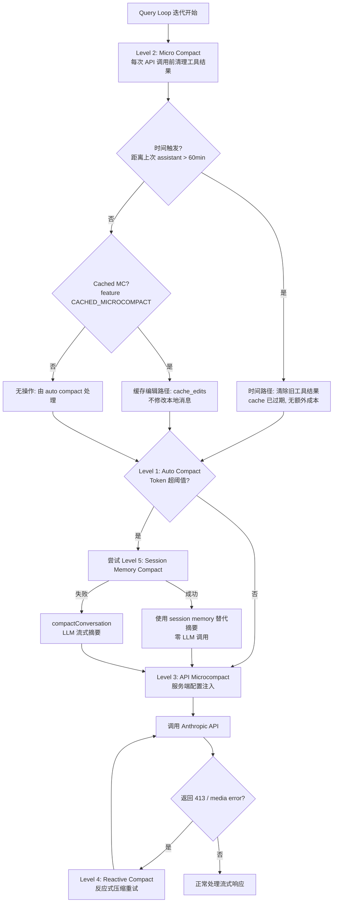

# Claude Code 对话压缩：5 级压缩机制详解

> 基于泄漏源码分析

所有 coding agent 都要面对上下文窗口的限制。Claude Code（以下简称 CC）使用 Claude 模型，上下文窗口约 200K tokens，但实际可用空间远小于这个数字——系统提示、工具定义、记忆文件、附件消息都占据固定开销，留给对话历史的窗口要在此基础上再打折扣。当对话持续增长、工具调用结果不断堆积时，压缩就不可避免。

CC 没有采用单一的「对话太长就调 LLM 做摘要」策略，而是设计了一套 5 级压缩机制。这套机制的核心设计思想是：**能用数据结构变换解决的就不调 LLM**。4 级压缩在数据结构层面操作（折叠工具结果、清除旧 thinking 块、利用 API 原生能力），只有最终级在需要高质量摘要时才调用 LLM。这与 OpenCode（两级压缩均调 LLM）和 Codex（三级均调 LLM）形成鲜明对比，是 CC 在 token 成本与上下文质量之间取得平衡的关键工程。

## 一、压缩问题

理解 CC 的压缩机制，首先要理解它要解决的三个矛盾。

**上下文窗口与对话增长**。用户在一个 session 里可能进行数十轮对话，每轮包含文件读取、命令执行、代码编辑等工具调用。一次 `FileReadTool` 读取大文件可能产生数千 tokens 的结果，一次 `BashTool` 执行命令的输出可能更长。这些工具结果累积起来，很快就会逼近上下文窗口上限。超过窗口限制会导致 API 返回 400 `context_length_exceeded` 错误，对话被迫中断。

**Prompt caching 的成本结构**。Claude API 支持 prompt caching：重复的前缀内容以 cache hit 价格（0.1x）计费，远低于正常 input 价格（1.0x）。但一旦修改消息结构（压缩就是修改），cache 立即失效，下一次请求要以 cache write 价格（1.25x）重新写入。这意味着每次压缩都有一个隐含成本：不仅压缩本身可能花费 LLM 调用，后续请求的缓存也会被破坏。因此，压缩策略必须考虑 cache 友好性——能不修改消息前缀就不修改，能只清理尾部就只清理尾部。

CC 对此有一个精巧的设计：cached microcompact 路径通过 Anthropic 的 `cache_edits` API，在不修改客户端消息数组的情况下删除服务端缓存中的工具结果。这样客户端的消息结构不变，cache key 不被破坏，但服务端在计算 token 时不再计入被删除的内容。这是「prompt cache aware」的具体含义——压缩策略本身感知到缓存的存在，并主动避免破坏缓存。OpenCode 和 Codex 的压缩都没有这种缓存感知能力。

**信息保留与 token 节省**。压缩太激进，模型丢失关键上下文，后续对话质量下降；压缩太保守，token 节省不够，很快又要再压。CC 的方案是分层渐进：先尝试低成本的微压缩（只清理工具结果），不够再升级到自动压缩（尝试用 session memory 代替摘要），最后才调用 LLM 做完整摘要。每一级都有明确的触发条件和成本预算，避免「一刀切」的粗暴策略。

此外，CC 的压缩系统还有两个工程层面的考量。第一是**断路器**：当上下文不可恢复地超过限制时（例如 prompt_too_long），auto compact 会连续失败。如果没有断路器，会话会陷入「压缩失败 → 下一轮再试 → 再失败」的死循环，产生大量无效 API 调用。第二是**递归守卫**：压缩本身会创建 forked agent（用于 LLM 摘要或 session memory 提取），这些 fork 也可能触发压缩，形成递归。CC 通过 `querySource` 标记（`'compact'`、`'session_memory'`）跳过这些 fork 的压缩检查，避免死锁。

## 二、5 级压缩概览

CC 的压缩系统分布在 `src/services/compact/` 目录下的 11 个文件中，形成 5 个层级的压缩策略：

| Level | 名称 | 文件 | 触发条件 | 成本 | 质量 |
|-------|------|------|----------|------|------|
| 1 | Auto Compact | `autoCompact.ts` | Token 达有效窗口 ~93% | 中 | 中-高 |
| 2 | Micro Compact | `microCompact.ts` | 每次 API 调用前 | 低 | 中 |
| 3 | API Microcompact | `apiMicrocompact.ts` | 服务端 input_tokens 超阈值 | 无（API 侧） | 低 |
| 4 | Reactive Compact | `reactiveCompact.ts` | API 返回 413 / media error | 中 | 高 |
| 5 | Session Memory Compact | `sessionMemoryCompact.ts` | Auto compact 优先尝试 | 低 | 最高 |

需要特别说明的是：`reactiveCompact.ts` 在泄漏源码中不存在——它被 `feature('REACTIVE_COMPACT')` 条件编译裁剪，是 ant（Anthropic 内部）独有模块。但 `query.ts` 和 `commands/compact/compact.ts` 中保留了对它的调用点，可以推断其行为。类似地，`cachedMicrocompact.ts`（cached microcompact 路径的实现）也被 `feature('CACHED_MICROCOMPACT')` 裁剪，但 `microCompact.ts` 中保留了对它的引用和接口描述。

这 5 级的关系不是简单的「逐级升级」，而是各自在不同时机被触发、互相补充的。需要特别说明：**Level 5（Session Memory Compact）是 Level 1（Auto Compact）的优先子路径，并非独立触发**——auto compact 触发时会先尝试 session memory（用历史记忆数据结构变换，不调 LLM），失败才回退到 LLM 摘要。因此 5 级是按「压缩机制」划分，而非「触发时机」划分。下方的 mermaid 图展示了它们在 query 循环中的触发顺序和决策路径：



## 三、Level 1: Auto Compact

Auto compact 是 CC 最核心的主动压缩机制，位于 `src/services/compact/autoCompact.ts`（351 行）。它在每次 API 调用前检查 token 使用量，超过阈值时触发压缩。

### 3.1 阈值计算

Auto compact 的触发不是简单的「80% 上下文窗口」，而是一套精密的多级阈值体系：

```typescript
// src/services/compact/autoCompact.ts:28-65
const MAX_OUTPUT_TOKENS_FOR_SUMMARY = 20_000  // 为摘要输出预留
const AUTOCOMPACT_BUFFER_TOKENS = 13_000      // auto compact 触发缓冲
const WARNING_THRESHOLD_BUFFER_TOKENS = 20_000
const ERROR_THRESHOLD_BUFFER_TOKENS = 20_000
const MANUAL_COMPACT_BUFFER_TOKENS = 3_000
```

`getEffectiveContextWindowSize()` 先从原始上下文窗口中减去摘要输出预留。这个预留基于 p99.99 的摘要输出统计（17,387 tokens），向上取整到 20,000：

```typescript
// src/services/compact/autoCompact.ts:33-49
export function getEffectiveContextWindowSize(model: string): number {
  const reservedTokensForSummary = Math.min(
    getMaxOutputTokensForModel(model),
    MAX_OUTPUT_TOKENS_FOR_SUMMARY,
  )
  let contextWindow = getContextWindowForModel(model, getSdkBetas())
  // 支持环境变量覆盖，用于测试
  const autoCompactWindow = process.env.CLAUDE_CODE_AUTO_COMPACT_WINDOW
  if (autoCompactWindow) {
    const parsed = parseInt(autoCompactWindow, 10)
    if (!isNaN(parsed) && parsed > 0) {
      contextWindow = Math.min(contextWindow, parsed)
    }
  }
  return contextWindow - reservedTokensForSummary
}
```

以 200K 上下文窗口为例：有效窗口 = 200K - 20K = 180K。Auto compact 阈值 = 180K - 13K = 167K（以 200K 原始窗口为基准约 83.5%）。再加上 warning（167K - 20K = 147K）和 error（同样 147K）两级预警，构成完整的 `calculateTokenWarningState()`：

> **注意**：阈值是固定 token 差值（13,000 tokens buffer），不是百分比。不同模型上下文窗口不同，百分比会变化。例如 Haiku 也是 200K 窗口时阈值相同约 83.5%；如果未来模型使用 100K 窗口，阈值将是 100K - 20K - 13K = 67K（约 67%）。文章以 Sonnet 200K 为标准上下文窗口讨论。

```typescript
// src/services/compact/autoCompact.ts:93-145
export function calculateTokenWarningState(
  tokenUsage: number,
  model: string,
): {
  percentLeft: number
  isAboveWarningThreshold: boolean
  isAboveErrorThreshold: boolean
  isAboveAutoCompactThreshold: boolean
  isAtBlockingLimit: boolean
} {
  const autoCompactThreshold = getAutoCompactThreshold(model)
  const threshold = isAutoCompactEnabled()
    ? autoCompactThreshold
    : getEffectiveContextWindowSize(model)
  const percentLeft = Math.max(
    0,
    Math.round(((threshold - tokenUsage) / threshold) * 100),
  )
  const warningThreshold = threshold - WARNING_THRESHOLD_BUFFER_TOKENS
  const errorThreshold = threshold - ERROR_THRESHOLD_BUFFER_TOKENS
  // ... 返回多级阈值状态
}
```

这套四级状态（ok → warning → error → autoCompact → blocking）驱动了终端 UI 中的 token 进度条颜色变化，也决定了是否触发压缩。`isAtBlockingLimit` 是最后防线：当 auto compact 被禁用时，到达 blocking limit 会直接阻止 API 调用，强制用户手动执行 `/compact`。`MANUAL_COMPACT_BUFFER_TOKENS = 3_000` 为这个手动操作预留了空间。

### 3.2 跟踪状态与断路器

`AutoCompactTrackingState` 跟踪压缩的执行状态：

```typescript
// src/services/compact/autoCompact.ts:51-60
export type AutoCompactTrackingState = {
  compacted: boolean
  turnCounter: number
  turnId: string
  consecutiveFailures?: number  // 连续失败计数，用于断路器
}
```

断路器是工程上非常重要的一环。当上下文不可恢复地超过限制时（例如 prompt_too_long），auto compact 会反复尝试并失败。源码注释记录了一个真实的线上事故：

```typescript
// src/services/compact/autoCompact.ts:67-70
// BQ 2026-03-10: 1,279 sessions had 50+ consecutive failures (up to 3,272)
// in a single session, wasting ~250K API calls/day globally.
const MAX_CONSECUTIVE_AUTOCOMPACT_FAILURES = 3
```

连续失败 3 次后断路器跳闸，当前 session 不再尝试 auto compact，避免无效 API 调用的雪崩。`turnCounter` 和 `turnId` 则用于追踪「距离上次压缩过了多少轮」，为 `recompactionInfo` 提供数据，让遥测能区分「同一链中的多次压缩」（H2 场景）与「跨 agent 的压缩」（H1/H5 场景）。

### 3.3 递归守卫

`shouldAutoCompact()` 包含多重递归守卫，防止压缩操作自身触发新的压缩：

```typescript
// src/services/compact/autoCompact.ts:170-183
// session_memory 和 compact 是 forked agent，会死锁
if (querySource === 'session_memory' || querySource === 'compact') {
  return false
}
// marble_origami 是 ctx-agent — 如果它的上下文膨胀触发 autocompact，
// runPostCompactCleanup 会调用 resetContextCollapse()，
// 销毁主线程的 committed log（模块级状态跨 fork 共享）
if (feature('CONTEXT_COLLAPSE')) {
  if (querySource === 'marble_origami') {
    return false
  }
}
```

这些守卫的核心思想是：压缩创建的 forked agent 继承了主对话的全部消息，如果它自己又触发压缩，就会形成「压缩 → fork → fork 的压缩 → fork 的 fork」的递归链。通过 `querySource` 标记跳过这些 fork，确保只有主线程的对话才会触发压缩。

### 3.4 双路径：Session Memory 优先

`autoCompactIfNeeded()` 的关键设计是**优先尝试 session memory 压缩**（无 LLM 调用），失败后才回退到传统的 `compactConversation()`（调 LLM 生成摘要）：

```typescript
// src/services/compact/autoCompact.ts:287-333
// EXPERIMENT: Try session memory compaction first
const sessionMemoryResult = await trySessionMemoryCompaction(
  messages,
  toolUseContext.agentId,
  recompactionInfo.autoCompactThreshold,
)
if (sessionMemoryResult) {
  setLastSummarizedMessageId(undefined)
  runPostCompactCleanup(querySource)
  if (feature('PROMPT_CACHE_BREAK_DETECTION')) {
    notifyCompaction(querySource ?? 'compact', toolUseContext.agentId)
  }
  markPostCompaction()
  return { wasCompacted: true, compactionResult: sessionMemoryResult }
}

// 回退到 LLM 摘要
const compactionResult = await compactConversation(
  messages,
  toolUseContext,
  cacheSafeParams,
  true,  // Suppress user questions for autocompact
  undefined,  // No custom instructions for autocompact
  true,  // isAutoCompact
  recompactionInfo,
)
```

如果 session memory 压缩成功，整个 auto compact 过程不产生任何 LLM 调用——session memory 是后台异步提取的，压缩时直接读取已提取的记忆文件。只有在 session memory 不可用或不足时，才调用 `compactConversation()` 让 LLM 生成摘要。

此外，在 reactive-only 模式下（`tengu_cobalt_raccoon` feature flag 为 true 时），auto compact 会被主动抑制，让 reactive compact 作为唯一的压缩路径。这是一个 A/B 实验设计：比较「主动压缩（auto compact 预防性触发）」与「被动压缩（reactive compact 仅在 413 时触发）」哪种策略整体更优。

## 四、Level 2: Micro Compact

Micro compact 是最轻量的压缩策略，位于 `src/services/compact/microCompact.ts`（530 行）。它在每次 API 调用前运行，目标是清理旧的工具结果以减少 token 消耗。

### 4.1 可压缩工具集

只有特定工具的结果才会被 micro compact 处理：

```typescript
// src/services/compact/microCompact.ts:41-50
const COMPACTABLE_TOOLS = new Set<string>([
  FILE_READ_TOOL_NAME,
  ...SHELL_TOOL_NAMES,
  GREP_TOOL_NAME,
  GLOB_TOOL_NAME,
  WEB_SEARCH_TOOL_NAME,
  WEB_FETCH_TOOL_NAME,
  FILE_EDIT_TOOL_NAME,
  FILE_WRITE_TOOL_NAME,
])
```

这些工具的共同特点是：输出内容大、时效性低。文件读取的结果在后续对话中很少被逐字引用，命令输出更是如此。而像 `TodoWriteTool`、`AgentTool` 等工具的结果不在这个集合中——它们的内容对后续对话有持续的参考价值。

### 4.2 三条路径

`microcompactMessages()` 有三条执行路径，按优先级短路：

**路径一：时间触发（Time-based）**。当距离上一条 assistant 消息的时间间隔超过阈值（默认 60 分钟），服务端 prompt cache 已过期，全量前缀无论如何都要重写——此时清理旧工具结果不会产生额外成本。配置来自 `timeBasedMCConfig.ts`，通过 GrowthBook 远程下发：

```typescript
// src/services/compact/timeBasedMCConfig.ts:30-34
const TIME_BASED_MC_CONFIG_DEFAULTS: TimeBasedMCConfig = {
  enabled: false,
  gapThresholdMinutes: 60,  // 60 分钟 = 服务端 1h cache TTL
  keepRecent: 5,            // 保留最近 5 个工具结果
}
```

注释明确说明了阈值选择的原因：60 分钟是服务端 1 小时 cache TTL 的安全边界——超过这个时间，缓存确定已过期，清理工具结果不会导致「本来能命中缓存的请求变成 cache miss」。这个路径直接修改消息内容，将被清理的工具结果替换为标记字符串：

```typescript
// src/services/compact/microCompact.ts:36
export const TIME_BASED_MC_CLEARED_MESSAGE = '[Old tool result content cleared]'
```

**路径二：缓存编辑（Cached Microcompact）**。这是最精巧的路径，通过 Anthropic 的 `cache_edits` API 在不修改本地消息内容的情况下删除服务端缓存中的工具结果：

```typescript
// src/services/compact/microCompact.ts:296-303
/**
 * Key differences from regular microcompact:
 * - Does NOT modify local message content (cache_reference and cache_edits
 *   are added at API layer)
 * - Uses count-based trigger/keep thresholds from GrowthBook config
 * - Takes precedence over regular microcompact (no disk persistence)
 * - Tracks tool results and queues cache edits for the API layer
 */
```

Cached microcompact 不修改客户端消息数组——它在 API 请求层附加 `cache_edits` 块，告诉服务端「这些工具结果可以从缓存中删除」。这样客户端消息保持不变，cache key 不被破坏，但服务端在计算 token 时不再计入这些被删除的工具结果。这是 CC 的「prompt cache aware」设计的核心体现：压缩策略主动感知缓存的存在，并选择不破坏缓存的方式。

这个路径还维护了一个 `pinnedEdits` 列表，记录已经被发送过的 cache edits 及其位置。后续请求需要在原始位置重新发送这些 edits，否则服务端的缓存状态会与客户端不一致。`consumePendingCacheEdits()` 和 `pinCacheEdits()` 管理这个生命周期。

此路径由 `feature('CACHED_MICROCOMPACT')` 门控，且只在主线程（`repl_main_thread` query source）执行——子 agent 的工具结果不能注册到全局的 `cachedMCState` 中，否则主线程会尝试删除不存在于自己对话中的工具结果。`cachedMicrocompact.ts` 文件在泄漏源码中不存在（ant-only）。

**路径三：无操作**。当以上两条路径都不触发时，microcompact 返回原始消息不做处理，由 auto compact 处理上下文压力。源码注释说明这是一个有意的设计：

```typescript
// src/services/compact/microCompact.ts:288-292
// Legacy microcompact path removed — tengu_cache_plum_violet is always true.
// For contexts where cached microcompact is not available (external builds,
// non-ant users, unsupported models, sub-agents), no compaction happens here;
// autocompact handles context pressure instead.
return { messages }
```

### 4.3 Token 估算

Micro compact 需要在不调 API 的情况下估算 token 数量。`estimateMessageTokens()` 遍历所有消息块，按类型累加估算值，最后乘以 4/3 的保守系数：

```typescript
// src/services/compact/microCompact.ts:164-205
export function estimateMessageTokens(messages: Message[]): number {
  let totalTokens = 0
  for (const message of messages) {
    if (message.type !== 'user' && message.type !== 'assistant') continue
    for (const block of message.message.content) {
      if (block.type === 'text') {
        totalTokens += roughTokenCountEstimation(block.text)
      } else if (block.type === 'tool_result') {
        totalTokens += calculateToolResultTokens(block)
      } else if (block.type === 'image' || block.type === 'document') {
        totalTokens += IMAGE_MAX_TOKEN_SIZE  // 固定 2000
      } else if (block.type === 'thinking') {
        totalTokens += roughTokenCountEstimation(block.thinking)
      }
      // ...
    }
  }
  return Math.ceil(totalTokens * (4 / 3))  // 保守估计
}
```

4/3 的系数是刻意的保守设计：宁可高估 token 数（提前触发压缩），也不要低估（导致 API 400 错误）。图像和文档固定按 2000 tokens 计算，因为它们的实际 token 数取决于服务端的内部处理，客户端无法准确估算。

## 五、Level 3: API Microcompact

API microcompact 位于 `src/services/compact/apiMicrocompact.ts`（153 行），是最特殊的一级——它不在客户端做任何数据变换，而是构造一个 `ContextManagementConfig` 传给 Anthropic API，由服务端原生处理上下文清理。

### 5.1 上下文管理策略

API microcompact 定义了两种服务端策略：

```typescript
// src/services/compact/apiMicrocompact.ts:35-61
export type ContextEditStrategy =
  | {
      type: 'clear_tool_uses_20250919'
      trigger?: { type: 'input_tokens'; value: number }
      keep?: { type: 'tool_uses'; value: number }
      clear_tool_inputs?: boolean | string[]
      exclude_tools?: string[]
      clear_at_least?: { type: 'input_tokens'; value: number }
    }
  | {
      type: 'clear_thinking_20251015'
      keep: { type: 'thinking_turns'; value: number } | 'all'
    }
```

`clear_tool_uses_20250919` 策略在 input_tokens 超过触发阈值时，清除旧的工具调用结果。`clear_thinking_20251015` 策略清除旧的 thinking 块，只保留最近 N 轮。策略名称中的日期后缀（`20250919`、`20251015`）是 Anthropic API 的版本化策略标识，确保客户端和服务端对策略语义有一致的契约。

### 5.2 配置构造

`getAPIContextManagement()` 根据当前会话状态构造策略数组：

```typescript
// src/services/compact/apiMicrocompact.ts:64-152
export function getAPIContextManagement(options?: {
  hasThinking?: boolean
  isRedactThinkingActive?: boolean
  clearAllThinking?: boolean
}): ContextManagementConfig | undefined {
  const strategies: ContextEditStrategy[] = []
  // thinking 清理策略（对所有用户生效）
  if (hasThinking && !isRedactThinkingActive) {
    strategies.push({
      type: 'clear_thinking_20251015',
      keep: clearAllThinking
        ? { type: 'thinking_turns', value: 1 }
        : 'all',
    })
  }
  // 工具结果清理策略（ant-only）
  if (process.env.USER_TYPE !== 'ant') {
    return strategies.length > 0 ? { edits: strategies } : undefined
  }
  // ... 按环境变量构造 clear_tool_uses 策略
}
```

默认触发阈值 180K tokens，目标保留 40K tokens，与客户端 microcompact 的值对齐。`clear_at_least` 字段确保服务端至少清除 `triggerThreshold - keepTarget = 140K` tokens 的工具结果，避免服务端「象征性清理」几个工具就认为满足了要求。

工具结果清理策略仅对 ant 用户开放，外部用户只能使用 thinking 清理。`clearAllThinking` 参数在用户空闲超过 1 小时后激活——此时缓存确定已失效，只保留最近一轮 thinking 即可，不需要保留全部。

### 5.3 零成本优势

API microcompact 的核心优势是**零客户端成本**：不调 LLM、不修改本地消息、不产生额外网络请求。策略配置附加到正常 API 请求中，服务端在处理请求时自动应用。代价是质量较低——服务端使用通用策略清理，不像 LLM 摘要那样能保留语义关键信息。服务端不知道哪些工具结果对当前任务更重要，只能按时间顺序清除最旧的。

## 六、Level 4: Reactive Compact

Reactive compact 是唯一被 API 错误触发的压缩策略。`reactiveCompact.ts` 在泄漏源码中不存在（被 `feature('REACTIVE_COMPACT')` 裁剪），但其调用模式在 `query.ts` 和 `commands/compact/compact.ts` 中清晰可见，可以从调用点推断其行为。

### 6.1 条件加载

Reactive compact 通过 Bun 的 `feature()` 条件加载，未启用时为 `null`：

```typescript
// src/query.ts:15-17
const reactiveCompact = feature('REACTIVE_COMPACT')
  ? (require('./services/compact/reactiveCompact.js') as typeof import('./services/compact/reactiveCompact.js'))
  : null
```

这种 `require()` + `as typeof import()` 的模式在第一篇架构文中已有详述：编译期保留类型信息，运行期按 feature flag 决定是否加载模块。`REACTIVE_COMPACT` 是 ant-only 特性，在外部构建中被死代码消除。

### 6.2 413 错误处理

Reactive compact 的核心入口是 `tryReactiveCompact()`，在 API 返回 prompt-too-long（413）或 media-size-error 时触发。在 `query.ts` 的流式处理循环中，错误被「扣留」（withheld）而非立即抛出，给恢复逻辑一个机会：

```typescript
// src/query.ts:799-825
let withheld = false
if (feature('CONTEXT_COLLAPSE')) {
  if (contextCollapse?.isWithheldPromptTooLong(message, isPromptTooLongMessage, querySource)) {
    withheld = true
  }
}
if (reactiveCompact?.isWithheldPromptTooLong(message)) {
  withheld = true
}
if (mediaRecoveryEnabled && reactiveCompact?.isWithheldMediaSizeError(message)) {
  withheld = true
}
if (!withheld) {
  yield yieldMessage  // 正常消息才 yield
}
```

扣留机制的设计思想是：错误消息先不展示给用户，先尝试恢复。如果恢复成功，用户不会看到错误；如果恢复失败，才将错误消息 yield 出去。这避免了用户在 413 后看到「prompt too long」然后又看到压缩恢复的过程——用户体验更平滑。

恢复逻辑在流式处理结束后执行：

```typescript
// src/query.ts:1119-1166
if ((isWithheld413 || isWithheldMedia) && reactiveCompact) {
  const compacted = await reactiveCompact.tryReactiveCompact({
    hasAttempted: hasAttemptedReactiveCompact,
    querySource,
    aborted: toolUseContext.abortController.signal.aborted,
    messages: messagesForQuery,
    cacheSafeParams: { systemPrompt, userContext, systemContext,
      toolUseContext, forkContextMessages: messagesForQuery },
  })
  if (compacted) {
    const postCompactMessages = buildPostCompactMessages(compacted)
    for (const msg of postCompactMessages) { yield msg }
    state = {
      messages: postCompactMessages,
      hasAttemptedReactiveCompact: true,  // 防止无限重试
      transition: { reason: 'reactive_compact_retry' },
    }
    continue  // 用压缩后的消息重试 API
  }
  // 恢复失败，抛出错误
  yield lastMessage
  void executeStopFailureHooks(lastMessage, toolUseContext)
  return { reason: isWithheldMedia ? 'image_error' : 'prompt_too_long' }
}
```

`hasAttemptedReactiveCompact` 标志位防止螺旋重试：如果 reactive compact 压缩后仍然 413，不再尝试，直接返回错误。注释明确说明了为什么不在恢复失败后继续执行 stop hooks：「模型从未产生有效响应，hooks 没有有意义的评估对象。在 prompt-too-long 上运行 stop hooks 会制造死亡螺旋：error → hook blocking → retry → error → ...」

### 6.3 Context Collapse 优先

在 reactive compact 之前，还有一个 `contextCollapse` 的恢复路径。当 413 发生时，优先尝试 drain 所有 staged context-collapses：

```typescript
// src/query.ts:1089-1117
if (isWithheld413) {
  if (feature('CONTEXT_COLLAPSE') && contextCollapse &&
      state.transition?.reason !== 'collapse_drain_retry') {
    const drained = contextCollapse.recoverFromOverflow(messagesForQuery, querySource)
    if (drained.committed > 0) {
      state = { messages: drained.messages, /* ... */,
        transition: { reason: 'collapse_drain_retry', committed: drained.committed } }
      continue
    }
  }
}
```

Context collapse 是另一个上下文管理实验特性，它在对话进行中「暂存」（stage）部分消息的折叠，在需要时 commit 或 drain。`collapse_drain_retry` 标记防止在 drain 后仍 413 时重复 drain——如果 drain 没用，就继续到 reactive compact。

### 6.4 Reactive Compact 的设计哲学

Reactive compact 的哲学与 auto compact 截然不同：不预测何时需要压缩，而是在 API 拒绝时再反应。Auto compact 需要设定阈值（83.5%），这个阈值是经验值，不同对话模式下的最优值不同。Reactive compact 省去了预测阈值的复杂性，让 API 自己告诉你「上下文太长了」。

代价是用户可能在 413 后经历一次重试延迟。但这个延迟被 withhold 机制掩盖了——用户看到的是「正在处理」而不是「出错了正在修复」。CC 通过 `tengu_cobalt_raccoon` feature flag 做 A/B 实验，比较两种策略的总体效果。

## 七、Level 5: Session Memory Compact

Session memory compact 是 CC 压缩体系中最精巧的一级。它位于 `src/services/compact/sessionMemoryCompact.ts`（630 行），利用后台异步提取的 session memory 替代实时 LLM 摘要，实现**零 LLM 调用的高质量压缩**。

### 7.1 Session Memory 的异步提取

理解 session memory compact，首先要理解 session memory 本身。`src/services/SessionMemory/sessionMemory.ts`（495 行）在对话进行中后台运行一个 forked agent，定期提取对话关键信息写入 markdown 文件：

```typescript
// src/services/SessionMemory/sessionMemory.ts:315-318
// Run session memory extraction using runForkedAgent for prompt caching
// runForkedAgent creates an isolated context to prevent mutation of parent state
await runForkedAgent({
  // ...提取配置
})
```

提取的触发条件由 `SessionMemoryConfig` 控制：

```typescript
// src/services/SessionMemory/sessionMemoryUtils.ts:32-36
export const DEFAULT_SESSION_MEMORY_CONFIG: SessionMemoryConfig = {
  minimumMessageTokensToInit: 10000,    // 对话达到 10K tokens 才初始化
  minimumTokensBetweenUpdate: 5000,    // 每增长 5K tokens 更新一次
  toolCallsBetweenUpdates: 3,           // 每 3 次工具调用更新一次
}
```

这个提取过程确实调用了 LLM，但它发生在后台、与主对话异步、分摊在多次工具调用之间。当 auto compact 触发时，session memory 已经准备好了——压缩时只需读取文件，不需要实时调用 LLM。这就是 session memory compact 能实现「零 LLM 调用」的根本原因：把 LLM 调用的成本从压缩的关键路径上移走，前置到对话进行中的后台。

### 7.2 消息保留策略

`trySessionMemoryCompaction()` 的核心是决定保留哪些最近的消息。配置通过 GrowthBook 远程下发：

```typescript
// src/services/compact/sessionMemoryCompact.ts:57-61
export const DEFAULT_SM_COMPACT_CONFIG: SessionMemoryCompactConfig = {
  minTokens: 10_000,           // 最少保留 10K tokens
  minTextBlockMessages: 5,     // 最少保留 5 条含文本块的消息
  maxTokens: 40_000,           // 最多保留 40K tokens
}
```

`calculateMessagesToKeepIndex()` 从 `lastSummarizedMessageId`（上次 session memory 提取覆盖到的消息 ID）开始向后扩展，直到满足两个最小值之一，或触及 `maxTokens` 上限：

```typescript
// src/services/compact/sessionMemoryCompact.ts:324-397
export function calculateMessagesToKeepIndex(
  messages: Message[],
  lastSummarizedIndex: number,
): number {
  let startIndex = lastSummarizedIndex >= 0
    ? lastSummarizedIndex + 1
    : messages.length
  let totalTokens = 0
  let textBlockMessageCount = 0
  // 从 startIndex 向后扫描，计算已有 token 和文本消息数
  for (let i = startIndex; i < messages.length; i++) {
    totalTokens += estimateMessageTokens([messages[i]!])
    if (hasTextBlocks(messages[i]!)) textBlockMessageCount++
  }
  // 已满足最小值 → 直接返回
  if (totalTokens >= config.minTokens &&
      textBlockMessageCount >= config.minTextBlockMessages) {
    return adjustIndexToPreserveAPIInvariants(messages, startIndex)
  }
  // 向前扩展直到满足条件或触及上限
  for (let i = startIndex - 1; i >= floor; i--) {
    totalTokens += estimateMessageTokens([messages[i]!])
    if (hasTextBlocks(messages[i]!)) textBlockMessageCount++
    startIndex = i
    if (totalTokens >= config.maxTokens) break
    if (totalTokens >= config.minTokens &&
        textBlockMessageCount >= config.minTextBlockMessages) break
  }
  return adjustIndexToPreserveAPIInvariants(messages, startIndex)
}
```

两个最小值的设定各有考量：`minTokens` 确保保留足够的上下文让模型理解当前工作状态；`minTextBlockMessages` 确保保留足够多的用户-助手交互轮次，让模型能理解用户的意图变化。`maxTokens` 是硬上限，防止保留过多消息导致压缩后仍超阈值。扩展的下界（`floor`）是上一个 compact boundary——不能跨越已有的压缩边界向前扩展，否则会破坏磁盘上的消息链连续性。

### 7.3 API 不变量保护

`adjustIndexToPreserveAPIInvariants()` 确保压缩不会破坏 Anthropic API 的消息格式约束。它处理两个场景：

**Tool use/result 配对**：如果保留的消息包含 `tool_result` 块，必须同时保留包含对应 `tool_use` 的 assistant 消息，否则 API 会报「orphan tool_result references non-existent tool_use」。

**Thinking 块合并**：流式响应会把同一个 `message.id` 的 thinking 块和 tool_use 块拆成多条消息。如果切分点落在它们中间，`normalizeMessagesForAPI` 合并时会丢失 thinking 块。函数检测同 `message.id` 的消息并调整切分点：

```typescript
// src/services/compact/sessionMemoryCompact.ts:232-314（大幅简化，仅示 Step 1/2 主流程）
export function adjustIndexToPreserveAPIInvariants(
  messages: Message[],
  startIndex: number,
): number {
  let adjustedIndex = startIndex
  // Step 1: 收集保留范围内的所有 tool_result IDs
  // 向前查找包含对应 tool_use 的 assistant 消息
  const allToolResultIds: string[] = []
  for (let i = startIndex; i < messages.length; i++) {
    allToolResultIds.push(...getToolResultIds(messages[i]!))
  }
  if (allToolResultIds.length > 0) {
    const neededToolUseIds = new Set(allToolResultIds.filter(
      id => !toolUseIdsInKeptRange.has(id)))
    for (let i = adjustedIndex - 1; i >= 0 && neededToolUseIds.size > 0; i--) {
      if (hasToolUseWithIds(messages[i]!, neededToolUseIds)) {
        adjustedIndex = i
        // ... 移除已找到的 ID
      }
    }
  }
  // Step 2: 收集保留范围内的所有 message.id
  // 向前查找同 id 的 thinking 消息
  for (let i = adjustedIndex - 1; i >= 0; i--) {
    if (message.type === 'assistant' && messageIdsInKeptRange.has(message.message.id)) {
      adjustedIndex = i  // 包含同 id 的 thinking 消息
    }
  }
  return adjustedIndex
}
```

这个函数的存在说明了流式消息处理的复杂性：同一次 API 响应可能被拆成多条消息（thinking、tool_use 分开存储），但 API 要求它们在发送时被合并。压缩的切分点必须尊重这种拆分-合并的不对称性。

### 7.4 压缩结果构造

Session memory compact 的压缩结果由 `createCompactionResultFromSessionMemory()` 构造。它不调用 LLM，而是把 session memory 文件内容包装成 summary 消息，配合保留的最近消息一起返回：

```typescript
// src/services/compact/sessionMemoryCompact.ts:437-503
function createCompactionResultFromSessionMemory(
  messages: Message[],
  sessionMemory: string,
  messagesToKeep: Message[],
  hookResults: HookResultMessage[],
  transcriptPath: string,
  agentId?: AgentId,
): CompactionResult {
  const preCompactTokenCount = tokenCountFromLastAPIResponse(messages)
  const boundaryMarker = createCompactBoundaryMessage(
    'auto', preCompactTokenCount ?? 0, messages[messages.length - 1]?.uuid)
  // 截断过长的 session memory 段
  const { truncatedContent, wasTruncated } =
    truncateSessionMemoryForCompact(sessionMemory)
  let summaryContent = getCompactUserSummaryMessage(
    truncatedContent, true, transcriptPath, true)
  if (wasTruncated) {
    summaryContent += `\n\nSome session memory sections were truncated...`
  }
  return {
    boundaryMarker: annotateBoundaryWithPreservedSegment(...),
    summaryMessages,
    attachments,
    hookResults,
    messagesToKeep,  // 保留的最近消息
    // SM-compact has no compact-API-call
    postCompactTokenCount: estimateMessageTokens(summaryMessages),
    truePostCompactTokenCount: estimateMessageTokens(summaryMessages),
  }
}
```

注意注释 `// SM-compact has no compact-API-call`——session memory compact 明确不产生 API 调用。`postCompactTokenCount` 和 `truePostCompactTokenCount` 收敛到同一个值（摘要消息的 token 估算），因为不存在「压缩 API 调用的总用量」与「压缩后上下文大小」的区分。

### 7.5 恢复会话场景

`trySessionMemoryCompaction()` 还处理一种特殊场景：恢复的会话（resumed session）。当用户通过 `--resume` 恢复一个之前被压缩过的会话时，`lastSummarizedMessageId` 可能未设置（因为进程重启后内存状态丢失），但 session memory 文件仍然存在：

```typescript
// src/services/compact/sessionMemoryCompact.ts:548-566
if (lastSummarizedMessageId) {
  // 正常情况：知道哪些消息已被摘要
  lastSummarizedIndex = messages.findIndex(msg => msg.uuid === lastSummarizedMessageId)
  if (lastSummarizedIndex === -1) {
    // ID 不在当前消息中（可能被修改）→ 回退到传统压缩
    return null
  }
} else {
  // 恢复会话：有 session memory 但不知道边界
  lastSummarizedIndex = messages.length - 1
  logEvent('tengu_sm_compact_resumed_session', {})
}
```

在恢复场景中，startIndex 被设为 `messages.length`（不保留任何消息），然后 `calculateMessagesToKeepIndex()` 向前扩展到满足最小值。这样所有消息都被 session memory 替代，但保留了最近的几条消息作为工作上下文。

## 八、Compact 架构

CC 的压缩系统由多个协作模块组成。下表梳理各文件职责：

| 文件 | 行数 | 职责 |
|------|------|------|
| `compact.ts` | 1705 | 核心：`compactConversation()` LLM 摘要、`buildPostCompactMessages()` 消息重建 |
| `autoCompact.ts` | 351 | 阈值监控、触发决策、session memory 优先、断路器 |
| `microCompact.ts` | 530 | 工具结果清理、时间触发、缓存编辑 |
| `apiMicrocompact.ts` | 153 | 服务端上下文管理策略配置 |
| `sessionMemoryCompact.ts` | 630 | 基于 session memory 的无 LLM 压缩 |
| `grouping.ts` | 63 | 按 API 轮次分组消息 |
| `prompt.ts` | 374 | 压缩摘要的 prompt 模板 |
| `postCompactCleanup.ts` | 77 | 压缩后缓存/状态清理 |
| `compactWarningState.ts` | 18 | 压缩警告抑制状态 |
| `compactWarningHook.ts` | 16 | React hook 订阅警告状态 |
| `timeBasedMCConfig.ts` | 43 | 时间触发 microcompact 配置 |

### 8.1 compactConversation：LLM 摘要路径

`compactConversation()` 是传统的 LLM 摘要路径，在 session memory 不可用时作为 fallback 被调用。它通过 `streamCompactSummary()` 发起 LLM 请求，优先尝试 forked agent 路径（复用主对话的 prompt cache）：

```typescript
// src/services/compact/compact.ts:1136-1396
async function streamCompactSummary({ ... }): Promise<AssistantMessage> {
  const promptCacheSharingEnabled = getFeatureValue_CACHED_MAY_BE_STALE(
    'tengu_compact_cache_prefix', true)
  if (promptCacheSharingEnabled) {
    try {
      const result = await runForkedAgent({
        promptMessages: [summaryRequest],
        cacheSafeParams,
        canUseTool: createCompactCanUseTool(),  // 拒绝所有工具调用
        querySource: 'compact',
        forkLabel: 'compact',
        maxTurns: 1,
        skipCacheWrite: true,
      })
      // ...
    } catch (error) {
      // fallback to streaming path
    }
  }
  // 直接流式路径（fallback）
  const streamingGen = queryModelWithStreaming({
    messages: normalizeMessagesForAPI(
      stripImagesFromMessages(stripReinjectedAttachments([
        ...getMessagesAfterCompactBoundary(messages), summaryRequest,
      ])),
      context.options.tools,
    ),
    systemPrompt: asSystemPrompt([
      'You are a helpful AI assistant tasked with summarizing conversations.',
    ]),
    thinkingConfig: { type: 'disabled' },
    tools: [FileReadTool],
    // ...
  })
}
```

关键设计有三点。第一，压缩 agent 的 `canUseTool` 返回 `deny`——压缩过程不允许调用任何工具，只产出文本摘要。这避免了压缩过程中工具调用产生的额外上下文膨胀。第二，forked agent 路径复用主对话的 prompt cache（通过传递相同的 `cacheSafeParams`），避免重复写入缓存。第三，如果 forked agent 失败，fallback 到直接流式路径，用极简的系统提示（"You are a helpful AI assistant tasked with summarizing conversations."）和最小工具集（只有 FileReadTool）。

### 8.2 压缩 Prompt 模板

`prompt.ts` 定义了压缩摘要的 prompt 结构。CC 的摘要 prompt 不是简单的「总结对话」，而是要求模型按 9 个固定段落输出：

```
1. Primary Request and Intent     — 用户请求和意图
2. Key Technical Concepts         — 技术概念
3. Files and Code Sections        — 文件和代码片段（含完整 snippet）
4. Errors and fixes               — 错误及修复方式
5. Problem Solving                — 问题解决过程
6. All user messages              — 所有非工具结果的用户消息
7. Pending Tasks                  — 待办任务
8. Current Work                   — 当前工作状态
9. Optional Next Step             — 可选的下一步（含原文引用）
```

模型被要求先用 `<analysis>` 标签做草稿分析，再输出 `<summary>` 块。`formatCompactSummary()` 会在送入上下文前剥离 `<analysis>` 部分，只保留 `<summary>`。这种「先思考再产出」的结构让模型有机会在正式摘要前梳理思路，提高摘要质量，同时草稿不被保留在上下文中，不浪费 token。

prompt 还包含一个 `NO_TOOLS_PREAMBLE` 前缀，明确告知模型不要调用任何工具。这是因为 forked agent 路径继承了主对话的完整工具集（为了 cache key 匹配），Sonnet 4.6+ 的 adaptive-thinking 模型有时会在摘要任务中尝试工具调用——前缀将这种概率从 2.79% 降低到 0.01%。

手动 `/compact` 命令位于 `src/commands/compact/compact.ts`（287 行），它的执行路径与 auto compact 类似但有关键差异。首先，手动压缩先尝试 session memory compaction（无自定义指令时），失败后尝试 reactive compact（如果处于 reactive-only 模式），最后回退到传统 `compactConversation()`。在传统路径中，手动压缩会先执行 `microcompactMessages()` 清理工具结果，再调用 `compactConversation()` 生成摘要——这与 auto compact 的「先 session memory 再 LLM」路径不同。

手动压缩与 auto compact 的另一个差异是：手动压缩允许用户提供自定义指令（`customInstructions`），这些指令会通过 hook 合并后注入到压缩 prompt 中。用户可以指示摘要聚焦于特定的文件、任务或决策。此外，手动压缩的错误会通过 `addErrorNotificationIfNeeded()` 展示给用户，而 auto compact 的错误是静默的（失败后下一轮重试）。

在 reactive-only 模式下，手动 `/compact` 会走 `compactViaReactive()` 路径——它不调用 `compactConversation()`，而是调用 `reactiveCompact.reactiveCompactOnPromptTooLong()`。这个函数虽然名字暗示「处理 413」，但实际也被手动压缩复用，因为它的「从尾部逐组剥离并摘要」的策略同样适用于主动压缩场景。`compactViaReactive()` 的 PreCompact hooks 与 cache 参数构建是并行执行的（`Promise.all`），因为两者互不依赖——hook 派生子进程，cache 参数遍历工具列表构建系统提示，没有数据依赖关系。

### 8.3 buildPostCompactMessages：消息重建

`buildPostCompactMessages()` 是所有压缩路径的统一出口，负责把 `CompactionResult` 组装成新的消息数组：

```typescript
// src/services/compact/compact.ts:330-338
export function buildPostCompactMessages(result: CompactionResult): Message[] {
  return [
    result.boundaryMarker,      // 压缩边界标记
    ...result.summaryMessages,   // 摘要消息
    ...(result.messagesToKeep ?? []),  // 保留的最近消息
    ...result.attachments,       // 附件（文件、计划、技能等）
    ...result.hookResults,       // hook 消息（CLAUDE.md 等）
  ]
}
```

这个固定的排列顺序确保所有压缩路径产出的消息结构一致。`boundaryMarker` 是一条 `SystemCompactBoundaryMessage`，标记压缩发生的位置——后续的 `getMessagesAfterCompactBoundary()` 会从这个标记开始读取「压缩后的消息」，跳过压缩前的历史。

### 8.4 压缩后文件恢复

`compactConversation()` 在生成摘要后，会恢复最近访问过的文件内容。这避免了模型在压缩后需要重新读取文件的额外工具调用：

```typescript
// src/services/compact/compact.ts:122-130
export const POST_COMPACT_MAX_FILES_TO_RESTORE = 5
export const POST_COMPACT_TOKEN_BUDGET = 50_000
export const POST_COMPACT_MAX_TOKENS_PER_FILE = 5_000
export const POST_COMPACT_MAX_TOKENS_PER_SKILL = 5_000
export const POST_COMPACT_SKILLS_TOKEN_BUDGET = 25_000
```

`createPostCompactFileAttachments()` 从 `readFileState` 中选取最近访问的 5 个文件，每个最多 5,000 tokens，总共不超过 50,000 tokens。它使用 `FileReadTool` 重新读取文件内容（而非使用缓存），确保内容是最新的。如果文件已经作为 Read 工具结果存在于保留消息中，则跳过——避免重复注入相同内容（最多可节省 25K tokens）。

除了文件，压缩后还会重新注入：计划文件附件（如果有 plan）、plan mode 指令（如果处于 plan mode）、已调用技能的内容、deferred tools 的 delta 通知、agent 列表 delta、MCP 指令 delta。这些附件确保模型在压缩后仍然知道有哪些工具可用、当前处于什么模式、有哪些外部资源。

### 8.5 Partial Compact：部分压缩

除了全量压缩，CC 还支持部分压缩——`partialCompactConversation()` 允许用户选择一条消息作为支点，只压缩其中一部分。这在用户觉得某些早期对话不再需要、但近期对话仍然重要时非常有用：

```typescript
// src/services/compact/compact.ts:772-779
export async function partialCompactConversation(
  allMessages: Message[],
  pivotIndex: number,
  context: ToolUseContext,
  cacheSafeParams: CacheSafeParams,
  userFeedback?: string,
  direction: PartialCompactDirection = 'from',
): Promise<CompactionResult>
```

两个方向的缓存影响不同：`from` 方向摘要支点之后的消息，保留前面的消息——由于前面的消息位置不变，cache 前缀被保留，这是缓存友好的方向。`up_to` 方向摘要支点之前的消息，保留后面的消息——摘要位于前面，后面的消息位置被推后，cache 前缀被破坏。

`partialCompactConversation()` 还支持 `userFeedback` 参数，让用户在压缩时提供额外的上下文说明。这个反馈会被注入到压缩 prompt 中（`User context: ${userFeedback}`），让摘要更聚焦于用户关心的内容。

### 8.6 PTL 重试机制

当压缩请求自身命中 prompt-too-long 错误时（压缩请求的消息太多，API 拒绝），`compactConversation()` 有一个重试机制：逐步丢弃最旧的消息组直到请求能通过：

```typescript
// src/services/compact/compact.ts:227-291
const MAX_PTL_RETRIES = 3
const PTL_RETRY_MARKER = '[earlier conversation truncated for compaction retry]'

export function truncateHeadForPTLRetry(
  messages: Message[],
  ptlResponse: AssistantMessage,
): Message[] | null {
  const groups = groupMessagesByApiRound(input)
  if (groups.length < 2) return null
  const tokenGap = getPromptTooLongTokenGap(ptlResponse)
  let dropCount: number
  if (tokenGap !== undefined) {
    // 精确丢弃：按 token gap 计算
    let acc = 0
    dropCount = 0
    for (const g of groups) {
      acc += roughTokenCountEstimationForMessages(g)
      dropCount++
      if (acc >= tokenGap) break
    }
  } else {
    // 模糊丢弃：丢弃 20% 的组
    dropCount = Math.max(1, Math.floor(groups.length * 0.2))
  }
  // ... 保留至少一个组用于摘要
}
```

这是「压缩的压缩」——当对话长到连压缩请求都装不下时，逐步丢弃最旧的部分直到压缩请求能通过。注释称这是「CC-1180 的最后逃生舱」——没有它，用户在超长对话中会完全卡死。

### 8.7 消息分组

`grouping.ts` 的 `groupMessagesByApiRound()` 按 API 轮次（assistant `message.id` 变化）分组消息。这个分组是 reactive compact 和 PTL retry 的基础——每次 API 调用的消息（assistant + 对应的 tool_use/result）构成一个可安全丢弃的单元：

```typescript
// src/services/compact/grouping.ts:22-62
export function groupMessagesByApiRound(messages: Message[][]): Message[][] {
  const groups: Message[][] = []
  let current: Message[] = []
  let lastAssistantId: string | undefined
  for (const msg of messages) {
    if (msg.type === 'assistant' &&
        msg.message.id !== lastAssistantId &&
        current.length > 0) {
      groups.push(current)
      current = [msg]
    } else {
      current.push(msg)
    }
    if (msg.type === 'assistant') {
      lastAssistantId = msg.message.id
    }
  }
  if (current.length > 0) groups.push(current)
  return groups
}
```

注释说明了为什么用 `message.id` 而非 `message.uuid` 作为分组边界：流式响应中，同一次 API 调用可能产生多个 content block（thinking、tool_use），它们共享同一个 `message.id` 但有不同的 `uuid`。用 `id` 分组能正确地将这些 block 归到同一次 API 调用中。注释还提到，这个分组取代了之前基于「人类轮次」（只在真实用户输入处分组）的方案，因为 SDK/CCR/eval 等场景下整个工作负载可能只有一次人类输入。

### 8.8 压缩后清理

`postCompactCleanup.ts` 负责压缩后的状态清理，重置所有因压缩而失效的缓存：

```typescript
// src/services/compact/postCompactCleanup.ts:31-77
export function runPostCompactCleanup(querySource?: QuerySource): void {
  const isMainThreadCompact = querySource === undefined ||
    querySource.startsWith('repl_main_thread') || querySource === 'sdk'
  resetMicrocompactState()       // 清理 microcompact 跟踪状态
  if (feature('CONTEXT_COLLAPSE') && isMainThreadCompact) {
    require('../contextCollapse/index.js').resetContextCollapse()
  }
  if (isMainThreadCompact) {
    getUserContext.cache.clear?.()       // 清理用户上下文缓存
    resetGetMemoryFilesCache('compact')  // 清理 CLAUDE.md 缓存
  }
  clearSystemPromptSections()     // 清理系统提示段
  clearClassifierApprovals()      // 清理分类器审批
  clearSpeculativeChecks()        // 清理推测性检查
  clearBetaTracingState()         // 清理 beta 追踪状态
  clearSessionMessagesCache()     // 清理会话消息缓存
}
```

注意子 agent（`agent:*` query source）与主线程共享模块级状态，只有主线程压缩时才重置这些全局缓存，避免子 agent 的压缩操作破坏主线程状态。注释还特别说明：技能内容不在这里清理——`createSkillAttachmentIfNeeded()` 需要跨多次压缩保留技能内容，以便在后续压缩中重新注入。

### 8.9 警告状态管理

`compactWarningState.ts` 和 `compactWarningHook.ts` 管理「上下文剩余空间」警告的显示/隐藏。压缩成功后立即抑制警告（因为压缩后的 token 数要等下一次 API 响应才准确），下次压缩尝试开始时清除抑制：

```typescript
// src/services/compact/compactWarningState.ts
export const compactWarningStore = createStore<boolean>(false)
export function suppressCompactWarning(): void {
  compactWarningStore.setState(() => true)
}
export function clearCompactWarningSuppression(): void {
  compactWarningStore.setState(() => false)
}
```

`compactWarningHook.ts` 用 `useSyncExternalStore` 订阅这个 store，独立于 React 组件树。注释说明了为什么把它放在单独的文件中：`compactWarningState.ts` 保持 React-free，因为 `microCompact.ts` 导入了它的纯状态函数，把 React 拉进 microcompact 的模块依赖图会拖入 print-mode 启动路径。

## 九、Query Loop 集成

所有压缩策略最终集成在 `query.ts` 的主循环中。通过依赖注入（`deps.ts`）实现可测试性：

```typescript
// src/query/deps.ts:21-39
export type QueryDeps = {
  callModel: typeof queryModelWithStreaming
  microcompact: typeof microcompactMessages
  autocompact: typeof autoCompactIfNeeded
  uuid: () => string
}
export function productionDeps(): QueryDeps {
  return {
    callModel: queryModelWithStreaming,
    microcompact: microcompactMessages,
    autocompact: autoCompactIfNeeded,
    uuid: randomUUID,
  }
}
```

`callModel`、`microcompact`、`autocompact` 三个函数通过 deps 注入，测试时可以替换为 mock。注释说明这是刻意缩小范围的模式验证（「4 deps to prove the pattern」），后续可以扩展到 `runTools`、`handleStopHooks` 等。

每个 query 迭代的压缩流程如下（简化）：

```typescript
// src/query.ts (简化)
async function* query(messages, params) {
  while (true) {
    // 1. Micro compact — 每次 API 调用前清理工具结果
    const microcompactResult = await deps.microcompact(
      messagesForQuery, toolUseContext, querySource)
    messagesForQuery = microcompactResult.messages

    // 2. Context collapse（可选）
    if (feature('CONTEXT_COLLAPSE') && contextCollapse) {
      messagesForQuery = (await contextCollapse
        .applyCollapsesIfNeeded(...)).messages
    }

    // 3. Auto compact — 超阈值时触发（先试 session memory, 再试 LLM 摘要）
    const { compactionResult } = await deps.autocompact(
      messagesForQuery, toolUseContext, cacheSafeParams,
      querySource, tracking, snipTokensFreed)
    if (compactionResult) {
      messagesForQuery = buildPostCompactMessages(compactionResult)
      tracking = { compacted: true, turnId: deps.uuid(), turnCounter: 0 }
    }

    // 4. Blocking limit 检查（auto compact 关闭时生效）
    if (!compactionResult && /* ... */) {
      const { isAtBlockingLimit } = calculateTokenWarningState(
        tokenCountWithEstimation(messagesForQuery), model)
      if (isAtBlockingLimit) {
        yield createAssistantAPIErrorMessage({ content: PROMPT_TOO_LONG })
        return { reason: 'blocking_limit' }
      }
    }

    // 5. 调用 API（同时注入 API microcompact 配置）
    for await (const message of deps.callModel({
      messages: messagesForQuery, /* ... */ })) {
      // 流式处理，同时检查 withheld 错误
      if (reactiveCompact?.isWithheldPromptTooLong(message)) withheld = true
      if (!withheld) yield message
    }

    // 6. Reactive compact — 处理 API 返回的 413
    if ((isWithheld413 || isWithheldMedia) && reactiveCompact) {
      const compacted = await reactiveCompact.tryReactiveCompact({ ... })
      if (compacted) {
        messagesForQuery = buildPostCompactMessages(compacted)
        hasAttemptedReactiveCompact = true
        continue  // 重试
      }
      return { reason: 'prompt_too_long' }
    }

    // 7. 正常处理响应...
  }
}
```

整个流程的执行顺序是：**snip → microcompact → context collapse → auto compact → blocking check → API call（含 API microcompact）→ reactive compact（如 413）**。这个顺序确保了低成本的压缩策略优先执行，只有在它们无法满足时才触发更重的策略。每一步都通过 `messagesForQuery` 变量将处理后的消息传递给下一步，形成一条管道。

值得注意的是，microcompact 在 auto compact 之前执行。这意味着 auto compact 看到的 token 数是 microcompact 清理后的数字。如果 microcompact 清理了足够的工具结果，auto compact 可能就不需要触发了。这种「先清理工具结果，再判断是否需要摘要」的顺序设计，最大化了数据结构级压缩的效果，减少了 LLM 摘要的频率。

## 十、横向对比

| 维度 | Claude Code | OpenCode | Codex |
|------|-------------|----------|-------|
| 压缩层级数 | 5 级 | 2 级 | 3 级 |
| 数据结构级压缩 | 4 级（micro/API MC/reactive/session memory） | 0 级 | 0 级 |
| LLM 调用 | 仅 auto compact fallback + 后台 session memory 提取 | 每次压缩均调用 | 每次压缩均调用 |
| 触发方式 | 阈值 + API 错误 + 时间间隔 + 会话边界 | 阈值 | 阈值 + 手动 |
| Prompt cache 感知 | 是（cached microcompact 通过 cache_edits 不破坏缓存） | 否 | 是 |
| 后台异步提取 | Session memory 后台 forked agent | 无 | 无 |
| 断路器 | 有（连续失败 3 次停止） | 无 | 无 |
| 服务端协作 | 有（API microcompact + cache_edits） | 无 | 无 |
| 部分压缩 | 有（partialCompactConversation, from/up_to 双向） | 无 | 无 |
| PTL 重试 | 有（truncateHeadForPTLRetry, 3 次重试） | 无 | 无 |

CC 的核心优势在于**将压缩成本从「每次压缩都调 LLM」降低到「大多数压缩是数据操作」**。Session memory 的后台异步提取是关键创新：把 LLM 调用的成本从压缩的关键路径上移走，分摊到对话进行中的后台 forked agent。这使得 auto compact 可以频繁触发而不产生显著的延迟和成本。从用户体验角度看，CC 的压缩几乎是无感的——session memory 路径的压缩耗时在毫秒级（读取文件 + 构建消息数组），而 OpenCode 和 Codex 的同步 LLM 压缩通常需要等待数秒到十几秒。

OpenCode 和 Codex 的每次压缩都在关键路径上同步调用 LLM——压缩一次对话需要等待一个完整的 API 响应。这意味着压缩期间用户无法与 agent 交互，整个对话流程被阻塞。CC 在 session memory 可用时，压缩是即时的（读取文件 + 数据结构变换），只有在 session memory 不可用时才退化到同步 LLM 调用。即使是退化场景，CC 也通过 forked agent 路径复用主对话的 prompt cache，减少压缩 API 调用的 cache miss 成本。

另一个重要差异是**服务端协作**。CC 的 API microcompact 和 cached microcompact 利用了 Anthropic API 的原生能力（`ContextManagementConfig`、`cache_edits`），让服务端参与上下文管理。OpenCode 和 Codex 面对的是通用 API（或自部署模型），没有这种服务端协作能力。这是 CC 作为 Anthropic 官方产品的独特优势——它知道 API 的内部能力，并能利用这些能力优化压缩策略。

**部分压缩（Partial Compact）**是 CC 的另一个独特能力。`partialCompactConversation()` 允许用户选择一条消息作为支点，向两个方向之一做部分压缩：`from` 方向摘要支点之后的消息（保留前面的，cache 前缀不受影响）；`up_to` 方向摘要支点之前的消息（保留后面的，cache 会被破坏但摘要位于前面）。这让用户可以精确控制哪些上下文被摘要、哪些被保留。OpenCode 和 Codex 都是全量压缩，不支持这种细粒度操作。

**断路器和 PTL 重试**是 CC 在长期运行稳定性方面的工程保障。断路器防止不可恢复的上下文超限导致 API 调用雪崩（真实线上事故：1,279 个 session 产生了 50+ 次连续失败，最多 3,272 次，每天浪费 250K 次 API 调用）。PTL 重试机制确保即使压缩请求自身因为对话过长而失败，也能通过逐步丢弃最旧的消息来恢复。OpenCode 和 Codex 都没有这些保护机制，在极端场景下可能让用户陷入无法恢复的死锁状态。

归根结底，CC 的 5 级压缩系统反映了一种分层降级的工程哲学：能用免费的数据操作解决就不用付费的 LLM 调用，能在后台异步做就不在关键路径同步做，能渐进重试就不一次性放弃。每一级都有明确的成本预算和质量预期，通过 GrowthBook 的 feature flag 做线上实验，持续优化各级的触发阈值和策略参数。这种「重工程、轻魔法」的风格贯穿了 CC 的整个代码库——压缩系统只是一个缩影。

## 十一、源码索引

| 文件 | 路径 |
|------|------|
| Auto Compact | `src/services/compact/autoCompact.ts` |
| Micro Compact | `src/services/compact/microCompact.ts` |
| API Microcompact | `src/services/compact/apiMicrocompact.ts` |
| Reactive Compact | `src/services/compact/reactiveCompact.ts`（泄漏源码中不存在，ant-only） |
| Session Memory Compact | `src/services/compact/sessionMemoryCompact.ts` |
| Compact 核心 | `src/services/compact/compact.ts` |
| 消息分组 | `src/services/compact/grouping.ts` |
| Prompt 模板 | `src/services/compact/prompt.ts` |
| 警告 Hook | `src/services/compact/compactWarningHook.ts` |
| 警告状态 | `src/services/compact/compactWarningState.ts` |
| 压缩后清理 | `src/services/compact/postCompactCleanup.ts` |
| 时间配置 | `src/services/compact/timeBasedMCConfig.ts` |
| Query Loop 集成 | `src/query.ts` |
| 依赖注入 | `src/query/deps.ts` |
| 手动 /compact 命令 | `src/commands/compact/compact.ts` |
| Session Memory 服务 | `src/services/SessionMemory/sessionMemory.ts` |
| Session Memory 工具 | `src/services/SessionMemory/sessionMemoryUtils.ts` |
| Session Memory Prompt | `src/services/SessionMemory/prompts.ts` |
