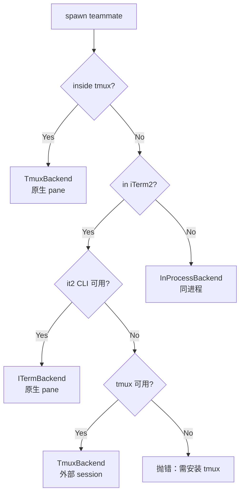
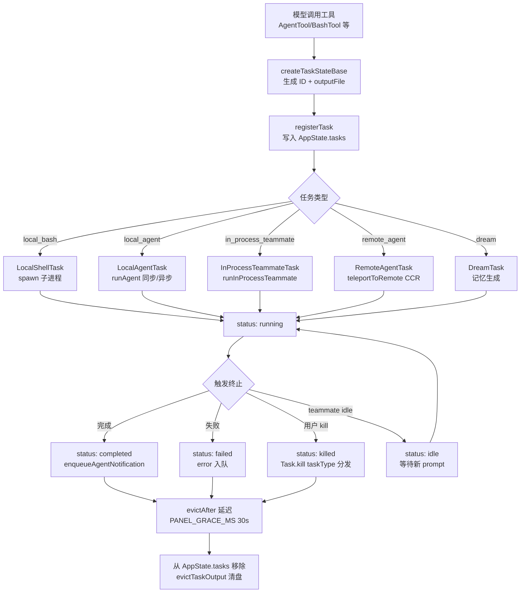

# Claude Code Agent 系统：AgentTool 与多级协作

> 从单进程子 agent 到多 agent 协作的四级演进

前几篇我们跟随的是「单线对话」：用户发一句话，`QueryEngine` 调一轮模型，模型回 `tool_use`，工具执行后把结果回填，再进下一轮。这种线性流程能解决大部分问题，但面对「同时调研三个模块」「先并行探索再串行实现」「一个 agent 跑长任务、主对话继续接活」这类场景时，单线就力不从心了。

Claude Code 的回答是**多套并存的 agent 机制**：从最轻量的进程内 teammate，到子进程 subagent，再到 feature flag 门控的 Coordinator 协调模式与实验性的 Agent Swarms。这套体系不是一次性设计出来的，而是按需求逐步叠加，因此呈现出明显的成熟度梯度——有些已经稳定可用，有些仍处于灰度阶段。本文基于泄漏源码分析，逐层拆解这四级机制的设计与实现。

## 一、Agent 的问题：为什么单线不够

单 agent 对话有三个根本限制：

1. **上下文污染**：一个 agent 干完探索、实现、验证三类活，上下文里塞满互相无关的工具结果，模型在每个阶段都要从一堆噪声里捞相关信息。
2. **无法并行**：模型一次只能调一个工具，串行执行多个独立任务时只能排队，耗时是任务数之和。
3. **生命周期僵化**：主对话一旦发起子任务，整个 turn 就被占住，用户无法在子任务跑的时候继续输入新指令。

解决这三个问题的思路分别对应三种机制：派生子 agent 隔离上下文、并行 spawn 多个 agent、把子任务推到后台异步执行。Claude Code 在此基础上还加了 Coordinator（显式编排）和 Swarm（agent 团队）两层，形成四级体系：

| 层级 | 机制 | 隔离方式 | 通信 | 成熟度 |
|------|------|---------|------|--------|
| L1 | AgentTool（subagent） | 子进程 / 同进程 | 工具返回值 | 稳定 |
| L2 | Teammate（in-process） | 同进程 + AsyncLocalStorage | mailbox 文件 | 稳定（代码）/ 灰度（外部用户需 opt-in） |
| L3 | Coordinator | 多 worker + leader 编排 | `<task-notification>` XML | feature flag |
| L4 | Agent Swarms | tmux/iTerm2 pane 或 in-process | mailbox + SendMessage | 实验性 |

下面从最底层的 Task 系统开始，自下而上拆解。

## 二、Task 系统：所有 agent 的公共底座

无论哪种 agent 机制，最终都要落到「一个可创建、可监控、可杀死的工作单元」上。Claude Code 把这个抽象提取为 `Task`，位于 `src/Task.ts` 与 `src/tasks.ts`。这是理解整个 agent 体系的入口。

### 2.1 TaskType 与 TaskStatus

`src/Task.ts` 首先定义了任务类型枚举：

```ts
export type TaskType =
  | 'local_bash'           // 后台 bash 命令
  | 'local_agent'          // 本地子 agent（AgentTool 派生）
  | 'remote_agent'         // 远程 agent（CCR 环境）
  | 'in_process_teammate'  // 进程内 teammate
  | 'local_workflow'       // 工作流脚本（feature flag）
  | 'monitor_mcp'          // MCP 监控任务（feature flag）
  | 'dream'                // AutoDream 记忆任务
```

七种类型覆盖了 Claude Code 所有的后台执行单元。注意 `local_workflow` 与 `monitor_mcp` 在 `tasks.ts` 中以条件 require 引入，分别被 `WORKFLOW_SCRIPTS` 与 `MONITOR_TOOL` 两个 feature flag 门控——这是 Bun 编译期裁剪的典型用法，外部产物里这两类任务的代码完全消失。

任务状态只有五种：

```ts
export type TaskStatus = 'pending' | 'running' | 'completed' | 'failed' | 'killed'
```

配套的 `isTerminalTaskStatus()` 判定任务是否进入终态——这个谓词在多处被用作守卫，防止向已死的 teammate 注入消息、防止清理路径重复触发。

### 2.2 Task 接口的极简契约

`Task` 接口本身极其精简：

```ts
export type Task = {
  name: string
  type: TaskType
  kill(taskId: string, setAppState: SetAppState): Promise<void>
}
```

源码注释明确说明：`spawn`/`render` 等方法从未被多态调用过（在 #22546 中移除），`Task` 接口唯一保留的多态方法是 `kill`。这是一个值得注意的设计收敛——起初可能设想 Task 是一个完整的抽象基类，最终发现真正需要跨类型分发的只剩「如何被杀死」这一件事。每个具体 Task 类型（`LocalAgentTask`、`InProcessTeammateTask` 等）各自维护自己的 spawn 逻辑与状态结构，`Task` 只在「需要按类型找到并 kill」时才被用到。

### 2.3 Task ID 的前缀编码

任务 ID 不是纯随机串，而是带类型前缀的：

```ts
const TASK_ID_PREFIXES: Record<string, string> = {
  local_bash: 'b',
  local_agent: 'a',
  remote_agent: 'r',
  in_process_teammate: 't',
  local_workflow: 'w',
  monitor_mcp: 'm',
  dream: 'd',
}
```

`generateTaskId(type)` 生成 `<prefix> + 8 位随机字符`，字符表是 36 进制（数字 + 小写字母），`36^8 ≈ 2.8 万亿`组合。源码注释专门提到「sufficient to resist brute-force symlink attacks」——因为 task 输出会以符号链接形式落到磁盘，可预测的 ID 会被攻击者构造符号链接劫持。前缀让人类在日志或 UI 里一眼能看出任务类型，是工程便利与可观测性的双重考虑。

### 2.4 Registry：`getAllTasks()` 与 `getTaskByType()`

`src/tasks.ts` 是注册中心，结构与 `tools.ts` 镜像：

```ts
export function getAllTasks(): Task[] {
  const tasks: Task[] = [LocalShellTask, LocalAgentTask, RemoteAgentTask, DreamTask]
  if (LocalWorkflowTask) tasks.push(LocalWorkflowTask)
  if (MonitorMcpTask) tasks.push(MonitorMcpTask)
  return tasks
}

export function getTaskByType(type: TaskType): Task | undefined {
  return getAllTasks().find(t => t.type === type)
}
```

这个 `getTaskByType()` 是整个任务系统的分发入口——任何地方拿到一个 `TaskType`，都能通过它找到对应的 `Task` 实例并调用 `kill()`。它返回 `Task | undefined`，意味着调用方需要自己处理「类型未注册」的情况（例如外部用户构建里 `LocalWorkflowTask` 不存在）。

### 2.5 TaskStateBase 与任务上下文

每种具体任务都扩展 `TaskStateBase`：

```ts
export type TaskStateBase = {
  id: string
  type: TaskType
  status: TaskStatus
  description: string
  toolUseId?: string
  startTime: number
  endTime?: number
  totalPausedMs?: number
  outputFile: string
  outputOffset: number
  notified: boolean
}
```

关键字段：

- `toolUseId` 把任务关联回触发它的那个 `tool_use` block，UI 可以高亮「这个工具调用还在跑」
- `outputFile` 是任务输出落盘的符号链接路径，长任务输出不全部驻留内存
- `notified` 防止重复发送 `<task-notification>`，是一个幂等守卫
- `totalPausedMs` 记录权限确认等阻塞时间，用于校正 UI 上的耗时显示

`TaskContext` 提供运行时依赖：

```ts
export type TaskContext = {
  abortController: AbortController
  getAppState: () => AppState
  setAppState: SetAppState
}
```

但源码注释指出，所有六种 kill 实现实际上只用 `setAppState`，`getAppState`/`abortController` 是「dead weight」。这是接口设计与实际使用之间的常见 gap——`TaskContext` 为未来的多态调用预留了完整的运行时上下文，但 kill 路径最终只需修改状态。

## 三、AgentTool：派生子 agent 的主入口

`src/tools/AgentTool/AgentTool.tsx` 是 Claude Code 招募帮手的核心工具。模型调用它时，会发生以下事情之一：

- 派生一个**同步子 agent**：父 agent 阻塞等待子 agent 完成，拿到结果后继续
- 派生一个**异步后台 agent**：父 agent 立即拿到 `async_launched` 状态返回，子 agent 在后台跑，完成后通过 `<task-notification>` 通知
- 派生一个 **teammate**：当 `team_name` 与 `name` 同时给出时，走 `spawnTeammate()` 路径，进入 swarm 体系
- 派生一个 **fork subagent**：实验路径（由 `FORK_AGENT` feature flag 门控），子 agent 继承父的完整系统提示与工具集，用于缓存命中优化

### 3.1 输入 schema 的分层裁剪

AgentTool 的输入 schema 不是一成不变的，而是根据 feature flag 动态裁剪：

```ts
export const inputSchema = lazySchema(() => {
  const schema = feature('KAIROS') ? fullInputSchema() : fullInputSchema().omit({ cwd: true })
  return isBackgroundTasksDisabled || isForkSubagentEnabled()
    ? schema.omit({ run_in_background: true })
    : schema
})
```

这里有几个值得注意的工程细节：

- `lazySchema` 把 schema 构造推迟到首次访问，避免模块加载期就触发 GrowthBook 读取
- `feature('KAIROS')` 决定 `cwd` 参数是否对模型可见——Kairos 助手模式需要指定工作目录，普通模式不需要
- `run_in_background` 在「后台任务被禁用」或「fork subagent 实验开启」时被 omit。后者是因为 fork 路径强制所有 spawn 走异步，模型不需要也不应该手动指定
- 用 `.omit()` 而非条件 spread 是有意的——spread 会让 Zod 类型推断坍缩为 `unknown`，`.omit()` 保留了类型推断

这种「基础 schema + 条件 omit」的模式让模型在不同配置下看到不同的工具参数集，避免暴露无效字段干扰决策。

### 3.2 Agent 选择与权限过滤

`AgentTool.call()` 的前半段是 agent 定义的选择与校验：

```ts
const effectiveType = subagent_type ?? (isForkSubagentEnabled() ? undefined : GENERAL_PURPOSE_AGENT.agentType)
const isForkPath = effectiveType === undefined
```

三条路径：

1. 显式指定 `subagent_type`：用它
2. 未指定 + fork 实验开启：走 fork 路径（`effectiveType = undefined`）
3. 未指定 + fork 实验关闭：默认 `general-purpose`

选定后还要经过两层过滤：

- `filterAgentsByMcpRequirements()`：如果 agent 声明了 `requiredMcpServers`，检查这些 MCP server 是否已连接且通过认证。源码里有段特别的逻辑——如果所需 server 还在 `pending` 状态，会轮询等待最多 30 秒，避免「agent 调起来时 MCP 还没连上」的竞态
- `filterDeniedAgents()`：根据权限规则（`Agent(AgentName)` 语法）剔除被 deny 的 agent

如果 agent 存在但被 deny，会抛出明确错误并指出 deny 规则来源，而不是笼统说「not found」——这对用户排查权限配置很有帮助。

### 3.3 同步 vs 异步的分流决策

是否异步执行由 `shouldRunAsync` 决定，它聚合了多个条件：

```ts
const shouldRunAsync =
  (run_in_background === true
    || selectedAgent.background === true
    || isCoordinator
    || forceAsync
    || assistantForceAsync
    || (proactiveModule?.isProactiveActive() ?? false)
  ) && !isBackgroundTasksDisabled
```

其中几个条件值得展开：

- `isCoordinator`：在 Coordinator 模式下，所有 spawn 都强制异步——Coordinator 不阻塞等待 worker，而是通过 `<task-notification>` 异步接收结果
- `forceAsync`（fork 路径）：fork subagent 实验强制全异步，统一交互模型
- `assistantForceAsync`（Kairos 助手模式）：源码注释说明原因——同步子 agent 会把主循环的 turn 一直占住，daemon 的 inputQueue 会堆积，首个逾期 cron 补偿会变成 N 个串行子 agent turn，阻塞所有用户输入

这是一个典型的「局部正确性 vs 全局性能」权衡：同步子 agent 对调用方更直观，但对整个系统的吞吐是灾难。Coordinator 和 Kairos 选择强制异步，把单点决策变成系统级优化。

### 3.4 工具池的独立装配

子 agent 不继承父 agent 的工具池，而是独立装配：

```ts
const workerPermissionContext = {
  ...appState.toolPermissionContext,
  mode: selectedAgent.permissionMode ?? 'acceptEdits',
}
const workerTools = assembleToolPool(workerPermissionContext, appState.mcp.tools)
```

注意 `mode` 默认设为 `acceptEdits`——子 agent 不继承父的权限模式，而是用更宽松的 `acceptEdits`（自动接受文件编辑）。这是一个安全性 vs 自主性的权衡：子 agent 通常在后台跑、无法弹层确认，若用 `default` 模式会卡在权限请求上。

但 fork 路径是反例：

```ts
availableTools: isForkPath ? toolUseContext.options.tools : workerTools,
```

fork 子 agent 显式继承父的完整工具数组，源码注释解释：fork 路径需要「cache-identical tool defs」——如果工具定义的序列化与父不同，API 请求前缀就会 diverge，prompt cache 在第一个不同的工具处失效。fork 实验的核心目标就是让子 agent 复用父的缓存前缀，因此必须用完全相同的工具集。

### 3.5 Worktree 隔离

`isolation: 'worktree'` 让子 agent 在临时 git worktree 里工作：

```ts
if (effectiveIsolation === 'worktree') {
  const slug = `agent-${earlyAgentId.slice(0, 8)}`
  worktreeInfo = await createAgentWorktree(slug)
}
```

子 agent 完成后，`cleanupWorktreeIfNeeded()` 检查 worktree 是否有改动——无改动则删除，有改动则保留并返回路径。这个设计让「探索性 spawn」（不修改文件）不留痕迹，而「实现性 spawn」（修改了文件）的成果保留下来，由父 agent 决定如何合并。

### 3.6 同步路径的双层 abort

同步子 agent 的执行循环里有两层 abort：

- **lifecycle abort**（`toolUseContext.abortController`）：杀死整个子 agent
- **work abort**（`currentWorkAbortController`）：只中断当前 turn，子 agent 进入 idle 状态等待下一个 prompt

这个分层是 teammate 模式（后文详述）的雏形——用户按 Escape 时，意图通常是「停下来听听我的下一句话」，而非「彻底杀掉」。但在纯子 agent 场景里，work abort 后子 agent 仍然会结束（因为没有下一个 prompt 来源），分层 abort 的价值要在 teammate 模式下才完全体现。

### 3.7 异步结果与 task-notification 协议

异步 agent 完成后，结果以 `<task-notification>` XML 形式注入回父 agent 的对话：

```xml
<task-notification>
<task-id>agent-a1b2c3d4</task-id>
<tool-use-id>toolu_xxx</tool-use-id>
<output-file>/path/to/output</output-file>
<status>completed</status>
<summary>Agent "Investigate auth bug" completed</summary>
<result>{agent 的最终文本响应}</result>
<usage>
  <total_tokens>12345</total_tokens>
  <tool_uses>8</tool_uses>
  <duration_ms>45000</duration_ms>
</usage>
</task-notification>
```

`enqueueAgentNotification()` 是这个 XML 的构造器，它有几个值得注意的工程细节：

- **幂等守卫**：`notified` 字段在 `updateTaskState` 里原子地 check-and-set，防止 TaskStopTool 与正常完成路径双重通知（双重通知会让模型看到两份结果，可能误判任务状态）
- **abort 推测**：`abortSpeculation(setAppState)` 在通知前调用——任务状态变了，预先推测的结果可能引用了过期的 task output，必须丢弃
- **worktree 信息**：`<worktree_path>` 与 `<worktree_branch>` 让父 agent 知道子 agent 在哪个 git worktree 里改了文件，便于后续合并

这种「XML 注入而非普通 tool_result」的设计，让异步 agent 的结果与同步 agent 的结果在对话流里有不同的视觉与语义形态——模型能区分「这是子 agent 的完整报告」而非「这是一个工具的返回值」，从而采取不同的处理策略（例如对子 agent 报告做综合，对工具返回值直接使用）。

### 3.8 后台化（backgrounding）：运行中切换同步为异步

同步子 agent 跑到一半可以转为后台，这是 AgentTool 最巧妙的设计之一：

```ts
const registration = registerAgentForeground({
  agentId: syncAgentId,
  // ...
  autoBackgroundMs: getAutoBackgroundMs() || undefined,
})
foregroundTaskId = registration.taskId
backgroundPromise = registration.backgroundSignal.then(() => ({ type: 'background' }))
```

`backgroundSignal` 是一个 Promise，在以下任一条件满足时 resolve：

- 用户显式按「后台化」按钮
- `autoBackgroundMs` 超时（gate 启用时为 120 秒，未启用时为 0 即不自动后台化，由 `tengu_auto_background_agents` GrowthBook gate 控制）

主循环用 `Promise.race` 监听这个信号：

```ts
const raceResult = backgroundPromise
  ? await Promise.race([nextMessagePromise.then(r => ({ type: 'message', result: r })), backgroundPromise])
  : { type: 'message', result: await nextMessagePromise }
```

一旦 background signal 胜出，同步路径切换为异步路径——子 agent 的剩余执行被包进一个 detached 闭包，父 agent 立即拿到 `async_launched` 返回值继续干活。这种「同步起步、必要时切异步」的设计，让短任务享受同步的简单性，长任务又能自动后台化不阻塞用户。

## 四、Teammate 模式：同进程的多 agent 协作

AgentTool 派生的子 agent 是「一次性」的——跑完就结束。但很多场景需要「常驻」的 agent：它能接收多条消息、跑完一个任务后进入 idle、被新消息唤醒继续干活。这就是 teammate 模式，对应 `in_process_teammate` 任务类型。

### 4.1 Teammate 与子 agent 的区别

| 维度 | 子 agent（local_agent） | Teammate（in_process_teammate） |
|------|------------------------|-------------------------------|
| 生命周期 | 一次性，跑完即终 | 常驻，idle 后可被唤醒 |
| 进程边界 | 可同进程也可子进程 | 同进程 |
| 通信 | 工具返回值 | mailbox 文件 + SendMessage 工具 |
| 上下文隔离 | 独立 ToolUseContext | AsyncLocalStorage 隔离 |
| 权限确认 | 后台无法弹层 | 通过 leader 的 ToolUseConfirm 队列 |
| 状态字段 | `LocalAgentTaskState` | `InProcessTeammateTaskState` |

`InProcessTeammateTaskState` 在 `TaskStateBase` 之上扩展了大量字段：

```ts
export type InProcessTeammateTaskState = TaskStateBase & {
  type: 'in_process_teammate'
  identity: TeammateIdentity
  prompt: string
  model?: string
  selectedAgent?: AgentDefinition
  abortController?: AbortController        // 杀整 teammate
  currentWorkAbortController?: AbortController  // 仅中断当前 turn
  awaitingPlanApproval: boolean
  permissionMode: PermissionMode
  messages?: Message[]
  inProgressToolUseIDs?: Set<string>
  pendingUserMessages: string[]
  isIdle: boolean
  shutdownRequested: boolean
  onIdleCallbacks?: Array<() => void>
  lastReportedToolCount: number
  lastReportedTokenCount: number
}
```

两层 abort controller 是 teammate 的关键——`currentWorkAbortController` 让 Escape 只中断当前 turn，teammate 进入 idle 等待下一条消息；`abortController` 才真正杀死整个 teammate。

### 4.2 同进程的上下文隔离：AsyncLocalStorage

Teammate 跑在主进程里，怎么避免它的状态污染 leader？答案是 `AsyncLocalStorage`（ALS）。`runInProcessTeammate()` 把整个执行包进两层 context：

```ts
await runWithTeammateContext(teammateContext, async () => {
  return runWithAgentContext(agentContext, async () => {
    // ... runAgent() 在这里跑
  })
})
```

`runWithTeammateContext` 注入 teammate 身份（teamName、agentName、color），`runWithAgentContext` 注入 agent 元数据（agentId、parentSessionId、agentType）。这两个 ALS context 让 teammate 内的任何代码都能通过 `getTeamName()`、`getAgentName()` 拿到自己的身份，而不需要把身份参数层层透传。

ALS 的好处是「隐式上下文」——同一个进程里同时跑多个 teammate，每个都看到自己的身份，互不干扰。代价是调试困难：调用栈里看不到 context，出问题需要靠日志里的 agentId 关联。

### 4.3 主循环：prompt → run → idle → wait → prompt

`runInProcessTeammate()` 的核心是一个 while 循环：

```ts
while (!abortController.signal.aborted && !shouldExit) {
  // 1. 跑一轮 runAgent()，处理当前 prompt
  for await (const message of runAgent({ ... })) { ... }

  // 2. 标记 idle，通知 leader
  updateTaskState(taskId, task => ({ ...task, isIdle: true }), setAppState)
  await sendIdleNotification(identity.agentName, ...)

  // 3. 等待下一条消息或 shutdown
  const waitResult = await waitForNextPromptOrShutdown(...)

  // 4. 根据等待结果设置下一个 prompt
  switch (waitResult.type) {
    case 'new_message': currentPrompt = ...; break
    case 'shutdown_request': currentPrompt = ...; break
    case 'aborted': shouldExit = true; break
  }
}
```

`waitForNextPromptOrShutdown()` 是 teammate 的「待命」状态实现，每 500ms 轮询三处：

1. **内存中的 `pendingUserMessages`**：用户在 transcript 视图里直接发给 teammate 的消息
2. **磁盘 mailbox**：其他 agent 通过 `SendMessage` 写入的文件消息
3. **team task list**：团队任务列表里未被认领的任务

mailbox 轮询里有段精巧的优先级逻辑：

- shutdown 请求优先于一切，防止被 peer-to-peer 消息饿死
- leader 消息优先于普通 peer 消息，因为 leader 代表用户意图
- 其余按 FIFO

这种优先级确保 teammate 不会因为消息洪流而错过「停下来」的指令。

### 4.4 权限确认：跨进程边界弹层

后台子 agent 无法弹权限确认，遇到需要确认的工具直接被拒。但 teammate 同进程，可以把权限请求转发给 leader 的 UI 队列：

```ts
const setToolUseConfirmQueue = getLeaderToolUseConfirmQueue()
if (setToolUseConfirmQueue) {
  return new Promise<PermissionDecision>(resolve => {
    setToolUseConfirmQueue(queue => [...queue, {
      // ... 带上 workerBadge 标识这是 teammate 的请求
      workerBadge: identity.color ? { name: identity.agentName, color: identity.color } : undefined,
      onAllow(updatedInput, permissionUpdates, feedback) { ... },
      onReject(feedback) { ... },
    }])
  })
}
```

`workerBadge` 给权限弹层加上 teammate 的颜色标识，用户能看出「这个权限请求来自哪个 teammate」。权限决策结果（包括用户选择的「以后都允许」规则）会通过 `getLeaderSetToolPermissionContext()` 写回 leader 的共享权限上下文——但有个关键约束 `preserveMode: true`，防止 teammate 的 `acceptEdits` 模式反向污染 leader 的权限模式。

如果 leader UI 队列不可用（例如非交互模式），fallback 到 mailbox 系统：teammate 把权限请求写进 leader 的 mailbox，leader 处理后把响应写进 teammate 的 mailbox，teammate 轮询拿到结果。这套 fallback 比 UI 队列慢一个量级（500ms 轮询间隔），但保证了非交互场景下 teammate 仍能完成权限确认。

### 4.5 自动压缩与上下文管理

Teammate 常驻意味着消息会无限增长，`runInProcessTeammate()` 在每轮迭代前检查 token 数：

```ts
const tokenCount = tokenCountWithEstimation(allMessages)
if (tokenCount > getAutoCompactThreshold(toolUseContext.options.mainLoopModel)) {
  const compactedSummary = await compactConversation(allMessages, isolatedContext, ...)
  contextMessages = buildPostCompactMessages(compactedSummary)
  allMessages.length = 0
  allMessages.push(...contextMessages)
}
```

注意它创建了一个 **isolated context** 进行压缩，避免压缩清掉主会话的 `readFileState` 缓存或触发主会话的 UI 回调。这是同进程多 agent 必须处理的副作用隔离——共享同一个 `toolUseContext` 对象，但每个 teammate 都要有自己的压缩状态。

### 4.6 消息镜像的内存上限

`InProcessTeammateTaskState.messages` 是 AppState 里的 UI 镜像，用于 transcript 视图。源码注释指出，这个数组曾导致严重的内存问题：

```ts
// BQ analysis (round 9, 2026-03-20) showed ~20MB RSS per agent at 500+ turn
// sessions and ~125MB per concurrent agent in swarm bursts. Whale session
// 9a990de8 launched 292 agents in 2 minutes and reached 36.8GB.
export const TEAMMATE_MESSAGES_UI_CAP = 50
```

「292 agents in 2 minutes, 36.8GB」是一个真实的线上事故。修复方案是 `appendCappedMessage()`——UI 镜像只保留最近 50 条，完整对话留在 `allMessages`（inProcessRunner 内部）和磁盘 transcript 上。这是一个值得记住的教训： AppState 里的数组字段，如果不加上限，在 swarm 场景下会指数级放大内存占用。

## 五、Coordinator 系统：显式的多 agent 编排

前两级（AgentTool、Teammate）都是「模型自己决定何时派生 agent」。Coordinator 模式则把模型本身变成一个**专职的协调者**，它不再直接执行工具，而是只做三件事：派生 worker、综合 worker 结果、与用户对话。

### 5.1 Feature flag 双重门控

Coordinator 模式受两层 gating：

```ts
export function isCoordinatorMode(): boolean {
  if (feature('COORDINATOR_MODE')) {
    return isEnvTruthy(process.env.CLAUDE_CODE_COORDINATOR_MODE)
  }
  return false
}
```

- `feature('COORDINATOR_MODE')`：编译期，决定代码是否打包进产物
- `CLAUDE_CODE_COORDINATOR_MODE` 环境变量：运行期，决定已打包的代码是否启用

两层独立的好处是：内部测试构建包含 Coordinator 代码，但默认关闭；只有显式设置环境变量的会话才进入 Coordinator 模式。`matchSessionMode()` 还能在 resume 会话时自动切换——如果存档的会话是 Coordinator 模式，resume 时自动把环境变量翻过来，保证会话一致性。

### 5.2 Coordinator 的系统提示

`getCoordinatorSystemPrompt()` 返回一段长达数百行的英文提示，定义 Coordinator 的角色与工作流。核心要点：

1. **角色**：你是 coordinator，不直接执行工具，只派生 worker、综合结果、与用户对话
2. **工具集**：只有 `Agent`、`SendMessage`、`TaskStop` 三个工具
3. **工作流四阶段**：Research（worker 并行）→ Synthesis（coordinator 自己做）→ Implementation（worker）→ Verification（worker）
4. **并发原则**：只读任务可自由并行，写任务按文件集合串行，验证可与实现并行
5. **prompt 合成**：worker 看不到 coordinator 的对话，每个 prompt 必须自包含。明令禁止「based on your findings」这种懒惰委派——coordinator 必须自己读研究结果、理解问题、写出带具体文件路径与行号的 spec
6. **continue vs spawn**：根据上下文重叠度决定是继续已有 worker 还是派生新的，有一张完整的决策表

这段提示最值得品味的是第 5 点——它把「synthesize」从一个模糊的工程概念，落实为对 coordinator 行为的具体约束：「禁止说 based on your findings」「必须包含具体 file paths、line numbers、what to change」。这种把工程纪律写进系统提示的做法，是 Coordinator 能在复杂任务上不退化为「传话筒」的关键。

### 5.3 Worker 工具集与用户上下文

`getCoordinatorUserContext()` 注入一段上下文，告诉 Coordinator 它的 worker 能用哪些工具：

```ts
const workerTools = Array.from(ASYNC_AGENT_ALLOWED_TOOLS)
  .filter(name => !INTERNAL_WORKER_TOOLS.has(name))
  .sort()
  .join(', ')
let content = `Workers spawned via the ${AGENT_TOOL_NAME} tool have access to these tools: ${workerTools}`
```

`INTERNAL_WORKER_TOOLS` 是 Coordinator 自己才能用的工具（`TeamCreate`、`TeamDelete`、`SendMessage`、`SyntheticOutput`），worker 拿不到——这保证 worker 不会反过来 spawn 自己的子 team，形成不可控的递归。

如果 `tengu_scratch` GrowthBook gate 开启，还会注入 scratchpad 目录路径，让 worker 之间可以无权限确认地读写共享知识。

### 5.4 Coordinator 的内置 agent 替换

Coordinator 模式开启后，`getBuiltInAgents()` 返回的内置 agent 列表会被替换：

```ts
if (feature('COORDINATOR_MODE')) {
  if (isEnvTruthy(process.env.CLAUDE_CODE_COORDINATOR_MODE)) {
    const { getCoordinatorAgents } = require('../../coordinator/workerAgent.js')  // workerAgent.js 在泄漏源码中不存在，ant-only
    return getCoordinatorAgents()
  }
}
```

普通模式下的 `general-purpose`、`explore`、`plan`、`verification` 等 agent 被 Coordinator 专用的 `worker` agent 替换。这是一个「模式切换」而非「能力叠加」——进入 Coordinator 模式后，模型看到的是完全不同的 agent 选项。

### 5.5 Coordinator 的 continue vs spawn 决策

Coordinator 系统提示里有一张完整的决策表，指导 coordinator 在「继续已有 worker」与「派生新 worker」之间选择：

| 场景 | 机制 | 理由 |
|------|------|------|
| 探索的文件恰好是要编辑的 | Continue（SendMessage） | worker 已有文件上下文 + 清晰计划 |
| 探索广但实现窄 | Spawn fresh | 避免拖入探索噪声，干净上下文更好 |
| 修正失败或扩展近期工作 | Continue | worker 有错误上下文，知道刚试过什么 |
| 验证别人写的代码 | Spawn fresh | 验证者应全新视角，不带实现假设 |
| 首次实现就用了错误方法 | Spawn fresh | 错误上下文污染重试，干净起步避免锚定 |
| 完全无关任务 | Spawn fresh | 无可复用上下文 |

这张表的核心判断维度是「上下文重叠度」——高重叠用 continue（复用上下文省钱），低重叠用 spawn fresh（避免噪声）。源码注释里明确强调「There is no universal default」，要求 coordinator 按具体场景判断而非套用固定规则。这种把决策框架而非决策规则写进提示的做法，让模型保留灵活性同时有判断依据。

### 5.6 Coordinator 与 AgentTool 的关系

Coordinator 不替代 AgentTool，而是**复用** AgentTool 的派生机制。区别在于：

- Coordinator 模式下，所有 spawn 强制异步（`isCoordinator` 为 `shouldRunAsync` 的条件之一）
- `model` 参数被忽略（`const model = isCoordinatorMode() ? undefined : modelParam`）——worker 必须用默认模型，保证 Coordinator 无法通过指定更贵模型来「作弊」
- worker 结果以 `<task-notification>` XML 形式注入回 Coordinator 的对话，而非作为普通 tool result

这意味着 Coordinator 是建立在 AgentTool 之上的「编排层」，而不是平行的另一套 agent 系统。它的成熟度介于 Teammate（稳定）与 Swarm（实验性）之间——已经有完整的工作流定义与系统提示，但仍受 feature flag 门控，尚未对全部用户开放。

## 六、Swarm 系统：agent 团队协作

Swarm 是 Claude Code 最新的多 agent 机制，对应 `src/utils/swarm/` 目录。它的核心想法是：让多个 agent 组成「团队」，每个 agent 有名字、角色，能互相发消息，共同完成任务。这比 Coordinator 更进一步——Coordinator 是「一个 leader 调度多个匿名 worker」，Swarm 是「具名的 agent 之间平等协作」。

### 6.1 启用门槛

Swarm 功能由 `isAgentSwarmsEnabled()` 统一门控：

```ts
export function isAgentSwarmsEnabled(): boolean {
  if (process.env.USER_TYPE === 'ant') return true              // 内部用户始终启用
  if (!isEnvTruthy(process.env.CLAUDE_CODE_EXPERIMENTAL_AGENT_TEAMS)
      && !isAgentTeamsFlagSet()) return false                    // 外部用户需显式 opt-in
  if (!getFeatureValue_CACHED_MAY_BE_STALE('tengu_amber_flint', true)) return false  // killswitch
  return true
}
```

三层 gating：内部用户直接启用、外部用户需要环境变量或 `--agent-teams` flag、再加上 GrowthBook killswitch。这种「内部全开 + 外部 opt-in + 全局 killswitch」是 Anthropic 灰度发布新功能的典型套路。

### 6.2 Teammate 后端：tmux、iTerm2 与 in-process

Swarm 的 teammate 可以跑在三种后端上，由 `detectAndGetBackend()` 自动选择：



优先级是：tmux 内嵌 > iTerm2 原生 pane > tmux 外部 session > in-process。前三种都是「pane 后端」——teammate 在终端的独立 pane 里跑，输出肉眼可见；in-process 是 fallback，teammate 在主进程里跑，只能通过 transcript 视图查看。

`teammateModeSnapshot.ts` 在会话启动时捕获一次 teammate 模式（`auto` / `tmux` / `in-process`），之后整个会话固定使用该模式：

```ts
export function captureTeammateModeSnapshot(): void {
  if (cliTeammateModeOverride) {
    initialTeammateMode = cliTeammateModeOverride
  } else {
    const config = getGlobalConfig()
    initialTeammateMode = config.teammateMode ?? 'auto'
  }
}
```

这个快照机制防止「会话中途改配置导致 teammate 后端错乱」——运行期对 `teammateMode` 配置的修改不影响当前会话，只对下次启动生效。

### 6.3 团队文件与身份

`TeamCreateTool` 创建一个团队时，会在磁盘上写一个 team file：

```ts
const teamFile: TeamFile = {
  name: finalTeamName,
  description: _description,
  createdAt: Date.now(),
  leadAgentId,
  leadSessionId: getSessionId(),
  members: [{
    agentId: leadAgentId,
    name: TEAM_LEAD_NAME,
    agentType: leadAgentType,
    model: leadModel,
    joinedAt: Date.now(),
    tmuxPaneId: '',
    cwd: getCwd(),
    subscriptions: [],
  }],
}
```

注意几个设计：

- **一个 leader 只能管一个 team**：`TeamCreateTool` 检查 `appState.teamContext?.teamName`，已存在则报错
- **lead agent ID 是确定性的**：`formatAgentId(TEAM_LEAD_NAME, finalTeamName)`，不随机生成，因为 leader 不是 teammate（`isTeammate()` 对 leader 返回 false），不需要进入 teammate 的 inbox 轮询
- **team file 跟随会话清理**：`registerTeamForSessionCleanup()` 注册会话结束时的清理，防止团队文件永远留在磁盘上（源码引用 gh-32730 的修复）
- **team 等于 task list**：`resetTaskList(sanitizeName(finalTeamName))` 给新团队创建独立的任务列表目录，task 编号从 1 开始

### 6.4 Swarm 上下文初始化

`computeInitialTeamContext()` 在 `main.tsx` 中**同步**调用，在首次渲染前计算 teamContext：

```ts
export function computeInitialTeamContext(): AppState['teamContext'] | undefined {
  const context = getDynamicTeamContext()
  if (!context?.teamName || !context?.agentName) return undefined
  const teamFile = readTeamFile(teamName)
  if (!teamFile) return undefined
  return {
    teamName,
    teamFilePath,
    leadAgentId: teamFile.leadAgentId,
    selfAgentId: agentId,
    selfAgentName: agentName,
    isLeader: !agentId,
    teammates: {},
  }
}
```

源码注释强调「synchronously in main.tsx BEFORE the first render, eliminating the need for useEffect workarounds」——这是一个有意为之的优化，把 team context 的初始化从异步 useEffect 提前到同步初始化，避免首屏渲染时 team context 还是 undefined 导致的闪烁。

`initializeTeammateContextFromSession()` 处理 resume 场景：从存档的 transcript 里取出 teamName/agentName，重新建立 teamContext。注意它在 member 找不到时只 debug log 而非报错——「may have been removed」是合法状态，teammate 可能已被 leader 移除。

### 6.5 Teammate 系统提示附加

`TEAMMATE_SYSTEM_PROMPT_ADDENDUM` 是一段追加到 teammate 系统提示的常量：

```ts
export const TEAMMATE_SYSTEM_PROMPT_ADDENDUM = `
# Agent Teammate Communication

IMPORTANT: You are running as an agent in a team. To communicate with anyone on your team:
- Use the SendMessage tool with \`to: "<name>"\` to send messages to specific teammates
- Use the SendMessage tool with \`to: "*"\` sparingly for team-wide broadcasts

Just writing a response in text is not visible to others on your team - you MUST use the SendMessage tool.

The user interacts primarily with the team lead. Your work is coordinated through the task system and teammate messaging.
`
```

这段提示的关键约束是「文本回复对他人不可见，必须用 SendMessage」——默认情况下模型倾向于「写一段文字就算回复了」，但 teammate 的输出 leader 看不到，必须显式调用 SendMessage 才能传递信息。这个约束对 teammate 的可用性至关重要，否则 leader 会一直等不到 teammate 的反馈。

### 6.6 Mailbox 通信模型

Swarm 的 agent 间通信基于文件 mailbox：每个 agent 有一个 inbox 文件，其他 agent 通过 `writeToMailbox(recipient, message, teamName)` 写入，接收方轮询读取。这个设计有几个特点：

- **跨进程兼容**：tmux/iTerm2 teammate 是独立进程，无法共享内存；文件 mailbox 是唯一通用通信方式
- **持久化**：消息落盘，进程重启后消息不丢
- **顺序保证**：`markMessageAsReadByIndex` 按索引标记已读，保证消息不会因为读取失败而丢失
- **优先级**：shutdown 请求优先于普通消息，leader 消息优先于 peer 消息（见 4.3 节）

代价是延迟——500ms 轮询间隔意味着消息平均延迟 250ms。对于高频交互这是明显开销，但 swarm 场景下 agent 之间的通信本身就不频繁，这个 trade-off 可接受。

## 七、团队协作工具

Swarm 体系依赖一组专门的工具，由模型调用以管理团队。

### 7.1 TeamCreateTool / TeamDeleteTool

`TeamCreateTool` 在 6.3 节已展开。`TeamDeleteTool` 是其镜像——删除团队文件、清理 task list、清空 AppState 里的 teamContext。两者都通过 `isAgentSwarmsEnabled()` 在 `isEnabled()` 里 gating，swarm 关闭时模型完全看不到这两个工具。

这两个工具在 `tasks.ts` 等处以 lazy require 引入，原因与 Coordinator 类似——避免循环依赖。`TeamCreateTool` 的 `shouldDefer: true` 表示它的执行可以延迟到 turn 边界，不必立即执行。

### 7.2 SendMessageTool

`SendMessageTool` 是 agent 间通信的核心工具。它的输入 schema 支持结构化消息：

```ts
const StructuredMessage = lazySchema(() =>
  z.discriminatedUnion('type', [
    z.object({ type: z.literal('shutdown_request'), reason: z.string().optional() }),
    z.object({ type: z.literal('shutdown_response'), request_id: z.string(), approve: semanticBoolean(), reason: z.string().optional() }),
    z.object({ type: z.literal('plan_approval_response'), request_id: z.string(), approve: semanticBoolean(), feedback: z.string().optional() }),
  ]),
)
```

三种结构化消息对应三种协议：

1. **shutdown_request**：leader 请求 teammate 停下。teammate 收到后由模型决定是否 approve（不自动批准）
2. **shutdown_response**：teammate 回应 shutdown 请求，approve 或 reject
3. **plan_approval_response**：leader 批准或拒绝 teammate 的 plan

`to` 字段支持多种寻址：

- teammate 名字：定向发送
- `"*"`：广播给所有 teammate
- `"uds:<socket-path>"`：通过 Unix domain socket 发给本地 peer（UDS_INBOX feature flag）
- `"bridge:<session-id>"`：发给 Remote Control peer

这种统一寻址让 SendMessage 能覆盖单机 swarm、跨进程、跨会话的所有通信场景。

### 7.3 工具可见性的层级

这些团队工具的可见性受多层 gating 控制：

| 工具 | 启用条件 |
|------|---------|
| `Agent`（含 teammate spawn 能力） | 始终启用，但 `name`/`team_name` 参数受 swarm gate |
| `TeamCreate` / `TeamDelete` | `isAgentSwarmsEnabled()` |
| `SendMessage` | `isAgentSwarmsEnabled()` |
| `TaskStop` | 始终启用（用于停子 agent） |

`AgentTool.call()` 里有显式检查：

```ts
if (team_name && !isAgentSwarmsEnabled()) {
  throw new Error('Agent Teams is not yet available on your plan.')
}
```

这是「能力探测」模式——模型看到 Agent 工具的 schema 里有 `team_name` 字段（因为 schema 不受 swarm gate，只受 KAIROS gate），但调用时若未启用 swarm 会抛错。这种设计让 schema 稳定（不随 swarm 状态变化），把 gating 推迟到调用时。

## 八、Task 生命周期总览

把前面几节串起来，一个 task 从创建到终态的完整流程：



几个关键节点：

- **创建**：`createTaskStateBase()` 生成 ID 与 `outputFile` 路径，状态置为 `pending`
- **注册**：`registerTask()` 写入 `AppState.tasks` 字典，UI 立即可见
- **分发**：`getTaskByType(type)` 找到对应 `Task` 实例，但只有 `kill()` 是多态分发的，spawn 各自走自己的路径
- **进度更新**：`updateTaskState()` 不可变更新 AppState，触发 React 重渲染
- **终态**：`completed`/`failed`/`killed` 三种，由 `isTerminalTaskStatus()` 判定
- **延迟清理**：终态后不立即从 AppState 移除，而是设置 `evictAfter = Date.now() + 30s`，让 UI 有时间显示「已完成」状态
- **磁盘清理**：`evictTaskOutput()` 清理 output file 符号链接

teammate 是这条流程里的特例——它有 `idle` 状态（非终态也非 running），可以从 idle 被新 prompt 唤醒回 running。这是 teammate 「常驻」特性的体现。

## 九、Agent 定义系统

前面所有机制都依赖一个前提：有一份 agent 定义告诉系统「这个 agent 叫什么、用什么工具、用什么提示」。这由 `src/tools/AgentTool/loadAgentsDir.ts` 提供。

### 9.1 AgentDefinition 的三种来源

```ts
export type AgentDefinition =
  | BuiltInAgentDefinition    // 内置 agent，提示是动态函数
  | CustomAgentDefinition     // 用户/项目/策略配置的 agent
  | PluginAgentDefinition     // 插件提供的 agent
```

三者都扩展自 `BaseAgentDefinition`，区别在 `source` 字段与系统提示的存储方式：

- **BuiltIn**：`source: 'built-in'`，`getSystemPrompt` 接收 `toolUseContext` 参数，可动态生成提示（例如根据当前工具集调整提示内容）
- **Custom**：`source` 是 `userSettings` / `projectSettings` / `policySettings` / `flagSettings` 之一，`getSystemPrompt` 是无参闭包，提示在解析时确定
- **Plugin**：`source: 'plugin'`，附带 `plugin` 字段标识来源插件

### 9.2 Agent 字段一览

`BaseAgentDefinition` 的字段反映了 agent 配置的完整维度：

```ts
export type BaseAgentDefinition = {
  agentType: string                    // 类型标识
  whenToUse: string                    // 模型选择 agent 时的描述
  tools?: string[]                     // 可用工具白名单
  disallowedTools?: string[]           // 禁用工具黑名单
  skills?: string[]                    // 预加载技能
  mcpServers?: AgentMcpServerSpec[]    // 专属 MCP server
  hooks?: HooksSettings                // 会话级 hook
  color?: AgentColorName               // UI 颜色
  model?: string                       // 模型覆盖
  effort?: EffortValue                 // 推理强度
  permissionMode?: PermissionMode      // 权限模式覆盖
  maxTurns?: number                    // 最大轮数
  requiredMcpServers?: string[]        // 必需的 MCP server（不满足则 agent 不可用）
  background?: boolean                 // 始终后台运行
  initialPrompt?: string               // 首轮注入的 prompt
  memory?: AgentMemoryScope            // 持久化记忆范围
  isolation?: 'worktree' | 'remote'    // 隔离模式
  omitClaudeMd?: boolean              // 是否省略 CLAUDE.md 层级
}
```

几个值得注意的字段：

- `requiredMcpServers`：与 `mcpServers` 不同，前者是「必需条件」（不满足则 agent 不可见），后者是「专属配置」（agent 启动时连接的 server）
- `omitClaudeMd`：源码注释说明「Read-only agents (Explore, Plan) don't need commit/PR/lint guidelines」，省略 CLAUDE.md 层级每周节省 5-15 Gtok——这是一个可观测的成本优化
- `background: true`：让 agent 始终以后台模式运行，由 `shouldRunAsync` 自动识别
- `isolation: 'remote'`：仅 `USER_TYPE === 'ant'` 可用，外部用户解析时会被拒绝

### 9.3 加载优先级与覆盖

`getActiveAgentsFromList()` 实现了 agent 的覆盖优先级：

```ts
const agentGroups = [
  builtInAgents,    // 最低优先级
  pluginAgents,
  userAgents,
  projectAgents,
  flagAgents,       // flag settings
  managedAgents,    // 最高优先级（策略配置）
]
const agentMap = new Map<string, AgentDefinition>()
for (const agents of agentGroups) {
  for (const agent of agents) {
    agentMap.set(agent.agentType, agent)  // 后者覆盖前者
  }
}
```

优先级从低到高：built-in < plugin < user < project < flag < managed。同名 agent，后加载的覆盖先加载的。这个顺序符合「组织策略 > 团队配置 > 个人偏好 > 内置默认」的治理原则——企业可以用 managed settings 强制覆盖用户自定义的 agent。

### 9.4 Markdown 与 JSON 双格式

Agent 定义支持两种文件格式：

- **Markdown**（`.md`）：frontmatter 声明元数据，正文是系统提示。`parseAgentFromMarkdown()` 解析
- **JSON**：`parseAgentsFromJson()` 解析，用于 flag settings 等编程式配置

两种格式都走同一套 Zod schema 校验（`AgentJsonSchema`），保证字段约束一致。Markdown 格式对人类友好（可以写多行 prompt），JSON 格式对程序友好（可以批量注入）。

`getAgentDefinitionsWithOverrides()` 是加载入口，用 `memoize` 缓存——同一 cwd 的多次调用只解析一次。缓存通过 `clearAgentDefinitionsCache()` 显式失效，在配置变更时调用。加载过程并行启动 plugin agent 加载与 memory snapshot 初始化，最后合并 built-in、plugin、custom 三类。

### 9.5 AgentId 与 SessionId 的类型品牌

`src/types/ids.ts` 用 TypeScript 的 branded type 防止 ID 混淆：

```ts
export type SessionId = string & { readonly __brand: 'SessionId' }
export type AgentId = string & { readonly __brand: 'AgentId' }
```

编译期类型系统会拒绝把 `string` 直接赋给 `AgentId`——必须通过 `asAgentId()` 或 `createAgentId()` 转换。`toAgentId()` 进一步用正则校验格式：

```ts
const AGENT_ID_PATTERN = /^a(?:.+-)?[0-9a-f]{16}$/
export function toAgentId(s: string): AgentId | null {
  return AGENT_ID_PATTERN.test(s) ? (s as AgentId) : null
}
```

返回 `null` 而非抛错是有意的——teammate 名字、team 寻址字符串都不符合 agent ID 格式，调用方需要区分「这是一个 agent ID」还是「这是一个 teammate 名字」。这种「校验返回可空」的设计让 `toAgentId` 可以安全地用在消息路由等需要尝试解析的场景。

## 十、横向对比：CC / OpenCode / Codex

把 Claude Code 的四级 agent 体系放回横向对比中：

| 维度 | Claude Code | OpenCode | Codex |
|------|-------------|----------|-------|
| 子 agent | AgentTool（子进程 / 同进程） | task tool spawn | Agent Path |
| 进程内 teammate | Teammate（ALS 隔离） | 无 | 无 |
| 显式编排 | Coordinator（feature flag） | 无 | Agent Tree |
| Agent 团队 | Agent Swarms（实验性） | 无 | 无 |
| Agent 定义 | Markdown / JSON / 插件 / 内置 | 配置文件 | 配置 |
| 后台执行 | 同步转异步（autoBackgroundMs） | 无 | 原生支持 |
| 并行 spawn | 受限（Coordinator 强制） | 受限 | 完整支持 |
| 成熟度 | 混合（部分稳定、部分灰度） | 稳定但简单 | 成熟 |
| 通信机制 | mailbox 文件 + SendMessage | 工具返回值 | 任务树消息 |
| 隔离机制 | worktree / remote / ALS | 无 | 沙箱 |

六处差异最能体现设计取舍：

**1. 多套机制并存而非统一抽象**。CC 同时维护 AgentTool、Teammate、Coordinator、Swarm 四套机制，每套有自己的状态结构、通信方式、生命周期。Codex 走「单一 Agent Tree」路线，所有子 agent 都是树节点，统一抽象。CC 的多套机制反映其迭代历史——每出现新需求就加新机制，而非重构既有抽象。代价是概念复杂度高（理解 CC 的 agent 系统要同时掌握四种模式），好处是各机制可以独立演进、不互相拖累。

**2. 进程内 teammate 是 CC 独有**。同进程多 agent 用 ALS 隔离，是 CC 在「无沙箱」约束下的独创——既避免了子进程的启动开销与 IPC 成本，又实现了上下文隔离。OpenCode 与 Codex 都没有等价机制，它们的 agent 都是独立进程或独立任务。

**3. Coordinator 是「模型重编程」而非「框架约束」**。Coordinator 模式靠一段超长的系统提示把模型变成专职协调者，而非像 Codex Agent Tree 那样在框架层强制 agent 只能调度不能执行。这种「软约束」的好处是灵活（改提示就能调整协调策略），代价是模型可能违反提示（实际执行工具而非派生 worker）。

**4. Swarm 的后端抽象是亮点**。`detectAndGetBackend()` 把 tmux、iTerm2、in-process 三种后端统一到 `TeammateExecutor` 接口下，调用方不感知具体后端。这种抽象让 swarm 能在不同终端环境下「尽力而为」——有 tmux 就用 tmux pane，有 iTerm2 就用 iTerm2 pane，都没有就退化到 in-process。Codex 与 OpenCode 都没有这种「终端感知」的多后端设计。

**5. 后台化是渐进式设计**。`autoBackgroundMs` 让同步子 agent 跑超时后自动转异步，是 CC 独有的「平滑退化」——用户不需要预先决定同步还是异步，系统根据运行时长自动选择。这种设计比 OpenCode / Codex 的「显式选择同步/异步」更友好，但实现也更复杂（需要 `Promise.race` 监听 background signal）。

**6. Agent 定义的覆盖优先级最完整**。CC 的六级覆盖（built-in < plugin < user < project < flag < managed）比 OpenCode 与 Codex 都精细，特别是 `managed` 层支持企业级策略下发。这种治理能力是 CC 面向企业用户的体现。

## 十一、设计哲学的几点观察

走读完整个 agent 系统，有几条贯穿始终的设计哲学值得点明：

**机制分层而非统一**。CC 没有试图用一个「万能 agent 抽象」覆盖所有场景，而是按需求成熟度分层：稳定的 AgentTool 处理一次性子 agent、Teammate 处理常驻协作、灰度的 Coordinator 处理显式编排、实验性的 Swarm 处理团队协作。每层有自己的接口、状态、生命周期，互不污染。这种「机制分层」让 CC 能在不破坏既有功能的前提下持续演进——Swarm 出问题不会影响 AgentTool，Coordinator 改动不会波及 Teammate。

**Feature flag 作为发布管道**。`feature()` 编译期裁剪 + GrowthBook 运行期 gating + 环境变量精细控制，构成三层发布管道。Coordinator 受 `feature('COORDINATOR_MODE')` + `CLAUDE_CODE_COORDINATOR_MODE` 双层门控，Swarm 受 `isAgentSwarmsEnabled()` 三层门控。这种「先编译期包含、再运行期灰度、最后默认启用」的发布方式，让 Anthropic 能在不发布新版本的前提下动态调整功能可用性——`tengu_amber_flint` killswitch 一关，所有外部用户的 swarm 立即失效。

**同进程优先**。CC 明显偏好同进程方案——Teammate 默认 in-process、Coordinator worker 也是同进程、只有 swarm 的 pane 后端才用子进程。这与其他 agent 框架「子进程优先」的惯例相反。原因有三：Bun 启动开销虽小但仍有、子进程 IPC 复杂、同进程可以用 ALS 做廉价隔离。代价是单个进程的资源占用更重（前述 36.8GB 事故就是同进程 swarm 的极端案例），CC 的应对是 `TEAMMATE_MESSAGES_UI_CAP` 等内存上限与 `evictTaskOutput` 等磁盘清理。

**模型作为协调者而非执行者**。Coordinator 模式把模型重编程为「只派生不执行」的协调者，Swarm 的 teammate 系统提示要求「必须用 SendMessage 通信」。这种「用系统提示约束模型行为」的做法是 CC 的核心方法论——很多在其他框架里靠代码强制的约束，CC 选择写进提示让模型自觉遵守。好处是灵活、可快速迭代（改提示比重构代码快），代价是约束不绝对、依赖模型能力。

**权限是横切关注点**。无论哪一级 agent，权限都贯穿始终——子 agent 用 `acceptEdits` 默认模式、teammate 通过 leader UI 队列确认、Coordinator worker 受 `ASYNC_AGENT_ALLOWED_TOOLS` 限制、Swarm teammate 受 `allowedTools` 配置。权限不是一个独立的「层」，而是织入每个 agent 机制的横切关注点。这也是 `src/utils/permissions/` 不在 `services/` 而在 `utils/` 下的原因——它不是服务，是基础设施。

## 十二、小结

Claude Code 的 agent 系统是一个四级并存的体系：AgentTool 处理一次性子 agent、Teammate 处理常驻协作、Coordinator 处理显式编排、Swarm 处理团队协作。这四级都建立在 `Task` 这个公共底座之上，共享 `TaskType` / `TaskStatus` / `generateTaskId` 等基础抽象，但各有独立的状态结构、通信机制与生命周期。

这套体系最值得借鉴的不是某个具体机制，而是它的**分层与门控策略**：每一级新机制都通过 feature flag 灰度发布、都复用既有的 Task 底座、都不污染已稳定的机制。这让 CC 能在保持现有功能稳定的前提下持续试验新的协作模式——Coordinator 与 Swarm 都是这种实验的产物，它们可能成功转正，也可能被废弃，但无论哪种结果都不会影响 AgentTool 与 Teammate 的稳定运行。

下一篇我们进入命令系统，看 Claude Code 的 70+ 斜杠命令是如何组织与注册的（以及 Commander.js 在其中扮演的真正角色）。

## 源码索引

- `src/Task.ts` — TaskType、TaskStatus、Task 接口、TaskStateBase、generateTaskId、TASK_ID_PREFIXES
- `src/tasks.ts` — getAllTasks、getTaskByType、LocalWorkflowTask/MonitorMcpTask 的 feature flag 条件 require
- `src/tasks/LocalAgentTask/LocalAgentTask.tsx` — LocalAgentTask、killAsyncAgent、enqueueAgentNotification、`<task-notification>` XML 格式
- `src/tasks/InProcessTeammateTask/types.ts` — InProcessTeammateTaskState、TeammateIdentity、TEAMMATE_MESSAGES_UI_CAP
- `src/tasks/InProcessTeammateTask/InProcessTeammateTask.tsx` — InProcessTeammateTask 实现、appendTeammateMessage
- `src/tasks/LocalShellTask/` — LocalShellTask（后台 bash）
- `src/tasks/RemoteAgentTask/` — RemoteAgentTask（CCR 远程 agent）
- `src/tasks/DreamTask/` — DreamTask（AutoDream 记忆任务）
- `src/tools/AgentTool/AgentTool.tsx` — AgentTool 主实现、输入 schema 动态裁剪、同步/异步分流、worktree 隔离
- `src/tools/AgentTool/loadAgentsDir.ts` — AgentDefinition、BuiltIn/Custom/Plugin 类型、getActiveAgentsFromList 优先级、parseAgentFromMarkdown/parseAgentsFromJson
- `src/tools/AgentTool/builtInAgents.ts` — getBuiltInAgents、Coordinator 模式下的 worker agent 替换
- `src/tools/AgentTool/built-in/` — generalPurposeAgent、exploreAgent、planAgent、verificationAgent 等内置 agent
- `src/tools/AgentTool/runAgent.ts` — runAgent 子 agent 执行入口
- `src/tools/AgentTool/forkSubagent.ts` — fork subagent 实验路径
- `src/tools/shared/spawnMultiAgent.ts` — 共享的 teammate spawn 逻辑、后端选择
- `src/tools/TeamCreateTool/TeamCreateTool.ts` — TeamCreateTool、team file 创建、lead agent 注册
- `src/tools/SendMessageTool/SendMessageTool.ts` — SendMessageTool、StructuredMessage（shutdown/plan_approval）、多寻址
- `src/coordinator/coordinatorMode.ts` — isCoordinatorMode、getCoordinatorSystemPrompt、getCoordinatorUserContext、matchSessionMode
- `src/utils/swarm/reconnection.ts` — computeInitialTeamContext、initializeTeammateContextFromSession
- `src/utils/swarm/teammatePromptAddendum.ts` — TEAMMATE_SYSTEM_PROMPT_ADDENDUM
- `src/utils/swarm/inProcessRunner.ts` — runInProcessTeammate、createInProcessCanUseTool、waitForNextPromptOrShutdown
- `src/utils/swarm/constants.ts` — TEAM_LEAD_NAME、SWARM_SESSION_NAME、环境变量常量
- `src/utils/swarm/backends/registry.ts` — detectAndGetBackend、isInProcessEnabled、getResolvedTeammateMode
- `src/utils/swarm/backends/teammateModeSnapshot.ts` — TeammateMode、captureTeammateModeSnapshot、getTeammateModeFromSnapshot
- `src/utils/swarm/backends/` — TmuxBackend、ITermBackend、InProcessBackend、PaneBackendExecutor
- `src/utils/agentSwarmsEnabled.ts` — isAgentSwarmsEnabled 三层 gating
- `src/state/teammateViewHelpers.ts` — enterTeammateView、exitTeammateView、stopOrDismissAgent、PANEL_GRACE_MS
- `src/types/ids.ts` — AgentId、SessionId branded type、asAgentId、toAgentId
