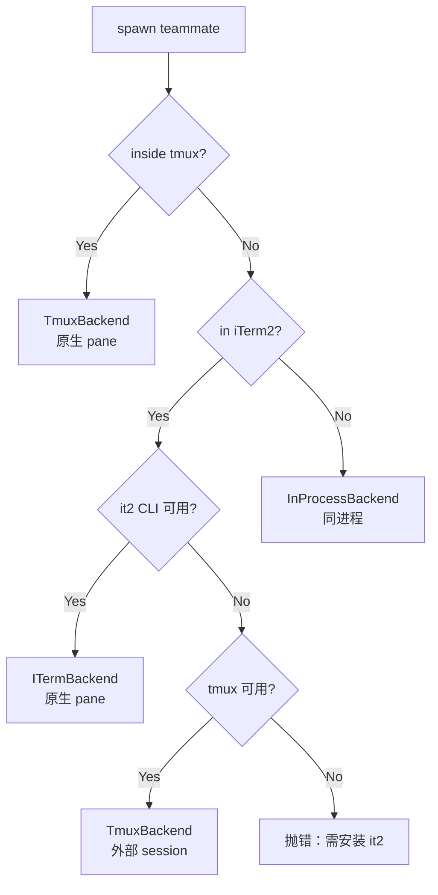
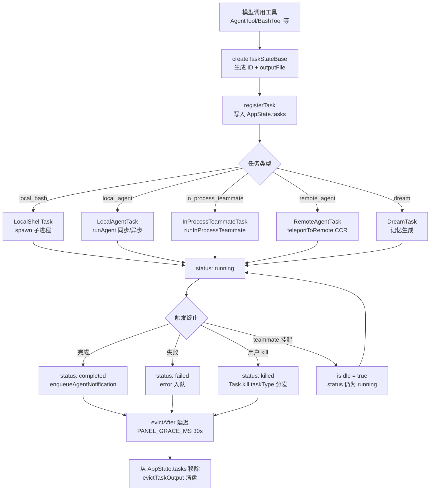

# Claude Code Agent 系统拆解：四级机制共用一个 Task 底座

想象你让一个 agent 干这么一件事：「重构这个服务，先摸清 auth、billing、storage 三个模块的现状，再动手改」。单线对话只能串行推进：auth 的二十个文件读一遍，billing 的三十个再读一遍，探索结果把上下文塞满，动手时模型要从一堆噪声里捞相关信息，而用户全程只能等。

一个进程、一条对话，怎么撑起多线协作？

Claude Code 的答案是按需求分层叠加：一次性子 agent 隔离上下文，常驻的进程内 teammate 承接协作，往上还有灰度中的 Coordinator 编排与实验性的 Swarm 团队。这一篇自下而上拆这套四级体系，先看它们共同站立的 Task 底座。你会看到：

- 第一，Task 接口为什么长成这样；
- 第二，AgentTool 派生子 agent 时，同步、异步、后台化、worktree 隔离这些分叉怎么决策；
- 第三，常驻的 teammate 怎么隔离上下文、互相通信，Coordinator 与 Swarm 这两级实验各自想解决什么。

权限系统下一篇展开，子 agent 的压缩行为第四篇已经拆过，这里停在 agent 机制的边界上。

## 一、Agent 的问题：为什么单线不够

单 agent 对话有三个根本限制：

1. **上下文污染**：一个 agent 干完探索、实现、验证三类活，上下文里塞满互相无关的工具结果，模型在每个阶段都要从噪声里捞相关信息。
2. **无法并行**：模型一次只能调一个工具，串行执行多个独立任务时只能排队，耗时是任务数之和。
3. **生命周期僵化**：主对话一旦发起子任务，整个 turn 就被占住，用户无法在子任务跑的时候继续输入新指令。

三个限制分别对应三种机制：派生子 agent 隔离上下文、并行 spawn 多个 agent、把子任务推到后台异步执行。Claude Code 在此之上又加了 Coordinator（显式编排）和 Swarm（agent 团队）两层，形成四级体系：

| 层级 | 机制 | 隔离方式 | 通信 | 成熟度 |
|------|------|---------|------|--------|
| L1 | AgentTool（subagent） | 同进程（独立 ToolUseContext）· worktree 可选 | 工具返回值 | 稳定 |
| L2 | Teammate（in-process） | 同进程 + AsyncLocalStorage | mailbox 文件 | 稳定（代码）/ 灰度（外部用户需 opt-in） |
| L3 | Coordinator | 多 worker + leader 编排 | `<task-notification>` XML | feature flag |
| L4 | Agent Swarms | tmux/iTerm2 pane 或 in-process | mailbox + SendMessage | 实验性 |

从最底层的 Task 系统开始，自下而上。

## 二、Task 系统：所有 agent 的公共底座

无论哪种 agent 机制，最终都要落到「一个可创建、可监控、可杀死的工作单元」上。Claude Code 把这个抽象提取为 `Task`，位于 `src/Task.ts` 与 `src/tasks.ts`。这是理解整个 agent 体系的入口。

### 2.1 TaskType 与 TaskStatus

`src/Task.ts` 首先定义了任务类型枚举：

```ts
export type TaskType =
  | 'local_bash'           // 后台 bash 命令
  | 'local_agent'          // 本地子 agent（AgentTool 派生）
  | 'remote_agent'         // 远程 agent（CCR 环境）
  | 'in_process_teammate'  // 进程内 teammate
  | 'local_workflow'       // 工作流脚本（feature flag）
  | 'monitor_mcp'          // MCP 监控任务（feature flag）
  | 'dream'                // AutoDream 记忆任务
```

七种类型覆盖了 Claude Code 所有的后台执行单元。`local_workflow` 与 `monitor_mcp` 在 `tasks.ts` 中以条件 require 引入，分别被 `WORKFLOW_SCRIPTS` 与 `MONITOR_TOOL` 两个 feature flag 门控——Bun 编译期裁剪，外部产物里这两类任务的代码完全消失。

任务状态只有五种：`pending`、`running`、`completed`、`failed`、`killed`。配套的 `isTerminalTaskStatus()` 判定任务是否进入终态——这个谓词在多处被用作守卫，防止向已死的 teammate 注入消息、防止清理路径重复触发。

### 2.2 Task 接口的极简契约

`Task` 接口本身极其精简：

```ts
export type Task = {
  name: string
  type: TaskType
  kill(taskId: string, setAppState: SetAppState): Promise<void>
}
```

源码注释明确说明：`spawn`/`render` 等方法从未被多态调用过（在 #22546 中移除），`Task` 接口唯一保留的多态方法是 `kill`。这是一次接口收敛——起初可能设想 Task 是一个完整的抽象基类，最终发现需要跨类型分发的只剩「如何被杀死」这一件事。每个具体 Task 类型（`LocalAgentTask`、`InProcessTeammateTask` 等）各自维护自己的 spawn 逻辑与状态结构，`Task` 只在「需要按类型找到并 kill」时才被用到。

### 2.3 Task ID 的前缀编码

任务 ID 带类型前缀：

```ts
const TASK_ID_PREFIXES: Record<string, string> = {
  local_bash: 'b',
  local_agent: 'a',
  remote_agent: 'r',
  in_process_teammate: 't',
  local_workflow: 'w',
  monitor_mcp: 'm',
  dream: 'd',
}
```

`generateTaskId(type)` 生成 `<prefix> + 8 位随机字符`，字符表是 36 进制，`36^8 ≈ 2.8 万亿`组合。源码注释专门提到「sufficient to resist brute-force symlink attacks」——task 输出会以符号链接形式落到磁盘，可预测的 ID 会被攻击者构造符号链接劫持。前缀让人类在日志或 UI 里一眼看出任务类型，是工程便利与可观测的双重考虑。

### 2.4 Registry：`getAllTasks()` 与 `getTaskByType()`

`src/tasks.ts` 是注册中心，结构与 `tools.ts` 镜像：

```ts
export function getAllTasks(): Task[] {
  const tasks: Task[] = [LocalShellTask, LocalAgentTask, RemoteAgentTask, DreamTask]
  if (LocalWorkflowTask) tasks.push(LocalWorkflowTask)
  if (MonitorMcpTask) tasks.push(MonitorMcpTask)
  return tasks
}

export function getTaskByType(type: TaskType): Task | undefined {
  return getAllTasks().find(t => t.type === type)
}
```

`getTaskByType()` 是整个任务系统的分发入口——任何地方拿到一个 `TaskType`，都能通过它找到对应的 `Task` 实例并调用 `kill()`。它返回 `Task | undefined`，调用方需要自己处理「类型未注册」的情况（例如外部用户构建里 `LocalWorkflowTask` 不存在）。

### 2.5 TaskStateBase 与任务上下文

每种具体任务都扩展 `TaskStateBase`：

```ts
export type TaskStateBase = {
  id: string
  type: TaskType
  status: TaskStatus
  description: string
  toolUseId?: string
  startTime: number
  endTime?: number
  totalPausedMs?: number
  outputFile: string
  outputOffset: number
  notified: boolean
}
```

字段各有分工：`toolUseId` 把任务关联回触发它的那个 `tool_use` block，UI 可以高亮「这个工具调用还在跑」；`outputFile` 是任务输出落盘的符号链接路径，长任务输出不全部驻留内存；`notified` 防止重复发送 `<task-notification>`，是一个幂等守卫；`totalPausedMs` 记录权限确认等阻塞时间，用于校正 UI 上的耗时显示。

`TaskContext` 提供运行时依赖：

```ts
export type TaskContext = {
  abortController: AbortController
  getAppState: () => AppState
  setAppState: SetAppState
}
```

源码注释指出，所有 kill 实现实际上只用 `setAppState`，`getAppState`/`abortController` 是「dead weight」——接口为未来的多态调用预留了完整运行时上下文，kill 路径最终只需修改状态。
## 三、AgentTool：派生子 agent 的主入口

`src/tools/AgentTool/AgentTool.tsx`（1,397 行）是 Claude Code 招募帮手的核心工具。模型调用它时，会发生以下事情之一：

- 派生一个**同步子 agent**：父 agent 阻塞等待子 agent 完成，拿到结果后继续
- 派生一个**异步后台 agent**：父 agent 立即拿到 `async_launched` 状态返回，子 agent 在后台跑，完成后通过 `<task-notification>` 通知
- 派生一个 **teammate**：当 `team_name` 与 `name` 同时给出时，走 `spawnTeammate()` 路径，进入 swarm 体系
- 派生一个 **fork subagent**：实验路径（由 `FORK_AGENT` feature flag 门控），子 agent 继承父的完整系统提示与工具集，用于缓存命中优化


### 3.1 输入 schema 的分层裁剪

AgentTool 的输入 schema 随 feature flag 动态裁剪：

```ts
export const inputSchema = lazySchema(() => {
  const schema = feature('KAIROS') ? fullInputSchema() : fullInputSchema().omit({ cwd: true })
  return isBackgroundTasksDisabled || isForkSubagentEnabled()
    ? schema.omit({ run_in_background: true })
    : schema
})
```

四个工程细节藏在里面：

- `lazySchema` 把 schema 构造推迟到首次访问，避免模块加载期就触发 GrowthBook 读取
- `feature('KAIROS')` 决定 `cwd` 参数是否对模型可见——Kairos 助手模式需要指定工作目录，普通模式不需要
- `run_in_background` 在「后台任务被禁用」或「fork subagent 实验开启」时被 omit，后者是因为 fork 路径强制所有 spawn 走异步，模型不需要也不应该手动指定
- 选择 `.omit()`、不用条件 spread 是有意的——spread 会让 Zod 类型推断坍缩为 `unknown`，`.omit()` 保留了类型推断

这种「基础 schema + 条件 omit」的模式让模型在不同配置下看到不同的工具参数集，避免暴露无效字段干扰决策。

### 3.2 Agent 选择与权限过滤

`AgentTool.call()` 的前半段是 agent 定义的选择与校验，核心一行：`const effectiveType = subagent_type ?? (isForkSubagentEnabled() ? undefined : GENERAL_PURPOSE_AGENT.agentType)`。三条路径：显式指定 `subagent_type` 就用它；未指定且 fork 实验开启，走 fork 路径（`effectiveType` 为 undefined）；未指定且 fork 实验关闭，默认 `general-purpose`。

选定后还要过两道过滤。`filterAgentsByMcpRequirements()` 检查 agent 声明的 `requiredMcpServers` 是否已连接且通过认证——如果所需 server 还在 `pending` 状态，会轮询等待最多 30 秒，避免「agent 调起来时 MCP 还没连上」的竞态。`filterDeniedAgents()` 根据权限规则（`Agent(AgentName)` 语法）剔除被 deny 的 agent。如果 agent 存在但被 deny，会抛出明确错误并指出 deny 规则来源，不笼统说「not found」。

### 3.3 同步 vs 异步的分流决策

是否异步执行由 `shouldRunAsync` 决定，它聚合了多个条件：

```ts
const shouldRunAsync =
  (run_in_background === true
    || selectedAgent.background === true
    || isCoordinator
    || forceAsync
    || assistantForceAsync
    || (proactiveModule?.isProactiveActive() ?? false)
  ) && !isBackgroundTasksDisabled
```

三个条件值得展开。`isCoordinator`：Coordinator 模式下所有 spawn 强制异步——Coordinator 不阻塞等待 worker，结果通过 `<task-notification>` 异步回来。`forceAsync`（fork 路径）：fork 实验强制全异步，统一交互模型。`assistantForceAsync`（Kairos 助手模式）的注释说明了原因——同步子 agent 会把主循环的 turn 一直占住，daemon 的 inputQueue 会堆积，首个逾期 cron 补偿会变成 N 个串行子 agent turn，阻塞所有用户输入。

这是一个典型的「局部正确性 vs 全局性能」权衡：同步子 agent 对调用方更直观，但对整个系统的吞吐是灾难。Coordinator 和 Kairos 选择强制异步，把单点决策变成系统级优化。

### 3.4 工具池的独立装配

子 agent 的工具池独立装配，不从父 agent 继承：

```ts
const workerPermissionContext = {
  ...appState.toolPermissionContext,
  mode: selectedAgent.permissionMode ?? 'acceptEdits',
}
const workerTools = assembleToolPool(workerPermissionContext, appState.mcp.tools)
```

`mode` 默认设为 `acceptEdits`（自动接受文件编辑），比父的权限模式更宽松。这是一个安全性 vs 自主性的权衡：子 agent 通常在后台跑、无法弹层确认，若用 `default` 模式会卡在权限请求上。

fork 路径是反例——`availableTools` 直接取 `toolUseContext.options.tools`（父的完整工具数组），不走独立装配。源码注释解释：fork 路径需要「cache-identical tool defs」——如果工具定义的序列化与父不同，API 请求前缀就会 diverge，prompt cache 在第一个不同的工具处失效。fork 实验的核心目标就是让子 agent 复用父的缓存前缀，因此必须用完全相同的工具集。

### 3.5 Worktree 隔离

`isolation: 'worktree'` 让子 agent 在临时 git worktree 里工作：

```ts
if (effectiveIsolation === 'worktree') {
  const slug = `agent-${earlyAgentId.slice(0, 8)}`
  worktreeInfo = await createAgentWorktree(slug)
}
// 完成后：无改动则删除 worktree，有改动则保留并返回路径
await cleanupWorktreeIfNeeded(worktreeInfo)
```

子 agent 完成后，`cleanupWorktreeIfNeeded()` 检查 worktree 是否有改动——无改动则删除，有改动则保留并返回路径。这个设计让「探索性 spawn」（不修改文件）不留痕迹，而「实现性 spawn」（修改了文件）的成果保留下来，由父 agent 决定如何合并。
### 3.6 单层 abort 与 Escape 的意图问题

同步子 agent 只有一层 abort：`toolUseContext.abortController` 一旦触发，整个子 agent 连同当轮执行一起终止。这留下一个体验问题——用户按 Escape 时，意图往往是「停下来听听我的下一句话」，单层 abort 无法表达这层区别。把「停 turn」与「杀整体」分开的第二层 abort（`currentWorkAbortController`）要到 teammate 模式才出现（4.1 节）——只有常驻 agent 才有「停完再继续」可言，纯子 agent 没有下一个 prompt 来源，停了就是结束。

### 3.7 异步结果与 task-notification 协议

异步 agent 完成后，结果以 `<task-notification>` XML 形式注入回父 agent 的对话：

```xml
<task-notification>
<task-id>agent-a1b2c3d4</task-id>
<tool-use-id>toolu_xxx</tool-use-id>
<output-file>/path/to/output</output-file>
<status>completed</status>
<summary>Agent "Investigate auth bug" completed</summary>
<result>{agent 的最终文本响应}</result>
<usage>
  <total_tokens>12345</total_tokens>
  <tool_uses>8</tool_uses>
  <duration_ms>45000</duration_ms>
</usage>
</task-notification>
```

`enqueueAgentNotification()` 是这个 XML 的构造器，它的构造过程有三个细节。**幂等守卫**：`notified` 字段在 `updateTaskState` 里原子地 check-and-set，防止 TaskStopTool 与正常完成路径双重通知——双重通知会让模型看到两份结果，可能误判任务状态。**abort 推测**：`abortSpeculation(setAppState)` 在通知前调用，任务状态变了，预先推测的结果可能引用了过期的 task output，必须丢弃。**worktree 信息**：`<worktree_path>` 与 `<worktree_branch>` 让父 agent 知道子 agent 在哪个 git worktree 里改了文件，便于后续合并。

XML 注入区别于普通 tool_result，异步 agent 的结果在对话流里有了不同的视觉与语义形态——模型能区分「这是子 agent 的完整报告」与「这是一个工具的返回值」，对前者做综合，对后者直接使用。

### 3.8 后台化：运行中切换同步为异步

同步子 agent 跑到一半可以转为后台，这是 AgentTool 最巧妙的设计之一：

```ts
const registration = registerAgentForeground({
  agentId: syncAgentId,
  autoBackgroundMs: getAutoBackgroundMs() || undefined,
})
foregroundTaskId = registration.taskId
backgroundPromise = registration.backgroundSignal.then(() => ({ type: 'background' }))
```

`backgroundSignal` 是一个 Promise，在任一条件满足时 resolve：用户显式按「后台化」按钮，或 `autoBackgroundMs` 超时（gate 启用时为 120 秒，由 `tengu_auto_background_agents` GrowthBook gate 控制）。主循环用 `Promise.race` 监听这个信号：

```ts
const raceResult = backgroundPromise
  ? await Promise.race([nextMessagePromise.then(r => ({ type: 'message', result: r })), backgroundPromise])
  : { type: 'message', result: await nextMessagePromise }
// background 胜出：剩余执行包进 detached 闭包，
// 父 agent 立即拿到 async_launched 返回值
```

background signal 一旦胜出，同步路径切换为异步路径——子 agent 的剩余执行被包进一个 detached 闭包，父 agent 立即拿到 `async_launched` 返回值继续干活。同步起步、必要时切异步，让短任务享受同步的简单性，长任务又能自动后台化不阻塞用户。

## 四、Teammate 模式：同进程的多 agent 协作

AgentTool 派生的子 agent 是「一次性」的——跑完就结束。但很多场景需要「常驻」的 agent：它能接收多条消息、跑完一个任务后进入 idle、被新消息唤醒继续干活。这就是 teammate 模式，对应 `in_process_teammate` 任务类型。

### 4.1 Teammate 与子 agent 的区别

| 维度 | 子 agent（local_agent） | Teammate（in_process_teammate） |
|------|------------------------|-------------------------------|
| 生命周期 | 一次性，跑完即终 | 常驻，idle 后可被唤醒 |
| 进程边界 | 同进程（独立 ToolUseContext） | 同进程（ALS 隔离） |
| 通信 | 工具返回值 | mailbox 文件 + SendMessage 工具 |
| 上下文隔离 | 独立 ToolUseContext | AsyncLocalStorage 隔离 |
| 权限确认 | 后台无法弹层 | 通过 leader 的 ToolUseConfirm 队列 |
| 状态字段 | `LocalAgentTaskState` | `InProcessTeammateTaskState` |

`InProcessTeammateTaskState` 在 `TaskStateBase` 之上扩展了大量字段：

```ts
export type InProcessTeammateTaskState = TaskStateBase & {
  type: 'in_process_teammate'
  identity: TeammateIdentity
  prompt: string
  model?: string
  selectedAgent?: AgentDefinition
  abortController?: AbortController        // 杀整 teammate
  currentWorkAbortController?: AbortController  // 仅中断当前 turn
  awaitingPlanApproval: boolean
  permissionMode: PermissionMode
  messages?: Message[]
  inProgressToolUseIDs?: Set<string>
  pendingUserMessages: string[]
  isIdle: boolean
  shutdownRequested: boolean
  onIdleCallbacks?: Array<() => void>
  lastReportedToolCount: number
  lastReportedTokenCount: number
}
```

两个 abort controller 是 teammate 的关键——`currentWorkAbortController` 让 Escape 只中断当前 turn，teammate 进入 idle 等待下一条消息；`abortController` 才杀死整个 teammate。

### 4.2 同进程的上下文隔离：AsyncLocalStorage

Teammate 跑在主进程里，怎么避免它的状态污染 leader？答案是 `AsyncLocalStorage`（ALS）。`runInProcessTeammate()` 把整个执行包进两层 context：

```ts
await runWithTeammateContext(teammateContext, async () => {
  return runWithAgentContext(agentContext, async () => {
    // ... runAgent() 在这里跑
  })
})
```

`runWithTeammateContext` 注入 teammate 身份（teamName、agentName、color），`runWithAgentContext` 注入 agent 元数据（agentId、parentSessionId、agentType）。这两个 ALS context 让 teammate 内的任何代码都能通过 `getTeamName()`、`getAgentName()` 拿到自己的身份，而不需要把身份参数层层透传。

ALS 的好处是「隐式上下文」——同一个进程里同时跑多个 teammate，每个都看到自己的身份，互不干扰。代价是调试困难：调用栈里看不到 context，出问题需要靠日志里的 agentId 关联。
### 4.3 主循环：prompt → run → idle → wait → prompt

`runInProcessTeammate()` 的核心是一个 while 循环：

```ts
while (!abortController.signal.aborted && !shouldExit) {
  // 1. 跑一轮 runAgent()，处理当前 prompt
  for await (const message of runAgent({ ... })) { ... }

  // 2. 标记 idle，通知 leader
  updateTaskState(taskId, task => ({ ...task, isIdle: true }), setAppState)
  await sendIdleNotification(identity.agentName, ...)

  // 3. 等待下一条消息或 shutdown
  const waitResult = await waitForNextPromptOrShutdown(...)

  // 4. 根据等待结果设置下一个 prompt
  switch (waitResult.type) {
    case 'new_message': currentPrompt = ...; break
    case 'shutdown_request': currentPrompt = ...; break
    case 'aborted': shouldExit = true; break
  }
}
```


`waitForNextPromptOrShutdown()` 是 teammate 的「待命」状态实现，每 500ms 轮询三处：内存中的 `pendingUserMessages`（用户在 transcript 视图里直接发给 teammate 的消息）、磁盘 mailbox（其他 agent 通过 `SendMessage` 写入的文件消息）、team task list（团队任务列表里未被认领的任务）。

mailbox 轮询里有段优先级逻辑：shutdown 请求优先于一切，防止被 peer-to-peer 消息饿死；leader 消息优先于普通 peer 消息，因为 leader 代表用户意图；其余按 FIFO。teammate 不会因为消息洪流而错过「停下来」的指令。

### 4.4 权限确认：跨进程边界弹层

后台子 agent 无法弹权限确认，遇到需要确认的工具直接被拒。但 teammate 同进程，可以把权限请求转发给 leader 的 UI 队列：

```ts
const setToolUseConfirmQueue = getLeaderToolUseConfirmQueue()
if (setToolUseConfirmQueue) {
  return new Promise<PermissionDecision>(resolve => {
    setToolUseConfirmQueue(queue => [...queue, {
      // ... 带上 workerBadge 标识这是 teammate 的请求
      workerBadge: identity.color ? { name: identity.agentName, color: identity.color } : undefined,
      onAllow(updatedInput, permissionUpdates, feedback) { ... },
      onReject(feedback) { ... },
    }])
  })
}
```

`workerBadge` 给权限弹层加上 teammate 的颜色标识，用户能看出「这个权限请求来自哪个 teammate」。权限决策结果（包括用户选择的「以后都允许」规则）会通过 `getLeaderSetToolPermissionContext()` 写回 leader 的共享权限上下文——但有个关键约束 `preserveMode: true`，防止 teammate 的 `acceptEdits` 模式反向污染 leader 的权限模式。

如果 leader UI 队列不可用（例如非交互模式），fallback 到 mailbox 系统：teammate 把权限请求写进 leader 的 mailbox，leader 处理后把响应写进 teammate 的 mailbox，teammate 轮询拿到结果。这套 fallback 比 UI 队列慢一个量级（500ms 轮询间隔），但保证了非交互场景下 teammate 仍能完成权限确认。

### 4.5 自动压缩与上下文管理

Teammate 常驻意味着消息会无限增长，`runInProcessTeammate()` 在每轮迭代前检查 token 数：

```ts
const tokenCount = tokenCountWithEstimation(allMessages)
if (tokenCount > getAutoCompactThreshold(toolUseContext.options.mainLoopModel)) {
  const compactedSummary = await compactConversation(allMessages, isolatedContext, ...)
  contextMessages = buildPostCompactMessages(compactedSummary)
  allMessages.length = 0
  allMessages.push(...contextMessages)
}
```

它创建了一个 **isolated context** 进行压缩，避免压缩清掉主会话的 `readFileState` 缓存或触发主会话的 UI 回调。这是同进程多 agent 必须处理的副作用隔离——共享同一个 `toolUseContext` 对象，但每个 teammate 都要有自己的压缩状态。

### 4.6 消息镜像的内存上限

`InProcessTeammateTaskState.messages` 是 AppState 里的 UI 镜像，用于 transcript 视图。源码注释指出，这个数组曾导致严重的内存问题：

```ts
// BQ analysis (round 9, 2026-03-20) showed ~20MB RSS per agent at 500+ turn
// sessions and ~125MB per concurrent agent in swarm bursts. Whale session
// 9a990de8 launched 292 agents in 2 minutes and reached 36.8GB.
export const TEAMMATE_MESSAGES_UI_CAP = 50
```

「292 agents in 2 minutes, 36.8GB」是一个真实的线上事故。修复方案是 `appendCappedMessage()`——UI 镜像只保留最近 50 条，完整对话留在 `allMessages`（inProcessRunner 内部）和磁盘 transcript 上。教训：AppState 里的数组字段，如果不加上限，在 swarm 场景下会指数级放大内存占用。

## 五、Coordinator 与 Swarm：叠在上面的两级实验

前两级（AgentTool、Teammate）都是「模型自己决定何时派生 agent」。更上面的两级把协作模式本身固化下来：Coordinator 把模型变成专职协调者，Swarm 让具名 agent 组成团队。两者都还在门控后面。

### 5.1 Coordinator：把模型变成专职协调者

Coordinator 模式受两层 gating：`feature('COORDINATOR_MODE')` 编译期决定代码是否打包，`CLAUDE_CODE_COORDINATOR_MODE` 环境变量运行期决定是否启用。内部测试构建包含代码但默认关闭，显式设环境变量才进入模式；`matchSessionMode()` 保证 resume 时自动切回存档的模式。

进入这个模式后，模型被一段数百行的系统提示重编程为协调者：不直接执行工具，只做派生 worker、综合结果、与用户对话三件事，核心工具收敛到 `Agent`、`SendMessage`、`TaskStop`，另有 `SyntheticOutput` 作为内部输出通道。工作流定义成四阶段——Research（worker 并行）→ Synthesis（coordinator 自己做）→ Implementation（worker）→ Verification（worker）；并发原则是只读任务自由并行、写任务按文件集合串行、验证与实现可在不同文件区域上并行。

这段提示里最有约束力的一条是 prompt 合成纪律：worker 看不到 coordinator 的对话，每个 prompt 必须自包含，明令禁止「based on your findings」这种懒惰委派——coordinator 必须自己读研究结果，写出带具体文件路径与行号的 spec。把工程纪律写进系统提示，是 Coordinator 不退化为传话筒的关键。配套的决策表指导「继续已有 worker 还是派生新的」，核心判断维度是上下文重叠度：探索的文件恰好是要编辑的就 continue（复用上下文），探索广而实现窄、或者验证别人代码的就 spawn fresh（避免噪声与锚定）。

Coordinator 不另起炉灶，它复用 AgentTool 的派生机制，改三处：所有 spawn 强制异步（`isCoordinator` 是 `shouldRunAsync` 的条件之一），结果以 `<task-notification>` 注入回来；`model` 参数被忽略，worker 必须用默认模型，堵死「指定更贵模型」的作弊口；普通模式的内置 agent 列表被替换为 Coordinator 专用的 worker agent——模式切换，能力替换。

### 5.2 Swarm：具名的 agent 团队

Swarm 对应 `src/utils/swarm/`，核心想法是让多个具名 agent 平等协作——Coordinator 是「一个 leader 调度匿名 worker」，Swarm 是「teammates 之间互相发消息」。启用由 `isAgentSwarmsEnabled()` 三层门控：内部用户直接启用、外部用户需环境变量或 `--agent-teams` 显式 opt-in、再加 `tengu_amber_flint` GrowthBook killswitch。这是 Anthropic 灰度新功能的典型配置。

teammate 可以跑在三种后端上，`detectAndGetBackend()` 自动选择：



优先级是 tmux 内嵌 > iTerm2 原生 pane > in-process——auto 模式下，普通终端里的默认终点就是 in-process，装了 tmux 也一样；「tmux 外部 session」只在 iTerm2 内 it2 不可用时作为降级出现。两种 pane 后端让 teammate 在终端独立 pane 里跑、输出肉眼可见；in-process 只能通过 transcript 视图查看。会话启动时 `captureTeammateModeSnapshot()` 固定一次模式，运行期改配置不影响当前会话，只对下次启动生效。

团队落成时 `TeamCreateTool` 在磁盘上写 team file，记录 leader 与成员。几个设计：一个 leader 只能管一个 team；leader 的 agent ID 是确定性的（`formatAgentId(TEAM_LEAD_NAME, teamName)`），可复现、重连后免查表路由；team 等于一个独立的 task list，任务编号从 1 开始；`registerTeamForSessionCleanup()` 注册会话结束时的清理，防止团队文件永远留在磁盘上。

通信靠文件 mailbox：每个 agent 一个 inbox 文件，`SendMessage` 写入，接收方 500ms 轮询。teammate 的系统提示里追加了一段硬约束 `TEAMMATE_SYSTEM_PROMPT_ADDENDUM`：文本回复对他人不可见，必须用 SendMessage——不加这条，模型会习惯性「写一段文字就算回复了」，leader 就一直等不到反馈。`to` 字段支持四种寻址：teammate 名字（定向）、`"*"`（广播）、`"uds:<socket-path>"`（本地 peer）、`"bridge:<session-id>"`（Remote Control 远端，第七篇展开）。一套 SendMessage 覆盖单机 swarm、跨进程、跨会话的所有通信场景。

### 5.3 工具可见性

| 工具 | 启用条件 |
|------|---------|
| `Agent`（含 teammate spawn 能力） | 始终可见；swarm 未启用时 `team_name` 调用抛错 |
| `TeamCreate` / `TeamDelete` / `SendMessage` | `isAgentSwarmsEnabled()` |
| `TaskStop` | 始终启用（用于停子 agent） |

`AgentTool.call()` 里有显式检查：`team_name` 给了而 swarm 未启用，直接抛错。schema 保持稳定、把 gating 推迟到调用时——模型看到的参数集不随 swarm 状态变化，这是「能力探测」模式。
## 六、Task 生命周期总览

把前面几节串起来，一个 task 从创建到终态的完整流程：



几个关键节点。**创建**：`createTaskStateBase()` 生成 ID 与 `outputFile` 路径，状态置为 `pending`。**注册**：`registerTask()` 写入 `AppState.tasks` 字典，UI 立即可见。**分发**：`getTaskByType(type)` 找到对应 `Task` 实例，但只有 `kill()` 是多态分发的，spawn 各自走自己的路径。**终态**：`completed`/`failed`/`killed` 三种，由 `isTerminalTaskStatus()` 判定。**延迟清理**：终态后不立即从 AppState 移除，先设置 `evictAfter = Date.now() + 30s`，让 UI 有时间显示「已完成」状态，之后 `evictTaskOutput()` 清理 output file 符号链接。

teammate 是这条流程里的特例——它在 `running` 态内用 `isIdle` 布尔标志挂起等待新 prompt，task status 不变。这是 teammate「常驻」特性的体现。

## 七、Agent 定义系统

前面所有机制都依赖一个前提：有一份 agent 定义告诉系统「这个 agent 叫什么、用什么工具、用什么提示」。这由 `src/tools/AgentTool/loadAgentsDir.ts` 提供。

### 7.1 AgentDefinition 的三种来源

```ts
export type AgentDefinition =
  | BuiltInAgentDefinition    // 内置 agent，提示是动态函数
  | CustomAgentDefinition     // 用户/项目/策略配置的 agent
  | PluginAgentDefinition     // 插件提供的 agent
```

三者都扩展自 `BaseAgentDefinition`，区别在 `source` 字段与系统提示的存储方式。**BuiltIn** 的 `getSystemPrompt` 接收 `toolUseContext` 参数，可动态生成提示（例如根据当前工具集调整内容）；**Custom** 的 `getSystemPrompt` 是无参闭包，提示在解析时确定，`source` 是 `userSettings` / `projectSettings` / `policySettings` / `flagSettings` 之一；**Plugin** 附带 `plugin` 字段标识来源插件。

### 7.2 Agent 字段一览

`BaseAgentDefinition` 的字段反映了 agent 配置的完整维度：

```ts
export type BaseAgentDefinition = {
  agentType: string                    // 类型标识
  whenToUse: string                    // 模型选择 agent 时的描述
  tools?: string[]                     // 可用工具白名单
  disallowedTools?: string[]           // 禁用工具黑名单
  skills?: string[]                    // 预加载技能
  mcpServers?: AgentMcpServerSpec[]    // 专属 MCP server
  hooks?: HooksSettings                // 会话级 hook
  color?: AgentColorName               // UI 颜色
  model?: string                       // 模型覆盖
  effort?: EffortValue                 // 推理强度
  permissionMode?: PermissionMode      // 权限模式覆盖
  maxTurns?: number                    // 最大轮数
  requiredMcpServers?: string[]        // 必需的 MCP server
  background?: boolean                 // 始终后台运行
  initialPrompt?: string               // 首轮注入的 prompt
  memory?: AgentMemoryScope            // 持久化记忆范围
  isolation?: 'worktree' | 'remote'    // 隔离模式
  omitClaudeMd?: boolean              // 是否省略 CLAUDE.md 层级
}
```

几个字段值得单独看：`requiredMcpServers` 与 `mcpServers` 不同，前者是「必需条件」（不满足则 agent 不可见），后者是「专属配置」（agent 启动时连接的 server）。`omitClaudeMd` 的源码注释写着「Read-only agents (Explore, Plan) don't need commit/PR/lint guidelines」——省略 CLAUDE.md 层级每周节省 5-15 Gtok，是一个可观测的成本优化。`isolation: 'remote'` 仅 `USER_TYPE === 'ant'` 可用，外部用户解析时会被拒绝。

### 7.3 加载优先级与覆盖

`getActiveAgentsFromList()` 实现了 agent 的覆盖优先级：

```ts
const agentGroups = [
  builtInAgents,    // 最低优先级
  pluginAgents,
  userAgents,
  projectAgents,
  flagAgents,       // flag settings
  managedAgents,    // 最高优先级（策略配置）
]
const agentMap = new Map<string, AgentDefinition>()
for (const agents of agentGroups) {
  for (const agent of agents) {
    agentMap.set(agent.agentType, agent)  // 后者覆盖前者
  }
}
```

优先级从低到高：built-in < plugin < user < project < flag < managed。同名 agent，后加载的覆盖先加载的。这个顺序符合「组织策略 > 团队配置 > 个人偏好 > 内置默认」的治理原则——企业可以用 managed settings 强制覆盖用户自定义的 agent。

### 7.4 Markdown 与 JSON 双格式

Agent 定义支持两种文件格式：Markdown（frontmatter 声明元数据，正文是系统提示，`parseAgentFromMarkdown()` 解析）和 JSON（`parseAgentsFromJson()` 解析，用于 flag settings 等编程式配置）。两种格式字段语义对齐，校验强度不同：JSON 走 `AgentJsonSchema` 严格校验，Markdown 是手写的 frontmatter 解析，非法值记日志后忽略——宽容解析让手写 agent 定义不至于因为一个拼错的 color 整体失效。分工也明确：Markdown 对人类友好（可以写多行 prompt），JSON 对程序友好（可以批量注入）。

`getAgentDefinitionsWithOverrides()` 是加载入口，用 `memoize` 缓存——同一 cwd 的多次调用只解析一次。缓存通过 `clearAgentDefinitionsCache()` 显式失效，在配置变更时调用。加载过程并行启动 plugin agent 加载与 memory snapshot 初始化，最后合并 built-in、plugin、custom 三类。

### 7.5 AgentId 与 SessionId 的类型品牌

`src/types/ids.ts` 用 TypeScript 的 branded type 防止 ID 混淆。`SessionId` 与 `AgentId` 都是 `string & { readonly __brand: '...' }` 的交叉类型，编译期拒绝把 `string` 直接赋给 `AgentId`——必须通过 `asAgentId()` 或 `createAgentId()` 转换。`toAgentId()` 进一步用正则校验格式：

```ts
export type AgentId = string & { readonly __brand: 'AgentId' }
const AGENT_ID_PATTERN = /^a(?:.+-)?[0-9a-f]{16}$/
export function toAgentId(s: string): AgentId | null {
  return AGENT_ID_PATTERN.test(s) ? (s as AgentId) : null
}
```

返回 `null`、不抛错是有意的——teammate 名字、team 寻址字符串都不符合 agent ID 格式，调用方需要区分「这是一个 agent ID」还是「这是一个 teammate 名字」。校验返回可空，让 `toAgentId` 可以安全地用在消息路由等需要尝试解析的场景。
## 八、横向对比：CC / OpenCode / Codex

把 Claude Code 的四级 agent 体系放回横向对比中：

| 维度 | Claude Code | OpenCode | Codex |
|------|-------------|----------|-------|
| 子 agent | AgentTool（同进程，worktree/remote 可选） | task tool spawn | Agent Path |
| 进程内 teammate | Teammate（ALS 隔离） | 无 | 无 |
| 显式编排 | Coordinator（feature flag） | 无 | Agent Tree |
| Agent 团队 | Agent Swarms（实验性） | 无 | 无 |
| Agent 定义 | Markdown / JSON / 插件 / 内置 | 配置文件 | 配置 |
| 后台执行 | 同步转异步（autoBackgroundMs） | 无 | 原生支持 |
| 并行 spawn | 受限（Coordinator 强制） | 受限 | 完整支持 |
| 通信机制 | mailbox 文件 + SendMessage | 工具返回值 | 任务树消息 |
| 隔离机制 | worktree / remote / ALS | 无 | 沙箱 |

表格之外，几处差异最能体现设计取舍：

- **多套机制并存而非统一抽象**：CC 同时维护四套机制，各有状态结构、通信方式、生命周期；Codex 走「单一 Agent Tree」统一抽象。多套机制反映迭代历史，代价是概念复杂度高，好处是各层独立演进、不互相拖累。
- **进程内 teammate 是 CC 独有**：同进程多 agent 用 ALS 隔离，既避免子进程的启动开销与 IPC 成本，又实现上下文隔离，OpenCode 与 Codex 都没有等价机制。
- **Coordinator 是「模型重编程」**：靠一段超长系统提示把模型变成协调者，框架层不做强制——改提示就能调整协调策略，代价是约束不绝对、依赖模型能力。
- **Swarm 的后端抽象**：`detectAndGetBackend()` 把 tmux、iTerm2、in-process 统一到 `TeammateExecutor` 接口下——有 tmux 用 tmux pane、有 iTerm2 用 iTerm2 pane、都没有就退化到 in-process，这种「终端感知」的多后端设计是另外两家没有的。
- **后台化是渐进式设计**：`autoBackgroundMs` 让同步子 agent 超时后自动转异步，用户不需要预先决定同步还是异步，比 OpenCode / Codex 的显式选择更友好，实现上要靠 `Promise.race` 监听 background signal。
- **定义覆盖优先级最完整**：六级覆盖（built-in < plugin < user < project < flag < managed）比两家都精细，`managed` 层支持企业级策略下发。

## 九、收束：三条设计观察

**机制按成熟度分层**。CC 没有试图用一个「万能 agent 抽象」覆盖所有场景，它按需求成熟度分层：稳定的 AgentTool 处理一次性子 agent、Teammate 处理常驻协作、灰度的 Coordinator 处理显式编排、实验性的 Swarm 处理团队协作。每层有自己的接口、状态、生命周期，互不污染——Swarm 出问题不影响 AgentTool，Coordinator 改动不波及 Teammate。

**门控即发布管道**。`feature()` 编译期裁剪、GrowthBook 运行期 gating、环境变量精细控制，构成三层发布管道。Coordinator 双层门控、Swarm 三层门控，`tengu_amber_flint` killswitch 一关，所有外部用户的 swarm 立即失效——不发布新版本就能动态调整功能可用性。

**同进程优先，代价明确**。Teammate 默认 in-process、Coordinator worker 同进程，与其他框架「子进程优先」的惯例相反。原因：Bun 启动开销虽小但仍有、子进程 IPC 复杂、同进程可以用 ALS 做廉价隔离。代价是单进程资源占用更重——36.8GB 事故就是极端案例——应对是 `TEAMMATE_MESSAGES_UI_CAP` 这类内存上限与 `evictTaskOutput` 这类磁盘清理。权限则作为横切关注点织入每一级：子 agent 默认 `acceptEdits`、teammate 走 leader 的 UI 队列确认、worker 受工具白名单限制。下一篇就拆这套权限系统——7 种权限模式，以及 auto 模式背后的 AI 分类器。

## 源码索引

- `src/Task.ts` — TaskType、TaskStatus、Task 接口、TaskStateBase、generateTaskId、TASK_ID_PREFIXES
- `src/tasks.ts` — getAllTasks、getTaskByType、LocalWorkflowTask/MonitorMcpTask 的 feature flag 条件 require
- `src/tasks/LocalAgentTask/LocalAgentTask.tsx` — LocalAgentTask、killAsyncAgent、enqueueAgentNotification、`<task-notification>` XML 格式
- `src/tasks/InProcessTeammateTask/types.ts` — InProcessTeammateTaskState、TeammateIdentity、TEAMMATE_MESSAGES_UI_CAP
- `src/tasks/InProcessTeammateTask/InProcessTeammateTask.tsx` — InProcessTeammateTask 实现、appendTeammateMessage
- `src/tools/AgentTool/AgentTool.tsx` — AgentTool 主实现、输入 schema 动态裁剪、同步/异步分流、worktree 隔离
- `src/tools/AgentTool/loadAgentsDir.ts` — AgentDefinition、BuiltIn/Custom/Plugin 类型、getActiveAgentsFromList 优先级、parseAgentFromMarkdown/parseAgentsFromJson
- `src/tools/AgentTool/builtInAgents.ts` — getBuiltInAgents、Coordinator 模式下的 worker agent 替换
- `src/tools/AgentTool/runAgent.ts` — runAgent 子 agent 执行入口
- `src/tools/AgentTool/forkSubagent.ts` — fork subagent 实验路径
- `src/tools/shared/spawnMultiAgent.ts` — 共享的 teammate spawn 逻辑、后端选择
- `src/tools/TeamCreateTool/TeamCreateTool.ts` — TeamCreateTool、team file 创建、lead agent 注册
- `src/tools/SendMessageTool/SendMessageTool.ts` — SendMessageTool、StructuredMessage（shutdown/plan_approval）、多寻址
- `src/coordinator/coordinatorMode.ts` — isCoordinatorMode、getCoordinatorSystemPrompt、getCoordinatorUserContext、matchSessionMode
- `src/utils/swarm/inProcessRunner.ts` — runInProcessTeammate、createInProcessCanUseTool、waitForNextPromptOrShutdown
- `src/utils/swarm/teammatePromptAddendum.ts` — TEAMMATE_SYSTEM_PROMPT_ADDENDUM
- `src/utils/swarm/backends/registry.ts` — detectAndGetBackend、isInProcessEnabled、getResolvedTeammateMode
- `src/utils/agentSwarmsEnabled.ts` — isAgentSwarmsEnabled 三层 gating
- `src/state/teammateViewHelpers.ts` — enterTeammateView、exitTeammateView、stopOrDismissAgent、PANEL_GRACE_MS
- `src/types/ids.ts` — AgentId、SessionId branded type、asAgentId、toAgentId

## 章节小测

<script setup>
const q = [
  {
    question: 'Claude Code 的四级 agent 机制（AgentTool → Teammate → Coordinator → Swarm）的演进逻辑是什么？',
    options: [
      "'每级机制完全独立设计彼此之间不存在演进关系'",
      "'从一次性派生到常驻协作再到显式编排与多后端团队'",
      "'从复杂逐步简化功能不断减少以降低使用门槛'",
      "'全部同时设计仅通过 feature flag 分阶段发布'"
    ],
    correct: 1,
    explanation: 'AgentTool 提供一次性子 agent（同步/异步）；Teammate 实现进程内常驻 agent，用 AsyncLocalStorage 隔离上下文；Coordinator 把模型变成专职协调者；Swarm 支持多后端（tmux/iTerm2/in-process）的 agent 团队协作。每级解决上一级无法覆盖的痛点。'
  },
  {
    question: '为什么 Task 接口只保留了 `kill()` 这一个多态方法？',
    options: [
      "'spawn 与 render 从未被多态调用各 Task 各自维护'",
      "'TypeScript 类型限制接口不可承载多态方法'",
      "'kill 的实现由基类统一提供各 Task 只补状态字段'",
      "'其余方法因调用方不满在评审时被集体移除'"
    ],
    correct: 0,
    explanation: '源码注释明确说明：spawn/render 等方法从未被多态调用过（在 #22546 中移除）。每个具体 Task 类型各自维护 spawn 逻辑与状态结构，Task 接口只在需要按类型找到并 kill 时才被用到。这是一次接口收敛。'
  },
  {
    question: 'Fork subagent 路径显式继承父 agent 的完整工具数组（常规子 agent 独立装配），原因是什么？',
    options: [
      "'fork 子 agent 不需要工具级别的权限过滤与检查'",
      "'fork 子 agent 复用父 cache 需保持工具集完全一致'",
      "'fork 子 agent 缺少独立权限模式无法运行多数工具'",
      "'fork 路径强制全部 spawn 为同步无需独立工具池'"
    ],
    correct: 1,
    explanation: '如果工具定义的序列化与父 agent 不同，API 请求前缀就会 diverge，prompt cache 在第一个不同的工具处失效。fork 实验的核心目标就是让子 agent 复用父的缓存前缀，因此必须用完全相同的工具集。'
  },
  {
    question: 'Teammate 的 isIdle 状态与常规子 agent 的终态有什么本质区别？',
    options: [
      "'两种状态语义相同表示子任务已进入终态'",
      "'isIdle 非终态可被新 prompt 唤醒回到 running'",
      "'isIdle 是 running 的子状态表示任务持续运转中'",
      "'isIdle 表示 teammate 运行中出现不可逆失败'"
    ],
    correct: 1,
    explanation: '子 agent（local_agent）是一次性的，跑完即终态。Teammate 常驻，它的主循环是 prompt → run → idle → wait → prompt，idle 后可通过 mailbox 接收新消息再次运行。这种设计让 Teammate 能维护长期协作关系。'
  },
  {
    question: '同步子 agent 运行中转后台（backgrounding）的触发与实现机制是？',
    options: [
      "'用户按钮或超时触发，主循环用 Promise.race 监听信号'",
      "'子 agent 检测超时后主动向父 agent 发送转后台请求'",
      "'所有子 agent 默认后台运行同步只是 UI 展示的假象'",
      "'模型在派生时预声明同步或异步运行中不可切换'"
    ],
    correct: 0,
    explanation: 'backgroundSignal 是一个 Promise，用户显式按后台化按钮或 autoBackgroundMs 超时（gate 控制默认 120 秒）时 resolve。主循环用 Promise.race 监听它与下一条用户消息，信号先到就把同步路径切成异步——子 agent 剩余执行包进 detached 闭包，父 agent 立即拿到 async_launched 返回值。'
  }
]
</script>

<Quiz :questions="q"></Quiz>


