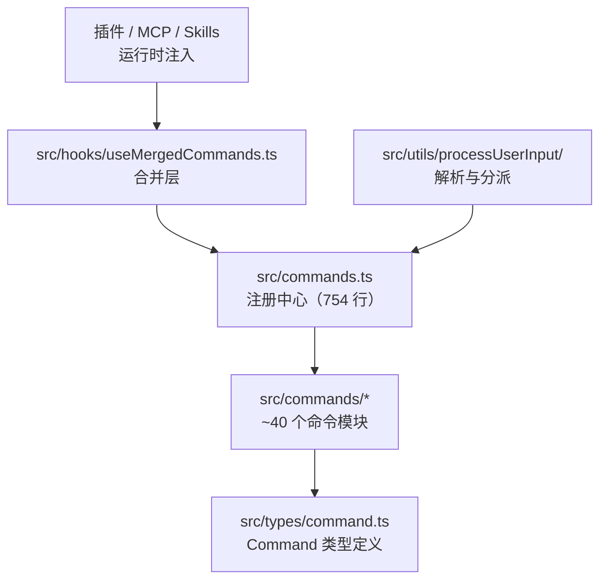

# Claude Code 命令系统：50+ 斜杠命令与 CLI 参数的设计与实现

> 从 `/commit` 到 `/ultrareview`：Command 注册、解析、三态执行与插件合并

前几篇我们走完的是「模型驱动」的链路：用户发一句话，`QueryEngine` 调模型、模型回 `tool_use`、工具执行、结果回填。但有一类用户输入走的是完全不同的路径——以 `/` 开头的斜杠命令。它们不进模型，由前端直接解析、分派、执行，可以在不消耗一次 API 调用的前提下完成 commit、清屏、切换主题、管理 MCP server 等动作。这套机制是 Claude Code 把「模型工具调用」和「用户主动操作」分流的关键设计。

斜杠命令看似简单——不就是「输入 `/xxx` 执行某个动作」吗？但 Claude Code 在这个看似简单的机制上叠加了三层复杂性。第一层是**三种执行模型**：有些命令生成提示词交给模型执行（`prompt`），有些同步执行返回文本（`local`），有些渲染交互式终端 UI（`local-jsx`）。第二层是**多来源合并**：内置命令、skills、plugin commands、MCP skills、workflow commands 来自五个不同的加载路径，需要统一合并和去重。第三层是**多维可用性门控**：feature flag、内部/外部用户、认证类型、远程模式安全、桥接安全——一个命令要经过八层门控才能最终出现在用户的 typeahead 里。

整个命令系统的源头只有两个文件：`src/commands.ts`（754 行）是注册中心，负责把所有命令组装成数组并提供查找接口；`src/commands/` 下 86 个子目录 + 15 个单文件 = 101 个条目是具体命令的实现，`COMMANDS()` 数组注册了 70 个基础命令（含 ant-only 内部命令后约 100 个）。命令本身的类型定义位于 `src/types/command.ts`。本文基于泄漏源码，从注册、解析、执行、合并四个维度拆解这套系统。

## 一、命令系统的三层结构

Claude Code 的命令系统由三层叠加而成：



第一层是**注册中心** `commands.ts`。它通过静态 `import` 把所有内置命令拉进一个数组 `COMMANDS()`，再通过 `getCommands(cwd)` 把这个数组与运行时加载的 skills、plugin commands、workflow commands 合并成一个最终的命令列表。`COMMANDS()` 被 lodash 的 `memoize` 包裹——配置读取必须延迟到调用时，不能在模块初始化阶段进行。

第二层是**命令模块**。每个命令都是一个独立的 `.ts` 文件或子目录，导出一个 `satisfies Command` 的对象。这种「一命令一文件」的结构让命令可以独立增删，也方便 feature flag 在编译期裁剪。`commands/` 目录下既有单文件命令（`commit.ts`、`review.ts`、`init.ts`），也有目录命令（`mcp/`、`config/`、`memory/`），目录形态通常意味着实现较重、需要拆分。

第三层是**类型契约** `types/command.ts`。它定义了 `Command` 类型的全貌，是注册中心和命令模块之间的协议。

注册中心 `commands.ts` 暴露的核心 API 有四个：`getCommands(cwd)` 返回当前用户可用的全部命令（内置 + skills + plugins + workflows + MCP skills）；`findCommand(name, commands)` 按名称或别名查找；`getCommand(name, commands)` 在找不到时抛出带可用命令列表的 `ReferenceError`；`hasCommand(name, commands)` 返回布尔值。`builtInCommandNames` 是一个 memoize 的 `Set<string>`，包含所有内置命令的 `name` 和 `aliases`，用于区分内置命令与运行时注入的命令。

## 二、Command 类型：三种执行模型

`Command` 类型是 `CommandBase` 与三种执行类型的交集：

```typescript
export type Command = CommandBase &
  (PromptCommand | LocalCommand | LocalJSXCommand)
```

`CommandBase` 是所有命令共享的元数据，字段相当丰富：

```typescript
export type CommandBase = {
  availability?: CommandAvailability[]
  description: string
  hasUserSpecifiedDescription?: boolean
  isEnabled?: () => boolean
  isHidden?: boolean
  name: string
  aliases?: string[]
  isMcp?: boolean
  argumentHint?: string
  whenToUse?: string
  version?: string
  disableModelInvocation?: boolean
  userInvocable?: boolean
  loadedFrom?: 'commands_DEPRECATED' | 'skills' | 'plugin' | 'managed' | 'bundled' | 'mcp'
  kind?: 'workflow'
  immediate?: boolean
  isSensitive?: boolean
  userFacingName?: () => string
}
```

几个字段值得单独说明：

- **`isEnabled()`**：动态开关，返回 `false` 的命令不出现在 `getCommands()` 结果里。`/doctor` 用它检查 `DISABLE_DOCTOR_COMMAND` 环境变量；`/ultrareview` 用它检查 `isUltrareviewEnabled()`；`/cost` 对 claude.ai 订阅者隐藏（因为订阅用户不按 token 计费）。注意 `isEnabled` 与 `availability` 是两个独立维度——后者是静态的认证要求，前者是运行时开关。
- **`isHidden`**：命令存在但不出现在 typeahead 和 help 里。内部调试命令常用这个标志。
- **`immediate`**：跳过输入队列立刻执行。正常命令会排在正在进行的 turn 后面，`immediate` 命令（如 `/mcp enable`、`/btw`）会立即生效。
- **`isSensitive`**：参数在对话历史里会被脱敏。用于可能包含密钥或敏感信息的命令。
- **`loadedFrom`**：标识命令来源，影响 SkillTool 的可见性过滤。`'bundled'`、`'skills'`、`'commands_DEPRECATED'` 三种来源的命令即使没有显式 description 也会自动从首行推导一个；`'plugin'` 和 `'mcp'` 来源的命令必须有显式 description 才出现在列表里。
- **`userInvocable`**：`false` 表示这个 skill 只能被模型通过 SkillTool 调用，用户输入 `/<name>` 会被拒绝并提示「Ask Claude to use the skill for you」。
- **`disableModelInvocation`**：反向开关，让 skill 只能用户调，模型看不到。用于有副作用的命令（如 `/deploy`、`/fix-issue`）。

三种执行类型则决定了命令被触发时**如何运行**：

| 类型 | 执行方式 | 返回 | 是否触发模型 | 典型命令 |
|------|---------|------|-------------|---------|
| `prompt` | 生成提示词 | `ContentBlockParam[]` | 是（`shouldQuery: true`） | `commit`、`review`、`init` |
| `local` | 同步执行函数 | `LocalCommandResult` | 否 | `compact`、`cost`、`clear` |
| `local-jsx` | 渲染 Ink UI | `React.ReactNode` | 否（除非 `onDone` 传入 `shouldQuery`） | `mcp`、`config`、`memory` |

### 2.1 PromptCommand：生成提示词交给模型

`prompt` 类型是最有意思的一种——它本身不执行任何业务逻辑，而是动态构造一段提示词，注入到对话上下文里，然后让模型按这段提示词去执行。它的核心字段是 `getPromptForCommand(args, context)`：

```typescript
export type PromptCommand = {
  type: 'prompt'
  progressMessage: string
  contentLength: number
  argNames?: string[]
  allowedTools?: string[]
  model?: string
  source: SettingSource | 'builtin' | 'mcp' | 'plugin' | 'bundled'
  context?: 'inline' | 'fork'
  effort?: EffortValue
  paths?: string[]
  getPromptForCommand(
    args: string,
    context: ToolUseContext,
  ): Promise<ContentBlockParam[]>
}
```

几个值得注意的字段：

- **`allowedTools`**：声明这个命令执行期间模型可以使用的额外工具白名单，例如 `/commit` 只允许 `Bash(git add:*)`、`Bash(git status:*)`、`Bash(git commit:*)`。
- **`context: 'inline' | 'fork'`**：`inline` 表示提示词展开进当前对话（默认）；`fork` 表示命令在一个独立的子 agent 里跑，有自己的上下文和 token 预算——这是 scheduled task 场景的设计。
- **`paths`**：glob 模式，当模型触及匹配的文件时这个 skill 才对模型可见，是一种按需激活机制。
- **`effort`**：覆盖当前 agent 的 effort 档位，让命令可以指定自己的模型档位。

### 2.2 LocalCommand：同步执行

`local` 类型是最直接的——一个异步函数 `call(args, context)` 返回 `LocalCommandResult`，结果可能是文本、压缩产物、或跳过：

```typescript
export type LocalCommandResult =
  | { type: 'text'; value: string }
  | { type: 'compact'; compactionResult: CompactionResult; displayText?: string }
  | { type: 'skip' }
```

`type: 'compact'` 是一个特殊通道——只有 `/compact` 命令用到，它返回的不是普通文本，而是压缩后的完整消息列表，调度器会走完全不同的拼装路径。

### 2.3 LocalJSXCommand：渲染 Ink 组件

`local-jsx` 类型用于需要交互式 UI 的命令——配置面板、MCP 管理、技能列表等。它返回一个 React 节点，由 Ink 渲染到终端：

```typescript
export type LocalJSXCommandCall = (
  onDone: LocalJSXCommandOnDone,
  context: ToolUseContext & LocalJSXCommandContext,
  args: string,
) => Promise<React.ReactNode>
```

`onDone` 回调是关键——命令完成后通过它把结果传回调度器，可以决定是否触发模型查询、是否插入 meta 消息、是否预填下一条输入：

```typescript
export type LocalJSXCommandOnDone = (
  result?: string,
  options?: {
    display?: CommandResultDisplay
    shouldQuery?: boolean
    metaMessages?: string[]
    nextInput?: string
    submitNextInput?: boolean
  },
) => void
```

`nextInput` + `submitNextInput` 是一个有趣的组合——命令完成后可以自动填入并提交下一条输入，`/discover` 这类向导式命令用它来串联流程。

## 三、命令执行流程

从用户输入到命令返回的完整路径：

```mermaid
sequenceDiagram
    participant U as 用户
    participant PUI as processUserInput
    participant PSC as processSlashCommand
    participant PAR as parseSlashCommand
    participant FC as findCommand
    participant CMD as Command.execute
    participant M as 模型

    U->>PUI: 输入 /commit "fix bug"
    PUI->>PSC: 检测到首字符 /
    PSC->>PAR: parseSlashCommand(input)
    PAR-->>PSC: {commandName, args, isMcp}
    PSC->>FC: findCommand("commit", commands)
    FC-->>PSC: Command 对象
    PSC->>CMD: 按 type 分派
    alt type = prompt
        CMD-->>PSC: ContentBlockParam[]
        PSC-->>PUI: messages + shouldQuery: true
        PUI->>M: 触发模型查询
    else type = local
        CMD-->>PSC: LocalCommandResult
        PSC-->>PUI: messages + shouldQuery: false
    else type = local-jsx
        CMD-->>PSC: React 节点 + onDone 回调
        PSC-->>PUI: 渲染 UI
    end
```

### 3.1 入口：processUserInput

`src/utils/processUserInput/processUserInput.ts` 是所有用户输入的入口。它接收字符串或 ContentBlock 数组，做图像处理、附件提取，然后根据输入特征分派：

```typescript
// Slash commands
if (inputString !== null && !effectiveSkipSlash && inputString.startsWith('/')) {
  const { processSlashCommand } = await import('./processSlashCommand.js')
  const slashResult = await processSlashCommand(
    inputString, precedingInputBlocks, imageContentBlocks,
    attachmentMessages, context, setToolJSX, uuid,
    isAlreadyProcessing, canUseTool,
  )
  return addImageMetadataMessage(slashResult, imageMetadataTexts)
}
```

注意 `processSlashCommand` 是**动态 import** 的——因为大多数对话不会触发斜杠命令，把它从主 bundle 里剥离可以减少启动开销。`effectiveSkipSlash` 是一个桥接安全开关，远程客户端（手机、网页）传来的消息默认不触发本地斜杠命令，除非命令在 `BRIDGE_SAFE_COMMANDS` 白名单里。

### 3.2 解析：parseSlashCommand

解析逻辑极其简洁，位于 `src/utils/slashCommandParsing.ts`，总共只有 60 行：

```typescript
export function parseSlashCommand(input: string): ParsedSlashCommand | null {
  const trimmedInput = input.trim()
  if (!trimmedInput.startsWith('/')) return null

  const withoutSlash = trimmedInput.slice(1)
  const words = withoutSlash.split(' ')
  if (!words[0]) return null

  let commandName = words[0]
  let isMcp = false
  let argsStartIndex = 1

  // MCP commands: second word is '(MCP)'
  if (words.length > 1 && words[1] === '(MCP)') {
    commandName = commandName + ' (MCP)'
    isMcp = true
    argsStartIndex = 2
  }

  const args = words.slice(argsStartIndex).join(' ')
  return { commandName, args, isMcp }
}
```

需要先澄清一个常见误解：Commander.js（`@commander-js/extra-typings`，`main.tsx:22` import）确实存在于 Claude Code 中，但它**只用于 CLI 参数解析**（`main.tsx:902` `new CommanderCommand()`，处理 `claude --print`、`claude --resume`、`claude --bare` 等命令行 flags），**不参与 REPL 内的斜杠命令解析**。斜杠命令的解析走独立的极简解析器。

斜杠命令解析没有用 Commander.js——这是源码里最让人意外的事实之一。整个解析逻辑就是「按空格切，第一个词是命令名，剩下的是参数」。MCP 命令的特殊语法 `/mcp:tool (MCP) arg1 arg2` 也只是检查第二个词是不是 `(MCP)` 字面量。这种极简解析支持的语法很有限，但对 Claude Code 的命令集已经足够——所有命令都是 `name + 自由文本 args` 的形态，没有子命令、没有 flag 解析。

这种极简设计有一个常被忽略的好处：**解析逻辑与命令实现解耦**。命令自己决定怎么解释 `args` 字符串——`/mcp` 把 args 按空格切成 `action target`，`/compact` 把整个 args 当作自定义总结指令，`/review` 把 args 当作 PR 号码。如果用 Commander.js 这种带 flag 解析的框架，每个命令还得声明自己的 flag schema，反而增加了维护成本。Claude Code 选择了「最小公共协议 + 命令自治」的路线。

### 3.3 查找：findCommand

```typescript
export function findCommand(
  commandName: string,
  commands: Command[],
): Command | undefined {
  return commands.find(
    _ =>
      _.name === commandName ||
      getCommandName(_) === commandName ||
      _.aliases?.includes(commandName),
  )
}
```

查找会匹配三个字段：`name`（内部名）、`userFacingName()`（显示名，可能剥离插件前缀）、`aliases`（别名数组）。`/clear` 有别名 `reset` 和 `new`，`/config` 有别名 `settings`，`/resume` 有别名 `continue`，`/tasks` 有别名 `bashes`。`getCommand` 在找不到时会抛 `ReferenceError` 并列出所有可用命令——这对调试很友好。

### 3.4 分派：三种 type 的执行

`getMessagesForSlashCommand` 是分派的核心，按 `command.type` 走三条完全不同的路径：

**`prompt` 路径**：调用 `command.getPromptForCommand(args, context)` 拿到 `ContentBlockParam[]`，构造一系列消息——一条 metadata 消息（标记 skill 加载）、一条 `isMeta: true` 的内容消息（模型可见但用户隐藏）、附件消息、权限消息。返回 `shouldQuery: true`，让主循环触发一轮模型查询。

这里有个细节值得展开。`getMessagesForPromptSlashCommand` 在构造消息时会做四件额外的事：第一，调用 `registerSkillHooks()` 把 skill 声明的 hooks 注册到当前会话（如果 skill 有 `hooks` 字段且通过了 `isRestrictedToPluginOnly('hooks')` 检查）；第二，调用 `addInvokedSkill()` 把 skill 内容记录到 compaction preservation 系统里，scoped by agentId——这样压缩时只恢复属于当前 agent 的 skills，防止跨 agent 泄漏；第三，调用 `getAttachmentMessages()` 从 skill 内容里提取 `@-mentions`、MCP resources、agent mentions 等附件；第四，把 `command.allowedTools` 通过 `parseToolListFromCLI()` 解析成权限规则并附在 `command_permissions` attachment 里。

`prompt` 路径还有一个 `context: 'fork'` 分支——当命令声明了 `context: 'fork'` 时，`executeForkedSlashCommand` 会把命令在一个独立子 agent 里执行。这个分支有两种模式：普通模式下命令同步运行并显示 progress UI；在 KAIROS（assistant mode）开启时，命令 fire-and-forget 到后台，完成后通过 `enqueuePendingNotification` 把结果作为 isMeta prompt 重新注入队列。注释解释了原因：「Without this, N scheduled tasks on startup = N serial cycles blocking user input. With this, N subagents run in parallel and results trickle into the queue as they finish.」

**`local` 路径**：调用 `mod.call(args, context)`，结果可能是 `text`（普通文本输出）、`compact`（压缩产物，走特殊的拼装路径）、`skip`（跳过，不产生任何消息）。返回 `shouldQuery: false`。

`local` 路径的错误处理值得一提：如果 `call()` 抛异常，会被 catch 并构造成 `<local-command-stderr>` 消息返回，不会让整个 REPL 崩溃。这种隔离让命令的错误不会污染主对话流。

**`local-jsx` 路径**：调用 `mod.call(onDone, context, args)`，返回 React 节点，由 `setToolJSX` 渲染到终端。命令通过 `onDone` 回调把结果传回，可以控制是否触发模型查询。这个路径最复杂——它要处理用户取消（ESC）、异常、`onDone` 没被调用导致 Promise 悬挂等边界情况。

`local-jsx` 路径的 Promise 悬挂问题在源码注释里有详细说明：「If load()/call() throws and onDone never fired, the outer Promise hangs forever, leaving queryGuard stuck in 'dispatching' and deadlocking the queue processor.」解决方案是在 catch 分支里检查 `doneWasCalled` 标志，如果没被调用就手动 resolve 一个空结果。这是一个典型的「回调 + Promise 混合模式」的陷阱——命令实现者可能忘记调 `onDone`，或者 `call()` 在 `onDone` 之前就抛了异常。

## 四、命令分类速览

按功能域分类，Claude Code 的 50+ 命令大致可以归为以下几组。

### 4.1 会话与代码协作

| 命令 | 类型 | 说明 |
|------|------|------|
| `commit` | prompt | 分析 diff 生成 commit |
| `commit-push-pr` | prompt | commit + push + 建 PR 一条龙 |
| `review` | prompt | 本地 PR review |
| `ultrareview` | local-jsx | 远程深度 review（10-20 分钟） |
| `security-review` | prompt | 安全审查 |
| `autofix-pr` | prompt | 自动修复 PR |
| `init` | prompt | 生成 CLAUDE.md |
| `init-verifiers` | prompt | 初始化验证器 |
| `clear` | local | 清空对话（别名 `reset`、`new`） |
| `compact` | local | 手动压缩对话 |
| `resume` | local-jsx | 恢复历史会话（别名 `continue`） |
| `rename` | local-jsx | 重命名当前会话 |
| `rewind` | local-jsx | 回退到某个 checkpoint |

### 4.2 配置与个性化

| 命令 | 类型 | 说明 |
|------|------|------|
| `config` | local-jsx | 配置面板（别名 `settings`） |
| `theme` | local-jsx | 终端主题 |
| `color` | local-jsx | agent 颜色 |
| `keybindings` | local-jsx | 快捷键管理 |
| `output-style` | local-jsx | 输出风格 |
| `statusline` | local-jsx | 状态栏切换 |
| `vim` | local-jsx | vim 模式 |
| `model` | local-jsx | 模型切换 |
| `effort` | local-jsx | effort 档位 |
| `permissions` | local-jsx | 权限管理 |
| `privacy-settings` | local-jsx | 隐私设置 |

### 4.3 工具与扩展管理

| 命令 | 类型 | 说明 |
|------|------|------|
| `mcp` | local-jsx | MCP server 管理（`immediate: true`） |
| `skills` | local-jsx | 列出可用 skills |
| `tasks` | local-jsx | 后台任务管理（别名 `bashes`） |
| `plugin` | local-jsx | 插件管理 |
| `reload-plugins` | local-jsx | 重载插件 |
| `hooks` | local-jsx | hooks 管理 |
| `agents` | local-jsx | agent 定义管理 |

### 4.4 诊断与可观测

| 命令 | 类型 | 说明 |
|------|------|------|
| `doctor` | local-jsx | 环境诊断 |
| `cost` | local | 会话成本与时长 |
| `context` | local | 上下文窗口占用 |
| `ctx_viz` | local | 上下文可视化 |
| `diff` | local-jsx | 查看 diff |
| `status` | local-jsx | 项目状态 |
| `stats` | local-jsx | 统计信息 |
| `usage` | local | 用量信息 |
| `insights` | prompt | 会话分析报告（懒加载） |

### 4.5 记忆与上下文

| 命令 | 类型 | 说明 |
|------|------|------|
| `memory` | local-jsx | 编辑记忆文件 |
| `add-dir` | local-jsx | 添加工作目录 |
| `files` | local-jsx | 列出跟踪文件 |
| `branch` | local-jsx | 切换 git 分支 |
| `tag` | local-jsx | 标记会话 |

### 4.6 共享与集成

| 命令 | 类型 | 说明 |
|------|------|------|
| `share` | local-jsx | 分享会话 |
| `session` | local-jsx | 会话管理 |
| `teleport` | local-jsx | 传送会话到远程 |
| `pr_comments` | local-jsx | 查看 PR 评论 |
| `feedback` | local-jsx | 发送反馈 |
| `desktop` | local-jsx | 桌面应用切换 |
| `mobile` | local-jsx | 移动端 QR |
| `login` / `logout` | local-jsx | 认证管理 |
| `ide` | local-jsx | IDE 操作 |
| `copy` | local-jsx | 复制内容 |
| `export` | local-jsx | 导出会话 |
| `upgrade` | local-jsx | 升级 Claude Code |
| `install-github-app` | local-jsx | 安装 GitHub App |
| `install-slack-app` | local-jsx | 安装 Slack App |

### 4.7 其他

`help`（帮助）、`exit`（退出）、`btw`（侧问快捷问题）、`onboarding`（引导流程）、`release-notes`（更新日志）、`issue`（生成 issue）、`break-cache`（打破 prompt cache）、`good-claude`（彩蛋命令）、`backfill-sessions`（会话迁移）、`sandbox-toggle`、`debug-tool-call`、`heapdump`、`mock-limits`、`ant-trace`、`perf-issue`、`thinkback`、`thinkback-play` 等。

这一组命令里有一些有趣的角落。`/btw` 是「侧问」命令——在不打断主对话的情况下问一个快速的侧面问题，它标记了 `immediate: true`，会立刻执行。`/break-cache` 是一个调试命令，用于打破 Anthropic API 的 prompt cache——当缓存内容过期或出错时，这个命令强制让下一次请求不走缓存。`/thinkback` 和 `/thinkback-play` 与思考链回放有关，让用户回顾模型的推理过程。`/heapdump` 是 Node.js 堆转储命令，用于内存泄漏调试。`/mock-limits` 和 `/reset-limits` 用于测试限流逻辑。这些命令大多是内部调试工具，对外部用户价值不大，但它们与业务命令共享同一套注册和执行机制——Claude Code 没有为调试命令单独搞一套系统。

## 五、关键命令深读

### 5.1 `/commit`：提示词模板的典范

`/commit` 是 `prompt` 类型命令的教科书实现。它本身不执行 git 命令，而是构造一段提示词，让模型按这段提示词去调用受限的工具集：

```typescript
const ALLOWED_TOOLS = [
  'Bash(git add:*)',
  'Bash(git status:*)',
  'Bash(git commit:*)',
]

const command = {
  type: 'prompt',
  name: 'commit',
  description: 'Create a git commit',
  allowedTools: ALLOWED_TOOLS,
  source: 'builtin',
  async getPromptForCommand(_args, context) {
    const promptContent = getPromptContent()
    const finalContent = await executeShellCommandsInPrompt(
      promptContent,
      { ...context, /* 注入 alwaysAllowRules */ },
      '/commit',
    )
    return [{ type: 'text', text: finalContent }]
  },
}
```

提示词模板里嵌入了 `!`git status`` 这种内联 shell 执行语法（`executeShellCommandsInPrompt` 会把它们替换成实际输出），让模型在生成 commit message 前就能看到当前 diff、最近 commit 风格、分支名。模板还包含一份「Git Safety Protocol」——NEVER amend、NEVER skip hooks、NEVER commit secrets——把安全约束以自然语言形式注入模型上下文。

这种设计的妙处在于：命令本身保持极简（92 行），复杂的 commit message 生成逻辑全部交给模型，而 `allowedTools` 白名单把模型的行动半径限制在 `git add/status/commit` 三个动作内。权限系统在 `getPromptForCommand` 里通过覆盖 `toolPermissionContext.alwaysAllowRules` 把这三个命令设为始终允许，避免每步都要用户确认。

`/commit` 的提示词模板里有几处值得注意的工程细节。第一，模板里写死了 HEREDOC 语法 `git commit -m "$(cat <<'EOF' ... EOF)"`——这是因为多行 commit message 在 shell 里必须用 HEREDOC，直接传 `-m` 会丢失换行。模型被明确要求「use heredoc syntax」。第二，模板包含 `getAttributionTexts()` 返回的 attribution 文本，会追加到 commit message 末尾（类似 `Co-Authored-By: Claude`），这是一个可选的署名机制。第三，对 Anthropic 内部用户（`USER_TYPE === 'ant'`），如果 `isUndercover()` 返回 true，会在提示词前缀加一段 undercover 指令——用于内部测试 Claude 不暴露身份的场景。

### 5.2 `/review` 与 `/ultrareview`：同源两种执行模型

`/review` 和 `/ultrareview` 是同一功能域的两种执行模型对比，源码位于 `src/commands/review.ts`：

```typescript
const review: Command = {
  type: 'prompt',
  name: 'review',
  description: 'Review a pull request',
  async getPromptForCommand(args) {
    return [{ type: 'text', text: LOCAL_REVIEW_PROMPT(args) }]
  },
}

const ultrareview: Command = {
  type: 'local-jsx',
  name: 'ultrareview',
  description: `~10–20 min · Finds and verifies bugs in your branch.
    Runs in Claude Code on the web. See ${CCR_TERMS_URL}`,
  isEnabled: () => isUltrareviewEnabled(),
  load: () => import('./review/ultrareviewCommand.js'),
}
```

`/review` 是本地 prompt 命令——提示词让模型调 `gh pr view`、`gh pr diff` 然后给评审意见，整个过程在当前会话里完成。`/ultrareview` 走完全不同的路径：它是 `local-jsx`，会渲染一个权限对话框（因为要发到 Claude Code on the web），同意后启动一个 10-20 分钟的远程 bughunter 任务。源码注释明确说明：「`/ultrareview` is the ONLY entry point to the remote bughunter path — `/review` stays purely local」。

这两个命令的差异揭示了 Claude Code 的一个设计原则：**功能域相同但执行模型不同时，分成两个独立命令比一个命令带子命令更清晰**。`/ultrareview` 不是 `/review --ultra`，它是另一个一等公民命令。

`/review` 的 prompt 模板也很值得读。它要求模型按 4 步走：先 `gh pr list` 列出 PR（如果没有参数）、再 `gh pr view <number>` 看详情、`gh pr diff <number>` 拿 diff、最后按代码正确性、项目规范、性能、测试覆盖、安全 5 个维度给评审意见。模板没有声明 `allowedTools`——这意味着模型执行 review 时默认可以调用所有已授权的工具，包括 `gh` 命令。与 `/commit` 的严格白名单形成对比，这种宽松策略适合 review 场景，因为 reviewer 可能需要跑测试、查文件、看日志，限制太死反而妨碍分析。

`/ultrareview` 的 `local-jsx` 实现里有一个 `UltrareviewOverageDialog` 组件——当免费 review 额度用完时弹出权限对话框，让用户确认是否付费继续。这是一个把计费逻辑嵌入命令执行的例子：命令不只是技术执行单元，也是商业策略的触点。

### 5.3 `/compact`：local 命令的特殊通道

`/compact` 是 `local` 类型里唯一用到 `type: 'compact'` 返回值的命令。它的实现位于 `src/commands/compact/compact.ts`，调用链很深：

```typescript
export const call: LocalCommandCall = async (args, context) => {
  let { messages } = context
  messages = getMessagesAfterCompactBoundary(messages)
  // ...
  // 1. 先尝试 session memory compaction
  if (!customInstructions) {
    const sessionMemoryResult = await trySessionMemoryCompaction(messages, context.agentId)
    if (sessionMemoryResult) return { type: 'compact', compactionResult: sessionMemoryResult, ... }
  }
  // 2. reactive-only 模式
  if (reactiveCompact?.isReactiveOnlyMode()) {
    return await compactViaReactive(messages, context, customInstructions, reactiveCompact)
  }
  // 3. 传统压缩：先 microcompact 再 compactConversation
  const microcompactResult = await microcompactMessages(messages, context)
  const result = await compactConversation(microcompactResult.messages, context, ...)
  return { type: 'compact', compactionResult: result, ... }
}
```

返回 `type: 'compact'` 而不是 `type: 'text'`，意味着 `processSlashCommand` 会走特殊的拼装路径——它要把压缩后的完整消息列表替换掉当前对话，而不是追加一条 `<local-command-stdout>`。这是 `LocalCommandResult` 联合类型里 `compact` 分支存在的唯一理由。

`/compact` 的三条路径反映了 Claude Code 压缩系统的演进——session memory compaction 是最新的、最便宜的（不需要调模型做总结，而是基于结构化的 session memory），reactive compaction 是分块渐进式压缩（`feature('REACTIVE_COMPACT')` 门控），传统 compact 是最老的、一次性的整段总结。三条路径的优先级是 session memory > reactive > 传统，前者成功就短路后者。这也是为什么 `/compact` 的实现看起来分支很多——每条路径都要独立处理 PreCompact hooks、cache break notification、microcompact state reset 等副作用。

`/compact` 还有一个易被忽略的细节：它在调用 `compactConversation` 之前会先跑 `microcompactMessages`。microcompact 是一个「轻量预处理」——它不调模型，只是按规则丢弃已完成的工具调用的中间结果（保留 toolResult 但丢掉 toolUse 的 input 详情）、折叠连续的 thinking blocks、移除冗余的 system 消息。这一步能把 token 数显著降低，让后续的模型总结更便宜。详见第 4 篇对话压缩。

### 5.4 `/mcp`：local-jsx 的即时执行

`/mcp` 命令的元数据里有个 `immediate: true` 字段：

```typescript
const mcp = {
  type: 'local-jsx',
  name: 'mcp',
  description: 'Manage MCP servers',
  immediate: true,
  argumentHint: '[enable|disable [server-name]]',
  load: () => import('./mcp.js'),
}
```

`immediate` 标志让命令跳过输入队列，立刻执行——`/mcp enable server-name` 这种命令应该立刻生效，不该排在正在进行的对话后面。`/btw` 也带这个标志——侧问应该立刻显示，不打断主对话节奏。

实现 `mcp.tsx` 里还包含一个子命令分派：`/mcp reconnect <server>` 重连、`/mcp enable <server>|all` 启用、`/mcp disable <server>|all` 禁用、无参数则渲染管理面板。一个 `local-jsx` 命令内部可以承载多种交互形态。

`/mcp` 的 enable/disable 子命令通过 `MCPToggle` 组件实现，这个组件用 `useEffect` 在挂载时执行 toggle 操作，完成后调用 `onComplete` 回调。这种「组件即副作用」的模式在 Ink 里很常见——因为 React 的 useEffect 提供了清理和依赖追踪，比命令式的副作用管理更可靠。`MCPToggle` 内部调用 `useMcpToggleEnabled()` hook，这个 hook 来自 `MCPConnectionManager` 服务，负责实际的连接/断开逻辑。

`/mcp` 还有一个 `no-redirect` 子命令——它绕过 ant 用户的 `/plugins` 重定向，直接显示原生 MCP 设置面板。这是一个测试用的隐藏参数，体现了「内部用户需要更底层访问」的设计考虑。

### 5.5 `/config` 与 `/memory`：UI 委托模式

`/config` 和 `/memory` 的实现都极简——它们只是把一个 React 组件渲染出来：

```typescript
// config/config.tsx
export const call: LocalJSXCommandCall = async (onDone, context) => {
  return <Settings onClose={onDone} context={context} defaultTab="Config" />
}
```

这种「命令 = UI 组件入口」的模式让命令注册保持轻量——所有交互逻辑都在组件里，命令本身只负责「打开这个面板」。`/config` 别名 `settings`，`/memory` 编辑的是 memdir 系统里的持久化文件（详见第 10 篇记忆系统）。

`/config` 渲染的 `Settings` 组件接受一个 `defaultTab` 参数，这意味着 `/config` 可以直接跳到某个 tab——如果未来加一个 `/config theme` 子命令，只需要把 args 解析成 tab 名传进去。当前实现没有做这个子命令分派，但架构已经预留了扩展空间。

`/memory` 命令对应的 `memory.tsx` 渲染的是一个文件编辑器，让用户直接编辑 `~/.claude/CLAUDE.md`、项目级 `CLAUDE.md`、`CLAUDE.local.md` 等记忆文件。这与 `/init` 形成互补——`/init` 是 AI 自动生成记忆文件，`/memory` 是用户手动编辑。两个命令覆盖了「自动生成」和「手动编辑」两种记忆管理路径。

`/color` 命令也是 UI 委托模式，但它更特殊——它改变的是 agent 在终端里的显示颜色，这是一个纯本地状态变更，不影响任何持久化数据。`/theme` 改变的是整体终端配色方案（深色/浅色/高对比度等），会持久化到配置文件。`/vim` 切换 vim 模式，影响输入框的按键行为。这三个命令都是「本地状态切换器」，用 `local-jsx` 是因为它们需要一个交互式的选择 UI。

### 5.6 `/init`：prompt 命令的复杂极端

`/init` 是 prompt 命令里最复杂的一个——它的提示词模板长达 256 行，定义了一个 8 阶段的初始化流程：询问要设置什么、探索代码库、填补信息空白、写 CLAUDE.md、写 CLAUDE.local.md、创建 skills、建议 hooks、总结。模板里还嵌入了 feature flag 分支：`NEW_INIT` 开启时用新模板（更结构化、支持 skills/hooks），否则用旧模板（只生成 CLAUDE.md）。

这个命令揭示了 prompt 类型的另一个特性——**提示词本身就是程序**。`/init` 没有任何 TypeScript 业务逻辑，所有流程控制（询问、探索、生成、建议）都写在自然语言提示词里，由模型按提示词执行。`getPromptForCommand` 只是一个返回字符串的函数。

`/init` 的新模板（`NEW_INIT_PROMPT`）尤其值得关注，它把整个初始化流程拆成 8 个阶段，每个阶段都有明确的输入、输出和决策点。Phase 1 用 `AskUserQuestion` 工具询问用户要设置什么；Phase 2 启动子 agent 探索代码库；Phase 3 用 `AskUserQuestion` 填补信息空白；Phase 4-5 写 CLAUDE.md 和 CLAUDE.local.md；Phase 6 创建 skills；Phase 7 建议 hooks 和其他优化；Phase 8 总结。这个流程的设计精髓在于「约束模型的选择空间」——每个阶段都明确告诉模型该做什么、不该做什么、用什么工具、输出什么格式。例如 Phase 4 明确列出 CLAUDE.md 应该包含什么、不该包含什么（「Do not repeat yourself and do not make up sections like 'Common Development Tasks'」）。

`/init` 还体现了 prompt 命令与 skill 系统的交叉——Phase 7 里要求模型「invoke the Skill tool with `skill: 'update-config'`」来加载 hooks schema。一个 prompt 命令在执行过程中可以触发另一个 skill 的加载，形成命令间的链式调用。这种机制让 `/init` 不需要自己实现 hooks 构造逻辑，而是委托给专门的 `update-config` skill。

## 六、命令与工具的边界

命令（Command）和工具（Tool）是 Claude Code 里两个容易混淆的概念。它们的边界如下：

| 维度 | Command | Tool |
|------|---------|------|
| 触发方 | 用户（输入 `/`） | 模型（产出 `tool_use`） |
| 执行时机 | 同步，立即 | 异步，在 turn 内 |
| 是否进模型 | prompt 类型会，local/local-jsx 不会 | 必然进模型（工具结果回填） |
| 权限检查 | 命令级 `allowedTools` + `availability` | 工具级权限系统 |
| UI 渲染 | local-jsx 自己渲染 | 由 StreamingToolExecutor 渲染进度 |
| 注册位置 | `src/commands.ts` | `src/tools.ts` |

但两者并非完全隔离。关键桥梁有三个：

**第一，prompt 命令的 `allowedTools`**。`/commit` 声明 `allowedTools: ['Bash(git add:*)', ...]`，这个白名单会被注入到 `toolPermissionContext.alwaysAllowRules`，让模型在执行 commit 提示词期间可以无确认地调用这几个 git 命令。命令是「用户授权入口」，工具是「模型执行手段」。用户通过输入 `/commit` 隐式授权了这几个 git 命令的自动执行，模型在提示词驱动下调用它们时不再需要逐个确认。这是一种「批量授权」机制——比起每个工具调用都弹权限框，让用户一次性授权一组相关操作体验好得多。

**第二，`shouldQuery` 机制**。`local-jsx` 命令通过 `onDone` 的 `shouldQuery: true` 可以在命令完成后触发一轮模型查询。例如 `/ultraplan` 完成后会触发模型继续推理。这让命令可以成为模型查询的「前置准备」——命令做完 UI 交互，把结果交给模型继续处理。

更微妙的是 `nextInput` + `submitNextInput` 的组合——命令完成后可以自动填入并提交下一条输入。这在向导式命令里很有用：`/discover` 命令让用户选一个功能，选完后自动把对应的 `/feature-name` 填入输入框并提交，形成「命令 → 选择 → 自动执行下一个命令」的链式流程。这种机制让 `local-jsx` 命令不只是「执行完就结束」，而是可以编排后续的对话流。

**第三，Skill 的双面性**。Skill 是一种特殊的 prompt 命令——它既能被用户用 `/skill-name` 触发，也能被模型通过 `SkillTool` 触发。`CommandBase` 里的 `userInvocable` 字段控制这一点：`false` 表示只能模型调，`true`（默认）表示用户和模型都能调。`disableModelInvocation` 则反过来——让 skill 只能用户调，模型看不到。

这种双面性由 `getSkillToolCommands` 和 `getSlashCommandToolSkills` 两个 memoize 函数实现，它们从 `getCommands()` 里过滤出「模型可见的 skills」：

```typescript
export const getSkillToolCommands = memoize(
  async (cwd: string): Promise<Command[]> => {
    const allCommands = await getCommands(cwd)
    return allCommands.filter(
      cmd =>
        cmd.type === 'prompt' &&
        !cmd.disableModelInvocation &&
        cmd.source !== 'builtin' &&
        (cmd.loadedFrom === 'bundled' ||
          cmd.loadedFrom === 'skills' ||
          cmd.loadedFrom === 'commands_DEPRECATED' ||
          cmd.hasUserSpecifiedDescription ||
          cmd.whenToUse),
    )
  },
)
```

注意 `cmd.source !== 'builtin'`——内置命令（如 `/commit`、`/review`）即使满足其他条件也不会出现在 SkillTool 的列表里。这是因为内置命令有自己的 `allowedTools` 白名单和特殊权限处理，不适合让模型自由调用。而 skill 目录里的命令、插件命令、bundled skills 都可以被模型通过 SkillTool 触发。这个设计把「用户快捷方式」和「模型可用能力」做了清晰区分——内置命令是前者，skills 是后者。

命令和工具的关系可以用一句话概括：**命令是用户视角的入口，工具是模型视角的能力**。prompt 命令是两者之间的桥梁——它把用户的 slash 意图翻译成模型能理解的提示词，再让模型用工具去执行。

## 七、插件命令与合并机制

### 7.1 三层合并

命令列表的合并发生在 React 组件 `REPL.tsx` 里：

```typescript
const commandsWithPlugins = useMergedCommands(localCommands, plugins.commands)
const mergedCommands = useMergedCommands(commandsWithPlugins, mcp.commands)
```

`useMergedCommands` 实现极简——用 lodash `uniqBy` 按 `name` 去重，**先出现的优先**：

```typescript
export function useMergedCommands(
  initialCommands: Command[],
  mcpCommands: Command[],
): Command[] {
  return useMemo(() => {
    if (mcpCommands.length > 0) {
      return uniqBy([...initialCommands, ...mcpCommands], 'name')
    }
    return initialCommands
  }, [initialCommands, mcpCommands])
}
```

合并顺序是 `local → plugins → mcp`，所以优先级也是 **local > plugins > mcp**。如果插件注册了一个叫 `commit` 的命令，它会被内置的 `/commit` 覆盖。这是 Claude Code 的优先级策略——内置命令不会被同名插件命令遮蔽。

`useMergedCommands` 的实现虽然只有 15 行，但它的调用位置在 `REPL.tsx:832-833` 揭示了一个两阶段合并的设计。`localCommands` 在 REPL 的 `useState` 里初始化，它本身已经通过 `getCommands()` 加载了内置命令 + skills + plugin commands + workflow commands（这些在 `commands.ts` 的 `loadAllCommands` 里合并）。然后 REPL 再用 `useMergedCommands` 把 `plugins.commands`（运行时发现的插件命令）和 `mcp.commands`（MCP server 暴露的 prompt commands）叠加上去。两阶段合并的原因是插件和 MCP server 的发现是异步的——它们在 REPL 渲染后才会陆续加载，需要通过 React state 更新来触发重新合并。

`getCommands()` 内部还有一个「动态 skills 插入」的逻辑值得注意。`getDynamicSkills()` 返回在文件操作过程中发现的新 skills（例如用户刚创建了一个新的 `.claude/skills/xxx/SKILL.md`）。这些动态 skills 会被去重后插入到「plugin skills 之后、内置命令之前」的位置：

```typescript
const insertIndex = baseCommands.findIndex(c => builtInNames.has(c.name))
return [
  ...baseCommands.slice(0, insertIndex),
  ...uniqueDynamicSkills,
  ...baseCommands.slice(insertIndex),
]
```

这个插入位置不是随意的——它确保动态 skills 的优先级低于已加载的 skills 和 plugins（因为 `findIndex` 找到第一个内置命令的位置，插入点在它之前），但高于内置命令。这与 `uniqBy` 去重策略配合，形成了一个清晰的优先级链：已加载 skills/plugins > 动态 skills > 内置命令。

### 7.2 Feature flag 门控

`commands.ts` 顶部有一大段 `feature()` 条件 require，把实验性命令按 feature flag 裁剪：

```typescript
const proactive = feature('PROACTIVE') || feature('KAIROS')
  ? require('./commands/proactive.js').default : null
const briefCommand = feature('KAIROS') || feature('KAIROS_BRIEF')
  ? require('./commands/brief.js').default : null
const voiceCommand = feature('VOICE_MODE')
  ? require('./commands/voice/index.js').default : null
const forkCmd = feature('FORK_SUBAGENT')
  ? require('./commands/fork/index.js').default : null
// ... 还有 bridge, remoteControlServer, ultraplan, torch, peers, buddy, workflows, web 等
```

这是 Bun 编译期裁剪——`feature('XXX')` 在编译时被替换成 `true` 或 `false`，外部产物里这些命令的代码完全消失。这与 `tasks.ts` 里对 `WORKFLOW_SCRIPTS`、`MONITOR_TOOL` 的条件 require 是同一套机制。

这些 feature flag 命令大致可以分成几组。`KAIROS` 系列（`proactive`、`brief`、`assistant`、`subscribe-pr`）是 Anthropic 内部的 assistant mode 实验功能，涉及定时任务、PR 订阅等。`BRIDGE_MODE` 系列（`bridge`、`remoteControlServer`）是远程控制模式，让手机/网页端可以控制本地 Claude Code。`VOICE_MODE` 是语音输入。`FORK_SUBAGENT` 是 fork subagent 实验。`ULTRAPLAN` 是深度规划模式。`TORCH`、`UDS_INBOX`（peers）、`BUDDY` 等都是更实验性的功能。

这种「feature flag + 条件 require」的模式让 Claude Code 可以在同一个代码库里维护多个实验分支，而外部产物只包含稳定功能。每个 feature flag 对应一个 Bun 编译选项，编译时决定哪些命令进入最终产物。这与传统的前端 feature flag（运行时判断、代码都打进 bundle）完全不同——Bun 的 `feature()` 是编译期常量，`false` 分支的代码会被 dead code elimination 完全移除。

### 7.3 INTERNAL_ONLY_COMMANDS

`commands.ts` 维护了一个内部命令列表：

```typescript
export const INTERNAL_ONLY_COMMANDS = [
  backfillSessions, breakCache, bughunter, commit, commitPushPr,
  ctx_viz, goodClaude, issue, initVerifiers, mockLimits, bridgeKick,
  version, resetLimits, resetLimitsNonInteractive, onboarding, share,
  summary, teleport, antTrace, perfIssue, env, oauthRefresh,
  debugToolCall, agentsPlatform, autofixPr,
].filter(Boolean)
```

这些命令只在 `process.env.USER_TYPE === 'ant'`（Anthropic 内部用户）且非 demo 模式时才注册。外部用户的 `commands.ts` 编译产物里这些命令会被消除——注意 `good-claude/index.js` 在外部仓库里就是一行 `export default { isEnabled: () => false, isHidden: true, name: 'stub' }`，是个占位 stub。`teleport/index.js` 同理。

这个列表里有几个值得注意的条目。`commit` 和 `commitPushPr` 在内部命令列表里——这意味着外部用户的 `/commit` 实际上走的是插件路径，而不是内置命令。这是一个有趣的架构选择：把核心的 commit 功能也迁移到插件体系，让内部用户用内置版（可以更快迭代），外部用户用插件版（通过 marketplace 分发）。`onboarding`、`share`、`teleport`、`summary`、`autofixPr` 等也都在内部命令列表里，说明这些功能目前只对 Anthropic 内部开放。

`agentsPlatform` 是唯一一个用 `USER_TYPE === 'ant'` 直接在 import 阶段门控的命令（其他内部命令是通过 `INTERNAL_ONLY_COMMANDS` 列表在运行时过滤）：

```typescript
const agentsPlatform =
  process.env.USER_TYPE === 'ant'
    ? require('./commands/agents-platform/index.js').default
    : null
```

这种差异可能是因为 `agentsPlatform` 涉及更深的内部基础设施，连代码存在都不想暴露给外部产物。而 `INTERNAL_ONLY_COMMANDS` 里的命令虽然在外部产物里也被消除，但它们的 import 是无条件的，只是运行时过滤——两层保险。

### 7.4 REMOTE_SAFE 与 BRIDGE_SAFE

远程模式和移动端桥接有不同的安全约束，由两个白名单控制：

```typescript
export const REMOTE_SAFE_COMMANDS: Set<Command> = new Set([
  session, exit, clear, help, theme, color, vim, cost, usage,
  copy, btw, feedback, plan, keybindings, statusline, stickers, mobile,
])

export const BRIDGE_SAFE_COMMANDS: Set<Command> = new Set([
  compact, clear, cost, summary, releaseNotes, files,
])
```

`REMOTE_SAFE` 用于 `--remote` 模式——这些命令只影响本地 TUI 状态，不依赖本地文件系统、git、shell。`BRIDGE_SAFE` 用于移动端桥接——`local` 类型命令里只有这 6 个可以从手机触发。`isBridgeSafeCommand` 函数把这个策略固化：

```typescript
export function isBridgeSafeCommand(cmd: Command): boolean {
  if (cmd.type === 'local-jsx') return false  // 渲染 Ink UI 的不能远程调
  if (cmd.type === 'prompt') return true       // 提示词展开成文本，安全
  return BRIDGE_SAFE_COMMANDS.has(cmd)         // local 类型需显式白名单
}
```

`local-jsx` 命令永远不能从手机触发——因为它们要渲染 Ink 组件，手机端没有终端 UI。`prompt` 命令默认安全，因为它最终展开成文本发给模型。

这两个白名单的差异值得注意。`REMOTE_SAFE` 有 17 个命令，都是纯 UI 状态切换（theme、color、vim、keybindings 等）或只读信息查看（cost、usage、help）。`BRIDGE_SAFE` 只有 6 个，是 `local` 类型里精选的「可以从手机安全执行」的命令——`compact` 可以从手机触发压缩（「useful mid-session from a phone」），`clear` 可以清空对话，`cost` 看花费，`summary` 看总结，`releaseNotes` 看更新日志，`files` 列出跟踪文件。这些命令的共同点是：输出是文本（不是 UI）、无破坏性副作用、不依赖本地 shell。

注释提到 PR #19134 的背景：「blanket-blocked all slash commands from bridge inbound because `/model` from iOS was popping the local Ink picker」。这是一个典型的「先收紧再放开」的安全演进——一开始全部禁止，然后逐个评估哪些可以安全开放。`isBridgeSafeCommand` 就是这个评估的固化结果。

### 7.5 availability：认证维度

除了 feature flag 和内部/外部区分，命令还有「认证可用性」维度：

```typescript
export type CommandAvailability =
  | 'claude-ai'   // claude.ai OAuth 订阅者（Pro/Max/Team/Enterprise）
  | 'console'     // 直接用 Console API key 的用户
```

`meetsAvailabilityRequirement(cmd)` 在 `getCommands()` 里逐条检查，没有 `availability` 字段的命令对所有用户可见。这个检查**故意不做 memoize**——因为认证状态可能在会话中变化（用户执行 `/login` 后），必须每次 `getCommands()` 都重新评估。

### 7.6 命令迁移到插件

`createMovedToPluginCommand.ts` 是一个有意思的迁移工具——当内置命令被迁移到插件市场时，用它生成一个「迁移提示」命令：

```typescript
export function createMovedToPluginCommand({
  name, description, progressMessage,
  pluginName, pluginCommand,
  getPromptWhileMarketplaceIsPrivate,
}): Command {
  return {
    type: 'prompt',
    name,
    async getPromptForCommand(args, context) {
      if (process.env.USER_TYPE === 'ant') {
        return [{ type: 'text', text: `This command has been moved to a plugin.
Tell the user:
1. To install the plugin, run: claude plugin install ${pluginName}@claude-code-marketplace
2. After installation, use /${pluginName}:${pluginCommand} to run this command
...` }]
      }
      return getPromptWhileMarketplaceIsPrivate(args, context)
    },
  }
}
```

内部用户看到迁移提示，外部用户在插件市场公开前仍走原逻辑。这是一个平滑迁移的过渡机制——命令先以「已迁移」状态存在，等插件市场公开后就可以删除这个占位命令。

## 八、命令的懒加载与 memoize

`commands.ts` 里有几个值得注意的性能优化。

**第一，`COMMANDS()` 被 memoize**。注释说明：「Declared as a function so that we don't run this until getCommands is called, since underlying functions read from config, which can't be read at module initialization time」。配置读取必须延迟到运行时，memoize 让它只算一次。

**第二，`loadAllCommands(cwd)` 被 memoize**。这个函数加载所有 skills、plugin commands、workflow commands，涉及磁盘 I/O 和动态 import，开销大。memoize 按 cwd 缓存——同一个目录多次调用只算一次。`clearCommandsCache()` 可以清空所有缓存层，在插件安装/卸载后调用。

**第三，`local-jsx` 和 `local` 命令的 `load()` 是懒加载**。每个命令的 `load` 是 `() => import('./xxx.js')`——只有命令被实际触发时才加载实现代码。这让启动时只加载命令的元数据（几十字节），而不是所有实现（某些命令如 `insights` 有 3200 行）。

`insights` 命令甚至更进一步——它在 `commands.ts` 里被手动包成了一个 shim：

```typescript
const usageReport: Command = {
  type: 'prompt',
  name: 'insights',
  description: 'Generate a report analyzing your Claude Code sessions',
  contentLength: 0,
  progressMessage: 'analyzing your sessions',
  source: 'builtin',
  async getPromptForCommand(args, context) {
    const real = (await import('./commands/insights.js')).default
    return real.getPromptForCommand(args, context)
  },
}
```

注释说明：「insights.ts is 113KB (3200 lines, includes diffLines/html rendering). Lazy shim defers the heavy module until /insights is actually invoked」。即使 `getPromptForCommand` 是懒加载的，113KB 的模块在 `import` 时也会被解析——shim 把这个开销推迟到命令真正被调用的那一刻。

**第四，缓存清理的多层设计**。命令系统有三个独立的缓存层：`loadAllCommands.cache`（命令加载结果，按 cwd 缓存）、`getSkillToolCommands.cache`（模型可见 skills 过滤结果）、`getSlashCommandToolSkills.cache`（slash skill 过滤结果）。`clearCommandMemoizationCaches()` 只清前两层加 `clearSkillIndexCache`，不清 plugin/skill 目录缓存；`clearCommandsCache()` 则全部清空，包括 plugin command cache 和 skill caches。这种分层清理让插件安装可以只清部分缓存，而不是全量重载。

注释里特别提到一个 lodash memoize 的陷阱：「getSkillIndex in skillSearch/localSearch.ts is a separate memoization layer built ON TOP of getSkillToolCommands/getCommands. Clearing only the inner caches is a no-op for the outer — lodash memoize returns the cached result without ever reaching the cleared inners. Must clear it explicitly.」这是一个 memoize 嵌套的经典问题——外层缓存命中时永远不会触达内层，所以清内层缓存是 no-op，必须从外到内逐层清。

## 九、命令的可用性矩阵

把前面几节提到的可用性控制汇总成一张矩阵，可以看清一个命令要经过多少道门才能最终出现在用户的 typeahead 里：

| 门控层 | 检查内容 | 失败结果 |
|--------|---------|---------|
| Feature flag | `feature('XXX')` 编译期裁剪 | 命令代码完全消失 |
| `INTERNAL_ONLY_COMMANDS` | `USER_TYPE === 'ant'` 且非 demo | 外部用户看不到 |
| `availability` | 认证类型（claude-ai / console） | 不匹配认证类型的用户看不到 |
| `isEnabled()` | 运行时开关（环境变量、GrowthBook） | 不出现在命令列表 |
| `isHidden` | 命令存在但不显示在 typeahead | 不出现在 typeahead，但仍可手动输入 |
| `REMOTE_SAFE` | `--remote` 模式安全 | 远程模式下被过滤 |
| `BRIDGE_SAFE` | 桥接安全 | 手机/网页端无法触发 |
| `userInvocable` | 用户可调用 | 用户输入被拒，提示让模型调 |

这八层门控不是顺序执行的，而是分散在不同的检查点。Feature flag 和 `INTERNAL_ONLY_COMMANDS` 在编译期生效；`availability`、`isEnabled`、`isHidden`、`userInvocable` 在 `getCommands()` 调用时检查；`REMOTE_SAFE` 在 `filterCommandsForRemoteMode()` 里过滤；`BRIDGE_SAFE` 在 `isBridgeSafeCommand()` 里检查。这种分散设计让每层门控可以独立演进，但也意味着调试「为什么我的命令不出现」需要逐层排查。

## 十、源码索引

- `src/commands.ts`（754 行）— 注册中心、`COMMANDS()` 数组、`getCommands()`、`findCommand()`、`INTERNAL_ONLY_COMMANDS`、`REMOTE_SAFE_COMMANDS`、`BRIDGE_SAFE_COMMANDS`、`meetsAvailabilityRequirement()`、`isBridgeSafeCommand()`
- `src/types/command.ts`（216 行）— `Command` 类型、`CommandBase`、`PromptCommand`、`LocalCommand`、`LocalJSXCommand`、`LocalCommandResult`、`LocalJSXCommandOnDone`、`CommandAvailability`、`getCommandName()`、`isCommandEnabled()`
- `src/utils/processUserInput/processUserInput.ts`（605 行）— `processUserInput()` 入口、桥接安全开关、ultraplan 关键字路由
- `src/utils/processUserInput/processSlashCommand.tsx`（921 行）— `processSlashCommand()`、`getMessagesForSlashCommand()`、三种 type 的分派、`executeForkedSlashCommand()`、`getMessagesForPromptSlashCommand()`
- `src/utils/slashCommandParsing.ts`（60 行）— `parseSlashCommand()`、`ParsedSlashCommand`
- `src/hooks/useMergedCommands.ts`（15 行）— `useMergedCommands()`、lodash `uniqBy` 去重
- `src/commands/`（约 40 个命令目录 + 若干单文件命令）— 具体命令实现
- `src/commands/commit.ts`（92 行）— `/commit` prompt 命令、`allowedTools` 白名单、`executeShellCommandsInPrompt` 内联 shell
- `src/commands/review.ts`（57 行）— `/review`（prompt）与 `/ultrareview`（local-jsx）的同源双形态
- `src/commands/commit-push-pr.ts`（158 行）— commit + push + PR 一条龙、Slack 集成
- `src/commands/init.ts`（256 行）— `/init` 8 阶段初始化流程、`NEW_INIT` feature flag
- `src/commands/compact/compact.ts`（287 行）— `/compact` local 命令、session memory / reactive / 传统三路径
- `src/commands/mcp/mcp.tsx`（84 行）— `/mcp` local-jsx、子命令分派、`MCPToggle` 组件
- `src/commands/config/config.tsx`（6 行）— `/config` UI 委托模式
- `src/commands/cost/index.ts`（23 行）— `/cost` local 命令、`isHidden` 对订阅者隐藏
- `src/commands/clear/index.ts`（19 行）— `/clear` local 命令、别名 `reset`/`new`
- `src/commands/createMovedToPluginCommand.ts`（65 行）— 命令迁移到插件的过渡 shim
- `src/screens/REPL.tsx:832-833` — `useMergedCommands` 的两层合并调用

## 章节小测

<script setup>
const q = [
  {
    question: 'Claude Code 斜杠命令没有使用 Commander.js 进行 REPL 内解析，而是使用极简的按空格切分解析器，这一设计的主要考量是什么？',
    options: [
      'Commander.js 有性能问题不适合 REPL',
      '极简解析实现了解耦——命令自己决定如何解释 args，无需每个命令声明 flag schema',
      '按空格切分是唯一的方式',
      '为了与 OpenCode 保持一致'
    ],
    correct: 1,
    explanation: '斜杠命令的解析就是按空格切分，命令自己决定怎么解释 args 字符串。/mcp 把 args 按空格切成 action target，/compact 把整个 args 当作自定义总结指令。如果用 Commander.js 这种带 flag 解析的框架，每个命令还得声明自己的 flag schema，反而增加维护成本。'
  },
  {
    question: 'Claude Code 的三种命令执行类型（prompt / local / local-jsx）的核心区别是什么？',
    options: [
      '只是执行速度不同',
      'prompt 生成提示词交给模型执行、local 同步执行返回文本、local-jsx 渲染交互式 Ink UI，分别对应三种交互模式',
      'prompt 和 local 一样，local-jsx 是异步的',
      'local-jsx 只能用于配置管理'
    ],
    correct: 1,
    explanation: 'prompt 类型构造提示词后触发模型查询（如 /commit 生成 commit message）；local 类型同步执行返回结果（如 /compact 执行压缩）；local-jsx 渲染交互式终端 UI 并通过 onDone 回调传回结果（如 /mcp 管理面板）。三者的 shouldQuery 标志决定了命令完成后是否触发模型调用。'
  },
  {
    question: '为什么 prompt 类型的 `/commit` 命令声明了 allowedTools 白名单，而 `/review` 没有？',
    options: [
      '/commit 是为了简化实现，/review 忘记了',
      '/commit 的提示词模板嵌入了内联 shell 执行语法，需要严格限制模型操作范围；而 review 场景需要模型自由调用 gh 命令、跑测试、查文件',
      '两个命令的实现不可比',
      'allowedTools 已废弃，新命令不需要'
    ],
    correct: 1,
    explanation: '/commit 的 allowedTools 将模型限制在 git add/status/commit 三个动作，配合 alwaysAllowRules 实现无确认执行。/review 没有声明白名单，因为 reviewer 可能需要跑测试、查文件、看日志，限制太死反而妨碍分析。这反映了命令对工具安全的不同需求。'
  },
  {
    question: '命令合并机制中 `uniqBy(\'name\')` 的去重策略导致本地 > 插件 > MCP 的优先级，这种设计的背后考虑是什么？',
    options: [
      '避免命令列表太长',
      '保证内置命令不会被同名插件命令遮蔽，用户信任的内置行为不受影响',
      'MCP 命令优先级最高，因为它们来自官方注册',
      '插件总是覆盖内置，鼓励使用插件生态'
    ],
    correct: 1,
    explanation: '合并顺序是 local → plugins → mcp，uniqBy 保留先出现的。如果插件注册了叫 commit 的命令，内置的 /commit 会覆盖它。这是 Claude Code 的优先级策略——内置命令作为可信基础，不会被插件意外破坏。'
  }
]
</script>

<Quiz :questions="q"></Quiz>
