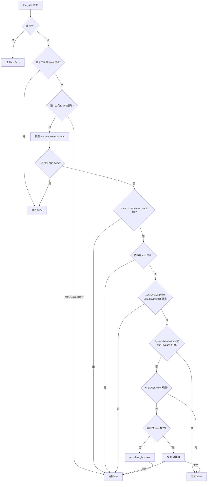
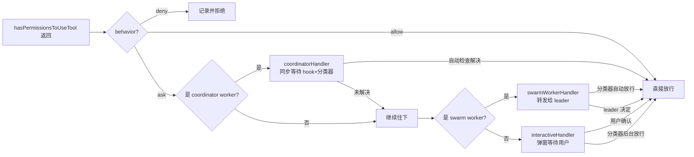

# Claude Code 权限系统：7 种权限模式与 AI 分类器

> PermissionMode、AI 安全分类器、denial tracking 与权限 UI 的源码级解读

上一篇分析了 Claude Code 的工具系统，看到每个 `tool_use` block 在执行前都会经过一道权限闸门。这一篇就把这道闸门彻底拆开：它如何在「每次都问」和「从不打扰」之间找到平衡点、AI 分类器在 auto 模式下扮演什么角色、denial tracking 如何让分类器学会沉默、以及权限决策如何通过 React 队列推到终端 UI。

整个权限系统的源码主要集中在三处：`src/utils/permissions/`（决策核心，~20 个文件）、`src/hooks/toolPermission/`（React 侧的处理器与上下文）、`src/hooks/useCanUseTool.tsx`（203 行的中央调度 hook）。三者构成一条从「模型要调工具」到「工具真正执行」的完整决策链。

## 一、为什么权限是 CC 的首要安全机制

Codex 走的是「沙箱优先」路线：所有写入操作默认在隔离的沙箱文件系统里进行，只有显式 opt-out 才接触真实环境。Claude Code 走的是另一条路——**没有强制的执行沙箱**，工具直接以当前用户的权限运行在真实文件系统上。

这意味着：

- `Bash` 工具执行的 `rm -rf /` 真的会删你的硬盘
- `FileWriteTool` 写入的文件就是磁盘上的真实文件
- `FileEditTool` 的 `old_string` / `new_string` 替换直接生效，没有 git stash 兜底

源码里确实存在一个 `SandboxManager`（在 `permissions.ts` 中可见 `SandboxManager.isSandboxingEnabled()` / `isAutoAllowBashIfSandboxedEnabled()`），但它是一个可选的、被 feature flag 控制的附加层，不是默认行为。CC 真正依赖的、唯一的安全边界，是**权限系统本身**。

这给权限系统带来了一个根本性的张力：

- 太严：每个工具调用都打断用户，agent 根本跑不起来
- 太松：放任 AI 执行破坏性操作，用户的代码库和数据随时可能被毁

CC 的解法是把「权限」拆成一个**多维度的决策空间**——模式（mode）、规则（rule）、分类器（classifier）、UI 交互（interactive handler）共同决定一次工具调用是 allow、ask 还是 deny。这四个维度不是简单的「与」关系，而是一个有优先级的短路链：deny 规则最先短路、bypass-immune 安全检查紧随其后、模式决定默认行为、分类器在 auto 模式下动态覆盖默认、UI 交互是最后的兜底。任何一个维度说 deny，整条链就 deny；但要让一个操作 allow，需要所有维度都不反对。这种「deny 优先、allow 需要共识」的设计，是 CC 在没有沙箱的情况下仍能保证安全的关键。下面逐层展开。

## 二、权限模式：4 种核心模式与若干内部态

权限模式的类型定义在 `src/types/permissions.ts:16-36`，分两层：

```typescript
export const EXTERNAL_PERMISSION_MODES = [
  'acceptEdits',
  'bypassPermissions',
  'default',
  'dontAsk',
  'plan',
] as const
export type ExternalPermissionMode = (typeof EXTERNAL_PERMISSION_MODES)[number]

export type InternalPermissionMode = ExternalPermissionMode | 'auto' | 'bubble'
export type PermissionMode = InternalPermissionMode
```

外部用户可见的有 5 种模式，加上 2 个仅内部使用的 `auto` 和 `bubble`，共 7 种。但用户日常交互的核心其实是 4 种：`default`、`plan`、`bypassPermissions`，以及 `auto`（AI 分类器模式，由 `TRANSCRIPT_CLASSIFIER` feature flag 控制，目前只在 ant 内部可用）。另外两种 `acceptEdits`（自动接受文件编辑，但 Bash 仍要问）和 `dontAsk`（更激进的「不再询问」）是更细粒度的中间态。

### 2.1 各模式的语义

`src/utils/permissions/PermissionMode.ts:42-91` 给每个模式配了标题、短标题、符号、颜色，是 UI 展示用的元数据：

```typescript
const PERMISSION_MODE_CONFIG: Partial<Record<PermissionMode, PermissionModeConfig>> = {
  default:           { title: 'Default',           symbol: '',      color: 'text',         external: 'default' },
  plan:              { title: 'Plan Mode',         symbol: PAUSE_ICON, color: 'planMode',  external: 'plan' },
  acceptEdits:       { title: 'Accept edits',       symbol: '⏵⏵',    color: 'autoAccept',  external: 'acceptEdits' },
  bypassPermissions: { title: 'Bypass Permissions', symbol: '⏵⏵',  color: 'error',       external: 'bypassPermissions' },
  dontAsk:           { title: "Don't Ask",         symbol: '⏵⏵',    color: 'error',       external: 'dontAsk' },
  ...(feature('TRANSCRIPT_CLASSIFIER') ? {
    auto: { title: 'Auto mode', shortTitle: 'Auto', symbol: '⏵⏵', color: 'warning', external: 'default' },
  } : {}),
}
```

注意 `auto` 模式的 `external: 'default'`：对 SDK 消费者或外部观察者来说，auto 模式对外表现为 default。这是个有意的隐藏——外部不应感知「这是 AI 在自动决策」还是「这是用户在手动确认」。

四种核心模式的实际行为差异如下：

| 模式 | 行为 | 适用场景 | 安全等级 |
|------|------|---------|---------|
| `default` | 每个工具调用都问用户 | 谨慎交互、初次试用 | 最高 |
| `plan` | 只读，所有写操作被拒绝 | 让 AI 先规划再执行 | 高 |
| `auto` | AI 分类器判断，安全放行、危险询问 | 长时间自主任务 | 中 |
| `bypassPermissions` | 不做任何权限检查 | 受信任的批量重构 | 最低 |

### 2.2 Shift+Tab 循环逻辑

模式之间通过 Shift+Tab 循环切换，逻辑在 `src/utils/permissions/getNextPermissionMode.ts:34-79`。最值得注意的是 ant 内部用户和外部用户的循环路径不同：

```typescript
case 'default':
  if (process.env.USER_TYPE === 'ant') {
    if (toolPermissionContext.isBypassPermissionsModeAvailable) {
      return 'bypassPermissions'
    }
    if (canCycleToAuto(toolPermissionContext)) {
      return 'auto'
    }
    return 'default'
  }
  return 'acceptEdits'

case 'acceptEdits':
  return 'plan'

case 'plan':
  if (toolPermissionContext.isBypassPermissionsModeAvailable) {
    return 'bypassPermissions'
  }
  if (canCycleToAuto(toolPermissionContext)) {
    return 'auto'
  }
  return 'default'
```

外部用户的循环是 `default → acceptEdits → plan → bypassPermissions → default`；ant 内部用户跳过 `acceptEdits` 和 `plan`，直接在 `default / bypassPermissions / auto` 之间循环——因为 ant 用户更倾向于让 auto 分类器接管，而不是用 acceptEdits 这种粗暴的「全接受编辑」。

`canCycleToAuto` 同时检查缓存的 `isAutoModeAvailable` 和实时的 `isAutoModeGateEnabled()`：

```typescript
function canCycleToAuto(ctx: ToolPermissionContext): boolean {
  if (feature('TRANSCRIPT_CLASSIFIER')) {
    const gateEnabled = isAutoModeGateEnabled()
    const can = !!ctx.isAutoModeAvailable && gateEnabled
    if (!can) {
      logForDebugging(
        `[auto-mode] canCycleToAuto=false: ctx.isAutoModeAvailable=${ctx.isAutoModeAvailable} isAutoModeGateEnabled=${gateEnabled} reason=${getAutoModeUnavailableReason()}`,
      )
    }
    return can
  }
  return false
}
```

两个检查可能不一致——`isAutoModeAvailable` 是启动时 `verifyAutoModeGateAccess` 设置的缓存值，而 `isAutoModeGateEnabled()` 是实时查询，会感知到 GrowthBook 在会话中途把 `tengu_auto_mode_config.enabled` 改成 `'disabled'` 的情况。实时检查的目的是防止 `transitionPermissionMode` 抛异常，那个异常会让 Shift+Tab 处理器静默崩溃，用户卡在当前模式无法切换。

### 2.3 auto 模式的「断路器」

`src/utils/permissions/autoModeState.ts` 是一个仅 39 行的小模块，维护 auto 模式的三个布尔态：

```typescript
let autoModeActive = false
let autoModeFlagCli = false
let autoModeCircuitBroken = false
```

`autoModeCircuitBroken` 是断路器：当异步的 `verifyAutoModeGateAccess` 检测到 GrowthBook 把 auto 模式禁用，就把它置为 true，此后 `isAutoModeGateEnabled()` 永远返回 false。即使后续 GrowthBook 又把开关打开，当前会话也不会重新启用——用户必须重启 CC。这是一个「fail-closed」设计：宁可让用户手动重新激活，也不冒险让一个被远程关闭过的权限模式悄悄恢复。

## 三、权限决策流程

完整的权限决策入口是 `src/utils/permissions/permissions.ts` 中的 `hasPermissionsToUseTool`（外层封装）和 `hasPermissionsToUseToolInner`（1158 行）。决策按以下顺序短路返回：



这个流程图把决策顺序压缩成了几个关键分叉点，但源码里有几处容易被忽略的细节。

### 3.1 bypass-immune 的安全检查

第 1g 步的 `safetyCheck` 是流程图里最容易被低估的一环。它在 `permissions.ts:1144-1152` 和 `1252-1260` 出现两次，分别在外层和内层决策中。它的判定来自工具的 `checkPermissions` 返回的 `decisionReason.type === 'safetyCheck'`，覆盖的路径包括：

- `.git/` 目录下的文件
- `.claude/` 配置目录
- `.vscode/` 等 IDE 配置
- shell 配置文件（`.bashrc` / `.zshrc` / `config.fish` 等）

这些路径即使在 `bypassPermissions` 模式下也**必须询问用户**。注释明确写道：「Safety checks are bypass-immune — they must prompt even when a PreToolUse hook returned allow」。这是 CC 给「绝对不能让 AI 偷偷改的东西」划的硬红线：哪怕用户开了 bypass，哪怕 PreToolUse hook 返回了 allow，只要工具操作的是这些敏感路径，就必须弹窗。

### 3.2 内容级 ask 规则同样 bypass-immune

第 1f 步处理另一种 bypass-immune 情况：用户在配置里写了一条内容相关的 ask 规则，例如 `Bash(npm publish:*)`——意思是「npm publish 这种命令永远要问我」。这类规则即使在 bypass 模式下也必须遵守。源码注释解释了原因：「When a user explicitly configures a content-specific ask rule, the tool's checkPermissions returns `{behavior:'ask', decisionReason:{type:'rule', rule:{ruleBehavior:'ask'}}}`. This must be respected even in bypass mode, just as deny rules are respected at step 1d.」

换句话说，bypass 模式并不是「无脑放行一切」，而是「跳过那些没有显式规则的默认询问」。用户用规则表达过的意图，永远优先于模式。

### 3.3 plan 模式的特殊处理

`plan` 模式在 `hasPermissionsToUseToolInner` 中没有专门的分支——它依赖工具自身的 `isReadOnly(input)` 和 `checkPermissions` 来判定。当一个工具的 `checkPermissions` 在 plan 模式下发现自己是写操作，会返回 `{behavior: 'deny', ...}` 或 `{behavior: 'ask', ...}`。读工具（`FileReadTool`、`GrepTool`、`GlobTool`）则返回 allow。

但有个有趣的分支：

```typescript
const shouldBypassPermissions =
  appState.toolPermissionContext.mode === 'bypassPermissions' ||
  (appState.toolPermissionContext.mode === 'plan' &&
    appState.toolPermissionContext.isBypassPermissionsModeAvailable)
if (shouldBypassPermissions) {
  return { behavior: 'allow', ... }
}
```

当用户原本是 bypass 模式、临时切到 plan 看一眼、然后再切回来时，plan 模式会表现得像 bypass——因为 `isBypassPermissionsModeAvailable` 标记了「用户本来是想 bypass 的，plan 只是临时看一眼」。这是一个 UX 上的微妙妥协：避免用户在 plan 和 bypass 之间切换时被反复打断。

## 四、AI 分类器：auto 模式的核心创新

auto 模式是 CC 权限系统最有想象力的一部分。它的核心思想是：**用一个小模型来判断当前工具调用的风险等级**，安全的放行，危险的再问用户。这把「是否打扰用户」从一个静态规则问题，变成了一个动态的、上下文相关的判断问题。

分类器的实现在 `src/utils/permissions/yoloClassifier.ts`（约 1500 行），入口函数是 `classifyYoloAction`。文件名里的「yolo」是 You Only Live Once 的缩写——这个名字本身就透露了设计者的幽默感：让 AI 替你做决定，赌一把。

### 4.1 分类器的输入构造

分类器不是简单地看「工具名 + 参数」，而是构造一个**完整的会话 transcript**。`buildTranscriptEntries` 函数（302-360 行）把消息历史转换成精简的对话记录：

```typescript
export function buildTranscriptEntries(messages: Message[]): TranscriptEntry[] {
  const transcript: TranscriptEntry[] = []
  for (const msg of messages) {
    if (msg.type === 'attachment' && msg.attachment.type === 'queued_command') {
      // 排队的用户命令也作为 user turn
    } else if (msg.type === 'user') {
      // 只取 text block
    } else if (msg.type === 'assistant') {
      // 只取 tool_use block，丢弃 assistant text
    }
  }
  return transcript
}
```

一个关键的细节：assistant 的 **text block 被完全丢弃**，只保留 `tool_use` block。源码注释解释了原因：

> Only include tool_use blocks — assistant text is model-authored and could be crafted to influence the classifier's decision.

这是一个对抗性考虑：如果分类器读到 assistant 的推理文本，模型可以通过精心构造的文字来「说服」分类器放行。只保留结构化的 tool_use 调用，把模型的「自我辩护」排除在外，让分类器只看「实际做了什么」。

每个 tool_use block 通过 `toAutoClassifierInput` 投影成精简输入。这是 Tool 接口上的一个方法（见系列第 3 篇）：

```typescript
toAutoClassifierInput(input: z.infer<Input>): unknown
```

每个工具自己决定「分类器需要看到我的哪些字段」。例如 `BashTool` 可能只投影命令字符串，`FileWriteTool` 可能只投影文件路径加上内容的前若干字符。如果某个工具返回空字符串，分类器直接判定为「无安全相关性」，立即 allow：

```typescript
if (actionCompact === '') {
  return {
    shouldBlock: false,
    reason: 'Tool declares no classifier-relevant input',
    model: getClassifierModel(),
  }
}
```

### 4.2 系统提示的组装

分类器的系统提示由 `buildYoloSystemPrompt`（484-540 行）组装，包含三部分：

1. **基础提示**（`BASE_PROMPT`）：从 `yolo-classifier-prompts/auto_mode_system_prompt.txt` 加载，定义分类任务和输出格式
2. **权限模板**：分外部用户（`permissions_external.txt`）和 ant 内部（`permissions_anthropic.txt`）两套，ant 模板更详细
3. **用户自定义规则**：从 `settings.autoMode` 读取，覆盖模板默认值

权限模板用 `<user_allow_rules_to_replace>...</user_allow_rules_to_replace>` 这种 XML 标签包裹默认规则。外部模板的语义是「用户规则替换默认」，ant 模板的语义是「用户规则追加到默认」。`buildYoloSystemPrompt` 用三个正则替换分别处理 allow / soft_deny / environment 三个 section。

`bashClassifier.ts` 还会在 `BASH_CLASSIFIER` feature flag 开启时往 allow / deny 列表里追加 Bash 前缀规则的描述，让分类器能理解 `Bash(git:*)` 这种配置的语义。

### 4.3 两阶段 XML 分类器

`classifyYoloActionXml`（711-996 行）是分类器的核心，支持三种模式：

- `'both'`（默认）：先跑 stage 1（fast），如果 allow 直接返回；如果 block，升级到 stage 2（thinking）做二次确认
- `'fast'`：只跑 stage 1，结果即终
- `'thinking'`：跳过 stage 1，直接跑 stage 2

两阶段的目的是降低误报率。stage 1 用 `max_tokens=64` + `stop_sequences=['</block>']` 快速给出 yes/no；如果 stage 1 说要 block，再跑 stage 2 用 4096 tokens 做完整推理。stage 2 的 suffix 明确要求模型「Review the classification process and follow it carefully, making sure you deny actions that should be blocked」。

stage 1 的 suffix 则是「Err on the side of blocking. `<block>` immediately.」——偏向保守，宁可错杀。两阶段的设计哲学是：**对放行宽容（stage 1 allow 就放），对阻止严格（stage 1 block 还要 stage 2 复核）**。

这种「宽放严收」的哲学背后是一个关键的工程权衡。如果 stage 1 误判为 allow，用户顶多被打扰一次（stage 2 还能纠正）；但如果 stage 1 误判为 block，用户会被打断一次，然后还要等 stage 2 复核。所以 stage 1 偏向 block 是「宁可慢一点也别放错」，stage 2 偏向 allow 是「确认过了就大胆放」。两个阶段各自的偏向互相抵消，最终达到一个既不太打扰用户、又不太危险的平衡点。

两阶段共享同一个 system prompt 和 transcript，享受 prompt cache（1 小时 TTL）。stage 2 在 action block 上设置了 `cache_control`，保证 stage 2 能命中 stage 1 的完整前缀缓存。源码注释明确计算了 cache budget：「Budget: system (1) + CLAUDE.md (0–1) + action (1) = 2–3, under the API limit of 4 cache_control blocks」。这个 budget 计算很重要——超过 4 个 cache_control block API 会返回 400，所以系统提示、CLAUDE.md、action 三处的 cache_control 加起来不能超限。

### 4.3.1 thinking 配置的模型差异

`getClassifierThinkingConfig` 函数（683-693 行）处理一个容易被忽略的兼容性问题：

```typescript
function getClassifierThinkingConfig(model: string): [false | undefined, number] {
  if (process.env.USER_TYPE === 'ant' && resolveAntModel(model)?.alwaysOnThinking) {
    return [undefined, 2048]
  }
  return [false, 0]
}
```

大多数模型可以直接用 `thinking: false` 禁用 thinking，让分类器只返回短文本。但有些 ant 内部模型（通过 `tengu_ant_model_override` 声明 `alwaysOnThinking`）默认开启 adaptive thinking，发送 `{ type: 'disabled' }` 会被 API 用 400 拒绝。对这类模型，处理方式是不传 `thinking` 参数，同时把 `max_tokens` 加上 2048 的 padding（`thinkingPadding`），避免 adaptive thinking 消耗掉 token 预算导致 `<block>` 标签还没输出就触发 `stop_reason=max_tokens`。源码注释引用了一次真实的 replay 数据：「observed 0–1114 tokens replaying go/ccshare/shawnm-20260310-202833」——adaptive thinking 实际消耗 0 到 1114 个 token，2048 的 padding 是基于这个观察留出的余量。

### 4.4 失败模式与 fail-closed

分类器对所有失败情况都采用 **fail-closed** 策略——失败时默认阻止：

```typescript
if (stage2Block === null) {
  return {
    shouldBlock: true,
    reason: 'Classifier stage 2 unparseable - blocking for safety',
    ...
  }
}
```

具体失败模式有五种，对应 `AutoModeOutcome` 类型：

```typescript
type AutoModeOutcome =
  | 'success'
  | 'parse_failure'  // 模型返回无法解析
  | 'interrupted'    // 用户中断
  | 'error'          // API 错误
  | 'transcript_too_long'  // 上下文超限
```

`transcript_too_long` 是一个特别值得注意的情况。分类器的 transcript 是从主循环的消息历史投影来的，但投影后可能比主循环上下文还大（因为主循环有 auto-compact，分类器没有）。源码里有一个 `dumpErrorPrompts` 函数（213-250 行），在 transcript 超限时把 system prompt、user prompt、context 比较信息全部 dump 到 `~/.claude/temp/auto-mode-classifier-errors/{sessionId}.txt`，方便通过 `/share` 命令收集给开发者排查。

这个「投影发散」（projection divergence）问题是 auto 模式最棘手的工程挑战之一。`classifyYoloAction` 在每次调用时都会计算两个数字用于遥测：

```typescript
const classifierChars = systemPrompt.length + userPrompt.length
const classifierTokensEst = Math.round(classifierChars / 4)
const mainLoopTokens = tokenCountWithEstimation(messages)
```

`tokenCountWithEstimation` 是一个廉价函数，它回溯到最近一次 API response 的 usage 数据，加上对尾部 slice 的估算。这两个数字的比例（`classifierTokensEst / mainLoopTokens`）被记录到 Datadog。源码注释给出了监控预期：「Expect ~0.6-0.8 steady state; alert on p95 > 1.0 (means classifier is bigger than main loop — auto-compact won't save us)」。当分类器的 token 数超过主循环时，auto-compact 机制无法拯救分类器——因为 auto-compact 只压缩主循环上下文，分类器的 transcript 是独立投影的。一旦比例超过 1.0，分类器会先于主循环触发 context overflow。

`transcriptTooLong` 字段在 `YoloClassifierResult` 上标记这种情况，调用方据此决定回退策略。源码注释明确说：「These are deterministic (same transcript → same error), so retrying won't help」——同一个 transcript 一定会再次超限，所以不要重试，直接回退到普通弹窗。

### 4.5 acceptEdits 快路径

auto 模式有一个有趣的优化：在跑分类器之前，先模拟一次 `acceptEdits` 模式的检查（`permissions.ts:605-648`）：

```typescript
const acceptEditsResult = await tool.checkPermissions(parsedInput, {
  ...context,
  getAppState: () => ({
    ...state,
    toolPermissionContext: { ...state.toolPermissionContext, mode: 'acceptEdits' as const },
  }),
})
if (acceptEditsResult.behavior === 'allow') {
  logForDebugging(`Skipping auto mode classifier for ${tool.name}: would be allowed in acceptEdits mode`)
  return { behavior: 'allow', updatedInput: acceptEditsResult.updatedInput ?? input, ... }
}
```

如果连 acceptEdits 模式（自动接受工作目录内的编辑）都会允许这个操作，那就没必要再花一次 API 调用让分类器确认了——直接放行。这把分类器的调用成本省在了「明显安全的操作」上，只在 acceptEdits 也会询问的场景（例如 Bash 命令、关键路径文件写入）才真正调用分类器。

但有两个工具被显式排除在这个快路径之外：

```typescript
if (
  result.behavior === 'ask' &&
  tool.name !== AGENT_TOOL_NAME &&
  tool.name !== REPL_TOOL_NAME
) { ... }
```

`AgentTool` 和 `REPL_TOOL_NAME` 即使在 acceptEdits 下也返回 allow，但它们的内部可能包含 VM 逃逸路径——子 agent 调用的工具、REPL 里嵌入的 JavaScript 代码。分类器必须看到这些「粘合代码」的内容，不能被 acceptEdits 的宽放策略绕过。

## 五、PermissionContext：决策的上下文

`src/types/permissions.ts:427-441` 定义了权限决策的核心上下文：

```typescript
export type ToolPermissionContext = {
  readonly mode: PermissionMode
  readonly additionalWorkingDirectories: ReadonlyMap<string, AdditionalWorkingDirectory>
  readonly alwaysAllowRules: ToolPermissionRulesBySource
  readonly alwaysDenyRules: ToolPermissionRulesBySource
  readonly alwaysAskRules: ToolPermissionRulesBySource
  readonly isBypassPermissionsModeAvailable: boolean
  readonly strippedDangerousRules?: ToolPermissionRulesBySource
  readonly shouldAvoidPermissionPrompts?: boolean
  readonly awaitAutomatedChecksBeforeDialog?: boolean
  readonly prePlanMode?: PermissionMode
}
```

几个字段值得展开：

- `alwaysAllowRules` / `alwaysDenyRules` / `alwaysAskRules` 按 `PermissionRuleSource` 分桶。source 有 8 种：`userSettings` / `projectSettings` / `localSettings` / `flagSettings` / `policySettings` / `cliArg` / `command` / `session`。这种分桶让权限规则有**优先级**：policy 永远覆盖 user，session 是临时的（用户在当前会话里选了「always allow」就加到 session 桶）

这 8 种 source 的优先级关系不是简单的「后写覆盖先写」，而是有严格的层级。`policySettings` 是企业策略，优先级最高，用户无法覆盖；`flagSettings` 是 feature flag 注入的规则，通常用于 A/B 测试新的安全策略；`userSettings` / `projectSettings` / `localSettings` 是用户可控的三档，分别对应全局、项目共享、项目本地（不进 git）；`cliArg` 是命令行参数传入的，进程级；`command` 是 `/permissions` 命令运行时添加的；`session` 是用户在权限弹窗里选「don't ask again」时添加的临时规则。

在 `hasPermissionsToUseToolInner` 的决策链里，deny 规则在所有 source 上都会被检查——任何一个 source 有 deny，就立即 deny。但 allow 规则只在「没有 deny、没有 ask 规则、mode 允许」的情况下才生效。这种「deny 一票否决、allow 需要全员不反对」的设计，让高优先级 source（如 policy）可以通过 deny 阻止低优先级 source（如 session）的 allow，但反过来不行。

- `additionalWorkingDirectories` 是一个 `ReadonlyMap`，记录用户授权过的额外工作目录。CC 默认只能在启动目录及其子目录下操作，这个字段是逃生口
- `isBypassPermissionsModeAvailable` 标记用户是否真的能切到 bypass 模式。某些环境（例如 policy 强制不允许 bypass）会把这个设为 false
- `strippedDangerousRules` 是 auto 模式专用的：当用户切到 auto 时，系统会把「危险的 allow 规则」（如 `Bash(python:*)`、`Bash(sudo:*)`）从 context 中剥离，避免分类器被宽放规则绕过
- `shouldAvoidPermissionPrompts` 用于异步 agent 上下文——agent 在后台跑时没法弹窗，必须用更严格的策略
- `awaitAutomatedChecksBeforeDialog` 控制 coordinator worker 的行为：是先等所有自动检查（hook + 分类器）完成再决定要不要弹窗，还是边弹窗边跑检查
- `prePlanMode` 记录用户切到 plan 之前的模式，方便切回去

### 5.1 PermissionResult 与四种 behavior

权限决策的输出类型是 `PermissionResult`，在 `src/types/permissions.ts:251-266`：

```typescript
export type PermissionResult<Input> =
  | PermissionDecision<Input>           // allow / ask / deny
  | { behavior: 'passthrough'; message: string; ... }
```

`PermissionDecision` 是三种确定行为的并集，加上 `passthrough` 共四种 behavior：

- `allow`：直接执行，`updatedInput` 可以修改输入（例如 Bash 工具的 `prefix` 被规范化）
- `deny`：拒绝执行，`message` 解释原因
- `ask`：需要用户确认，`message` 是给用户看的提示
- `passthrough`：工具自身没有意见，交给上层规则决定。在 `hasPermissionsToUseToolInner` 的最后会被转换成 `ask`

`ask` 决策里有个特殊的 `pendingClassifierCheck` 字段：

```typescript
export type PermissionAskDecision<Input> = {
  behavior: 'ask'
  message: string
  ...
  pendingClassifierCheck?: PendingClassifierCheck
}
```

这个字段让「弹窗」和「后台分类器检查」可以并行——UI 弹出来的同时，分类器在后台异步跑，如果分类器判定 allow，就自动关闭弹窗。这就是「speculative classifier check」机制，下一节会展开。

### 5.2 PermissionDecisionReason：决策的可解释性

每个决策都附带一个 `decisionReason`，在 `permissions.ts:271-324` 定义了 11 种 reason 类型：

```typescript
export type PermissionDecisionReason =
  | { type: 'rule'; rule: PermissionRule }
  | { type: 'mode'; mode: PermissionMode }
  | { type: 'subcommandResults'; reasons: Map<string, PermissionResult> }
  | { type: 'permissionPromptTool'; ... }
  | { type: 'hook'; hookName: string; hookSource?: string; reason?: string }
  | { type: 'asyncAgent'; reason: string }
  | { type: 'sandboxOverride'; reason: 'excludedCommand' | 'dangerouslyDisableSandbox' }
  | { type: 'classifier'; classifier: string; reason: string }
  | { type: 'workingDir'; reason: string }
  | { type: 'safetyCheck'; reason: string; classifierApprovable: boolean }
  | { type: 'other'; reason: string }
```

这个 reason 不只是给日志看——它直接影响后续行为。例如 `safetyCheck` 有一个 `classifierApprovable` 布尔：

```typescript
| { type: 'safetyCheck'; reason: string; classifierApprovable: boolean }
```

源码注释解释了它的语义：

> When true, auto mode lets the classifier evaluate this instead of forcing a prompt. True for sensitive-file paths (.claude/, .git/, shell configs) — the classifier can see context and decide. False for Windows path bypass attempts and cross-machine bridge messages.

同样是 safetyCheck，`.git/` 目录下的操作可以让分类器决定（因为分类器能看到完整上下文），但跨机器 bridge 消息必须强制询问（因为分类器无法判断另一台机器的状态）。这种细粒度的「是否信任分类器」决策，全部编码在 `decisionReason` 里。

## 六、Denial Tracking：让分类器学会沉默

`src/utils/permissions/denialTracking.ts` 是个只有 45 行的小文件，但它解决了一个看似简单实则关键的问题：**当用户连续拒绝类似的工具调用时，分类器应该停止尝试**。

```typescript
export type DenialTrackingState = {
  consecutiveDenials: number
  totalDenials: number
}

export const DENIAL_LIMITS = {
  maxConsecutive: 3,
  maxTotal: 20,
} as const
```

两个计数器，两个阈值：

- `consecutiveDenials`：连续拒绝次数。达到 3 次后，分类器停止自动放行，强制每次都问用户
- `totalDenials`：会话内累计拒绝次数。达到 20 次后，分类器整个会话不再生效

`recordDenial` / `recordSuccess` / `shouldFallbackToPrompting` 三个函数操作这个状态：

```typescript
export function recordDenial(state: DenialTrackingState): DenialTrackingState {
  return {
    ...state,
    consecutiveDenials: state.consecutiveDenials + 1,
    totalDenials: state.totalDenials + 1,
  }
}

export function recordSuccess(state: DenialTrackingState): DenialTrackingState {
  if (state.consecutiveDenials === 0) return state
  return { ...state, consecutiveDenials: 0 }
}

export function shouldFallbackToPrompting(state: DenialTrackingState): boolean {
  return (
    state.consecutiveDenials >= DENIAL_LIMITS.maxConsecutive ||
    state.totalDenials >= DENIAL_LIMITS.maxTotal
  )
}
```

注意 `recordSuccess` 只重置 `consecutiveDenials`，不重置 `totalDenials`。这个设计是有意的：连续拒绝说明「这一类操作我不希望 AI 自动做」，应该立即停止自动放行；累计拒绝说明「用户对 auto 模式整体不满意」，应该让分类器在整个会话里都退到「只问不放」的保守模式。

### 6.1 denial 在 UI 上的反馈

`useCanUseTool.tsx:77-89` 里能看到，当分类器决策被覆盖（用户拒绝了分类器判定 allow 的操作）时，UI 会推一条通知：

```typescript
if (feature("TRANSCRIPT_CLASSIFIER") && result.decisionReason?.type === "classifier" && result.decisionReason.classifier === "auto-mode") {
  recordAutoModeDenial({
    toolName: tool.name,
    display: description,
    reason: result.decisionReason.reason ?? "",
    timestamp: Date.now()
  })
  toolUseContext.addNotification?.({
    key: "auto-mode-denied",
    priority: "immediate",
    jsx: <><Text color="error">{tool.userFacingName(input).toLowerCase()} denied by auto mode</Text><Text dimColor={true}> · /permissions</Text></>
  })
}
```

「denied by auto mode」这条提示告诉用户：是分类器判定要 block 的，不是用户主动拒绝。同时调用 `recordAutoModeDenials`（不同于 `denialTracking.ts`，是另一个模块）记录被分类器阻止的具体操作。这是给用户一个「我可以看到 AI 替我做了什么决定」的透明度——auto 模式不是黑箱，每一次阻止都有记录。

### 6.2 dangerousPatterns：进入 auto 模式时的清理

`src/utils/permissions/dangerousPatterns.ts` 定义了一组「危险的 Bash 前缀规则」：

```typescript
export const DANGEROUS_BASH_PATTERNS: readonly string[] = [
  ...CROSS_PLATFORM_CODE_EXEC,
  'zsh', 'fish', 'eval', 'exec', 'env', 'xargs', 'sudo',
  ...(process.env.USER_TYPE === 'ant'
    ? ['fa run', 'coo', 'gh', 'gh api', 'curl', 'wget', 'git', 'kubectl', 'aws', 'gcloud', 'gsutil']
    : []),
]
```

`CROSS_PLATFORM_CODE_EXEC` 包含 `python` / `node` / `npx` / `bunx` / `npm run` / `bash` / `sh` / `ssh` 等所有「可以执行任意代码」的入口。

这些 pattern 在 `permissionSetup.ts` 的 `isDangerousBashPermission` 中被用来匹配用户的 allow 规则。当用户切到 auto 模式时，所有匹配这些 pattern 的 allow 规则（如 `Bash(python:*)`、`Bash(npm run:*)`）会被从 `ToolPermissionContext` 中剥离，存到 `strippedDangerousRules` 字段。剥离的目的是：**避免用户先前配置的宽放规则绕过 auto 模式的分类器**。用户切回 default 模式时，这些规则会被恢复。

## 七、权限处理器：三种分发路径

`useCanUseTool.tsx` 是权限系统的中央调度 hook。它的核心逻辑只有 60 行左右，但根据 `result.behavior` 的不同，分发到三个不同的处理器：



### 7.1 coordinatorHandler：协作模式下的串行检查

`src/hooks/toolPermission/handlers/coordinatorHandler.ts` 只有 65 行，处理 coordinator worker 的权限请求。它的特点是**串行等待所有自动检查完成**，不像主 agent 那样并行 race：

```typescript
async function handleCoordinatorPermission(params): Promise<PermissionDecision | null> {
  // 1. 先跑 hook（快、本地）
  const hookResult = await ctx.runHooks(permissionMode, suggestions, updatedInput)
  if (hookResult) return hookResult

  // 2. 再跑分类器（慢、推理——仅 bash）
  const classifierResult = feature('BASH_CLASSIFIER')
    ? await ctx.tryClassifier?.(params.pendingClassifierCheck, updatedInput)
    : null
  if (classifierResult) return classifierResult

  // 3. 都没解决 → 返回 null，让调用方 fall through 到弹窗
  return null
}
```

注释明确说明：「For coordinator workers, automated checks (hooks and classifier) are awaited sequentially before falling through to the interactive dialog」。这种串行设计是因为 coordinator 没有交互式 UI 可用，必须先穷尽所有自动检查，最后才退到主 agent 的对话框。

### 7.2 swarmWorkerHandler：转发给 leader

`src/hooks/toolPermission/handlers/swarmWorkerHandler.ts`（159 行）处理 swarm worker 的情况。swarm worker 是没有用户交互能力的子 agent，它的权限请求必须转发给 leader agent：

```typescript
async function handleSwarmWorkerPermission(params): Promise<PermissionDecision | null> {
  if (!isAgentSwarmsEnabled() || !isSwarmWorker()) {
    return null
  }

  // 先尝试分类器自动放行
  const classifierResult = feature('BASH_CLASSIFIER')
    ? await ctx.tryClassifier?.(params.pendingClassifierCheck, updatedInput)
    : null
  if (classifierResult) return classifierResult

  // 转发给 leader
  const request = createPermissionRequest({ ... })
  registerPermissionCallback({
    requestId: request.id,
    toolUseId: ctx.toolUseID,
    async onAllow(...) { ... },
    onReject(...) { ... },
  })
  void sendPermissionRequestViaMailbox(request)

  // 设置等待指示器
  ctx.toolUseContext.setAppState(prev => ({
    ...prev,
    pendingWorkerRequest: { toolName: ctx.tool.name, toolUseId: ctx.toolUseID, description },
  }))
}
```

关键设计：**先尝试分类器自动放行，不行再转发给 leader**。这样能减少 leader 的打扰次数——swarm worker 自己能判断的操作不打扰 leader，只有真正需要人类判断的才转发。

转发通过 mailbox 机制（`sendPermissionRequestViaMailbox`），leader 端的 `useSwarmPermissionPoller` 轮询邮箱，拿到请求后走自己的 `useCanUseTool` 流程，再把结果通过 `onAllow` / `onReject` 回调传回 worker。

### 7.3 interactiveHandler：主 agent 的多路 race

`src/hooks/toolPermission/handlers/interactiveHandler.ts`（536 行）是最复杂的处理器，因为主 agent 的对话框需要同时支持：本地键盘输入、bridge 远程响应（claude.ai 网页端）、channel 中继（Telegram/iMessage 等）、hook 自动决策、分类器自动放行。这五条路径**同时 race**，谁先响应谁赢。

这五条路径并非对等。本地键盘是默认路径，UI 上可见；bridge 和 channel 是远程路径，通过 MCP 通知机制把请求推到用户的手机或网页；hook 和分类器是自动路径，不需要用户介入。当用户在手机上点「allow」时，本地对话框需要立即关闭；反之，如果用户在终端先按了回车，手机上那条 pending 请求也要被取消。这种双向同步靠 `createResolveOnce` 的 `claim()` 机制保证一致性。

race 的同步原语是 `createResolveOnce`：

```typescript
function createResolveOnce<T>(resolve: (value: T) => void): ResolveOnce<T> {
  let claimed = false
  let delivered = false
  return {
    resolve(value: T) {
      if (delivered) return
      delivered = true
      claimed = true
      resolve(value)
    },
    isResolved() { return claimed },
    claim() {
      if (claimed) return false
      claimed = true
      return true
    },
  }
}
```

`claim()` 是一个原子化的「check-and-mark」操作：调用方在 `await` 之前先 `claim()`，如果返回 false 说明有人已经赢了，直接 return。这关闭了 `isResolved()` 检查和 `resolve()` 调用之间的竞态窗口。源码注释特别强调：「Use this in async callbacks BEFORE awaiting, to close the window between the `isResolved()` check and the actual `resolve()` call」。

### 7.3.1 bridge 远程响应

当 CC 通过 bridge 连接到 claude.ai 网页端时，权限请求会被同时推送到网页端。bridge 模块用 `bridgeCallbacks.sendRequest` 把请求发出去，然后用 `bridgeCallbacks.onResponse` 订阅响应：

```typescript
bridgeCallbacks.sendRequest(bridgeRequestId, ctx.tool.name, displayInput, ctx.toolUseID, description, result.suggestions, result.blockedPath)
const unsubscribe = bridgeCallbacks.onResponse(bridgeRequestId, response => {
  if (!claim()) return  // 本地用户/hook/分类器已经响应
  ...
  if (response.behavior === 'allow') {
    if (response.updatedPermissions?.length) {
      void ctx.persistPermissions(response.updatedPermissions)
    }
    resolveOnce(ctx.buildAllow(response.updatedInput ?? displayInput))
  } else {
    resolveOnce(ctx.cancelAndAbort(response.message))
  }
})
```

源码注释提到一个有趣的细节：「All tools are forwarded — CCR's generic allow/deny modal handles any tool, and can return `updatedInput` when it has a dedicated renderer (e.g. plan edit)」。网页端有一个通用的 allow/deny 弹窗，能处理任何工具。对于某些有专用渲染器的工具（如 plan edit），网页端还能返回 `updatedInput`——用户在网页上修改了工具参数后，修改后的值会传回终端。这种「远程编辑参数」的能力让 bridge 不只是一个简单的 yes/no 通道，而是一个完整的远程审批界面。

### 7.3.2 channel 中继

channel 是另一个远程路径，通过 MCP server 把权限请求推送到 Telegram、iMessage、Discord 等即时通讯平台。和 bridge 不同，channel 只支持纯 yes/no，不支持 `updatedInput`：

```typescript
if (
  (feature('KAIROS') || feature('KAIROS_CHANNELS')) &&
  channelCallbacks &&
  !ctx.tool.requiresUserInteraction?.()
) {
  // ... 发送 CHANNEL_PERMISSION_REQUEST_METHOD 通知到每个 channel client
}
```

源码注释解释了一个看起来像 dead code 的 guard：「Unlike the bridge block, this still guards on `requiresUserInteraction` — channel replies are pure yes/no with no `updatedInput` path. In practice the guard is dead code today: all three `requiresUserInteraction` tools (ExitPlanMode, AskUserQuestion, ReviewArtifact) return `isEnabled()===false` when channels are configured, so they never reach this handler」。这个 guard 是防御性的——虽然现在没有工具能走到这里，但万一未来有工具同时声明 `requiresUserInteraction` 又没在 channel 模式下禁用，这个 guard 会阻止它走 channel 路径（因为 channel 无法传递 `updatedInput`）。

一个精妙的设计是「yes abc123」的拦截。用户在 Telegram 上回复「yes abc123」时，这条消息会被 `useManageMCPConnections.ts` 的 notification handler 在 enqueue 之前拦截，不会进入 Claude 的对话历史。`abc123` 是 `shortRequestId(ctx.toolUseID)` 生成的短 ID，用来匹配对应的 pending 请求。源码注释明确说明了这个设计：「The inbound "yes abc123" is intercepted in the notification handler BEFORE enqueue, so it never reaches Claude as a conversation turn」。如果用户回复的 ID 已经过期（对应请求已经被本地或 bridge 解决），`tryConsumeReply` 会失败，这条消息会被当作普通聊天入队。

### 7.4 speculative classifier check

Bash 工具有一个特别的优化：**speculative classifier check**。当用户在键盘上输入命令时，CC 已经在后台启动分类器检查这条命令。如果用户按下回车确认执行时，分类器已经跑完了，可以直接用结果，不需要再等：

```typescript
if (feature("BASH_CLASSIFIER") && result.pendingClassifierCheck && tool.name === BASH_TOOL_NAME && !appState.toolPermissionContext.awaitAutomatedChecksBeforeDialog) {
  const speculativePromise = peekSpeculativeClassifierCheck((input as { command: string }).command)
  if (speculativePromise) {
    const raceResult = await Promise.race([speculativePromise.then(_temp), new Promise(_temp2)])
    if (raceResult.type === "result" && raceResult.result.matches && raceResult.result.confidence === "high") {
      consumeSpeculativeClassifierCheck((input as { command: string }).command)
      ...
      resolve(ctx.buildAllow(result.updatedInput ?? input, { decisionReason: { type: "classifier", classifier: "bash_allow", reason: `Allowed by prompt rule: "${raceResult.result.matchedDescription}"` } }))
      return
    }
  }
}
```

`Promise.race` 在分类器结果和 2 秒超时之间赛跑（`_temp2` 是 `setTimeout(res, 2000, { type: "timeout" })`）。2 秒内分类器给出「high confidence」的 allow，就直接放行；超时则继续走交互式弹窗。

这种「预执行」设计把分类器的延迟藏在了用户思考的时间里——用户还在读命令、决定要不要按回车的时候，分类器已经把判断做好了。

## 八、权限 UI：用户交互的最后一公里

权限 UI 的组件位于 `src/components/permissions/` 目录，按工具类型有专门的子目录：

```
permissions/
├── BashPermissionRequest/
├── FileEditPermissionRequest/
├── FileWritePermissionRequest/
├── FilesystemPermissionRequest/
├── NotebookEditPermissionRequest/
├── PowerShellPermissionRequest/
├── SedEditPermissionRequest/
├── SkillPermissionRequest/
├── WebFetchPermissionRequest/
├── AskUserQuestionPermissionRequest/
├── EnterPlanModePermissionRequest/
├── ExitPlanModePermissionRequest/
├── SandboxPermissionRequest.tsx
├── FallbackPermissionRequest.tsx
├── PermissionRequest.tsx        ← 主入口
├── PermissionDialog.tsx
├── PermissionPrompt.tsx         ← 通用选项组件
├── PermissionExplanation.tsx    ← AI 风险解释
├── PermissionRequestTitle.tsx
├── PermissionRuleExplanation.tsx
└── PermissionDecisionDebugInfo.tsx
```

### 8.1 PermissionPrompt：通用的选项组件

`PermissionPrompt.tsx` 是一个通用的选项选择组件，接收一组 `PermissionPromptOption`：

```typescript
type PermissionPromptOption<T extends string> = {
  value: T
  label: ReactNode
  feedbackConfig?: {
    type: FeedbackType   // 'accept' | 'reject'
    placeholder?: string
  }
  keybinding?: KeybindingAction
}
```

每个选项可以有：

- `value`：选项的标识（如 `'yes'`、`'no'`、`'yes-apply-suggestions'`）
- `label`：展示文本
- `feedbackConfig`：如果用户选了这个选项，是否还要让用户输入反馈文本（例如「拒绝时说明原因」）
- `keybinding`：绑定的快捷键

以 `BashPermissionRequest/bashToolUseOptions.tsx` 为例，Bash 工具的选项大致是：

```typescript
{ type: 'input', label: 'Yes', value: 'yes', ... },
{ type: 'input', label: 'Yes', value: 'yes', ... },
// 如果有 Haiku 生成的建议：
{ type: 'input', label: 'Yes, and don’t ask again for', value: 'yes-prefix-edited', ... },
// 如果有规则建议：
{ label: generateShellSuggestionsLabel(...), value: 'yes-apply-suggestions' },
// classifier 评审过的前缀：
{ type: 'input', label: 'Yes, and don’t ask again for', value: 'yes-classifier-reviewed', ... },
{ type: 'input', label: 'No', value: 'no', ... },
{ label: 'No', value: 'no' },
```

注意 CC 不是用 `y/n/a/d` 这种单键快捷键（那是用户简述里的简化说法），而是用方向键 + 回车的 Select 组件。每个选项可以有 `keybinding`，但实际的键位由 `useKeybindings` hook 统一管理。

### 8.2 「don't ask again」语义

当用户选择带「don't ask again for」的选项时，会生成一条 `PermissionUpdate`，把对应的规则加到 session 桶：

```typescript
type PermissionUpdate =
  | { type: 'addRules'; destination: PermissionUpdateDestination; rules: PermissionRuleValue[]; behavior: PermissionBehavior }
  | { type: 'replaceRules'; ... }
  | { type: 'removeRules'; ... }
  | { type: 'setMode'; destination; mode: ExternalPermissionMode }
  | { type: 'addDirectories'; ... }
  | { type: 'removeDirectories'; ... }
```

`destination` 决定了规则的持久化范围：

- `session`：只在当前会话生效，重启 CC 后失效
- `localSettings`：写到 `.claude/settings.local.json`，不进 git
- `projectSettings`：写到 `.claude/settings.json`，会进 git，团队共享
- `userSettings`：写到 `~/.claude/settings.json`，全局生效
- `cliArg`：通过 `--allowedTools` / `--disallowedTools` 传入，进程级

用户在 UI 里选「Yes, and don't ask again for `git *`」时，默认写到 `session`；如果用户在 `/permissions` 命令里手动添加规则，可以选择写到哪个 destination。

`PermissionUpdate` 还支持 `addDirectories` 和 `removeDirectories`，用于管理 `additionalWorkingDirectories`。当用户授权 CC 操作启动目录之外的路径时（例如 `FileReadTool` 读 `/etc/hosts`），会生成一条 `addDirectories` update，把该路径加到 session 桶。这避免了每次访问外部路径都要重新授权。

`PermissionUpdate` 的 `type` 字段有三种规则操作：`addRules`（追加）、`replaceRules`（替换整个 source+behavior 桶）、`removeRules`（删除指定规则）。`replaceRules` 用于磁盘同步：当用户手动编辑 `settings.json` 时，CC 需要把磁盘上的新规则集完整替换到内存 context 里。源码在 `syncPermissionRulesFromDisk` 函数中先用 `replaceRules` 清空所有 disk source 的规则，再 `replaceRules` 写入新规则——这种「先清空再写入」的模式是为了处理「用户删除了某条规则」的情况，单纯的 `addRules` 无法表达删除。

### 8.2.1 规则字符串的解析与转义

权限规则用 `ToolName(content)` 格式存储，例如 `Bash(git push)`。但 content 本身可能包含括号——例如 `Bash(python -c "print(1)")`。`src/utils/permissions/permissionRuleParser.ts` 处理这种转义：

```typescript
export function escapeRuleContent(content: string): string {
  return content
    .replace(/\\/g, '\\\\')  // 先转义反斜杠
    .replace(/\(/g, '\\(')   // 再转义左括号
    .replace(/\)/g, '\\)')   // 最后转义右括号
}
```

转义顺序很关键：必须先处理反斜杠，否则后两步引入的反斜杠会被错误地再次转义。解析时反过来：先反转义括号，再反转义反斜杠。

`permissionRuleValueFromString` 用 `findFirstUnescapedChar` / `findLastUnescapedChar` 找到第一个未转义的 `(` 和最后一个未转义的 `)`，把规则字符串切成 `toolName` 和 `ruleContent` 两部分。判断「未转义」的方式是数前面的反斜杠数量——奇数个反斜杠表示被转义，偶数个表示未转义。这种经典的 shell-style 转义让 CC 的权限规则可以表达任意 content，包括嵌套括号的 Python 表达式、含括号的 shell 命令等。

另外，`permissionRuleParser.ts` 还维护了一个 `LEGACY_TOOL_NAME_ALIASES` 映射表，处理工具改名后的向后兼容：

```typescript
const LEGACY_TOOL_NAME_ALIASES: Record<string, string> = {
  Task: AGENT_TOOL_NAME,
  KillShell: TASK_STOP_TOOL_NAME,
  AgentOutputTool: TASK_OUTPUT_TOOL_NAME,
  BashOutputTool: TASK_OUTPUT_TOOL_NAME,
}
```

用户老配置里的 `Task` 会被自动映射到现在的 `Agent`，避免工具改名导致权限规则失效。

### 8.3 PermissionExplanation：AI 解释风险

`src/utils/permissions/permissionExplainer.ts` 提供了一个独立的 AI 解释服务，用主循环模型分析即将执行的操作的风险：

```typescript
const EXPLAIN_COMMAND_TOOL = {
  name: 'explain_command',
  input_schema: {
    type: 'object',
    properties: {
      explanation: { type: 'string', description: 'What this command does (1-2 sentences)' },
      reasoning: { type: 'string', description: 'Why YOU are running this command. Start with "I"' },
      risk: { type: 'string', description: 'What could go wrong, under 15 words' },
      riskLevel: { type: 'string', enum: ['LOW', 'MEDIUM', 'HIGH'], ... },
    },
    required: ['explanation', 'reasoning', 'risk', 'riskLevel'],
  },
}
```

这个工具用 `tool_choice: { type: 'tool', name: 'explain_command' }` 强制模型必须调用，保证结构化输出。返回的 `riskLevel` 会显示在 UI 上，给用户一个快速的视觉提示。

注意它和 auto 模式的分类器是**两个不同的 AI 调用**：

- 分类器（`yoloClassifier`）：决定 allow / block，影响是否打扰用户
- explainer（`permissionExplainer`）：只在弹窗已经显示时跑，生成给用户看的风险解释，不影响决策

explainer 通过 `extractConversationContext` 抽取最近 3 条 assistant 消息的文本，作为「为什么模型要跑这个命令」的上下文。这是为了让解释不只是「这个命令做什么」，而是「为什么在这个对话上下文里要做这个」。

explainer 的实现有一个细节值得注意：它用主循环模型（`getMainLoopModel()`）而不是单独的小模型。这意味着 explainer 的调用成本和主循环一致——每次弹窗都会触发一次完整的 API 调用。为了控制成本，explainer 有 1000 字符的 context 截断（`maxChars = 1000`），并且只取最后 3 条 assistant 消息。如果主循环模型是 Opus，每次弹窗都要花一次 Opus 调用的钱——这是为什么 explainer 默认开启但可以通过 `permissionExplainerEnabled: false` 关闭。

### 8.4 auto-approve 的视觉反馈

当分类器在后台判定 allow、自动关闭弹窗时，UI 不会立刻消失——它会显示一个对勾标记停留 1-3 秒：

```typescript
// Keep checkmark visible, then remove dialog.
// 3s if terminal is focused (user can see it), 1s if not.
const checkmarkMs = getTerminalFocused() ? 3000 : 1000
checkmarkTransitionTimer = setTimeout(() => {
  ctx.removeFromQueue()
}, checkmarkMs)
```

这个停留时间的设计很巧妙：终端在前台时停 3 秒（用户能看到），不在前台时停 1 秒（用户切回来时已经过去了，不打扰）。用户也可以按 Esc 提前关闭（`onDismissCheckmark` 回调）。

这个对勾标记是 CC 给用户的「透明度承诺」：每次 AI 替你做了决定，都会留个痕迹让你知道。

## 九、与工具系统的集成

权限系统不是孤立的——它和工具系统深度耦合。每个工具通过 `Tool` 接口上的几个方法参与权限决策（详见系列第 3 篇）：

```typescript
validateInput?(input, context): Promise<ValidationResult>
checkPermissions(input, context): Promise<PermissionResult>
preparePermissionMatcher?(input): Promise<(pattern: string) => boolean>
getPath?(input): string
isReadOnly(input): boolean
isDestructive?(input): boolean
toAutoClassifierInput(input): unknown
```

注意 CC 走的是**函数式权限判定**，而不是声明式的 `permissions: { required: PermissionType[] }`。每个工具自己实现 `checkPermissions`，根据 input 动态返回决策。这比声明式更灵活——`BashTool` 可以解析 `git push --force` 这种复合命令，分别检查每个子命令；`FileEditTool` 可以根据文件路径是否在 `.git/` 下返回不同的决策。

### 9.1 checkPermissions 的返回值如何被使用

在 `hasPermissionsToUseToolInner` 中，`tool.checkPermissions` 的返回值经过多层短路：

1. 如果返回 `deny`，立即 deny
2. 如果是 `requiresUserInteraction` 工具且返回 `ask`，立即 ask（绕过 bypass）
3. 如果 `decisionReason.type === 'rule'` 且 `ruleBehavior === 'ask'`，立即 ask（绕过 bypass）
4. 如果 `decisionReason.type === 'safetyCheck'`，立即 ask（绕过 bypass）
5. 否则，passthrough 转换成 ask，或被 mode 决定

这意味着工具可以通过 `checkPermissions` 表达「这条规则是 bypass-immune 的」——只要把 `decisionReason.type` 设为 `'rule'` 且 `ruleBehavior` 设为 `'ask'`，或设为 `'safetyCheck'`。

### 9.2 preparePermissionMatcher 与规则匹配

`preparePermissionMatcher` 给 hook 的 `if` 条件用。例如配置了 `Bash(git *)` 这条规则，需要一个匹配器把 `git push` 命令匹配到这条规则上。Bash 的 `preparePermissionMatcher` 会解析命令的前缀（如 `git`），构造一个 `pattern => boolean` 的函数，判断给定的 pattern 字符串是否匹配当前命令。

这个设计让权限规则可以**按内容匹配**，而不只是按工具名。`Bash(git *)` 只放行 `git` 子命令，`Bash(npm publish:*)` 只对 `npm publish` 询问，其他 `npm` 子命令不受影响。

### 9.3 toAutoClassifierInput 的契约

`toAutoClassifierInput` 是 Tool 接口上给分类器看的方法。它的契约是：

- 返回空字符串 `''`：表示「这个工具/输入没有安全相关性」，分类器直接 allow
- 返回对象：分类器会把它序列化后作为 transcript 的一部分
- 返回字符串：直接作为 transcript 文本

源码里有一处防御性处理值得注意：

```typescript
try {
  encoded = tool.toAutoClassifierInput(input) ?? input
} catch (e) {
  logForDebugging(`toAutoClassifierInput failed for ${block.name}: ${errorMessage(e)}`)
  logEvent('tengu_auto_mode_malformed_tool_input', { toolName: block.name })
  encoded = input
}
```

`block.input` 是模型生成的、未经验证的输出——一个因为参数错误被拒绝的 tool_use（例如把数组传成了 JSON 字符串）依然会进入 transcript。`toAutoClassifierInput` 假设输入是 `z.infer<Input>`，遇到畸形输入会抛异常。捕获后回退到原始 input 对象，避免分类器崩溃。

## 十、框架对比

| 维度 | Claude Code | OpenCode | Codex |
|------|-------------|----------|-------|
| 权限模式数 | 5 外部 + 2 内部（default/acceptEdits/plan/bypassPermissions/dontAsk + auto/bubble） | 3 档（ask/auto-edit/yolo） | ExecPolicy 多档 |
| AI 分类器 | 有（auto 模式，2 阶段 XML） | 无 | 无 |
| 执行沙箱 | 可选（feature flag），非默认 | 无 | 默认强制 |
| Denial tracking | 有（consecutive + total 双计数器） | 无 | 无 |
| 规则匹配粒度 | 工具自定义 `checkPermissions` + `preparePermissionMatcher` | 工具级 + 路径级 | 命令前缀级 |
| Bypass-immune 路径 | 有（`.git/`、`.claude/`、shell 配置、内容级 ask 规则） | 无 | 由沙箱保证 |
| 远程审批 | bridge（claude.ai）+ channel（Telegram/iMessage） | 无 | 无 |
| Swarm 转发 | mailbox 机制，先试分类器再转发 | 无 swarm | 无 swarm |
| 决策可解释性 | `PermissionDecisionReason` 10 种类型 | 简单文本 | 简单文本 |

几个值得展开的对比点：

**CC vs Codex 的安全哲学**。Codex 把安全押在沙箱上——所有写入先到沙箱文件系统，用户确认后才 apply 到真实环境。好处是 AI 永远无法直接破坏用户数据，坏处是沙箱和真实环境的差异可能导致 apply 失败。CC 把安全押在权限系统上——AI 直接操作真实环境，但每次操作前都过一道由「规则 + 模式 + 分类器 + UI」共同决定的闸门。好处是没有沙箱 apply 的延迟和失败，坏处是一旦闸门失守（例如 bypass 模式 + 模型犯错），破坏是即时的。

**CC 的 AI 分类器是独一份**。OpenCode 和 Codex 都没有用 AI 模型来做权限决策——它们的「auto」模式本质上是「按规则放行」，规则没匹配到就问。CC 的 auto 模式是真正让一个独立模型看完整 transcript 来判断「这次操作是否安全」，这是把 LLM 用在安全决策上的少数生产案例。代价是每次工具调用都可能触发一次额外的 API 调用（虽然有 acceptEdits 快路径和 speculative check 优化）。

**Denial tracking 也是 CC 独有**。这个看似简单的双计数器机制，解决了一个其他框架都没认真对待的问题：当用户对 AI 的自主决策不满意时，如何让 AI 逐步退回到「每次都问」的保守模式。OpenCode 和 Codex 的 auto 模式没有这种「自我降级」机制——用户只能手动切回 ask 模式。

## 十一、源码索引

权限系统涉及的核心文件，按功能分组：

**类型与模式定义**

- `src/types/permissions.ts`（441 行）：`PermissionMode` / `PermissionResult` / `PermissionDecisionReason` / `ToolPermissionContext` 等所有类型定义
- `src/utils/permissions/PermissionMode.ts`（141 行）：模式配置、模式间转换、UI 元数据
- `src/utils/permissions/autoModeState.ts`（39 行）：auto 模式的三个布尔态与断路器
- `src/utils/permissions/getNextPermissionMode.ts`（101 行）：Shift+Tab 循环逻辑

**决策核心**

- `src/utils/permissions/permissions.ts`（1486 行）：`hasPermissionsToUseTool` 主决策函数
- `src/utils/permissions/permissionRuleParser.ts`（198 行）：规则字符串解析（`Bash(git *)` 格式）
- `src/utils/permissions/permissionSetup.ts`（1532 行）：context 初始化、危险规则剥离
- `src/utils/permissions/dangerousPatterns.ts`（80 行）：危险 Bash 前缀 pattern 列表
- `src/utils/permissions/PermissionResult.ts`（35 行）：决策结果类型

**AI 分类器**

- `src/utils/permissions/yoloClassifier.ts`（~1500 行）：2 阶段 XML 分类器、transcript 构造、prompt 组装
- `src/utils/permissions/bashClassifier.ts`（61 行）：Bash 命令的 prompt 规则描述
- `src/utils/permissions/classifierShared.ts`：分类器响应解析的共享工具
- `src/utils/permissions/classifierDecision.ts`：分类器决策类型
- `src/utils/permissions/denialTracking.ts`（45 行）：denial 状态机

**Hook 与处理器**

- `src/hooks/useCanUseTool.tsx`（203 行）：中央调度 hook
- `src/hooks/toolPermission/PermissionContext.ts`（388 行）：决策上下文、`createResolveOnce` race 原语
- `src/hooks/toolPermission/handlers/interactiveHandler.ts`（536 行）：主 agent 多路 race
- `src/hooks/toolPermission/handlers/coordinatorHandler.ts`（65 行）：coordinator 串行检查
- `src/hooks/toolPermission/handlers/swarmWorkerHandler.ts`（159 行）：swarm worker 转发
- `src/hooks/toolPermission/permissionLogging.ts`：决策日志

**UI 组件**

- `src/components/permissions/PermissionRequest.tsx`：主入口
- `src/components/permissions/PermissionPrompt.tsx`：通用选项组件
- `src/components/permissions/PermissionDialog.tsx`：对话框容器
- `src/components/permissions/PermissionExplanation.tsx`：AI 风险解释展示
- `src/components/permissions/BashPermissionRequest/`：Bash 工具专用 UI
- `src/utils/permissions/permissionExplainer.ts`（250 行）：AI 风险解释服务

**Tool 接口集成**

- `src/Tool.ts`（792 行）：`checkPermissions` / `validateInput` / `preparePermissionMatcher` / `toAutoClassifierInput` 等方法定义
- `src/types/tools.ts`：`ToolProgressData` 等周边类型

权限系统是 CC 整个安全模型的支柱。理解了它，就能理解为什么 CC 敢于在没有沙箱的情况下让 AI 直接操作真实环境——因为它把「是否允许这次操作」的决策，分散到了模式、规则、AI 分类器、UI 交互四个维度上，每个维度都有自己的 fail-safe，组合起来形成了一个比单一沙箱更精细的安全网。下一篇 MCP 集成架构会展开 CC 如何把外部工具纳入这个权限体系。
