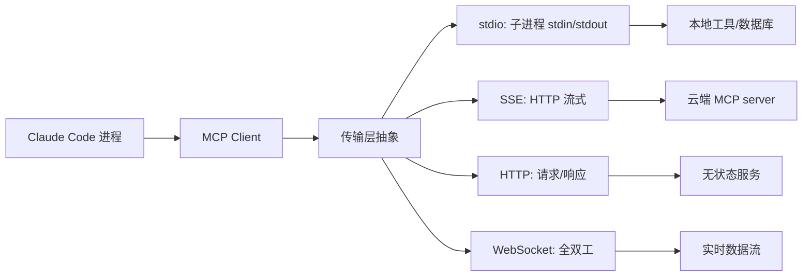
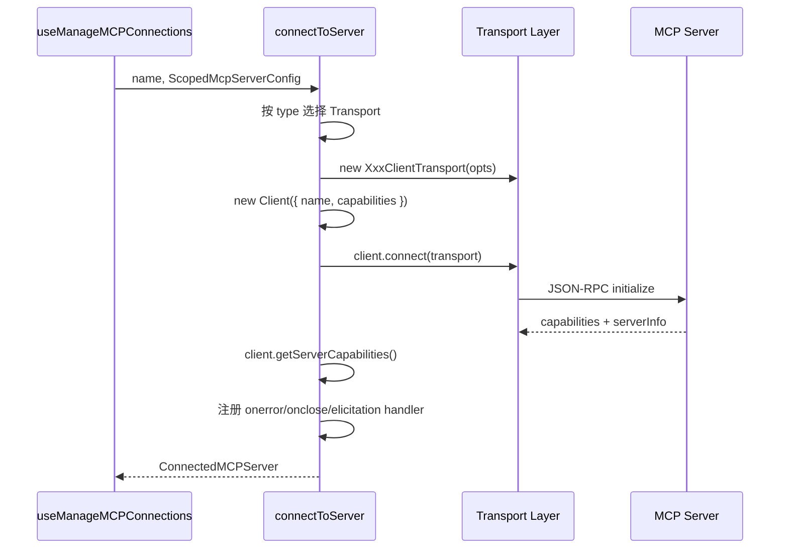

# Claude Code MCP 集成架构：4 种传输层与扩展生态

Model Context Protocol（MCP）是 Anthropic 提出的开放标准，旨在统一 AI 应用与外部工具、资源、数据源之间的交互方式。在三个主流终端 Agent（Claude Code、OpenCode、Codex）中，Claude Code 对 MCP 的支持最为完整——从传输层、鉴权、资源配置到官方注册表、通道权限、插件生态，几乎覆盖了协议的全部能力。本文从源码层面拆解 Claude Code 的 MCP 集成：先看配置类型与传输层，再看客户端管理器与连接生命周期，最后覆盖鉴权、UI、插件系统与横向对比。

MCP 协议本身基于 JSON-RPC 2.0，定义了三类核心能力：tools（工具调用）、resources（资源读取）、prompts（提示模板）。Client 与 server 之间的交互遵循「initialize → 协商 capabilities → list tools/resources → call tool → cleanup」的生命周期。Claude Code 作为 MCP client，需要管理多个 server 连接、处理鉴权、转换工具结果格式、在 UI 上展示连接状态——这套完整的工程实现，是理解「一个 Agent 如何安全地扩展外部能力」的最佳样本。

## 一、MCP 服务概览

Claude Code 的 MCP 实现集中在 `src/services/mcp/` 目录，共 23 个文件，覆盖客户端连接、鉴权、配置、UI、通道权限、官方注册表等全部子领域。其中几个核心文件的规模如下：

| 文件 | 行数 | 职责 |
|------|------|------|
| `client.ts` | 3,348 | 连接建立、工具/资源拉取、工具调用、结果转换 |
| `auth.ts` | 2,465 | OAuth 2.0 全流程、token 管理、step-up 检测 |
| `config.ts` | 1,578 | 配置读写、环境变量展开、策略过滤 |
| `useManageMCPConnections.ts` | 1,141 | React Hook，管理连接生命周期与重连 |
| `types.ts` | 258 | 全部 Zod schema 与类型定义 |

`client.ts` 是整个 MCP 服务中最大的文件，也是全项目最大的单文件之一。它承担了从「拿到一份配置」到「调一次工具拿到结果」的全部逻辑：根据配置类型选择传输层、构造 Client、连接、拉取 capabilities、列出工具/资源/命令、调用工具、转换结果、处理超时与错误恢复。理解了这个文件，就理解了 Claude Code 与外部世界交互的核心管道。

从架构定位看，MCP 服务是 Claude Code「工具系统」的外部延伸。内置工具（Bash、Read、Write、Edit 等）直接在进程内执行，调用路径短、延迟低；MCP 工具则要经过传输层、JSON-RPC 序列化、跨进程/跨网络通信，调用路径长得多。但 MCP 的价值在于「可扩展」——第三方开发者无需修改 Claude Code 本体，只需实现一个 MCP server 即可接入新的工具能力（数据库查询、API 调用、浏览器控制等）。这种「核心稳定、边缘可扩展」的架构是现代 Agent 平台的共同选择。

需要先理清一个概念区分：**MCP server 是外部进程**（或远程服务），它们独立于 Claude Code 运行，通过 JSON-RPC 协议通信；**插件（plugin）则是运行在 Claude Code 进程内的代码**，可以提供 skills（命令）、hooks、以及 MCP server 配置。两者关系是「插件可以声明 MCP server 配置」，但插件本身不是 MCP server。这个区分在后文「插件系统」一节会展开。

## 二、MCP 配置类型

### 2.1 传输层 discriminated union

`src/services/mcp/types.ts` 用 Zod 定义了所有 MCP server 配置，通过 `type` 字段做 discriminated union。核心的四种用户可配置传输层如下：

```ts
// src/services/mcp/types.ts
export const TransportSchema = lazySchema(() =>
  z.enum(['stdio', 'sse', 'sse-ide', 'http', 'ws', 'sdk']),
)

export const McpStdioServerConfigSchema = lazySchema(() =>
  z.object({
    type: z.literal('stdio').optional(), // Optional for backwards compatibility
    command: z.string().min(1, 'Command cannot be empty'),
    args: z.array(z.string()).default([]),
    env: z.record(z.string(), z.string()).optional(),
  }),
)

export const McpSSEServerConfigSchema = lazySchema(() =>
  z.object({
    type: z.literal('sse'),
    url: z.string(),
    headers: z.record(z.string(), z.string()).optional(),
    headersHelper: z.string().optional(),
    oauth: McpOAuthConfigSchema().optional(),
  }),
)

export const McpHTTPServerConfigSchema = lazySchema(() =>
  z.object({
    type: z.literal('http'),
    url: z.string(),
    headers: z.record(z.string(), z.string()).optional(),
    headersHelper: z.string().optional(),
    oauth: McpOAuthConfigSchema().optional(),
  }),
)

export const McpWebSocketServerConfigSchema = lazySchema(() =>
  z.object({
    type: z.literal('ws'),
    url: z.string(),
    headers: z.record(z.string(), z.string()).optional(),
    headersHelper: z.string().optional(),
  }),
)
```

除上述四种主传输层外，还有三种内部专用类型：

- `sse-ide` / `ws-ide`：IDE 扩展专用，携带 `ideName` 与平台标记，不需要 OAuth 鉴权（走 IDE 提供的 authToken）。
- `sdk`：SDK 进程内 MCP server，配置只含 `name`，不经过常规传输层，而是通过 `SdkControlTransport` 桥接（见后文）。
- `claudeai-proxy`：Claude.ai 云端代理的 MCP server，配置含 `url` 和 `id`，连接时用 Claude.ai 的 OAuth token 走 Streamable HTTP。

最终 `McpServerConfigSchema` 是这八种配置的 union：

```ts
export const McpServerConfigSchema = lazySchema(() =>
  z.union([
    McpStdioServerConfigSchema(),
    McpSSEServerConfigSchema(),
    McpSSEIDEServerConfigSchema(),
    McpWebSocketIDEServerConfigSchema(),
    McpHTTPServerConfigSchema(),
    McpWebSocketServerConfigSchema(),
    McpSdkServerConfigSchema(),
    McpClaudeAIProxyServerConfigSchema(),
  ]),
)
```

### 2.2 配置作用域

每份配置在运行时会被附加 `scope` 字段，形成 `ScopedMcpServerConfig`：

```ts
export type ConfigScope =
  | 'local'      // 项目本地（不入版本控制）
  | 'user'       // 用户全局
  | 'project'    // 项目级（.mcp.json，入版本控制）
  | 'dynamic'    // 运行期动态注入
  | 'enterprise' // 企业管理配置
  | 'claudeai'   // Claude.ai 云端同步
  | 'managed'     // 受管配置（企业策略锁定）

export type ScopedMcpServerConfig = McpServerConfig & {
  scope: ConfigScope
  // 插件提供的 server 在此处记录来源（如 'slack@anthropic'）
  pluginSource?: string
}
```

七种 scope 的优先级与合并规则由 `config.ts` 的 `getAllMcpConfigs()` 统一编排。企业级配置（`enterprise` / `managed`）可以通过 `shouldAllowManagedMcpServersOnly()` 强制「只允许受管 MCP server」，这是企业部署场景下的安全约束——一旦开启，用户自行配置的 server 会被全部忽略，确保工具来源完全受 IT 管控。`project` 与 `local` scope 的配置会被纳入 workspace trust 检查——若项目未被信任，`headersHelper` 这类可执行配置项不会运行（后文鉴权节详述）。

配置合并时的去重逻辑也值得关注。`dedupPluginMcpServers` 和 `dedupClaudeAiMcpServers` 分别处理插件来源和 Claude.ai 来源的 server 去重，依据是 `getMcpServerSignature` 计算的签名——stdio server 用 command + args 拼接，远程 server 用 URL（经 `unwrapCcrProxyUrl` 解包 CCR 代理 URL 后）。签名相同的 server 只保留优先级最高的那份，避免同一 server 被重复连接浪费资源。`addMcpConfig` 还会校验 server 名格式（`/[^a-zA-Z0-9_-]/` 直接拒绝），并阻止保留名 `claude-in-chrome` 被用户注册。

## 三、四种传输层

Claude Code 支持四种面向用户的传输层，覆盖本地与远程、有状态与无状态、单向与双向的全部组合。下图展示了从 Claude Code 进程到外部服务的完整链路：



### 3.1 stdio：本地子进程

stdio 是最常用的传输层，适用于本地工具。Claude Code 通过 `StdioClientTransport` 派生子进程，经 stdin/stdout 收发 JSON-RPC 消息。典型配置是 `npx -y @modelcontextprotocol/server-postgres` 这类通过 npm 分发的 server。

`client.ts:944` 的核心逻辑：

```ts
} else if (serverRef.type === 'stdio' || !serverRef.type) {
  const finalCommand =
    process.env.CLAUDE_CODE_SHELL_PREFIX || serverRef.command
  const finalArgs = process.env.CLAUDE_CODE_SHELL_PREFIX
    ? [[serverRef.command, ...serverRef.args].join(' ')]
    : serverRef.args
  transport = new StdioClientTransport({
    command: finalCommand,
    args: finalArgs,
    env: {
      ...subprocessEnv(),
      ...serverRef.env,
    } as Record<string, string>,
    stderr: 'pipe', // 阻止 server 的 stderr 直接打到 UI
  })
}
```

两个细节值得注意。第一，`CLAUDE_CODE_SHELL_PREFIX` 环境变量允许把整个命令包一层 shell 前缀（如 `docker exec -i container`），此时 command 和 args 会被拼成单条字符串传给 shell。第二，`stderr: 'pipe'` 把子进程的标准错误重定向到管道，由专门的 `stderrHandler` 累积（上限 64 MB），连接成功后一次性输出到日志、连接失败时附带在错误信息里——这避免了 server 的调试输出污染终端 UI。

stdio 还有一个特殊分支：Chrome MCP server 和 Computer Use MCP server 会被「进程内化」。以 Chrome 为例，正常 spawn 一个 Chrome MCP 子进程要吃掉约 325 MB 内存，因此 Claude Code 选择用 `InProcessTransport` 在主进程内直接跑 server，省掉子进程开销（`client.ts:905`）。这两类 server 走的是 `feature('CHICAGO_MCP')` 灰度门控——Computer Use 能力还在灰度阶段，未全量开放。

stdio 传输层的另一个细节是环境变量继承策略。`subprocessEnv()` 返回经过过滤的当前进程环境变量（剔除敏感项），再与 `serverRef.env` 合并，后者覆盖前者。这让 server 配置既能继承必要的运行时变量（如 PATH），又能注入专属的环境变量（如数据库连接串）。`CLAUDE_CODE_SHELL_PREFIX` 还允许把整个命令用 shell 包装，典型用法是 `docker exec -i container_name`——此时 `finalArgs` 变成单元素数组（拼接后的完整命令字符串），由 shell 解析执行。

### 3.2 SSE：HTTP 流式

SSE（Server-Sent Events）用于远程 server 连接，是 HTTP 长连接流式协议。Claude Code 用 `SSEClientTransport` 建立 SSE 连接，配合 `ClaudeAuthProvider` 做鉴权。`client.ts:619` 的关键配置：

```ts
if (serverRef.type === 'sse') {
  const authProvider = new ClaudeAuthProvider(name, serverRef)
  const combinedHeaders = await getMcpServerHeaders(name, serverRef)

  const transportOptions: SSEClientTransportOptions = {
    authProvider,
    fetch: wrapFetchWithTimeout(
      wrapFetchWithStepUpDetection(createFetchWithInit(), authProvider),
    ),
    requestInit: {
      headers: {
        'User-Agent': getMCPUserAgent(),
        ...combinedHeaders,
      },
    },
  }

  // EventSource 是长连接，不能用 60s 超时包装
  transportOptions.eventSourceInit = {
    fetch: async (url: string | URL, init?: RequestInit) => {
      const authHeaders: Record<string, string> = {}
      const tokens = await authProvider.tokens()
      if (tokens) {
        authHeaders.Authorization = `Bearer ${tokens.access_token}`
      }
      return fetch(url, {
        ...init,
        ...getProxyFetchOptions(),
        headers: {
          'User-Agent': getMCPUserAgent(),
          ...authHeaders,
          ...init?.headers,
          ...combinedHeaders,
          Accept: 'text/event-stream',
        },
      })
    },
  }

  transport = new SSEClientTransport(new URL(serverRef.url), transportOptions)
}
```

这里有一个容易踩坑的设计：`eventSourceInit` 的 fetch 故意**不**套 `wrapFetchWithTimeout`。注释解释得很清楚——EventSource 是长连接，会无限期保持以接收服务端推送的事件，给它套 60 秒超时会直接掐断流。超时包装只用于单次 API 请求（POST、auth refresh），不用于持久 SSE 流。这是 SSE 传输层最容易出 bug 的地方，Claude Code 用分离的 fetch 函数显式区分了两类请求。

### 3.3 HTTP：请求/响应

HTTP 传输层对应 MCP 协议的 Streamable HTTP，用 `StreamableHTTPClientTransport` 实现。相比 SSE，它是请求/响应模式，适合无状态操作。`client.ts:784` 的配置：

```ts
} else if (serverRef.type === 'http') {
  const authProvider = new ClaudeAuthProvider(name, serverRef)
  const combinedHeaders = await getMcpServerHeaders(name, serverRef)

  // 若 server 已有 OAuth token，authProvider 会设置 Authorization；
  // 此时不要用 session ingress token 覆盖
  const hasOAuthTokens = !!(await authProvider.tokens())

  const transportOptions: StreamableHTTPClientTransportOptions = {
    authProvider,
    fetch: wrapFetchWithTimeout(
      wrapFetchWithStepUpDetection(createFetchWithInit(), authProvider),
    ),
    requestInit: {
      ...getProxyFetchOptions(),
      headers: {
        'User-Agent': getMCPUserAgent(),
        ...(sessionIngressToken &&
          !hasOAuthTokens && {
            Authorization: `Bearer ${sessionIngressToken}`,
          }),
        ...combinedHeaders,
      },
    },
  }

  transport = new StreamableHTTPClientTransport(
    new URL(serverRef.url),
    transportOptions,
  )
}
```

HTTP 传输层有一个微妙的 token 优先级问题：当一个 server 既有 OAuth token 又可能拿到 session ingress token（企业 SSO 场景）时，需要判断「已有 OAuth token 就不覆盖」。因为 SDK 的 authProvider 在 `requestInit` 合并**之后**才设置 Authorization，如果两边都设了，authProvider 的值会赢——但 CCR 代理 URL（`ccr_shttp_mcp`）没有 OAuth token，仍然需要 ingress token。这个 `hasOAuthTokens` 判断就是为了让两种场景各得其所。

HTTP 传输层还声明了 `MCP_STREAMABLE_HTTP_ACCEPT = 'application/json, text/event-stream'`，表示客户端同时接受 JSON 响应和 SSE 流式响应。这让 server 可以根据响应特性选择格式——简单结果用 JSON，长时间运行的任务用 SSE 流式推送进度。`MCP_REQUEST_TIMEOUT_MS = 60000`（60 秒）作为单次请求的超时上限，配合 `wrapFetchWithTimeout` 包装的 fetch 使用。与 SSE 不同，HTTP 传输层的 fetch 可以安全地套超时包装，因为每次请求都是独立的，不存在长连接被误杀的问题。

### 3.4 WebSocket：全双工

WebSocket 是四种传输层中唯一的全双工通道，适合实时数据流场景。Claude Code 在 Bun 和 Node 两种运行时下用了不同的 WebSocket 实现：

```ts
} else if (serverRef.type === 'ws') {
  const combinedHeaders = await getMcpServerHeaders(name, serverRef)
  const tlsOptions = getWebSocketTLSOptions()
  const wsHeaders = {
    'User-Agent': getMCPUserAgent(),
    ...(sessionIngressToken && {
      Authorization: `Bearer ${sessionIngressToken}`,
    }),
    ...combinedHeaders,
  }

  let wsClient: WsClientLike
  if (typeof Bun !== 'undefined') {
    // Bun 的 WebSocket 原生支持 headers/proxy/tls
    wsClient = new globalThis.WebSocket(serverRef.url, {
      protocols: ['mcp'],
      headers: wsHeaders,
      proxy: getWebSocketProxyUrl(serverRef.url),
      tls: tlsOptions || undefined,
    } as unknown as string[])
  } else {
    wsClient = await createNodeWsClient(serverRef.url, {
      headers: wsHeaders,
      agent: getWebSocketProxyAgent(serverRef.url),
      ...(tlsOptions || {}),
    })
  }
  transport = new WebSocketTransport(wsClient)
}
```

Bun 的 WebSocket API 支持自定义 headers、proxy、TLS，但 DOM 类型定义不认这些字段，所以要用 `as unknown as string[]` 绕过类型检查。Node 环境下则通过 `createNodeWsClient` 构造一个兼容 `WsClientLike` 接口的对象。两种运行时走不同代码路径，但最终都产出 `WebSocketTransport`，对上层透明。

WebSocket 传输层还处理了 TLS 选项和代理：`getWebSocketTLSOptions()` 返回自定义证书或跳过自签证书的配置，`getWebSocketProxyUrl()` 和 `getWebSocketProxyAgent()` 分别为 Bun 和 Node 提供 HTTP/HTTPS 代理支持。日志输出前会把 `authorization` header 脱敏为 `[REDACTED]`，避免 token 泄漏到日志文件。这些细节看似琐碎，但在企业代理环境和自签证书内网中不可或缺——WebSocket 的全双工特性让它成为内网实时 MCP server 的首选传输层。

四种传输层的特性对比如下：

| 传输层 | 通信模式 | 典型场景 | 鉴权 | 复杂度 |
|--------|----------|----------|------|--------|
| stdio | 双向（stdin/stdout） | 本地工具、数据库 | 无（进程级） | 低 |
| SSE | 服务端→客户端流 | 云端 MCP server | OAuth 2.0 | 中 |
| HTTP | 请求/响应 | 无状态操作 | OAuth 2.0 | 低 |
| WebSocket | 全双工 | 实时数据流 | Token/Header | 高 |

## 四、MCP 客户端管理器

### 4.1 连接状态机

`client.ts` 的核心是 `connectToServer` 函数（`client.ts:595`），它被 `memoize` 包裹——同一份配置只连接一次，除非显式清除缓存触发重连。连接结果是一个五态联合类型：

```ts
// src/services/mcp/types.ts
export type MCPServerConnection =
  | ConnectedMCPServer    // 已连接，可调用
  | FailedMCPServer       // 连接失败
  | NeedsAuthMCPServer   // 需要鉴权
  | PendingMCPServer      // 连接中/重连中
  | DisabledMCPServer     // 被用户禁用

export type ConnectedMCPServer = {
  client: Client              // MCP SDK 的 Client 实例
  name: string
  type: 'connected'
  capabilities: ServerCapabilities
  serverInfo?: { name: string; version: string }
  instructions?: string       // server 声明的使用说明
  config: ScopedMcpServerConfig
  cleanup: () => Promise<void>
}
```

状态流转的核心逻辑在 `connectToServer` 内部。连接成功后返回 `ConnectedMCPServer`；若 `UnauthorizedError` 被捕获，走 `handleRemoteAuthFailure` 返回 `NeedsAuthMCPServer`；其他错误抛出，由上层捕获后标为 `FailedMCPServer`。`PendingMCPServer` 只在重连流程中出现，携带 `reconnectAttempt` 和 `maxReconnectAttempts` 用于 UI 展示进度。`DisabledMCPServer` 则在配置加载阶段就标记——`isMcpServerDisabled` 检查用户设置，被禁用的 server 不会进入连接流程，直接以 disabled 状态注册到 AppState，UI 显示为灰色开关。

这五种状态的区分不仅是 UI 展示的需要，更直接影响连接调度逻辑。`getMcpToolsCommandsAndResources` 在批量连接前会先过滤 disabled server；`NeedsAuthMCPServer` 会触发 `/mcp` 鉴权菜单的引导提示；`PendingMCPServer` 的 reconnectAttempt 字段让 UI 能显示「重连中（2/5）」的进度条。这种「状态驱动 UI、UI 反馈状态」的双向绑定，是 Claude Code 在复杂连接场景下仍能保持可观测性的基础。

### 4.2 连接生命周期

`connectToServer` 的执行路径可以概括为五步：



连接超时由 `getConnectionTimeoutMs()` 控制，用 `Promise.race` 竞速 `connectPromise` 与 `timeoutPromise`。超时后会显式关闭 `inProcessServer` 和 `transport`，避免僵尸连接。

连接建立后，Client 注册了三个关键 handler：

1. **`ListRootsRequestSchema`**：当 server 反向请求「客户端的根目录」时，返回当前工作目录 `file://${getOriginalCwd()}`。这让 server 能感知用户在哪个项目下工作。
2. **`ElicitRequestSchema`**：初始化阶段的默认 handler 直接返回 `cancel`，防止 server 在 UI 注册真正的 handler 之前发起 elicitation 导致丢请求。真正的 handler 由 `useManageMCPConnections` 中的 `registerElicitationHandler` 覆盖。
3. **`onerror` / `onclose`**：连接错误处理与重连触发。

连接成功后，代码会读取三样东西：`client.getServerCapabilities()`（server 声明的能力集）、`client.getServerVersion()`（server 名称与版本）、`client.getInstructions()`（server 给模型的使用说明）。capabilities 是一个结构体，标记 server 是否支持 tools、prompts、resources、resource subscribe 等。Claude Code 据此决定后续拉取哪些内容——没有 tools capability 的 server 不会被列入工具列表。`instructions` 若超过 `MAX_MCP_DESCRIPTION_LENGTH`（2048 字符）会被截断，防止过长的说明污染系统提示。

Client 构造时自身也声明了能力集：`roots: {}`（声明支持 roots）、`elicitation: {}`（声明支持 elicitation）。注释特别提到 elicitation 能力用空对象而非 `{form:{},url:{}}`，因为 Java MCP SDK（Spring AI）的 Elicitation 类没有字段，遇到未知属性会报错——这是一个跨语言兼容性的妥协。

### 4.3 错误检测与重连触发

连接建立后，错误处理是一段相当精密的逻辑（`client.ts:1216` 起）。SDK 的 transport 在连接失败时调用 `onerror` 但不调用 `onclose`，而 Claude Code 依赖 `onclose` 触发重连。为弥合这个缺口，代码追踪连续错误次数，达到 `MAX_ERRORS_BEFORE_RECONNECT`（值为 3）后手动调用 `client.close()`：

```ts
let consecutiveConnectionErrors = 0
const MAX_ERRORS_BEFORE_RECONNECT = 3
let hasTriggeredClose = false

const isTerminalConnectionError = (msg: string): boolean => {
  return (
    msg.includes('ECONNRESET') ||
    msg.includes('ETIMEDOUT') ||
    msg.includes('EPIPE') ||
    msg.includes('EHOSTUNREACH') ||
    msg.includes('ECONNREFUSED') ||
    msg.includes('Body Timeout Error') ||
    msg.includes('terminated') ||
    msg.includes('SSE stream disconnected') ||
    msg.includes('Failed to reconnect SSE stream')
  )
}
```

`isTerminalConnectionError` 判断错误是否属于「终结性连接错误」——即不可恢复、需要重连的网络故障。ECONNRESET（连接重置）、ETIMEDOUT（超时）、ECONNREFUSED（拒绝连接）等都被纳入。SSE 传输层还有两个专属的中间错误标识（`SSE stream disconnected` 和 `Failed to reconnect SSE stream`），因为 SDK 内部的 SSE 重连机制会把真实网络错误包一层，上面的字符串匹配不到。

### 4.4 指数退避重连

重连策略在 `useManageMCPConnections.ts` 中实现，采用指数退避：

```ts
const MAX_RECONNECT_ATTEMPTS = 5
const INITIAL_BACKOFF_MS = 1000
const MAX_BACKOFF_MS = 30000

const backoffMs = Math.min(
  INITIAL_BACKOFF_MS * Math.pow(2, attempt - 1),
  MAX_BACKOFF_MS,
)
```

重连循环最多尝试 5 次，退避间隔为 1s、2s、4s、8s、16s（上限 30s，所以第 5 次实际等待 16s）。每次重连前会检查 `isMcpServerDisabled(client.name)`——若用户在等待期间禁用了 server，重连立即终止。重连过程中状态被标为 `pending` 并携带 `reconnectAttempt`，UI 据此显示「重连中（第 N/5 次）」。

### 4.5 批量连接与并发控制

`getMcpToolsCommandsAndResources`（`client.ts:2226`）负责批量连接所有配置的 server。它先把 server 分成两组：

- **local**（stdio / sdk）：需要 spawn 子进程，并发不宜过高。
- **remote**（sse / http / ws / 其他）：网络连接，可承受更高并发。

两组分别用不同的批次大小（`getMcpServerConnectionBatchSize()` 与 `getRemoteMcpServerConnectionBatchSize()`）处理，通过 `processBatched` 控制并发。此外还有一个 15 分钟 TTL 的 auth cache（`MCP_AUTH_CACHE_TTL_MS = 15 * 60 * 1000`）：最近返回 401 的 server 会被跳过，避免每次会话都做无意义的鉴权探测。`hasMcpDiscoveryButNoToken` 进一步收紧了这个口子——即使 TTL 未过期，只要 server 曾被探测过但用户从未完成授权，就直接跳过，省掉每次连接的网络往返。

连接成功后，工具、命令、资源的拉取分别由三个 memoize 函数负责：`fetchToolsForClient`、`fetchCommandsForClient`、`fetchResourcesForClient`。其中 `fetchToolsForClient` 用 `memoizeWithLRU`（容量 `MCP_FETCH_CACHE_SIZE = 20`）缓存，避免对同一 server 重复发 `tools/list` 请求。工具名会经过规范化处理——`isIncludedMcpTool` 过滤掉非白名单的 IDE 工具（仅允许 `mcp__ide__executeCode` 和 `mcp__ide__getDiagnostics`），其余工具按 `mcp__{server}__{tool}` 格式暴露给模型。每个工具的描述也会被截断到 `MAX_MCP_DESCRIPTION_LENGTH` 以控制上下文体积。

## 五、MCP 鉴权

### 5.1 OAuth 2.0 全流程

远程 MCP server（SSE / HTTP）的鉴权走 OAuth 2.0 Authorization Code 流程。核心实现是 `ClaudeAuthProvider`（`auth.ts:1376`），它实现了 MCP SDK 的 `OAuthClientProvider` 接口：

```ts
export class ClaudeAuthProvider implements OAuthClientProvider {
  private serverName: string
  private serverConfig: McpSSEServerConfig | McpHTTPServerConfig
  private redirectUri: string
  private _codeVerifier?: string
  private _authorizationUrl?: string
  private _state?: string
  private _refreshInProgress?: Promise<OAuthTokens | undefined>
  private _pendingStepUpScope?: string

  get clientMetadata(): OAuthClientMetadata {
    const metadata: OAuthClientMetadata = {
      client_name: `Claude Code (${this.serverName})`,
      redirect_uris: [this.redirectUri],
      grant_types: ['authorization_code', 'refresh_token'],
      response_types: ['code'],
      token_endpoint_auth_method: 'none', // Public client
    }
    return metadata
  }
}
```

`token_endpoint_auth_method: 'none'` 表明 Claude Code 是 public client（RFC 8252），不使用 client secret——终端应用无法安全保存 secret，因此走 PKCE + authorization code 流程。`redirect_uris` 指向 localhost 回调地址。

`clientMetadataUrl` 是一个较新的扩展（CIMD，SEP-991）：当授权服务器声明支持 `client_id_metadata_document_supported: true` 时，SDK 用这个 URL 作为 client_id 而非走 Dynamic Client Registration。这简化了与已注册 client 的联邦式鉴权（FedStart）场景，可通过 `MCP_OAUTH_CLIENT_METADATA_URL` 环境变量覆盖（用于测试或自建 AS）。

token 的存储与读取通过 localStorage 完成，key 由 `getServerKey` 根据 server 名和 URL 计算。`revokeServerTokens` 在用户主动断开连接时撤销 token，`clearServerTokensFromLocalStorage` 清除本地缓存。整个生命周期是：发现 AS 元数据 → 动态注册 client（或用 CIMD）→ 引导用户授权 → 拿到 access_token + refresh_token → 后续请求带 Bearer token → token 过期时自动刷新。

### 5.2 OAuth 回调端口

`oauthPort.ts` 负责寻找可用的本地回调端口。它遵循 RFC 8252 Section 7.3 的 loopback redirect 规则——任何端口都可用，只要 path 匹配：

```ts
// Windows 动态端口范围 49152-65535 被保留，避开
const REDIRECT_PORT_RANGE =
  getPlatform() === 'windows'
    ? { min: 39152, max: 49151 }
    : { min: 49152, max: 65535 }
const REDIRECT_PORT_FALLBACK = 3118

export function buildRedirectUri(port: number = REDIRECT_PORT_FALLBACK): string {
  return `http://localhost:${port}/callback`
}
```

`findAvailablePort()` 先尝试环境变量 `MCP_OAUTH_CALLBACK_PORT` 指定的端口，否则在动态端口范围内随机选（最多尝试 100 次），最后回退到 3118。随机选择而非顺序扫描是为了安全性——防止攻击者预判端口发起拦截。

### 5.3 Step-up 检测与 token 刷新

`wrapFetchWithStepUpDetection`（`auth.ts:1354`）是一个 fetch 包装器，用于检测需要更高权限的 step-up 场景。当 server 返回 403 且表明需要额外 scope 时，它会触发新的授权流程让用户重新同意。token 刷新通过 `_refreshInProgress` Promise 去重——多个并发请求共享同一次刷新，避免 refresh token 被重复使用导致失效。

### 5.4 XAA：跨应用免授权访问

`xaa.ts` 实现了 Cross-App Access（XAA，SEP-990），允许在不弹出浏览器授权页的情况下获取 MCP access token。它串联两个 RFC：


具体流程是：先在 IdP 用 token exchange（RFC 8693）把 id_token 换成 ID-JAG（Identity JWT Assertion Grant），再在 AS 用 JWT bearer grant（RFC 7523）把 ID-JAG 换成 MCP access_token。这套机制主要用于企业场景——用户已在 IdP 登录，无需再为 MCP server 单独授权。`xaaIdpLogin.ts` 负责 IdP 登录流程，`xaa.ts` 负责后续的 token 交换。

XAA 的请求超时设为 30 秒（`XAA_REQUEST_TIMEOUT_MS = 30000`），用 `AbortSignal.any` 合并超时信号与用户取消信号——当用户在鉴权菜单按 Esc 时，能立即中止进行中的网络请求，而非等到超时。两个 grant type 用 URN 标识：`urn:ietf:params:oauth:grant-type:token-exchange`（RFC 8693）和 `urn:ietf:params:oauth:grant-type:jwt-bearer`（RFC 7523），token type 分别为 `id_token` 和 `id-jag`。这套链式 token 交换的设计遵循 MCP 的 ext-auth 规范（SEP-990），结构上对齐 TS SDK PR #1593 的 Layer-2 接口，便于未来 SDK 升级时机械替换。

### 5.5 动态 headers

`headersHelper.ts` 支持通过外部脚本动态获取请求 headers。这类似 git 的 credential-helper 模式——一个脚本服务多个 server：

```ts
export async function getMcpHeadersFromHelper(
  serverName: string,
  config: McpSSEServerConfig | McpHTTPServerConfig | McpWebSocketServerConfig,
): Promise<Record<string, string> | null> {
  if (!config.headersHelper) return null

  // 项目级配置需要先通过 trust 检查
  if (
    'scope' in config &&
    isMcpServerFromProjectOrLocalSettings(config as ScopedMcpServerConfig) &&
    !getIsNonInteractiveSession()
  ) {
    const hasTrust = checkHasTrustDialogAccepted()
    if (!hasTrust) {
      // 未信任的项目不允许执行 headersHelper
      return null
    }
  }

  const execResult = await execFileNoThrowWithCwd(config.headersHelper, [], {
    shell: true,
    timeout: 10000,
    env: {
      ...process.env,
      CLAUDE_CODE_MCP_SERVER_NAME: serverName,
      CLAUDE_CODE_MCP_SERVER_URL: config.url,
    },
  })
  // ...解析 JSON 输出为 headers
}
```

两个安全要点：第一，来自 `project` 或 `local` scope 的 `headersHelper` 必须先通过 workspace trust 检查，防止恶意仓库通过 `.mcp.json` 执行任意命令；第二，脚本通过环境变量 `CLAUDE_CODE_MCP_SERVER_NAME` 和 `CLAUDE_CODE_MCP_SERVER_URL` 获知当前上下文，这样一份脚本可以服务多个 server。最终 headers 是静态 headers 与动态 headers 的合并，后者覆盖前者。

## 六、MCP 配置管理

### 6.1 `.mcp.json` 与环境变量展开

项目级配置写在 `.mcp.json` 文件中，格式为 `{ mcpServers: Record<string, McpServerConfig> }`。配置中的字符串支持环境变量展开，由 `envExpansion.ts` 实现：

```ts
export function expandEnvVarsInString(value: string): {
  expanded: string
  missingVars: string[]
} {
  const missingVars: string[] = []
  const expanded = value.replace(/\$\{([^}]+)\}/g, (match, varContent) => {
    const [varName, defaultValue] = varContent.split(':-', 2)
    const envValue = process.env[varName]

    if (envValue !== undefined) return envValue
    if (defaultValue !== undefined) return defaultValue

    missingVars.push(varName)
    return match
  })
  return { expanded, missingVars }
}
```

支持两种语法：`${VAR}` 直接展开，`${VAR:-default}` 带默认值（与 shell 一致）。`split(':-', 2)` 限制了 split 次数，确保默认值本身包含 `:-` 时不会被误切。缺失的变量会被收集到 `missingVars` 数组，由上层报错而非静默使用空值——这很重要，因为一个空的数据库连接串或 API key 可能导致 server 行为异常但难以排查根因。

`config.ts` 的 `expandEnvVars` 按配置类型递归展开：stdio 展开 `command`/`args`/`env`，远程类型展开 `url`/`headers`，IDE 和 SDK 类型直接透传。展开发生在配置加载阶段（`addMcpConfig` 调用前），确保运行期拿到的配置已经是最终值。`addMcpConfig` 函数本身还做了一系列校验：名称合法性（仅允许字母、数字、下划线、连字符）、保留名检查（`claude-in-chrome`、Computer Use 相关名称）、同名 server 冲突检测，最后才写入对应 scope 的配置文件。

### 6.2 名称规范化

`normalization.ts` 负责把 server 名规范化为 API 兼容格式（`^[a-zA-Z0-9_-]{1,64}$`）：

```ts
const CLAUDEAI_SERVER_PREFIX = 'claude.ai '

export function normalizeNameForMCP(name: string): string {
  let normalized = name.replace(/[^a-zA-Z0-9_-]/g, '_')
  if (name.startsWith(CLAUDEAI_SERVER_PREFIX)) {
    normalized = normalized.replace(/_+/g, '_').replace(/^_|_$/g, '')
  }
  return normalized
}
```

Claude.ai 来源的 server 名会做额外处理：折叠连续下划线并去除首尾下划线。这是因为 MCP 工具名用 `__` 双下划线分隔 server 名与工具名（如 `mcp__servername__toolname`），若 server 名本身含连续下划线会破坏解析。

### 6.3 策略过滤

企业场景下，MCP server 需要经过 allowlist/denylist 过滤。`config.ts` 提供了 `isMcpServerAllowedByPolicy` 和 `isMcpServerDenied`，支持精确 URL 匹配与通配符模式。`filterMcpServersByPolicy` 在配置加载后统一过滤，被拒的 server 不会进入连接流程。

## 七、MCP 工具集成

### 7.1 MCPTool：统一入口

`src/tools/MCPTool/MCPTool.ts` 是所有 MCP 工具的统一入口。它的设计很巧妙——本身是一个「壳」工具，几乎所有方法都被 `src/services/mcp/client.ts` 在运行期覆盖：

```ts
export const MCPTool = buildTool({
  isMcp: true,
  isOpenWorld() {
    return false
  },
  name: 'mcp',
  maxResultSizeChars: 100_000,
  async description() {
    return DESCRIPTION
  },
  async prompt() {
    return PROMPT
  },
  async call() {
    return { data: '' }
  },
  async checkPermissions(): Promise<PermissionResult> {
    return { behavior: 'passthrough', message: 'MCPTool requires permission.' }
  },
  // ...render 方法
})
```

注释 `// Overridden in mcpClient.ts` 标明了 `name`、`description`、`prompt`、`call`、`userFacingName` 都会在运行期被实际的 MCP 工具信息覆盖。这种「占位 + 覆盖」模式让工具注册系统可以统一处理内置工具与 MCP 工具，无需为后者单独开一条代码路径。

`maxResultSizeChars: 100_000` 限制单次工具结果不超过 10 万字符，超出会被截断。`inputSchema` 用 `z.object({}).passthrough()` 放行任意输入——因为每个 MCP 工具定义自己的 schema，统一入口不做校验。

这个设计背后有一个重要的架构决策：Claude Code 没有为每个 MCP 工具生成独立的工具定义，而是在运行期动态修改 `MCPTool` 的 `name`/`description`/`prompt`/`call` 等方法。模型看到的是多个 `mcp__{server}__{tool}` 形式的工具名，但它们共享同一个 `MCPTool` 实例的方法签名，实际调用时由 `services/mcp/client.ts` 根据 server 名和工具名路由到正确的 `callMCPTool` 调用。这种「单实例多工具」模式避免了工具注册表膨胀，也简化了权限检查的代码路径。

### 7.2 资源访问

除工具调用外，MCP 协议还定义了 resources（资源）概念。Claude Code 提供两个相关工具：

- `ListMcpResourcesTool`：列出指定 server 的可用资源
- `ReadMcpResourceTool`：读取指定资源内容

资源访问通过 `fetchResourcesForClient`（`client.ts:2000`）实现，同样用 LRU 缓存（`MCP_FETCH_CACHE_SIZE = 20`）避免重复拉取。资源类型为 `ServerResource = Resource & { server: string }`，附加了来源 server 名以便 UI 区分。

### 7.3 工具调用与结果转换

`callMCPTool`（`client.ts:3029`）是实际调用 MCP 工具的函数。它做了三件事：设置 30 秒间隔的进度日志（长时工具会持续输出 `Tool 'xxx' still running (Ns elapsed)`）、用 `Promise.race` 竞争超时、调用 `client.callTool`。

超时值 `getMcpToolTimeoutMs()` 默认是 `DEFAULT_MCP_TOOL_TIMEOUT_MS = 100_000_000`（约 27 小时），这是一个刻意设大的值——MCP 工具可能执行长时间任务（如跑测试、训练模型），过短的超时会误杀。真正的超时控制交给调用方（如主循环的 turn 超时）和用户手动取消（AbortSignal）。

在 `callMCPTool` 之上还有一层 `callMCPToolWithUrlElicitationRetry`（`client.ts:2813`），它处理 URL elicitation 的重试逻辑：当工具调用返回需要 elicitation 的错误码（`-32042`）时，触发 elicitation 流程让用户在浏览器完成验证，完成后重试工具调用。这形成了「调用→需验证→elicitation→重试」的闭环，对需要 OAuth 授权后才能调用的 MCP 工具尤为重要。

结果转换由 `transformMCPResult` 和 `processMCPResult` 处理，把 MCP 返回的 `content` 数组转换为 Claude API 兼容的格式。`MCPResultType` 区分三种结果形态：`toolResult`（标准工具结果）、`structuredContent`（结构化内容）、`contentArray`（原始内容数组）。图片 MIME 类型会被特殊处理（`contentContainsImages` 检测后持久化为 blob 再转 text block），`inferCompactSchema` 会把深层结构推断为简化 schema 字符串以控制上下文长度——它递归遍历两层深度，把对象结构压缩为类似 `{name:string,age:number}` 的紧凑表示。

### 7.4 Elicitation：交互式输入

`elicitationHandler.ts` 实现了 MCP 协议的 elicitation 能力——server 可以反向向用户请求输入。支持两种模式：

- **form**：表单模式，server 声明字段，Claude Code 渲染表单让用户填写
- **url**：URL 模式，server 给一个 URL，用户在浏览器完成操作后 server 发送完成通知

```ts
export type ElicitationRequestEvent = {
  serverName: string
  requestId: string | number
  params: ElicitRequestParams
  signal: AbortSignal
  respond: (response: ElicitResult) => void
  waitingState?: ElicitationWaitingState  // URL 模式的等待态
  onWaitingDismiss?: (action: 'dismiss' | 'retry' | 'cancel') => void
  completed?: boolean  // server 确认完成
}
```

URL 模式有一个两阶段流程：第一阶段用户打开浏览器，第二阶段显示等待态（带「Retry now」/「Skip confirmation」按钮）。server 通过 `ElicitationCompleteNotificationSchema` 通知完成。表单与 hook 系统集成——`executeElicitationHooks` 允许插件程序化提供响应，`executeElicitationResultHooks` 在响应完成后触发副作用 hook。

elicitation 还支持错误驱动的重试场景。当工具调用返回错误码 `-32042`（需要 elicitation）时，`callMCPToolWithUrlElicitationRetry` 会捕获该错误并启动 URL elicitation 流程，用户完成浏览器操作后自动重试工具调用。这种「错误即触发」的设计让 MCP server 能按需要求用户验证，而非在连接时就强制完成所有鉴权——对于只在特定操作时需要额外授权的 server（如转账前需要二次验证），这种惰性鉴权显著降低了使用门槛。

## 八、连接管理 UI 与通道系统

### 8.1 React Context 架构

`MCPConnectionManager.tsx` 是一个编译后的 React 组件（源码用了 React Compiler 的 `_c` runtime），它通过 Context 向子组件暴露两个能力：

```ts
interface MCPConnectionContextValue {
  reconnectMcpServer: (serverName: string) => Promise<{
    client: MCPServerConnection
    tools: Tool[]
    commands: Command[]
    resources?: ServerResource[]
  }>
  toggleMcpServer: (serverName: string) => Promise<void>
}
```

`useMcpReconnect` 和 `useMcpToggleEnabled` 两个 hook 让任意子组件都能触发重连或启停 server，无需 prop drilling。真正的连接管理逻辑在 `useManageMCPConnections.ts` 中实现。

这个 Hook 内部维护了一套批量更新机制。MCP server 的连接回调是异步到达的（网络 I/O 时序不同），如果每次回调都触发一次 `setAppState`，React 会在短时间内频繁重渲染。为此代码用了一个 16ms 的时间窗口（`MCP_BATCH_FLUSH_MS = 16`）把多个 server 状态更新攒到一次 `setAppState` 调用中：

```ts
const MCP_BATCH_FLUSH_MS = 16
const pendingUpdatesRef = useRef<PendingUpdate[]>([])
const flushTimerRef = useRef<ReturnType<typeof setTimeout> | null>(null)

const flushPendingUpdates = useCallback(() => {
  flushTimerRef.current = null
  const updates = pendingUpdatesRef.current
  if (updates.length === 0) return
  pendingUpdatesRef.current = []
  setAppState(prevState => {
    let mcp = prevState.mcp
    for (const update of updates) {
      // 合并 tools/commands/resources 到 mcp 状态
    }
    return { ...prevState, mcp }
  })
}, [setAppState])
```

选择 16ms（约一帧）而非 `queueMicrotask` 的原因在注释里说得很清楚：microtask 会在当前同步代码结束后立即执行，而网络 I/O 回调可能分散在不同 macrotask 中，导致 batch 不完整。16ms 时间窗口确保即使回调到达时间有偏差，也能被同一个 batch 捕获。

Hook 还监听 `pluginReconnectKey`——这是一个由 `/reload-plugins` 命令递增的计数器。当插件被重新加载时，`getClaudeCodeMcpConfigs()` 会读取已清缓存的插件数据，effect 重新执行后就会连接新启用的插件 MCP server。这是插件与 MCP 连接管理的衔接点。

### 8.2 通道权限

通道（channel）是 Claude Code 的一个高级特性——允许通过 Telegram、iMessage、Discord 等即时通讯渠道远程审批权限请求。这套系统由三个文件支撑：

`channelAllowlist.ts` 维护已批准的通道插件白名单，数据来自 GrowthBook 的 `tengu_harbor_ledger` flag：

```ts
export function getChannelAllowlist(): ChannelAllowlistEntry[] {
  const raw = getFeatureValue_CACHED_MAY_BE_STALE<unknown>('tengu_harbor_ledger', [])
  const parsed = ChannelAllowlistSchema().safeParse(raw)
  return parsed.success ? parsed.data : []
}

export function isChannelsEnabled(): boolean {
  return getFeatureValue_CACHED_MAY_BE_STALE('tengu_harbor', false)
}
```

白名单是插件粒度而非 server 粒度——源码注释解释了原因：如果一个插件长出了恶意的第二个 server，这个插件本身已经被攻破，逐 server 门控拦不住，反而会在无害的插件重构时误伤。

`channelPermissions.ts` 实现权限审批的中继。当 CC 遇到权限对话框时，同时通过活跃通道发送审批请求，与本地 UI / bridge / hooks / classifier 竞速，先返回者赢。用户在通道里的回复格式是严格的：

```
/^\s*(y|yes|n|no)\s+([a-km-z]{5})\s*$/i
```

5 个小写字母（不含 `l`，因为像 `1`/`I`），大小写不敏感，不允许裸 yes/no——这防止 AI 在对话流中误触发审批。server 解析用户回复后发送结构化的 `notifications/claude/channel/permission` 事件，CC 匹配 request_id 后完成审批。

这套机制有一个被明确接受的安全边界：受信任的方是人类（通过通道回复），而非 Claude 本身。但信任边界不是终端，而是 allowlist（`tengu_harbor_ledger`）。源码注释坦诚记录了这个权衡——一个被攻破的通道 server 能在人类未看到提示的情况下伪造「yes」加随机 ID 的回复，但这只加速而非增强了攻击能力：被攻破的通道本就拥有无限的对话注入能力（通过长期社会工程等待 `acceptEdits` 等权限），注入后自审批只是更快，不是更强的能力。`isChannelPermissionRelayEnabled` 是独立的 GrowthBook 门控（`tengu_harbor_permissions`），默认关闭，与通道总开关（`tengu_harbor`）分离——通道可以先上线，权限中继后灰度，互不影响。

`channelNotification.ts` 处理通道的通用通知机制，让通道插件能接收 CC 的状态变更（如新消息、工具调用开始/结束）。这与权限中继共享同一套通道基础设施，但走不同的 JSON-RPC notification 路径。

### 8.3 官方注册表

`officialRegistry.ts` 在启动时 fire-and-forget 地预取官方 MCP server 列表：

```ts
export async function prefetchOfficialMcpUrls(): Promise<void> {
  if (process.env.CLAUDE_CODE_DISABLE_NONESSENTIAL_TRAFFIC) return

  const response = await axios.get<RegistryResponse>(
    'https://api.anthropic.com/mcp-registry/v0/servers?version=latest&visibility=commercial',
    { timeout: 5000 },
  )

  const urls = new Set<string>()
  for (const entry of response.data.servers) {
    for (const remote of entry.server.remotes ?? []) {
      const normalized = normalizeUrl(remote.url)
      if (normalized) urls.add(normalized)
    }
  }
  officialUrls = urls
}
```

`isOfficialMcpUrl` 在运行期查询这个集合，判断某个 URL 是否属于官方注册的 server。这个标记影响权限提示的呈现方式——官方 server 通常享有更宽松的默认权限。注册表查询有 5 秒超时，失败时静默降级（`officialUrls` 保持 `undefined`，`isOfficialMcpUrl` 返回 false，fail-closed）。`CLAUDE_CODE_DISABLE_NONESSENTIAL_TRAFFIC` 环境变量可完全关闭这个请求，用于离线或高安全环境。

URL 规范化是注册表查询正确性的关键。`normalizeUrl` 把 URL 的 query string 去掉、trailing slash 去掉，与 `getLoggingSafeMcpBaseUrl` 的规范化逻辑保持一致——只有两侧用相同规则规范化，`Set.has()` 的查找才有效。注册表数据结构是 `{ servers: [{ server: { remotes: [{ url }] } }] }`，一个 server 可以有多个 remote 端点，全部纳入白名单。这种 fire-and-forget 预取 + 运行期查询的模式，让官方注册表对启动性能几乎零影响（5 秒超时，失败不阻塞），又能为权限决策提供即时数据。

## 九、插件系统

### 9.1 插件与 MCP 的关系

插件系统位于 `src/services/plugins/`，与 MCP 是互补关系而非替代关系。核心区别：

- **MCP server** 是外部进程，通过 JSON-RPC 通信，Claude Code 只能调用其暴露的工具/资源。
- **插件** 是运行在 Claude Code 进程内的代码，可以提供三类能力：skills（命令）、hooks（生命周期钩子）、MCP server 配置。

一个插件可以声明若干 MCP server 配置，这些配置在加载时被注入到 MCP 配置池中，与用户手动配置的 server 一视同仁地参与连接。插件来源记录在 `ScopedMcpServerConfig.pluginSource` 字段（如 `slack@anthropic`），通道门控等逻辑据此判断来源。

### 9.2 内置与市场插件

`builtinPlugins.ts` 管理随 CLI 发布的内置插件。插件 ID 用 `{name}@builtin` 格式区分于市场插件（`{name}@{marketplace}`）：

```ts
export function getBuiltinPlugins(): {
  enabled: LoadedPlugin[]
  disabled: LoadedPlugin[]
} {
  for (const [name, definition] of BUILTIN_PLUGINS) {
    if (definition.isAvailable && !definition.isAvailable()) continue

    const pluginId = `${name}@${BUILTIN_MARKETPLACE_NAME}`
    const userSetting = settings?.enabledPlugins?.[pluginId]
    // 启用状态：用户偏好 > 插件默认 > true
    const isEnabled =
      userSetting !== undefined
        ? userSetting === true
        : (definition.defaultEnabled ?? true)

    const plugin: LoadedPlugin = {
      name,
      manifest: { name, description: definition.description, version: definition.version },
      path: BUILTIN_MARKETPLACE_NAME, // sentinel
      source: pluginId,
      enabled: isEnabled,
      isBuiltin: true,
      hooksConfig: definition.hooks,
      mcpServers: definition.mcpServers,
    }
    // ...
  }
}
```

`src/plugins/bundled/index.ts` 是内置插件注册入口，目前是空脚手架——为将来把 bundled skills 迁移为用户可开关的内置插件预留。

### 9.3 安装与 CLI 命令

`PluginInstallationManager.ts` 在启动时后台安装声明的市场插件，不阻塞主流程。它用 `reconcileMarketplaces` 做增量同步，通过 `onProgress` 回调把 `pending`→`installing`→`installed`/`failed` 状态映射到 AppState 供 UI 展示。新安装的市场会触发 `refreshActivePlugins` 自动刷新插件缓存并重建 MCP 连接；而已存在的市场仅更新时，则设置 `needsRefresh` 标记，提示用户手动运行 `/reload-plugins`——更新不如新安装紧急，让用户自己选择应用时机。

`pluginCliCommands.ts` 提供了一组 CLI 命令：`installPlugin`、`uninstallPlugin`、`enablePlugin`、`disablePlugin`、`disableAllPlugins`、`updatePluginCli`，对应 `/plugin` 系列交互。`VALID_INSTALLABLE_SCOPES` 和 `VALID_UPDATE_SCOPES` 约束了可操作的配置作用域，防止用户误改企业受管插件。插件操作失败时，`handlePluginCommandError` 统一格式化错误信息，避免把原始异常栈暴露给终端用户。

插件系统的市场（marketplace）概念类似 npm registry——一个市场是一个可被声明、克隆、缓存的插件源。`loadKnownMarketplacesConfig` 读取已安装的市场清单，`getDeclaredMarketplaces` 读取用户/项目声明的市场列表，`diffMarketplaces` 比较两者得出 missing（需新装）、sourceChanged（需更新）和 upToDate（无需操作）三组。`clearMarketplacesCache` 和 `clearPluginCache` 分别清理不同层级的缓存，前者影响市场元数据，后者影响插件加载结果。

### 9.4 进程内传输与 SDK 桥接

两个特殊的传输层值得单独说明。

`InProcessTransport.ts` 用于在主进程内运行 MCP server，不 spawn 子进程。它创建一对 linked transport，一端的 `send` 直接投递到另一端的 `onmessage`：

```ts
export function createLinkedTransportPair(): [Transport, Transport] {
  const a = new InProcessTransport()
  const b = new InProcessTransport()
  a._setPeer(b)
  b._setPeer(a)
  return [a, b]
}
```

`send` 用 `queueMicrotask` 异步投递，避免同步请求/响应循环导致栈深度溢出。Chrome MCP 和 Computer Use MCP 都用这个机制在进程内运行，省掉数百 MB 的子进程开销。

`SdkControlTransport.ts` 桥接 CLI 进程与 SDK 进程的通信。SDK MCP server 运行在 SDK 进程内，需要通过 stdout/stdin 的控制消息与 CLI 进程的 MCP client 通信。`SdkControlClientTransport`（CLI 侧）把 JSON-RPC 消息包装成带 `server_name` 和 `request_id` 的控制请求发给 SDK；`SdkControlServerTransport`（SDK 侧）接收控制请求、路由到对应 server、返回响应。消息 ID 全程保留以做关联。

## 十、横向对比

将三个终端 Agent 的 MCP 支持放在一起对比：

| 维度 | Claude Code | OpenCode | Codex |
|------|-------------|----------|-------|
| 传输层 | 4 主传输 + 3 专用（IDE/SDK/proxy） | stdio + SSE | stdio + SSE |
| 鉴权 | OAuth 2.0 + XAA + headersHelper | 无 | OAuth 2.0 |
| 资源 | list + read | 无 | list + read |
| 官方注册表 | 有（预取 + 查询） | 无 | 无 |
| 通道权限 | 有（Telegram/iMessage/Discord 审批中继） | 无 | 无 |
| 插件系统 | 有（内置 + 市场） | 有 | 无 |
| 重连策略 | 指数退避（5 次，上限 30s） | 简单重试 | 无自动重连 |
| 进程内 server | 有（InProcessTransport） | 无 | 无 |
| Elicitation | form + url 双模式 | 无 | 无 |

Claude Code 在传输层多样性、鉴权深度、通道权限和插件生态上都明显领先。OpenCode 和 Codex 都只支持 stdio + SSE 两种基础传输层，没有 OAuth 之外的鉴权增强，也没有官方注册表与通道系统。这种差距的根源在于 Claude Code 把 MCP 视为一等扩展生态（插件系统直接依赖 MCP 配置注入），而后两者更多把 MCP 当作可选的工具接入通道。

具体来看几个关键差异点。传输层方面，Claude Code 额外支持的 HTTP（Streamable HTTP）是 MCP 协议较新的传输规范，它比 SSE 更轻量（无需维持长连接），适合部署在 Serverless 或无状态后端的 MCP server；WebSocket 则填补了实时双向通信的空白。鉴权方面，OpenCode 完全没有 MCP 鉴权实现——它只能连接无需认证的本地 stdio server 或公开的远程 server，这在企业场景下是硬伤。XAA 让 Claude Code 能与企业 SSO 无缝集成，用户登录一次即可访问所有受保护的 MCP server，无需逐个授权。

重连策略的差异也值得注意。Claude Code 的指数退避（5 次、上限 30s）能在网络抖动时自动恢复，且重连过程中 UI 显示进度（「第 N/5 次」），用户体验友好。Codex 没有自动重连——连接断了就断了，需要用户手动重启。OpenCode 有简单重试但缺少退避策略，高频重试可能给 server 造成压力。

进程内传输（`InProcessTransport`）是 Claude Code 独有的优化。把高内存开销的 MCP server（如 Chrome）放进主进程运行，省掉了子进程的内存复制开销和 IPC 延迟。这种优化在工具调用频繁的场景下收益显著——每次工具调用的 stdin/stdout 序列化在子进程模式下可能增加数毫秒延迟，进程内模式下则是微秒级的内存拷贝。

## 十一、设计取舍总结

回顾整个 MCP 集成，几个关键的设计决策值得提炼。

**传输层用 discriminated union 而非继承**。八种配置类型用 Zod union 表达，每个分支用 `type` 字段区分。这让配置校验在解析期完成，运行期通过 `switch (config.type)` 分发。相比 OOP 继承，这种方式更利于序列化（直接写进 JSON 配置文件）和类型推导。

**连接用 memoize 缓存，重连靠清除缓存**。`connectToServer` 被 `memoize` 包裹，同一份配置只连接一次。重连时调用 `clearServerCache` 清除对应 key，下次调用自然触发新连接。这是一种「以缓存失效代替显式状态转移」的模式，简洁但要小心缓存 key 的设计——`getServerCacheKey` 需要覆盖配置变更的场景。

**错误恢复用「连续错误计数 + 手动 close」弥补 SDK 缺陷**。MCP SDK 的 transport 在连接失败时只调 `onerror` 不调 `onclose`，而 Claude Code 依赖 `onclose` 触发重连。代码没有修改 SDK，而是在外层追踪连续错误、达到阈值后手动 `client.close()`，让 SDK 的 close 链路自然触发 `onclose`。这种「不侵入依赖、在边界做适配」的策略在大型项目中很常见。

**通道权限用结构化事件而非文本中继**。用户在 Telegram 回复「yes」后，不是把文本透传给 CC，而是由 server 解析后发送 `notifications/claude/channel/permission` 结构化事件。这防止了 AI 在对话流中误触发审批——即使模型输出了「yes xxxxx」，也不会被当作有效审批。安全边界从「终端」转移到了「server 端的解析逻辑」，配合 allowlist 做来源控制。

这些决策共同构成了一个在「功能完备」与「工程可控」之间取得平衡的 MCP 集成。3,348 行的 `client.ts` 看似庞大，但每一种传输层、每一个错误分支、每一次重连尝试都有对应的源码逻辑可追溯——这正是 Claude Code 能把 MCP 做成「三者中最完整」的工程基础。

值得补充的是，这套 MCP 集成并非一蹴而就。从代码中大量保留的注释可以看出演进的痕迹：`sse-ide` 和 `ws-ide` 是为 IDE 集成后加的传输类型；`claudeai-proxy` 是 Claude.ai 云端代理功能引入后的新分支；XAA（SEP-990）和 CIMD（SEP-991）是近期增加的企业鉴权能力；通道权限中继仍在 `tengu_harbor_permissions` 灰度门控下。每一个 feature flag 和 GrowthBook 开关都标记着一个正在灰度或待发布的特性。这种「主干稳定、特性门控」的演进方式，让 Claude Code 能在保持 MCP 核心管道不变的前提下，持续吸收协议新能力和企业场景需求——这也是 51 万行代码体量下仍能维持可维护性的关键工程实践。

## 章节小测

<script setup>
const q = [
  {
    question: 'Claude Code 支持四种面向用户的 MCP 传输层（stdio/SSE/HTTP/WebSocket），选择 stdio 传输层时有一个特殊的进程内优化是什么？',
    options: [
      'stdio 默认使用 shell 包装所有命令',
      'Chrome MCP server 和 Computer Use MCP server 被进程内化（InProcessTransport），避免 spawn 子进程吃掉大量内存',
      '所有 stdio 子进程的 stderr 都直接输出到终端',
      'stdio 传输层不支持环境变量传递'
    ],
    correct: 1,
    explanation: 'Chrome MCP server 正常 spawn 子进程要吃掉约 325 MB 内存。Claude Code 选择用 InProcessTransport 在主进程内直接跑 server，省掉子进程开销。这是由 feature(\'CHICAGO_MCP\') 灰度门控的优化路径。'
  },
  {
    question: 'MCP 客户端对 SSE 传输层和 HTTP 传输层使用了不同的 fetch 包装策略，原因是什么？',
    options: [
      '两种传输层使用不同的 HTTP 库',
      'SSE 的 EventSource 是长连接，套 60 秒超时会直接掐断流；HTTP 是独立请求可安全套超时',
      'HTTP 传输层不需要超时控制',
      'SSE 传输层不支持自定义 headers'
    ],
    correct: 1,
    explanation: 'SSE 传输层的 eventSourceInit.fetch 故意不套 wrapFetchWithTimeout——EventSource 是长连接，会无限期保持以接收服务端推送的事件，套 60 秒超时会直接掐断流。HTTP 的 fetch 可安全套超时包装，因为每次请求独立。'
  },
  {
    question: 'assembleToolPool 在批量连接 MCP server 前对 local（stdio/sdk）和 remote（sse/http/ws）使用不同的批次大小，除此之外还用了什么优化避免不必要的鉴权探测？',
    options: [
      '禁用所有未配置的 server',
      '15 分钟 TTL 的 auth cache，最近返回 401 的 server 被跳过，配合 hasMcpDiscoveryButNoToken 进一步收紧',
      '每次连接都重新鉴权',
      '只鉴权一次，后续全部信任'
    ],
    correct: 1,
    explanation: '15 分钟 TTL 的 auth cache：最近返回 401 的 server 会被跳过，避免每次会话都做无意义的鉴权探测。hasMcpDiscoveryButNoToken 进一步将曾探测过但用户从未完成授权的 server 也跳过，省掉网络往返。'
  },
  {
    question: '插件与 MCP server 的本质区别是什么？',
    options: [
      '没有区别，两者是同一个概念',
      'MCP server 是外部进程，通过 JSON-RPC 通信；插件是运行在 CC 进程内的代码，可以提供 skills、hooks 和 MCP server 配置',
      '插件比 MCP server 更安全',
      'MCP server 比插件更强大'
    ],
    correct: 1,
    explanation: 'MCP server 是外部进程（或远程服务），独立于 CC 运行，通过 JSON-RPC 通信。插件是运行在 CC 进程内的代码，可以提供 skills（命令）、hooks（生命周期钩子）以及 MCP server 配置——插件可以声明 MCP server 配置，但插件本身不是 MCP server。'
  }
]
</script>

<Quiz :questions="q"></Quiz>
