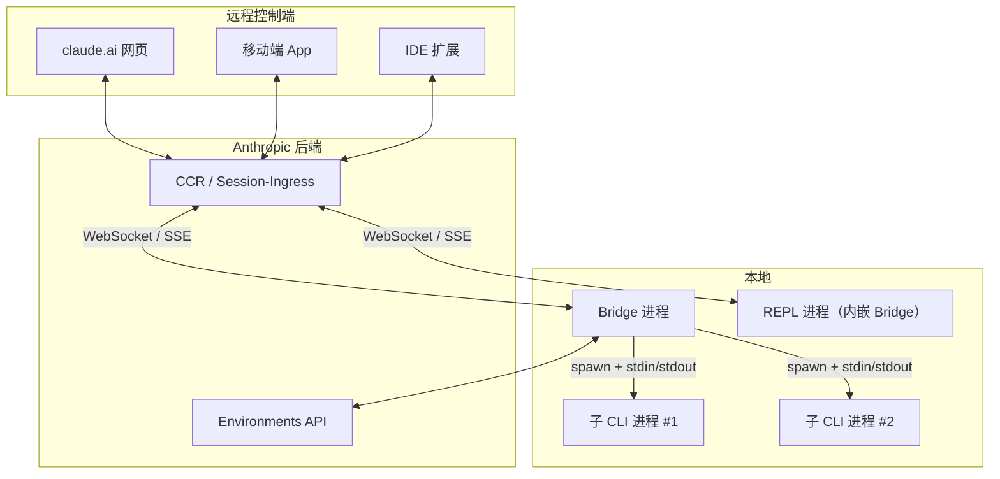
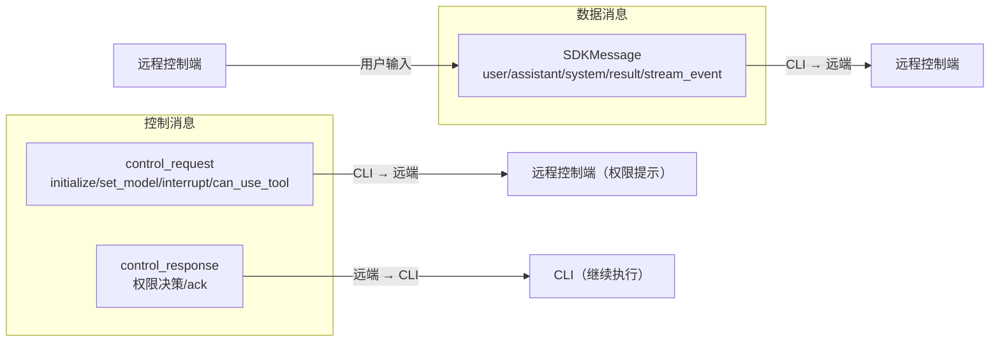
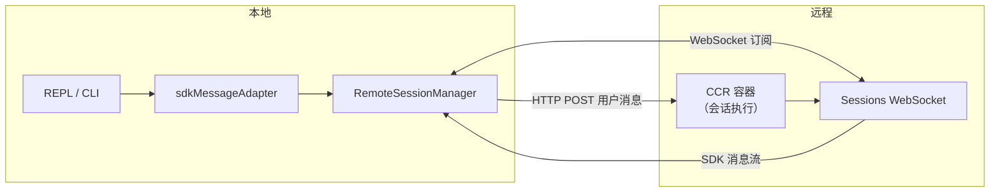

# Claude Code Bridge 桥接系统：IDE 集成与远程模式

Claude Code 的核心是一个终端 REPL，但它的能力远不止于此。通过 Bridge 桥接系统，一个本地运行的 CLI 会话可以被 claude.ai 网页端、移动端 App、以及 IDE 扩展远程操控——用户可以在手机上发起对话，在网页端审批权限，在 IDE 里看到实时的工具调用状态。这套「本地执行、远程控制」的架构，是 Claude Code 区别于纯终端 Agent 的关键能力之一。本文从源码层面拆解 Bridge 系统：先看整体架构与两种运行模式，再看消息协议与会话管理，最后覆盖权限回调、JWT 认证与远程会话模式。

Bridge 系统的核心挑战在于：CLI 是终端进程，没有原生 UI；而远程控制端（网页/移动端）需要展示权限对话框、实时流式输出、多会话切换。Bridge 要在两类进程之间建立一条可靠的双向通道，同时处理 JSON-RPC 消息路由、权限审批转发、token 刷新、连接恢复等工程问题。`src/bridge/` 目录共 31 个文件、约 1.26 万行 TypeScript，覆盖了从传输层到 UI 展示的全部逻辑。

## 一、Bridge 系统总览

Bridge 系统有两种运行模式，对应两个不同的入口和代码路径：

| 维度 | Standalone Bridge | REPL Bridge |
|------|-------------------|-------------|
| 入口命令 | `claude remote-control` | REPL 内 `/remote-control` |
| 进程模型 | 独立守护进程 | REPL 进程内 |
| 核心文件 | `bridgeMain.ts`（2,999 行） | `replBridge.ts`（2,406 行） |
| 会话模型 | 多会话（默认上限 32） | 单会话 |
| 子进程 | spawn 子 CLI（`--print` 模式） | 无子进程，REPL 自身 |
| 传输层 | Session-Ingress WS（v1）/ CCR v2 SSE（v2 = SSE 读 + HTTP POST 写） | 同左 |

Standalone Bridge 是一个常驻守护进程：它向服务器注册一个「bridge environment」，轮询拉取工作项（work item），每个工作项对应一个会话请求。拉到工作项后，守护进程 spawn 一个子 CLI 进程，子进程通过 WebSocket（v1）或 SSE（v2）连接到 session-ingress 服务，建立双向通信。REPL Bridge 则运行在 REPL 进程内部，把当前 REPL 会话直接桥接到 claude.ai，无需 spawn 子进程。

两种模式共享大量基础设施：消息协议（`bridgeMessaging.ts`）、JWT 刷新（`jwtUtils.ts`）、权限回调类型（`bridgePermissionCallbacks.ts`）、会话运行器（`sessionRunner.ts`）、远程桥接核心（`remoteBridgeCore.ts`）。这种共享设计确保两种模式在消息路由、权限转发、token 管理上行为一致。

## 二、整体架构



Standalone Bridge 的数据流是：远程控制端 → CCR 后端 → Bridge 守护进程 → 子 CLI 进程。Bridge 进程本身不做模型推理，它只负责拉取工作、管理子进程生命周期、转发消息与权限决策。REPL Bridge 的数据流更短：远程控制端 → CCR 后端 → REPL 进程，没有中间的子进程层。

Bridge 系统的关键文件及其规模如下：

| 文件 | 行数 | 职责 |
|------|------|------|
| `bridgeMain.ts` | 2,999 | Standalone Bridge 主循环、工作轮询、会话 spawn |
| `replBridge.ts` | 2,406 | REPL Bridge 核心、传输层管理 |
| `remoteBridgeCore.ts` | 1,008 | 共享桥接核心（v1/v2 通用） |
| `bridgeUI.ts` | 530 | Bridge 状态显示 UI |
| `bridgeApi.ts` | 539 | Environments API 客户端 |
| `sessionRunner.ts` | 550 | 子进程 spawn 与活动追踪 |
| `bridgeMessaging.ts` | 461 | 消息路由、回声去重、控制请求处理 |
| `initReplBridge.ts` | 569 | REPL Bridge 初始化 |
| `replBridgeTransport.ts` | 370 | v1/v2 传输层适配 |
| `jwtUtils.ts` | 256 | JWT 解码与 token 刷新调度 |
| `types.ts` | 262 | 全部类型定义 |

## 三、Standalone Bridge 主循环

`bridgeMain.ts` 的核心是 `runBridgeLoop` 函数，它实现了一个「轮询 → 分发 → spawn → 监控」的循环。整个循环可以概括为四个阶段：

```mermaid
sequenceDiagram
    participant Loop as Poll Loop
    participant API as Environments API
    participant Spawner as SessionSpawner
    participant Child as 子 CLI 进程
    Loop->>API: pollForWork(environmentId)
    API-->>Loop: WorkResponse | null
    alt 无工作
        Loop->>Loop: sleep(pollInterval)
    else 有工作
        Loop->>API: acknowledgeWork(workId)
        Loop->>Spawner: spawn(sessionId, sdkUrl, accessToken)
        Spawner->>Child: claude --print --sdk-url ...
        Child-->>Spawner: NDJSON 流（stdout）
        Spawner->>Loop: SessionHandle
        Loop->>Loop: 注册活动追踪
        Loop->>API: heartbeatWork(workId, token)
    end
```

### 3.1 工作轮询

主循环以 `while (!loopSignal.aborted)` 驱动，每轮调用 `api.pollForWork()` 向服务器拉取工作项。轮询间隔由 `pollConfigDefaults.ts` 配置，分三档：

```ts
const POLL_INTERVAL_MS_NOT_AT_CAPACITY = 2000      // 空闲时 2 秒
const POLL_INTERVAL_MS_AT_CAPACITY = 600_000       // 满载时 10 分钟
const MULTISESSION_POLL_INTERVAL_MS_PARTIAL_CAPACITY = 2000  // 部分占用 2 秒
```

空闲时 2 秒一次轮询，保证用户在网页端发起会话后能在 2 秒内被本地 Bridge 接收。满载（活跃会话数达到 `maxSessions`）时切换到 10 分钟一次轮询，配合心跳保活——10 分钟的选择不是随意的，服务器侧的 `BRIDGE_LAST_POLL_TTL` 为 4 小时，10 分钟轮询提供了 24 倍裕量。

满载状态下还有一个「心跳模式」：当 `non_exclusive_heartbeat_interval_ms > 0` 时，循环不再轮询，而是以心跳间隔发送 `heartbeatWork` 请求延长工作项的租约。心跳与轮询可以组合——心跳循环内设一个 `pollDeadline`，到期后跳出心跳回到轮询。这种设计让满载时既保持租约活跃（心跳），又不遗漏服务器侧的 token 轮换重派（轮询）。

### 3.2 工作项分发

`pollForWork` 返回的 `WorkResponse` 携带一个 `secret` 字段——base64url 编码的 JSON，解码后得到 `WorkSecret`：

```ts
export type WorkSecret = {
  version: number
  session_ingress_token: string  // JWT，子进程用它连接 session-ingress
  api_base_url: string
  sources: Array<{ type: string; git_info?: { ... } }>
  auth: Array<{ type: string; token: string }>
  use_code_sessions?: boolean    // 服务器决定走 v1 还是 v2
}
```

`use_code_sessions` 是服务器侧的版本选择器——为 `true` 时走 CCR v2 路径（SSE 传输 + CCRClient 写入），否则走 v1（Session-Ingress WebSocket）。Bridge 不会自行决定版本，完全服从服务器配置。

工作项类型分两种：`healthcheck`（健康检查，直接 ack 即可）和 `session`（实际会话请求）。session 类型的工作项携带 `id`（会话 ID），Bridge 据此 spawn 子进程。在 spawn 之前有一个关键的幂等性检查：如果 `completedWorkIds` 集合中已包含该 work ID，说明这是服务器的重复派发（stop 请求尚未被服务器处理），直接跳过避免重复 spawn。

### 3.3 子进程 spawn 与 CCR v2 注册

子进程通过 `createSessionSpawner` 创建。spawn 的命令行参数值得注意：

```ts
const args = [
  ...deps.scriptArgs,
  '--print',
  '--sdk-url', opts.sdkUrl,
  '--session-id', opts.sessionId,
  '--input-format', 'stream-json',
  '--output-format', 'stream-json',
  '--replay-user-messages',
  ...(deps.verbose ? ['--verbose'] : []),
  ...(debugFile ? ['--debug-file', debugFile] : []),
  ...(deps.permissionMode ? ['--permission-mode', deps.permissionMode] : []),
]
```

子进程以 `--print` 模式运行（非交互），通过 `--sdk-url` 指向 session-ingress 或 CCR v2 端点，输入输出均为 `stream-json`（NDJSON 流）。`--replay-user-messages` 让子进程把用户消息回显到 stdout，Bridge 据此提取首条用户消息派生会话标题。

CCR v2 路径多了一步 worker 注册。Bridge 调用 `registerWorker(sdkUrl, session_ingress_token)` 向 CCR 后端注册自己为该会话的 worker，获得一个 `workerEpoch`。epoch 是并发控制的关键——同一会话只能有一个活跃 worker，新注册会使旧 worker 的心跳 409 失败。注册有两次重试机会，全部失败则放弃该会话。

环境变量方面有两个重要设置：`CLAUDE_CODE_OAUTH_TOKEN` 被显式置为 `undefined`（剥离 Bridge 自身的 OAuth token，让子进程使用 session ingress token 做推理），`CLAUDE_CODE_ENVIRONMENT_KIND` 设为 `'bridge'`（让子进程知道自己运行在 bridge 环境中）。

### 3.4 Worktree 隔离与容量唤醒

多会话模式下，Bridge 支持三种 spawn 模式：`single-session`（单会话，桥接结束即退出）、`same-dir`（多会话共享 cwd）、`worktree`（每个会话获得独立 git worktree）。worktree 模式通过 `createAgentWorktree` 为每个会话创建隔离的工作目录，避免并发会话互相踩踏文件修改：

```ts
if (spawnModeAtDecision === 'worktree' &&
    (initialSessionId === undefined || !sameSessionId(sessionId, initialSessionId))) {
  const wt = await createAgentWorktree(`bridge-${safeFilenameId(sessionId)}`)
  sessionWorktrees.set(sessionId, { worktreePath: wt.worktreePath, ... })
  sessionDir = wt.worktreePath
}
```

首个预创建的会话（`initialSessionId`）例外——它运行在用户调用 `rc` 的原始目录，匹配单会话模式的 UX。worktree 创建可能耗时 1-2 秒，代码刻意在 `await` 前捕获 `spawnModeAtDecision`，因为 `w` 键处理器可能在此期间切换模式，导致分析与日志不一致。

会话结束时，`onSessionDone` 触发 `capacityWake.wake()`——这是 at-capacity 睡眠的提前唤醒机制。`capacityWake.ts` 用两个 `AbortController` 合并外部信号与唤醒信号：

```ts
function signal(): CapacitySignal {
  const merged = new AbortController()
  outerSignal.addEventListener('abort', abort, { once: true })
  wakeController.signal.addEventListener('abort', abort, { once: true })
  return { signal: merged.signal, cleanup: () => { /* 移除监听 */ } }
}
```

`wake()` 先 abort 当前 controller 再创建新的——这让下一次 `signal()` 调用获得一个全新的、未 abort 的 controller。`cleanup` 在 sleep 正常结束后移除监听器，防止内存泄漏。这个 56 行的模块被 `bridgeMain.ts` 和 `replBridge.ts` 共享，替代了两者此前逐字节重复的唤醒逻辑。

## 四、消息协议

`bridgeMessaging.ts` 定义了 Bridge 的消息协议。Ch01 提到的「JSON-RPC over WebSocket」是宽泛说法——实际不是标准的 JSON-RPC 2.0（没有标准的 request/response/notification 三态模式），而是 Claude Code 自定义的 SDK 消息格式，但核心思路一致：用 `type` 字段做 discriminated union，控制消息与数据消息分流。

### 4.1 消息类型

协议中有三类消息在通道上流动：



`SDKMessage` 是数据通道，携带用户消息、助手回复、系统事件、流式事件等。`control_request` 是 CLI 向远端发起的控制请求——最关键的是 `can_use_tool`，即权限请求。`control_response` 是远端的响应——权限审批的结果（allow/deny）。

`isEligibleBridgeMessage` 过滤器决定哪些消息应该转发到远端：只有 `user`、`assistant` 和 `local_command` 类型的系统消息会被转发；`tool_result`、`progress` 等内部 REPL 噪声被过滤。虚拟消息（REPL 内部调用产生的 `isVirtual` 标记）也被排除——远端看到的是 REPL 工具调用的摘要，而非内部实现细节。

### 4.2 入站路由

`handleIngressMessage` 是所有入站消息的统一入口。它的路由逻辑是三段式：

```ts
export function handleIngressMessage(
  data: string,
  recentPostedUUIDs: BoundedUUIDSet,    // 我们发出的消息的 UUID
  recentInboundUUIDs: BoundedUUIDSet,   // 已转发过的入站 UUID
  onInboundMessage?: (msg: SDKMessage) => void,
  onPermissionResponse?: (response: SDKControlResponse) => void,
  onControlRequest?: (request: SDKControlRequest) => void,
): void {
  const parsed = normalizeControlMessageKeys(jsonParse(data))
  if (isSDKControlResponse(parsed)) { onPermissionResponse?.(parsed); return }
  if (isSDKControlRequest(parsed))  { onControlRequest?.(parsed); return }
  if (!isSDKMessage(parsed)) return
  // UUID 去重...
  if (parsed.type === 'user') { onInboundMessage?.(parsed) }
}
```

`control_response` 优先检查——它不是 `SDKMessage` 联合类型的一部分，必须在类型守卫之前判断。`control_request` 其次，它需要在 10-14 秒内响应，否则服务器会杀掉 WebSocket 连接。最后才是常规的 `SDKMessage`，只有 `user` 类型会被转发给 `onInboundMessage`（其他类型如 `assistant` 是 CLI 自己产生的，不需要从远端接收）。

### 4.3 回声去重

Bridge 通道有一个微妙的回声问题：Bridge 发出的消息可能被服务器回放回来。`BoundedUUIDSet` 是一个 FIFO 环形缓冲区，用于追踪已发出和已接收的 UUID：

```ts
export class BoundedUUIDSet {
  private readonly ring: (string | undefined)[]
  private readonly set = new Set<string>()
  private writeIdx = 0
  add(uuid: string): void {
    if (this.set.has(uuid)) return
    const evicted = this.ring[this.writeIdx]
    if (evicted !== undefined) this.set.delete(evicted)
    this.ring[this.writeIdx] = uuid
    this.set.add(uuid)
    this.writeIdx = (this.writeIdx + 1) % this.capacity
  }
}
```

`recentPostedUUIDs` 记录 Bridge 发出的消息 UUID，收到相同 UUID 的入站消息时判定为回声并丢弃。`recentInboundUUIDs` 是第二道防线——SSE 序号协商（`from_sequence_num`）失败时，服务器可能重放已转发过的历史消息，这个集合捕获这类边缘情况。两个集合都是 O(capacity) 内存，环形缓冲区在容量满时淘汰最旧条目。注释明确指出，这是「外部排序（hook 的 `lastWrittenIndexRef`）之后的第二道安全网」。

### 4.4 服务器控制请求处理

`handleServerControlRequest` 响应服务器发起的控制请求。它支持五种子类型：

| subtype | 含义 | 响应 |
|---------|------|------|
| `initialize` | 连接建立协商 | 返回空 capabilities + PID |
| `set_model` | 切换模型 | 回调 `onSetModel` 后 ack |
| `set_max_thinking_tokens` | 调整思考 token 预算 | 回调后 ack |
| `set_permission_mode` | 切换权限模式 | 回调返回裁决，可拒绝 |
| `interrupt` | 中断当前轮次 | 回调 `onInterrupt` 后 ack |

`outboundOnly` 模式是一个重要的安全开关。当为 `true` 时，所有可变请求（interrupt、set_model、set_permission_mode、set_max_thinking_tokens）都返回错误而非 false-success：

```ts
const OUTBOUND_ONLY_ERROR =
  'This session is outbound-only. Enable Remote Control locally to allow inbound control.'
```

`initialize` 是唯一的例外——即使 outbound-only 也必须返回 success，否则服务器会杀掉连接。这个模式用于 CCR Mirror（本地会话同步到远端做镜像，但不接受远端控制）和 SDK 的 `/bridge` 子路径场景。

## 五、会话运行器

`sessionRunner.ts` 负责子 CLI 进程的完整生命周期：spawn、活动追踪、权限请求检测、优雅退出。`createSessionSpawner` 返回一个 `SessionSpawner`，其 `spawn` 方法是核心。

### 5.1 活动追踪

子进程的 stdout 是 NDJSON 流，每行一条消息。`extractActivities` 解析这些消息，提取出用户可读的活动摘要：

```ts
const TOOL_VERBS: Record<string, string> = {
  Read: 'Reading', Write: 'Writing', Edit: 'Editing',
  MultiEdit: 'Editing', Bash: 'Running', Glob: 'Searching',
  Grep: 'Searching', WebFetch: 'Fetching', WebSearch: 'Searching',
  Task: 'Running task', LSP: 'LSP',
}
```

工具名被映射为动词（`Read` → `Reading`），配合输入中的 `file_path`/`command`/`url` 等字段生成摘要，如 `Editing src/foo.ts`。活动存储在一个长度为 10 的环形缓冲区中，UI 据此显示最近 5 次工具调用的「轨迹」（trail）。

### 5.2 权限请求检测

子进程在需要权限时，会通过 stdout 发出 `can_use_tool` 类型的 `control_request`。`sessionRunner.ts` 在解析每行 NDJSON 时检测这类消息：

```ts
if (msg.type === 'control_request') {
  const request = msg.request as Record<string, unknown> | undefined
  if (request?.subtype === 'can_use_tool' && deps.onPermissionRequest) {
    deps.onPermissionRequest(opts.sessionId, parsed as PermissionRequest, opts.accessToken)
  }
}
```

`PermissionRequest` 的结构是：

```ts
export type PermissionRequest = {
  type: 'control_request'
  request_id: string
  request: {
    subtype: 'can_use_tool'
    tool_name: string
    input: Record<string, unknown>
    tool_use_id: string
  }
}
```

在 standalone bridge 中，`onPermissionRequest` 回调只是记录日志——`bridgeMain.ts:2586` 的回调注释为 `(not auto-approving)`。实际的权限审批发生在 claude.ai 网页端：服务器把 `control_request` 转发给网页，网页弹出原生权限对话框，用户选择 allow/deny 后，网页把 `control_response` 发回服务器，服务器再通过 WebSocket 投递给子进程。这条链路跨越了三个进程（子 CLI → Bridge → 服务器 → 网页），但子进程感知不到——它只看到一个 `control_response` 回来，和本地 REPL 的权限流程完全一致。

### 5.3 优雅退出

子进程退出时，`on('close')` 根据退出码和信号判断状态：

- `SIGTERM`/`SIGINT` → `'interrupted'`
- exit code 0 → `'completed'`
- 其他 → `'failed'`

`SessionHandle` 提供 `kill()`（SIGTERM）和 `forceKill()`（SIGKILL）两级终止。`forceKill` 用独立的 `sigkillSent` 标志而非 `child.killed`，因为 `child.killed` 在 `kill()` 调用时就置 true，而非进程真正退出时——需要在 SIGTERM 后仍能发 SIGKILL。

token 刷新通过 `updateAccessToken` 实现：新 token 通过 stdin 以 `update_environment_variables` 消息发给子进程，子进程的 StructuredIO 据此更新 `process.env.CLAUDE_CODE_SESSION_ACCESS_TOKEN`，下次刷新 headers 时自然使用新 token。

## 六、权限回调桥接

`bridgePermissionCallbacks.ts` 定义了权限回调的抽象接口，是连接 CLI 权限系统与 Bridge 传输层的桥梁：

```ts
type BridgePermissionResponse = {
  behavior: 'allow' | 'deny'
  updatedInput?: Record<string, unknown>      // 允许修改工具输入
  updatedPermissions?: PermissionUpdate[]    // 顺带更新权限规则
  message?: string                            // deny 时的原因
}

type BridgePermissionCallbacks = {
  sendRequest(...): void            // CLI → 远端：发起权限请求
  sendResponse(...): void           // 远端 → CLI：返回权限决策
  cancelRequest(requestId): void   // 取消待处理的请求
  onResponse(requestId, handler): () => void  // 注册响应回调
}
```

这个接口的定义揭示了一个重要设计：权限审批不只是 allow/deny 二选一。`updatedInput` 允许审批者修改工具输入——例如用户在审批 Bash 命令时，可以修正命令中的错误路径再放行。`updatedPermissions` 允许审批者顺带添加永久权限规则（「以后这类操作自动放行」），这与 Claude Code 的权限系统（7 种权限模式 + denial tracking）深度集成。

在 REPL Bridge 中，权限流程的状态机通过 `reportState` 同步给服务器：

```ts
sendControlRequest(request: SDKControlRequest) {
  if (request.request.subtype === 'can_use_tool') {
    transport.reportState('requires_action')  // 告诉服务器：等待用户操作
  }
  void transport.write(event)
}
sendControlResponse(response: SDKControlResponse) {
  transport.reportState('running')  // 告诉服务器：恢复运行
  void transport.write(event)
}
```

`requires_action` 状态让 claude.ai 网页端显示「等待权限审批」指示器，`running` 状态清除它。`control_cancel_request` 是另一条路径——当本地 hook、AI 分类器或通道审批先于远端解决了权限时，需要显式取消远端待处理的请求，否则服务器停留在 `requires_action` 状态等待一个永远不会到来的响应。

`isBridgePermissionResponse` 类型守卫只检查 `behavior` 判别字段而非完整结构验证——这是一种刻意的宽松校验，让接口对未来扩展字段保持兼容。

## 七、JWT 认证

`jwtUtils.ts` 实现了 session ingress token 的刷新调度。子进程连接 session-ingress 用的 JWT 有过期时间（通常 4 小时），过期后连接断开。`createTokenRefreshScheduler` 在过期前 5 分钟主动刷新：

```ts
const TOKEN_REFRESH_BUFFER_MS = 5 * 60 * 1000    // 过期前 5 分钟刷新
const FALLBACK_REFRESH_INTERVAL_MS = 30 * 60 * 1000  // 兜底 30 分钟
const MAX_REFRESH_FAILURES = 3                     // 最多 3 次失败
```

### 7.1 JWT 解码

`decodeJwtPayload` 不验证签名地解码 JWT payload——Bridge 是客户端，不负责验证签名（那是服务器的事），只需要读 `exp` 过期时间：

```ts
export function decodeJwtPayload(token: string): unknown | null {
  const jwt = token.startsWith('sk-ant-si-')
    ? token.slice('sk-ant-si-'.length)  // 剥离 session-ingress 前缀
    : token
  const parts = jwt.split('.')
  if (parts.length !== 3 || !parts[1]) return null
  return jsonParse(Buffer.from(parts[1], 'base64url').toString('utf8'))
}
```

`sk-ant-si-` 前缀是 session-ingress token 的标识，解码前需要剥离。如果 JWT 不可解码（如直接传入 OAuth token），`schedule` 会保留现有定时器而非打断刷新链。

### 7.2 生成代际与竞态防护

刷新调度器维护一个 `generations` Map——每次 `schedule` 或 `cancel` 都会递增对应 session 的代际号。`doRefresh` 是异步的，在 `await getAccessToken()` 期间，session 可能被取消或重新调度。完成后检查代际号是否变化，若变化则跳过后续操作：

```ts
async function doRefresh(sessionId: string, gen: number): Promise<void> {
  oauthToken = await getAccessToken()
  if (generations.get(sessionId) !== gen) {
    // 期间被取消或重新调度，放弃
    return
  }
  onRefresh(sessionId, oauthToken)
  // 安排下一次兜底刷新
}
```

这是处理「异步操作期间状态变更」的经典模式——用单调递增的代际号检测过期操作，避免孤儿定时器。

### 7.3 v1 与 v2 的刷新差异

`onRefresh` 回调在 v1 和 v2 下行为不同。v1 直接把新 OAuth token 通过 stdin 发给子进程（`handle.updateAccessToken(oauthToken)`）。v2 不能这么做——CCR v2 端点验证 JWT 的 `session_id` claim，OAuth token 没有这个 claim。因此 v2 走 `api.reconnectSession(environmentId, sessionId)`，触发服务器侧的重派——下一次 `pollForWork` 会带回新的 JWT，Bridge 通过 `existingHandle` 路径把新 token 交付给子进程：

```ts
const existingHandle = activeSessions.get(sessionId)
if (existingHandle) {
  existingHandle.updateAccessToken(secret.session_ingress_token)
  tokenRefresh?.schedule(sessionId, secret.session_ingress_token)
  await ackWork()
  break
}
```

这种「重派而非刷新」的设计是 v2 安全模型的必然结果——每个 JWT 绑定特定的 session_id 和 worker epoch，无法像 v1 那样用 OAuth token 直接替换。

## 八、REPL Bridge

`replBridge.ts` 实现了运行在 REPL 进程内部的 Bridge。与 standalone bridge 不同，它不需要 spawn 子进程——REPL 自身就是被桥接的会话。`ReplBridgeHandle` 暴露了完整的双向通信接口：

```ts
export type ReplBridgeHandle = {
  bridgeSessionId: string
  environmentId: string
  sessionIngressUrl: string
  writeMessages(messages: Message[]): void       // REPL → 远端
  writeSdkMessages(messages: SDKMessage[]): void
  sendControlRequest(request: SDKControlRequest): void
  sendControlResponse(response: SDKControlResponse): void
  sendControlCancelRequest(requestId: string): void
  sendResult(): void
  teardown(): Promise<void>
}
```

### 8.1 传输层选择

`replBridgeTransport.ts` 抽象了 v1 与 v2 的差异。v1 使用 `HybridTransport`（WebSocket 读 + HTTP POST 写），v2 使用 `SSETransport`（SSE 读）+ `CCRClient`（CCR v2 写）。两种传输通过 `ReplBridgeTransport` 接口统一：

```ts
export type ReplBridgeTransport = {
  write(message: StdoutMessage): Promise<void>
  writeBatch(messages: StdoutMessage[]): Promise<void>
  setOnData(callback: (data: string) => void): void
  setOnClose(callback: (closeCode?: number) => void): void
  getLastSequenceNum(): number      // SSE 序号高水位
  reportState(state: SessionState): void  // v2 专用，v1 no-op
  flush(): Promise<void>            // v2 专用
}
```

`getLastSequenceNum` 是 v2 传输切换的关键——SSE 协议支持 `from_sequence_num` / `Last-Event-ID`，新传输可以告诉服务器从哪个序号续传，避免重放整个会话历史。v1 的 Session-Ingress WS 不用序号，重放语义由服务器侧的消息游标处理，所以始终返回 0。

### 8.2 共享核心

`remoteBridgeCore.ts`（1,008 行）是 v1 和 v2 的共享核心。它抽取了两种模式通用的逻辑：消息写入与回声去重、传输层回调装配、权限响应路由、401 认证恢复。

认证恢复是一个精细的状态机。当传输层收到 401 关闭码时，`recoverFromAuthFailure` 被触发：它先设置 `authRecoveryInFlight = true`（阻止此期间的写入，避免消息丢失），拉取新凭证，调用 `rebuildTransport` 重建传输层。重建过程保留旧传输的 SSE 序号，确保无缝续传。整个恢复期间，所有 `sendControlRequest`/`sendControlResponse` 都被丢弃（日志记录后 return），因为旧传输的 epoch 已过期，写入会 409。

`rebuildTransport` 的注释强调了 epoch 的语义：「每次 /bridge 调用都会在服务器侧递增 epoch。刷新和 401 恢复两条路径都必须重建传输层——只换 JWT 而不重建，旧 CCRClient 会用心跳保活一个过期 epoch，导致 409。」

401 恢复期间还有一个 `flushGate` 机制——传输层重建期间，所有写入操作被暂存到 gate 中，直到新传输就绪。没有这个门控，`writeMessages` 会往一个已经关闭的旧传输写入（uploader 在 409 后静默失效），把 UUID 加入 `recentPostedUUIDs` 后写入实际 no-op，导致永久性消息丢失。`flushGate.start()` 在重建入口同步调用（在任何 `await` 之前），`drainFlushGate()` 在新传输连接成功后释放。

### 8.3 故障注入框架

`bridgeDebug.ts` 提供了一套 ant 内部专用的故障注入框架，用于手动测试 Bridge 的恢复路径。通过 REPL 的 `/bridge-kick` 命令可以注入四种故障：`pollForWork` 404（环境丢失）、`registerBridgeEnvironment` 瞬态失败、`reconnectSession` 错误、`heartbeatWork` 失败。

```ts
type BridgeFault = {
  method: 'pollForWork' | 'registerBridgeEnvironment' | 'reconnectSession' | 'heartbeatWork'
  kind: 'fatal' | 'transient'  // fatal → teardown, transient → retry/backoff
  status: number
  count: number                 // 剩余注入次数，递减至 0 移除
}
```

`fatal` 与 `transient` 的区分对应真实故障模式——fatal 错误（404 环境丢失、403 权限失效）走 teardown 路径，transient 错误（5xx、网络中断）走重试退避。注释引用了 BQ 2026-03-12 的 7 天窗口数据：`poll 404` 每周 14.7 万次（`onEnvironmentLost` 门控失效）、`ws_closed 1002/1006` 每周 2.2 万次（关闭后僵尸轮询）。这套注入框架让开发者能在本地复现这些线上故障，验证恢复逻辑的正确性。

`injectBridgeFault` 用模块级状态而非依赖注入——注释解释了原因：「一个 REPL 进程只有一个 bridge，`/bridge-kick` 命令没有其他方式触达 `initBridgeCore` 的闭包」。`teardown` 时 `clearBridgeDebugHandle` 清除槽位。`wakePollLoop` 方法可中断 at-capacity 睡眠，让注入的 poll 故障立即生效而非等待最长 10 分钟。

## 九、远程会话模式

`src/remote/` 目录实现了远程会话模式——连接到一个运行在远程 CCR 容器上的会话，而非桥接本地 CLI。这与 Bridge 的定位相反：Bridge 是「本地执行、远程控制」，远程会话是「远程执行、本地查看」。



### 9.1 RemoteSessionManager

`RemoteSessionManager.ts` 是远程会话的编排器，协调三个职责：WebSocket 订阅（接收消息）、HTTP POST 发送（用户消息）、权限请求/响应流程。

连接建立后，`RemoteSessionManager` 维护一个 `pendingPermissionRequests` Map——当 CCR 发来 `can_use_tool` 控制请求时，存入 Map 并回调 `onPermissionRequest`。用户在本地 REPL 审批后，`respondToPermissionRequest` 从 Map 取出请求，构造 `control_response` 通过 WebSocket 发回 CCR。

`control_cancel_request` 是服务器取消待处理权限请求的通道——压缩期间服务器可能短暂认为会话已过期（4001），取消未决的权限提示避免用户审批一个已经无效的请求。

### 9.2 SessionsWebSocket

`SessionsWebSocket.ts` 是 WebSocket 客户端，连接 `/v1/sessions/ws/{sessionId}/subscribe`。它的重连策略与 MCP 客户端类似但有关键差异：

```ts
const RECONNECT_DELAY_MS = 2000
const MAX_RECONNECT_ATTEMPTS = 5
const PING_INTERVAL_MS = 30000
const MAX_SESSION_NOT_FOUND_RETRIES = 3
const PERMANENT_CLOSE_CODES = new Set([4003])  // unauthorized
```

4003（unauthorized）是永久错误，立即停止重连。4001（session not found）被特殊处理——压缩期间服务器可能短暂认为会话不存在，给予 3 次重试机会，每次延迟递增（2s、4s、6s）。这个设计的注释解释了原因：「压缩期间服务器可能短暂认为会话已过期，而 CLI worker 正忙于压缩 API 调用、不发射事件。」

Bun 和 Node 的 WebSocket 实现再次分叉——Bun 原生支持 headers/proxy/TLS，Node 用 `ws` 包。两者都支持 `ping()`，30 秒一次心跳保活。

### 9.3 SDK 消息适配器

`sdkMessageAdapter.ts` 是远程会话模式与本地 REPL 之间的翻译层。CCR 后端发送 SDK 格式的消息（`SDKMessage`），本地 REPL 期望内部 `Message` 类型。`convertSDKMessage` 把前者转换为后者：

```ts
export function convertSDKMessage(msg: SDKMessage, opts?: ConvertOptions): ConvertedMessage {
  switch (msg.type) {
    case 'assistant': return { type: 'message', message: convertAssistantMessage(msg) }
    case 'stream_event': return { type: 'stream_event', event: convertStreamEvent(msg) }
    case 'result': return msg.subtype !== 'success'
      ? { type: 'message', message: convertResultMessage(msg) }
      : { type: 'ignored' }  // 成功结果是噪声，不显示
    case 'system': /* init / status / compact_boundary */
    case 'tool_progress': return { type: 'message', message: convertToolProgressMessage(msg) }
    // ...
  }
}
```

`user` 消息的处理最微妙——`convertToolResults` 选项决定是否把 `tool_result` 内容块转为 `UserMessage`。在 direct connect 模式下，工具结果来自远程服务器、需要本地渲染；在 CCR 模式下，用户消息处理方式不同，直接忽略。`parent_tool_use_id` 不能用来区分工具结果——agent 侧的 `normalizeMessage()` 对顶层工具结果硬编码为 null，必须通过 content shape（`tool_result` block）检测。

### 9.4 远程权限桥接

`remotePermissionBridge.ts` 解决了一个独特问题：远程 CCR 运行的工具可能在本地 CLI 没有对应的工具定义（如远程专属的 MCP 工具）。`createToolStub` 为这些「未知工具」生成最小化的 Tool 桩：

```ts
export function createToolStub(toolName: string): Tool {
  return {
    name: toolName,
    isEnabled: () => true,
    userFacingName: () => toolName,
    renderToolUseMessage: (input) => /* 取前 3 个字段渲染 */,
    call: async () => ({ data: '' }),
    needsPermissions: () => true,
    isMcp: false,
  } as unknown as Tool
}
```

`needsPermissions: () => true` 确保桩工具走 `FallbackPermissionRequest` 路径，弹出权限对话框。`createSyntheticAssistantMessage` 为远程权限请求构造合成的 `AssistantMessage`——本地没有真实的助手消息（工具调用在远程 CCR 上执行），但权限系统的 `ToolUseConfirm` 类型要求一个 `AssistantMessage`，合成一个满足类型约束。

合成消息的 `usage` 全部归零、`model` 为空字符串——它只用于满足类型约束、让权限对话框能渲染工具名和输入，不参与 token 计数或上下文管理。这种「类型先行、数据后填」的模式在类型系统严格的语言中很常见：当远端拥有本地不具备的信息时，用一个结构完整但内容最小的占位对象穿过类型边界。

### 9.5 入站消息规范化

`inboundMessages.ts` 处理从远程控制端发来的用户消息。一个容易被忽略但影响重大的问题是图片块的字段命名——iOS 和网页客户端可能发送 camelCase 的 `mediaType` 而非 snake_case 的 `media_type`，甚至完全省略该字段。未规范化的坏块会「毒化」整个会话——后续每次 API 调用都因 `media_type: Field required` 失败：

```ts
export function normalizeImageBlocks(
  blocks: Array<ContentBlockParam>,
): Array<ContentBlockParam> {
  if (!blocks.some(isMalformedBase64Image)) return blocks  // 快路径零分配
  return blocks.map(block => {
    if (!isMalformedBase64Image(block)) return block
    const src = block.source as unknown as Record<string, unknown>
    // 补全 media_type 或从 base64 推断格式
  })
}
```

快路径扫描在无异常块时直接返回原数组引用，避免在正常路径上分配新数组。`extractInboundMessageFields` 是入站消息的统一入口，过滤掉空内容和非 user 类型的消息，返回提取的 content 与 UUID 供 REPL 入队。

## 十、关键文件概览

Bridge 系统的其余文件各有专职：

| 文件 | 职责 |
|------|------|
| `bridgeApi.ts` | Environments API 客户端：注册环境、轮询工作、ack、心跳、权限事件投递 |
| `bridgeConfig.ts` | Bridge 配置：base URL、access token 读取 |
| `bridgeDebug.ts` | 故障注入框架：包装 API 客户端，支持按方法名注入错误 |
| `bridgeEnabled.ts` | Feature gate 检查：`BRIDGE_MODE` + `tengu_ccr_bridge` + 订阅验证 |
| `bridgeUI.ts` | 终端状态显示：banner、会话列表、活动轨迹、QR 码 |
| `replBridgeHandle.ts` | `ReplBridgeHandle` 的具体实现 |
| `capacityWake.ts` | 容量唤醒原语：会话结束时唤醒 at-capacity 睡眠 |
| `codeSessionApi.ts` | CCR v2 会话 API |
| `createSession.ts` | 会话创建：`POST /v1/sessions` |
| `inboundAttachments.ts` | 入站附件处理 |
| `inboundMessages.ts` | 入站用户消息处理：图片块规范化（camelCase → snake_case） |
| `pollConfig.ts` | 轮询间隔配置（GrowthBook 可调） |
| `pollConfigDefaults.ts` | 轮询默认值 |
| `trustedDevice.ts` | 可信设备 token |
| `workSecret.ts` | 工作项密钥解码、SDK URL 构造、worker 注册 |
| `remoteBridgeCore.ts` | v1/v2 共享桥接核心 |
| `envLessBridgeConfig.ts` | v2（env-less）配置：最小版本检查 |
| `flushGate.ts` | 写入刷新门控：传输层重建期间暂存写入 |
| `bridgePointer.ts` | 会话指针文件（`--continue` 恢复用） |
| `sessionIdCompat.ts` | `cse_*` ↔ `session_*` ID 转换 |
| `bridgeStatusUtil.ts` | 状态格式化工具 |

`bridgeEnabled.ts` 的门控逻辑值得单独说明。Remote Control 需要三个条件同时满足：编译期 `feature('BRIDGE_MODE')` 为真（外部构建中被 tree-shake 为 false）、运行期 `isClaudeAISubscriber()` 为真（排除 Bedrock/Vertex/API key 登录）、GrowthBook `tengu_ccr_bridge` gate 为真（灰度控制）。`getBridgeDisabledReason()` 提供细粒度诊断——区分「不是 claude.ai 订阅」「token scope 不全」「无法确定组织」「灰度未覆盖」四种拒绝原因，让用户看到可操作的错误信息而非笼统的「不可用」。

## 十一、设计取舍总结

回顾整个 Bridge 系统，几个关键的设计决策值得提炼。

**两种模式共享核心，差异隔离在入口**。Standalone Bridge 和 REPL Bridge 共享消息协议、JWT 刷新、权限回调，但进程模型完全不同——前者 spawn 子进程、后者内嵌。`remoteBridgeCore.ts` 抽取共享逻辑，`bridgeMain.ts` 和 `replBridge.ts` 各自处理进程模型差异。这种「核心共享、入口分离」的模式让两种模式在功能对齐的同时保持各自的简洁性。

**权限审批跨越三进程链路但对 CLI 透明**。子 CLI 发出 `can_use_tool` control_request → Bridge 转发 → 服务器路由 → 网页弹框 → 用户决策 → 原路返回。子进程只看到一个 `control_response`，和本地 REPL 的权限流程完全一致。这种「远程权限对 CLI 透明」的设计让工具代码无需感知运行模式——同一个 `checkPermissions` 调用，无论权限对话框出现在终端还是浏览器，代码路径不变。

**token 刷新用代际号而非取消令牌**。`createTokenRefreshScheduler` 用单调递增的 generation Map 检测过期操作，而非 `AbortController`。原因是 token 刷新的「取消」语义不是「立即停止」，而是「完成后丢弃结果」——`doRefresh` 的 `await getAccessToken()` 无法中断，但可以检查完成后代际号是否变化来决定是否继续。这种模式在无法真正取消异步操作时是更安全的选择。

**v2 用重派替代刷新**。v1 的 token 刷新是纯客户端操作——拿新 OAuth token 通过 stdin 发给子进程即可。v2 的 JWT 绑定 session_id 和 worker epoch，无法客户端侧替换，必须走服务器重派。这看似更复杂，实则是安全模型的升级——v2 的每个 token 都有明确的 session 绑定和 worker 身份，泄露后影响范围更小。代价是刷新链路更长（客户端 → 服务器重派 → 下次轮询带回新 token），`reconnectSession` 失败时需要重试。

**消息去重用环形缓冲区而非 Set**。`BoundedUUIDSet` 用环形数组 + Set 的组合实现 O(1) 的 add/has 和 O(capacity) 的内存。选择环形缓冲区而非无限增长的 Set，是因为 Bridge 是长运行进程——一个跑几天的 standalone bridge 会积累大量 UUID，无限 Set 会导致内存泄漏。环形缓冲区在容量满时自动淘汰最旧条目，由于消息按时间顺序到达，被淘汰的总是最不可能再被回声的旧 UUID。

这些决策共同构成了一个在「远程可控」与「本地可靠」之间取得平衡的 Bridge 系统。2,999 行的 `bridgeMain.ts` 看似庞大，但每一段轮询间隔、每一个 token 刷新分支、每一次权限转发都有对应的源码逻辑可追溯——这正是 Claude Code 能把 Remote Control 做成「手机上审批权限、本地继续执行」这种跨设备体验的工程基础。
