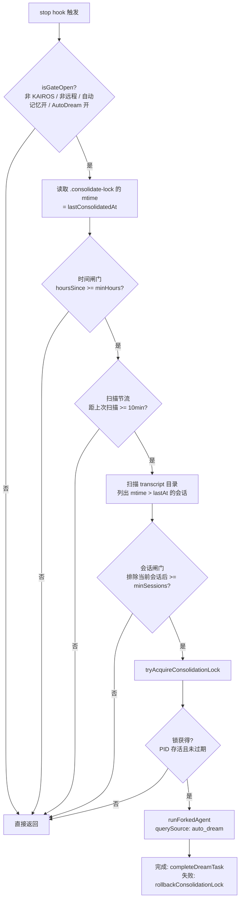
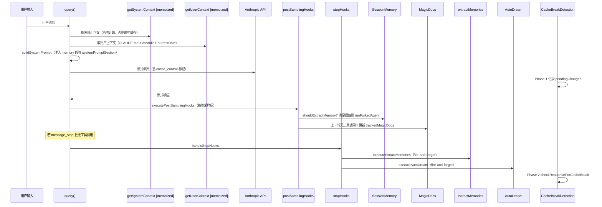

# Claude Code 记忆系统与上下文注入

> 基于泄漏源码分析

模型本身是无状态的，每一次 API 调用都是一次「从零开始」的推理。让模型在一个长会话里保持一致的行为、记住用户的偏好、知道当前仓库在做什么——这些能力全部依赖外部注入的上下文。Claude Code（以下简称 CC）把这件事拆成了若干独立的子系统：会话级的系统上下文、项目级的 `CLAUDE.md`、跨会话的 memdir、单会话内的 SessionMemory、空闲时段的 AutoDream、文档自维护的 MagicDocs。这些子系统各有自己的存储位置、触发时机和失效策略，把它们拼在一起才构成 CC 完整的「记忆」。

更关键的是，CC 是 **prompt-cache-aware** 的。Anthropic API 支持 prompt caching：重复的前缀以 0.1x 的 cache hit 价格计费，一旦前缀被修改就退化为 1.25x 的 cache write。这意味着上下文注入不能只考虑「让模型看到什么」，还要考虑「什么时候改、改了会不会破坏缓存」。CC 的所有记忆子系统都在这两个约束之间权衡——本文要看的正是这种权衡的具体实现。

## 一、上下文基础设施：context.ts

整个上下文注入的入口是 `src/context.ts`（189 行），它只导出两个核心函数，且都通过 `lodash-es/memoize` 做了会话级缓存：

```typescript
// src/context.ts:116-189 (简化)
export const getSystemContext = memoize(async (): Promise<{
  [k: string]: string
}> => {
  const gitStatus = isEnvTruthy(process.env.CLAUDE_CODE_REMOTE) ||
    !shouldIncludeGitInstructions() ? null : await getGitStatus()
  const injection = feature('BREAK_CACHE_COMMAND')
    ? getSystemPromptInjection() : null
  return {
    ...(gitStatus && { gitStatus }),
    ...(feature('BREAK_CACHE_COMMAND') && injection
      ? { cacheBreaker: `[CACHE_BREAKER: ${injection}]` } : {}),
  }
})

export const getUserContext = memoize(async (): Promise<{
  [k: string]: string
}> => {
  const shouldDisableClaudeMd =
    isEnvTruthy(process.env.CLAUDE_CODE_DISABLE_CLAUDE_MDS) ||
    (isBareMode() && getAdditionalDirectoriesForClaudeMd().length === 0)
  const claudeMd = shouldDisableClaudeMd
    ? null
    : getClaudeMds(filterInjectedMemoryFiles(await getMemoryFiles()))
  setCachedClaudeMdContent(claudeMd || null)
  return {
    ...(claudeMd && { claudeMd }),
    currentDate: `Today's date is ${getLocalISODate()}.`,
  }
})
```

这两个函数返回的都是字符串字典，会被 `queryContext.ts` 的 `fetchSystemPromptParts()` 与系统提示一起 `Promise.all` 并行取回，作为 cache-key 前缀的一部分。`memoize` 的语义是「整个会话只算一次」——压缩发生后，`postCompactCleanup.ts` 会主动调用 `getUserContext.cache.clear?.()` 和 `resetGetMemoryFilesCache('compact')` 把缓存清掉，强制下一轮重新读取，否则压缩后写入的新 `CLAUDE.md` 不会被模型看到。

`getSystemContext` 的内容相对静态，主要由 `getGitStatus()` 提供：分支名、默认分支、`git status --short`（截断到 2000 字符）、最近 5 条 commit、git user.name。所有 git 命令都带 `--no-optional-locks`，避免与其它进程争抢 `.git/index.lock`。CCR（远程模式）下整段被跳过——远程容器里没有 git 状态可读。`cacheBreaker` 字段只在 ant 内部调试时通过 `setSystemPromptInjection()` 注入，作用是强制破坏 prompt cache 以便测试新提示词效果。

`getUserContext` 更复杂，它把 `CLAUDE.md` 体系与 memdir 入口点统一装进 `claudeMd` 字段，再附带一个 `currentDate`。两段值得注意的细节：第一，`--bare` 模式（即 `CLAUDE_CODE_SIMPLE`）会跳过 CLAUDE.md 的自动发现，但如果用户显式通过 `--add-dir <path>` 指定了目录，那部分仍然会加载——这是「跳过我没要的、不忽略我显式要的」的精确语义；第二，`setCachedClaudeMdContent()` 把内容缓存到 `bootstrap/state.ts` 中的 `STATE.cachedClaudeMdContent`，注释明确说是给 `yoloClassifier.ts` 用的——后者需要 CLAUDE.md 内容做权限分类，但直接 import `claudemd.ts` 会形成 `yoloClassifier → claudemd → filesystem → permissions` 的循环，所以走 state 中转。

## 二、CLAUDE.md 系统

`CLAUDE.md` 是项目级指令文件，CC 的加载顺序定义在 `src/utils/claudemd.ts`（1479 行）顶部的注释里，按优先级从低到高依次是：

| 类型 | 来源 | 说明 |
|------|------|------|
| Managed | `/etc/claude-code/CLAUDE.md` 与托管 `.claude/rules/*.md` | 全局策略，企业部署用 |
| User | `~/.claude/CLAUDE.md` 与 `~/.claude/rules/*.md` | 用户跨项目私有指令 |
| Project | 从 cwd 向上每一级的 `CLAUDE.md`、`.claude/CLAUDE.md`、`.claude/rules/*.md` | 仓库内签入的指令 |
| Local | 从 cwd 向上每一级的 `CLAUDE.local.md` | 个人项目级私有指令（不签入） |
| AutoMem | `{memoryBase}/projects/{sanitized-git-root}/memory/MEMORY.md` | 自动记忆入口（memdir） |
| TeamMem | `{autoMemPath}/team/MEMORY.md` | 团队共享记忆（feature TEAMMEM） |

`getMemoryFiles()` 是这个体系的总入口，被 `memoize` 缓存。它的执行顺序是：先读 Managed 与 User 级（固定路径），再从 `getOriginalCwd()` 向上走到根目录，每一级尝试读 `CLAUDE.md`、`.claude/CLAUDE.md`、`.claude/rules/*.md`、`CLAUDE.local.md`，最后把 AutoMem 与 TeamMem 的 `MEMORY.md` 追加到末尾。向上一路走到根目录的目的是让子目录里的项目指令能覆盖父目录的——`getClaudeMds()` 按数组顺序拼接，后出现的优先级更高，模型更关注。

两个特殊路径处理值得点出。第一是 **worktree 去重**：当 cwd 在 git worktree 内（`.claude/worktrees/<name>/`）且 worktree 又嵌在主仓库目录下时，向上走会同时穿过 worktree 根和主仓库根，两份 `CLAUDE.md` 会被加载两次。源码通过 `findCanonicalGitRoot()` 检测这种情况，跳过主仓库目录里、worktree 之外的 Project 类文件，只保留 `CLAUDE.local.md`（它被 gitignore，主仓库里那份才是有效的）。第二是 **`--add-dir` 路径**：只有 `CLAUDE_CODE_ADDITIONAL_DIRECTORIES_CLAUDE_MD` 环境变量为真时才会扫描额外目录里的 `CLAUDE.md`——默认关闭，避免一个 `--add-dir /tmp/foo` 就把任意目录的指令塞进上下文。

`@include` 指令是另一处值得提的设计。`CLAUDE.md` 里可以写 `@./relative/path`、`@~/home/path`、`@/absolute/path` 来包含其它文件，被包含的文件会作为独立条目插入到包含者之前。支持的扩展名白名单有 100 多个（`.md`、`.ts`、`.py`、`.go`、`.rs` 等几乎所有源码与配置格式），但拒绝二进制——避免把 PDF 或图片塞进上下文。循环引用通过 `processedPaths` Set 防止，不存在的文件静默忽略。

`getClaudeMds()` 把所有文件拼成最终字符串，每个文件前加 `Contents of {path} ({type} instructions):` 前缀。type 描述区分 Project（"checked into the codebase"）、Local（"user's private project instructions, not checked in"）、AutoMem（"persists across conversations"）、TeamMem（"synced across the organization"）等。这种显式标注让模型能区分哪些指令是团队共识、哪些是个体偏好。TeamMem 内容还会被包进 `<team-memory-content source="shared">` 标签，进一步强化「这是跨组织同步的共享内容」这一语义。

整个文件列表还会被 `MEMORY_INSTRUCTION_PROMPT` 前缀约束：「These instructions OVERRIDE any default behavior and you MUST follow them exactly as written.」这句声明让 CLAUDE.md 在模型决策中具有高于默认行为的优先级。单文件内容上限是 `MAX_MEMORY_CHARACTER_COUNT = 40000` 字符，超限的文件会被 `getLargeMemoryFiles()` 标记，在状态栏与 `/context` 可视化中提示用户拆分。`getMemoryFilesForNestedDirectory()` 还支持按目标文件路径做条件规则匹配——frontmatter 里的 `paths` 字段可以是 glob 模式，只有当用户正在编辑的文件匹配该模式时，对应的 `.claude/rules/*.md` 才被加载。这种按需注入避免了把所有规则一次性塞进上下文。

`filterInjectedMemoryFiles()` 是 `tengu_moth_copse` feature flag 控制的开关：开启时，AutoMem 与 TeamMem 不再注入到系统提示，而是通过 `findRelevantMemories()` 按需作为 attachment 注入。这是从「全量塞」到「按 query 召回」的策略切换，目的是减少无关记忆占用上下文。这个 flag 还影响 `getClaudeMds()` 内部的 `tengu_paper_halyard` 检查——后者开启时跳过 Project 与 Local 类型文件，让项目级指令也走 attachment 路径。两个 flag 组合形成四种注入策略，对应不同的实验分组。

`resetGetMemoryFilesCache()` 与 `clearMemoryFileCaches()` 是两个容易混淆的失效接口。前者带 `InstructionsLoadReason` 参数（`'session_start'` / `'compact'`），会重新武装 `InstructionsLoaded` hook，让下一次 `getMemoryFiles()` miss 时触发钩子通知——压缩后需要这种通知让 UI 知道指令被重新加载了。后者只清缓存不触发 hook，用于 worktree 切换、设置同步、`/memory` 对话框等「纯正确性失效、不需要通知」的场景。这种区分避免了 UI 在每次缓存失效时都被无意义地刷新。

## 三、记忆目录：memdir/

`memdir/` 是 CC 跨会话持久化记忆的核心，目录结构如下：

```
{memoryBase}/projects/{sanitized-git-root}/memory/
├── MEMORY.md          # 入口索引（自动加载到系统提示）
├── user_role.md       # 单条记忆，带 frontmatter
├── feedback_testing.md
├── project_auth.md
├── reference_docs.md
├── logs/2026/07/2026-07-23.md   # KAIROS 模式下的 append-only 日志
└── team/              # TeamMem 子目录（feature TEAMMEM）
    └── MEMORY.md
```

`memoryBase` 由 `getMemoryBaseDir()` 决定：`CLAUDE_CODE_REMOTE_MEMORY_DIR` 环境变量（CCR 用）优先，否则是 `~/.claude`。项目段用 `sanitizePath(getAutoMemBase())` 做路径清洗，`getAutoMemBase()` 走 `findCanonicalGitRoot()`——这意味着同一个 git 仓库的所有 worktree 共享同一个 memory 目录，不会因为 worktree 路径不同而分裂。`getAutoMemPath()` 被 memoize，key 是 `getProjectRoot()`，测试中切 mock 会重新计算。

`isAutoMemoryEnabled()` 的判定优先级链体现了 CC 对「关闭路径」的细致处理：

```typescript
// src/memdir/paths.ts:30-55
export function isAutoMemoryEnabled(): boolean {
  if (isEnvTruthy(process.env.CLAUDE_CODE_DISABLE_AUTO_MEMORY)) return false
  if (isEnvDefinedFalsy(envVal)) return true
  if (isEnvTruthy(process.env.CLAUDE_CODE_SIMPLE)) return false   // --bare
  if (isEnvTruthy(process.env.CLAUDE_CODE_REMOTE) &&
      !process.env.CLAUDE_CODE_REMOTE_MEMORY_DIR) return false    // CCR 无持久存储
  if (settings.autoMemoryEnabled !== undefined) return settings.autoMemoryEnabled
  return true  // 默认开
}
```

路径解析还有一道安全关卡。`validateMemoryPath()` 拒绝相对路径、根路径、Windows 驱动器根（`C:`）、UNC 路径（`\\server\share`）、包含 null 字节的路径——这些都能在 `isAutoMemPath()` 的写权限检查中被绕过，造成「指向 `~/.ssh` 等敏感目录」的攻击。settings.json 的 `autoMemoryDirectory` 字段支持 `~/` 展开，但 `projectSettings`（仓库内签入的 `.claude/settings.json`）被显式排除——恶意仓库不能通过签入 settings 把 memory 目录指向敏感位置，因为那会让 `filesystem.ts` 的写权限 carve-out（`isAutoMemPath` 匹配时跳过 `DANGEROUS_DIRECTORIES` 检查）变成攻击面。`CLAUDE_COWORK_MEMORY_PATH_OVERRIDE` 环境变量是另一条覆盖路径，但同样不享受写权限 carve-out（`hasAutoMemPathOverride()` 返回 true 时，`filesystem.ts` 不会跳过危险目录检查）。

记忆类型被约束在一个闭集四元组里（`memoryTypes.ts`）：`user`、`feedback`、`project`、`reference`。每种类型都有 `<when_to_save>`、`<how_to_use>`、`<body_structure>`、`<examples>` 四段说明，喂给模型后让它知道何时该写哪种记忆。`WHAT_NOT_TO_SAVE_SECTION` 显式禁止把代码模式、git 历史、debugging 解决方案、CLAUDE.md 已有内容、临时任务状态写成记忆——这些都能从当前项目状态派生，存进 memdir 是冗余。注释里还有一条值得注意的强化条款：「These exclusions apply even when the user explicitly asks you to save.」——即使用户说「把这周的 PR 列表存下来」，模型也应该追问「什么是 surprising 或 non-obvious 的部分」，而不是机械地把活动日志写进去。`TRUSTING_RECALL_SECTION` 是 eval 验证过的关键段落：模型读到记忆里写的「函数 X 存在」时，必须先 `grep` 确认才推荐，因为记忆是写入时刻的快照，函数可能已被重命名或删除。eval 数据显示，把这个段落放在独立 section 下（标题用「Before recommending from memory」而非「Trusting what you recall」）能把准确率从 0/3 提升到 3/3——同样的正文，标题的语义触发点不同效果天差地别。

`MEMORY.md` 入口有双重截断保护：`MAX_ENTRYPOINT_LINES = 200` 行、`MAX_ENTRYPOINT_BYTES = 25_000` 字节。`truncateEntrypointContent()` 先按行截（自然边界），再按字节截到上一个换行符，最后附上一段警告说明哪条限制被触发。这是 p97/p100 长尾防护：实测 p97 在 200 行内，但 p100 出现过 197KB 的失控索引。

`loadMemoryPrompt()` 是把 memdir 内容拼进系统提示的入口（被 `systemPromptSection('memory', ...)` 缓存）。它的派发逻辑反映了几种并存的记忆形态：

```typescript
// src/memdir/memdir.ts:419-506 (简化)
export async function loadMemoryPrompt(): Promise<string | null> {
  if (feature('KAIROS') && autoEnabled && getKairosActive()) {
    return buildAssistantDailyLogPrompt(skipIndex)  // 助手模式：append-only 日志
  }
  if (feature('TEAMMEM') && teamMemPaths!.isTeamMemoryEnabled()) {
    await ensureMemoryDirExists(teamDir)
    return teamMemPrompts!.buildCombinedMemoryPrompt(...)  // 个人+团队合并
  }
  if (autoEnabled) {
    await ensureMemoryDirExists(autoDir)
    return buildMemoryLines('auto memory', autoDir, ...).join('\n')
  }
  return null
}
```

KAIROS（助手模式）走 append-only daily log：记忆写到 `logs/YYYY/MM/YYYY-MM-DD.md`，每晚 `/dream` skill 把日志蒸馏成 topic 文件与 `MEMORY.md`。注释解释了为什么 prompt 里写的是 `YYYY-MM-DD` 模式而非具体日期：prompt 被 `systemPromptSection('memory', ...)` 缓存，跨午夜不失效，模型从 `currentDate` 推断今天的日期——这样 prompt 前缀保持稳定，cache 不被破坏。这是 prompt-cache-aware 在 memdir 层面的具体体现。

`ensureMemoryDirExists()` 是「harness 保证目录存在」的承诺——prompt 里明确写「This directory already exists — write to it directly with the Write tool (do not run mkdir or check for its existence)」，避免模型浪费一轮工具调用去 `ls`/`mkdir -p`。

记忆的召回侧由 `findRelevantMemories.ts` 实现（`tengu_moth_copse` 开启时生效）：`scanMemoryFiles()` 扫描目录里所有 `.md`（排除 `MEMORY.md`），读取每个文件前 30 行的 frontmatter，按 mtime 倒序保留前 200 个。然后构造 manifest 交给 Sonnet 通过 `sideQuery` 选最多 5 个最相关的，`querySource: 'memdir_relevance'`。`recentTools` 参数让 selector 跳过正在使用的工具的 reference 文档——「模型已经在用这个工具了，再注入它的用法文档是噪音」。`alreadySurfaced` 集合在 selector 调用前就过滤掉前几轮已经展示过的文件，避免 selector 把 5 个 slot 浪费在重复选择上。manifest 格式是 `[type] filename (timestamp): description` 的一行式列表，`formatMemoryManifest()` 把它拼成纯文本喂给 selector。即使 selector 返回空列表也会触发 `logMemoryRecallShape()` 遥测——`selection-rate` 需要分母来区分「跑了但没选」与「压根没跑」。

另一种记忆注入路径是 `extractMemories.ts`（在 stop hook 中触发）。它与主对话的内存写入是互补关系：当主对话在某轮里已经写了 memory 文件，extractMemories 通过 `hasMemoryWritesSince()` 检测到这一情况后跳过该区间——避免重复提取。源码注释把这个关系描述得很清楚：「主 agent 的 prompt 总是包含完整的保存指令，无论 extractMemories 是否开启；当主 agent 写了记忆，后台 agent 跳过那段；当它没写，后台 agent 补上漏掉的。」这种「主+补」的双轨设计让记忆提取既不依赖主 agent 的主动性，也不会在主 agent 已经做了的情况下重复劳动。`createAutoMemCanUseTool()` 在 extractMemories 与 autoDream 中都被复用——它只允许 `FileEditTool`、`FileWriteTool`、`FileReadTool`、`BashTool`（只读）、`GrepTool`、`GlobTool` 操作 memory 目录内的文件，其它一律 deny。

## 四、SessionMemory：会话内的实时摘要

`src/services/SessionMemory/` 解决的是「单会话内的压缩替代品」。它和 memdir 不是一回事：memdir 是跨会话持久化的（写一次，下次会话还看得到），SessionMemory 是当前会话内的草稿，主要服务于 Level 5 的 `sessionMemoryCompact`——压缩时优先读 SessionMemory 文件，避免调用 LLM 做摘要。

`sessionMemory.ts` 的核心是 `extractSessionMemory` 这个 post-sampling hook：

```typescript
// src/services/SessionMemory/sessionMemory.ts:272-350 (简化)
const extractSessionMemory = sequential(async function (context: REPLHookContext) {
  const { messages, querySource } = context
  if (querySource !== 'repl_main_thread') return  // 只在主线程跑
  if (!isSessionMemoryGateEnabled()) return       // GB: tengu_session_memory
  initSessionMemoryConfigIfNeeded()                // 懒加载配置
  if (!shouldExtractMemory(messages)) return
  markExtractionStarted()
  const setupContext = createSubagentContext(toolUseContext)
  const { memoryPath, currentMemory } = await setupSessionMemoryFile(setupContext)
  const userPrompt = await buildSessionMemoryUpdatePrompt(currentMemory, memoryPath)
  await runForkedAgent({
    promptMessages: [createUserMessage({ content: userPrompt })],
    cacheSafeParams: createCacheSafeParams(context),
    canUseTool: createMemoryFileCanUseTool(memoryPath),  // 只允许 Edit memoryPath
    querySource: 'session_memory',
    forkLabel: 'session_memory',
    overrides: { readFileState: setupContext.readFileState },
  })
  updateLastSummarizedMessageIdIfSafe(messages)
  markExtractionCompleted()
})
```

触发条件由 `shouldExtractMemory()` 决定，配置默认值是：

```typescript
// src/services/SessionMemory/sessionMemoryUtils.ts:32-36
export const DEFAULT_SESSION_MEMORY_CONFIG: SessionMemoryConfig = {
  minimumMessageTokensToInit: 10000,    // 对话达 10K tokens 才初始化
  minimumTokensBetweenUpdate: 5000,     // 每增长 5K tokens 更新一次
  toolCallsBetweenUpdates: 3,           // 每 3 次工具调用更新一次
}
```

token 计数走的是 `tokenCountWithEstimation()`——和 autoCompact 用同一个口径，确保两者的阈值判断一致。触发条件是 `(tokens 增长 AND 工具调用数)` 或 `(tokens 增长 AND 上一轮无工具调用)`，后者在自然对话断点（模型纯文本回复）时强制触发，保证关键转折点能被捕获。

SessionMemory 的模板是一份 9 段固定结构（`prompts.ts`）：Session Title、Current State、Task specification、Files and Functions、Workflow、Errors & Corrections、Codebase and System Documentation、Learnings、Key results、Worklog。每段都有一行斜体描述作为模板指令，prompt 严格要求模型「不能改 section header、不能改斜体描述、只能更新描述下方的内容」。`MAX_SECTION_LENGTH = 2000` tokens 限制单段长度，`MAX_TOTAL_SESSION_MEMORY_TOKENS = 12000` 限制总量。模板可被 `~/.claude/session-memory/config/template.md` 覆盖。

`createMemoryFileCanUseTool()` 是个有意思的设计——它只允许 `FileEditTool` 修改 SessionMemory 文件本身，其它所有工具一律 deny。这避免了摘要把对话上下文写歪：模型不能借摘要之机执行任意代码、读任意文件、改任意文件。`runForkedAgent` 复用主对话的 prompt cache（通过 `createCacheSafeParams`），让提取本身的 token 成本大幅降低。`createSubagentContext()` 克隆一份 `toolUseContext`，确保 forked agent 对 `readFileState` 的修改不会污染父上下文——后者通过 `overrides: { readFileState: setupContext.readFileState }` 显式传入克隆副本。

`updateLastSummarizedMessageIdIfSafe()` 只在「最后一条 assistant 消息没有 tool_use 块」时更新 `lastSummarizedMessageId`——避免压缩切分点落在 tool_use/tool_result 配对中间，产生孤儿 `tool_result`。`waitForSessionMemoryExtraction()` 提供 15 秒超时等待，超过 1 分钟视为 stale 直接放弃——这保证压缩时不会因为 SessionMemory 卡死而无限阻塞。`initSessionMemory()` 在 setup 阶段同步注册 hook，但 gate 检查（`tengu_session_memory`）与配置加载（`tengu_sm_config`）都延迟到 hook 真正运行时才做——这避免了启动阶段被 GrowthBook 网络请求阻塞，代价是首轮对话可能用 stale 的配置值。`isAutoCompactEnabled()` 也是 SessionMemory 启动的前置条件：如果用户关了 autoCompact，SessionMemory 也不会初始化——因为它存在的唯一目的就是服务于压缩。

SessionMemory 与压缩的集成走 `sessionMemoryCompact.ts`（详见第四篇）。压缩触发时，`trySessionMemoryCompaction()` 先检查 `lastSummarizedMessageId` 是否有效，再调用 `getSessionMemoryContent()` 读取已提取的记忆文件。如果文件存在且 `lastSummarizedMessageId` 有效，整个压缩过程不产生任何 LLM 调用——这是「零 LLM 压缩」路径的根本来源。恢复会话场景（`--resume`）下，`lastSummarizedMessageId` 可能因进程重启而丢失，但 session memory 文件仍在磁盘上：此时 `lastSummarizedIndex` 被设为 `messages.length - 1`，`calculateMessagesToKeepIndex()` 从尾部向前扩展到满足最小 token 阈值，让所有消息都被 session memory 替代但保留最近几条作为工作上下文。

## 五、AutoDream：空闲时段的记忆整合

`src/services/autoDream/` 是 CC 把「睡觉时整理记忆」这个比喻落到代码里的实现。`autoDream.ts` 在每次 stop hook 后被 `executeAutoDream()` 调用，但实际触发要同时通过三道闸门：



默认配置是 `minHours: 24`、`minSessions: 5`，由 GrowthBook `tengu_onyx_plover` 远程下发。三道闸门的设计哲学是「最便宜的先检查」：时间闸门只读一个 stat，会话闸门要扫整个 transcript 目录，锁要写文件并验证 PID。`SESSION_SCAN_INTERVAL_MS = 10 * 60 * 1000` 是扫描节流——时间闸门一旦通过，每轮都会通过，但目录扫描不能每轮都做，所以加一道 10 分钟节流。

锁机制（`consolidationLock.ts`）的设计很精巧。锁文件 `.consolidate-lock` 存在 memory 目录里，**它的 mtime 就是 `lastConsolidatedAt`**——一个 stat 同时承担「上次整合时间」与「是否有人在整合」两个语义。锁文件正文是持有者的 PID。`HOLDER_STALE_MS = 60 * 60 * 1000` 是 PID 复用防护：即使 PID 还在运行，但锁超过 1 小时也算 stale——避免 PID 被回收复用后误判为「锁还活着」。失败时 `rollbackConsolidationLock(priorMtime)` 把 mtime 回滚到获取前的值，让下一轮能重新尝试。

整合 prompt（`consolidationPrompt.ts`）是 4 阶段结构：Orient（`ls` memory 目录、读 `MEMORY.md`、看现有 topic 文件）→ Gather（查日志、查漂移的记忆、必要时 grep transcript）→ Consolidate（合并新信号到现有文件而非新建）→ Prune（更新 `MEMORY.md` 索引，删过期的、降级过长的）。Bash 在这一阶段被限制为只读命令（`ls`/`find`/`grep`/`cat`/`stat`/`wc`/`head`/`tail`），通过 `createAutoMemCanUseTool()` 实现——避免整合过程意外修改文件。

`DreamTask` 是 CC 4 种后台任务类型之一（`Task.ts` 里的 `'dream'`）。`registerDreamTask()` 让原本不可见的 forked agent 出现在终端底部的 task pill 与 `Shift+Down` 对话框里，`makeDreamProgressWatcher()` 把每一轮 assistant 消息折叠成 `{ text, toolUseCount }`，并收集 Edit/Write 的 `file_path`——但注释明确说这是「至少这些被改了」，bash 写的文件抓不到。完成后通过 `appendSystemMessage` 把「Improved N memory files」塞进主 transcript，与 `extractMemories` 的「Saved N memories」消息保持同一 surface。

`DreamTaskState` 的 `phase` 字段只有 `'starting'` 与 `'updating'` 两态——dream prompt 的 4 阶段结构（orient/gather/consolidate/prune）没有被解析成 phase，只是简单地在第一次 Edit/Write 工具调用落地时从 starting 翻到 updating。`turns` 数组保留最近 30 轮（`MAX_TURNS = 30`）的折叠消息，超出后旧的会被丢弃——这是 UI 展示用的，不影响 dream agent 本身的执行。`abortController` 让用户可以从后台任务对话框 kill 一个正在跑的 dream：kill 时先 abort、再回滚锁、再把 task 状态置为 killed，三步必须按序。`priorMtime` 被 stash 在 task state 里就是为了这一刻——kill 路径与 fork 失败路径共用 `rollbackConsolidationLock(priorMtime)`，把锁文件的 mtime 回滚到获取前的值。

锁的 PID 复用防护值得单独说明。`tryAcquireConsolidationLock()` 读取锁文件正文解析出 PID，调用 `isProcessRunning()` 验证该进程是否还活着。即使 PID 存活，如果锁文件 mtime 距今超过 `HOLDER_STALE_MS = 1h`，也判定为 stale 直接抢占——因为 Unix PID 会被回收复用，长时间后 PID 仍存活不代表还是原来那个进程。两个 reclaim 同时写入时，最后读到的 PID 赢，输家在 re-read 时发现自己的 PID 不在文件里就 bail。这种「write → re-read 验证」的模式是无锁文件协调的经典手法，比 flock 更跨平台。

## 六、MagicDocs：自维护的文档

`src/services/MagicDocs/` 是一个更轻量、更聚焦的服务：自动维护带特殊头部的 markdown 文档。任何 `.md` 文件第一行写 `# MAGIC DOC: [title]`，下一行可选地写一段斜体说明（`*instructions*`），CC 读取这个文件后就会把它登记进 `trackedMagicDocs`，之后每次会话空闲时（上一轮无工具调用）跑一次更新。

```typescript
// src/services/MagicDocs/magicDocs.ts:33-35
const MAGIC_DOC_HEADER_PATTERN = /^#\s*MAGIC\s+DOC:\s*(.+)$/im
const ITALICS_PATTERN = /^[_*](.+?)[_*]\s*$/m
```

`initMagicDocs()` 通过 `registerFileReadListener()` 订阅文件读取事件——每次 `FileReadTool` 读一个文件，listener 都会被调用一次，检测内容是否匹配 Magic Doc 头部。匹配则 `registerMagicDoc(filePath)` 把路径登记下来。`updateMagicDocs` 是 post-sampling hook，只在 `querySource === 'repl_main_thread'` 且 `!hasToolCallsInLastAssistantTurn(messages)` 时跑——避免打断用户工作流。

更新走 `runAgent`（不是 `runForkedAgent`，因为 MagicDocs 不需要复用主对话的 cache 前缀），`querySource: 'magic_docs'`，`canUseTool` 同样被限制为只允许 Edit 该文档本身。prompt（`prompts.ts`）的核心理念是「BE TERSE. High signal only」、「Keep the document CURRENT with the latest state of the codebase - this is NOT a changelog or history」——文档反映当前状态，不记历史变化，过期信息就地替换而非追加「Updated to...」。文档作者可以通过斜体指令提供自定义更新规则，这些规则优先于通用 prompt。

MagicDocs 整体是 ant-only 的（`initMagicDocs()` 开头有 `if (process.env.USER_TYPE === 'ant')`），但自定义 prompt 模板放在 `~/.claude/magic-docs/prompt.md`，用 `{{var}}` 语法做变量替换。`substituteVariables()` 用单次正则替换避免两个 bug：`$` 反引用损坏（replace 函数会把 `$` 当字面量）与双重替换（用户内容里恰好包含 `{{varName}}` 会被后续变量匹配）。`loadMagicDocsPrompt()` 在文件不存在时静默回退到默认模板——这与 SessionMemory 的模板加载逻辑一致，都是「自定义优先、缺失回退」的模式。

MagicDocs 与 SessionMemory 在 hook 注册上有关键差异：MagicDocs 通过 `registerFileReadListener()` 被动发现文档——只有当模型用 `FileReadTool` 读了一个 Magic Doc 文件后，它才会被加入 `trackedMagicDocs` 并在后续轮次更新。SessionMemory 则是无条件注册的 post-sampling hook，只要满足阈值就跑。这种差异反映了两者定位不同：MagicDocs 是「用户主动声明要维护的文档」，必须有显式读取动作才生效；SessionMemory 是「系统默认开启的摘要服务」，不需要用户声明。MagicDocs 的 `cloneFileStateCache()` 与 `delete(docInfo.path)` 也是一个细节：克隆 `readFileState` 后删掉当前文档的条目，确保 `FileReadTool` 在 MagicDocs agent 里不会因为 dedup 返回 `file_unchanged` stub——必须读到真实内容才能重新检测 header 与 instructions。

## 七、Prompt Cache 感知

前文多次提到「prompt-cache-aware」，这一节看 CC 具体怎么感知。`src/services/api/promptCacheBreakDetection.ts`（727 行）是两阶段的缓存破坏检测器：

**Phase 1（调用前）**：在 `prepareCacheBreakTracking()` 里记录本次请求的「指纹」——`systemHash`（系统提示 JSON 的 hash）、`toolsHash`（工具定义 hash）、`cacheControlHash`（带 `cache_control` 字段的 hash，捕捉 scope/TTL 翻转）、`perToolHashes`（每个工具 schema 的 hash，定位是哪个工具描述变了）、`model`、`fastMode`、`betas`、`effortValue` 等约 15 个维度。同时计算 `pendingChanges`：与上一次的指纹逐项 diff，记录「哪些字段变了」。

**Phase 2（响应后）**：`checkResponseForCacheBreak()` 拿到响应的 `cache_read_tokens`，与上一次比较。如果 `cacheReadTokens < prevCacheRead * 0.95` 且 `tokenDrop >= MIN_CACHE_MISS_TOKENS (2000)`，判定为缓存破坏，根据 `pendingChanges` 解释原因：

```typescript
// src/services/api/promptCacheBreakDetection.ts:577-588 (简化)
let reason: string
if (parts.length > 0) {
  reason = parts.join(', ')                       // 客户端可解释：model/system/tools/betas 变化
} else if (lastAssistantMsgOver1hAgo) {
  reason = 'possible 1h TTL expiry (prompt unchanged)'
} else if (lastAssistantMsgOver5minAgo) {
  reason = 'possible 5min TTL expiry (prompt unchanged)'
} else if (timeSinceLastAssistantMsg !== null) {
  reason = 'likely server-side (prompt unchanged, <5min gap)'
} else {
  reason = 'unknown cause'
}
```

这里区分 TTL 过期（5min / 1hour）、服务端路由/驱逐、客户端改动三类原因。BQ 分析显示约 90% 的「所有客户端 flag 都 false 且间隔小于 TTL」的破坏是服务端引起的，不应误导成 CC bug。

`cacheDeletionsPending` 是个特殊标志：当 cached microcompact 通过 `cache_edits` 删除服务端缓存内容时，cache_read 必然下降——这是预期的，不算破坏。检测器看到这个标志后跳过本次比较，把基线重置为新的 `cacheReadTokens`，避免下一轮误报。

`systemPromptSections.ts` 提供了两种段类型：`systemPromptSection()` 是缓存的（计算一次，存到 `STATE.systemPromptSectionCache`，`/clear` 与 `/compact` 时清空），`DANGEROUS_uncachedSystemPromptSection()` 是每轮重算的（会破坏缓存，需要传 reason 解释为什么必须）。MCP 指令段用后者——MCP server 可能在会话中途连接/断开，必须每轮重算。memory 段用前者，因为 memdir 内容在压缩前是稳定的。

`getTrackingKey()` 还揭示了一个细节：`compact` 这个 querySource 复用 `repl_main_thread` 的 tracking state——因为压缩是 fork 主对话做摘要，共享同一份 cache 前缀，所以共享 tracking state 才能正确检测破坏。

## 八、整体集成流程

把前面所有子系统串起来，一次完整的 query 循环大致是这样：



几个关键时序点：

1. **`getSystemContext` / `getUserContext` 在 query 开始时被 `fetchSystemPromptParts()` 并行取回**——两者通过 `Promise.all` 并发，且 memoize 保证只在首次或缓存被清后真正计算。压缩后 `postCompactCleanup` 清缓存，下一轮重新读取。

2. **postSamplingHooks 在每轮模型采样后执行**——即每收到一段 assistant 消息就跑一次。SessionMemory 与 MagicDocs 都注册在这里，`sequential()` 包装保证它们不会并发执行。但 SessionMemory 内部有 token 阈值守卫，多数轮次会直接 return。

3. **stopHooks 在 `message_stop` 且无工具调用时执行**——即一个完整 turn 结束。`extractMemories` 与 `executeAutoDream` 在这里 fire-and-forget，不阻塞主循环返回。`--bare` 模式下整段被跳过（注释：「Scripted -p calls don't want auto-memory or forked agents contending for resources during shutdown」）。

4. **AutoDream 的 stop hook 路径只是入口，真正触发要看三道闸门**——大多数 stop hook 调用会在时间闸门就 return，成本仅一次 stat。

5. **CacheBreakDetection 的 Phase 1 在请求构造时记录，Phase 2 在响应回来后比较**——它不影响请求本身，只做遥测。检测结果写入 BQ 与本地 diff 文件（`/tmp/claude-cache-break-<rand>.diff`）供 ant 调试。

## 九、横向对比

| 维度 | Claude Code | OpenCode | Codex |
|------|-------------|----------|-------|
| 项目级指令文件 | `CLAUDE.md` 多层级（Managed/User/Project/Local） | `INSTRUCTIONS.md` / `AGENTS.md` | `.claude.md` |
| 自动发现机制 | 从 cwd 向上遍历到根 + `--add-dir` 显式指定 | 单一项目根 | 单一项目根 |
| 跨会话记忆目录 | memdir/（按 git root 分桶，含 team 子目录） | 有（`memory/` 目录） | 无 |
| 记忆类型分类 | 四元闭集（user/feedback/project/reference） | 自由格式 | 自由格式 |
| 会话内摘要 | SessionMemory（后台 forked agent，9 段模板） | 无独立摘要服务 | 无独立摘要服务 |
| 摘要服务于压缩 | 是（Level 5 sessionMemoryCompact 零 LLM 压缩） | 否 | 否 |
| 空闲时段整合 | AutoDream（三闸门 + PID 锁 + 4 阶段 prompt） | 无 | 无 |
| 文档自维护 | MagicDocs（ant-only，`# MAGIC DOC:` 头部触发） | 无 | 无 |
| Prompt cache 感知 | 是（13 维度指纹 + 两阶段检测 + cache_edits API） | 否 | 是（基础） |
| 上下文分层 | System + User 两层（context.ts） | 5 层 | 13 段 |
| 段级缓存 | `systemPromptSection()` + `DANGEROUS_uncached` | 无段级缓存 | 无段级缓存 |

CC 在记忆系统上的投入远超另外两者，核心差异在三点。第一，**记忆分层与压缩的耦合**：SessionMemory 不是孤立的摘要服务，它的产物直接被 `sessionMemoryCompact` 消费，让压缩能走「零 LLM 调用」路径。这把摘要成本从压缩关键路径前置到了对话进行中的后台，是 CC 在长会话成本控制上的关键工程。OpenCode 和 Codex 的摘要服务与压缩解耦，每次压缩都在关键路径上同步调 LLM。

第二，**AutoDream 的「睡眠整合」隐喻**：CC 把跨会话的记忆整合做成一个独立的、低频的（24 小时 / 5 会话）、有锁的后台任务，让 memdir 不会无限膨胀——4 阶段 prompt 显式要求「合并而非新建」「删过期而非保留」。OpenCode 与 Codex 的记忆目录都是只增不减，依赖用户或模型主动整理，长期使用会出现大量重复或过时条目。

第三，**prompt-cache-aware 的具体性**：CC 不只是「知道有 cache」这种泛泛的认知，而是把每一个可能破坏 cache 的维度（system prompt、tool schemas、betas、model、effort、cache_control scope/TTL）都做成了可追踪的指纹，两阶段比对给出可解释的破坏原因。这种级别的可观测性在 OpenCode 与 Codex 里完全找不到——后两者的 cache 行为对用户和开发者都是黑盒。

CC 的代价是复杂度：context.ts 只有 189 行，但围绕它的 claudemd.ts、memdir/、SessionMemory/、autoDream/、MagicDocs/、promptCacheBreakDetection.ts 加起来超过 4000 行。每个子系统都有自己的 feature flag、阈值配置、缓存策略与失效路径。这种复杂度是 CC 作为 Anthropic 官方产品长期演进的产物——很多分支（KAIROS daily log、TEAMMEM、tengu_moth_copse 召回模式）都是 A/B 实验中的并行策略，最终哪条留下、哪条裁掉取决于线上数据。

## 十、源码索引

| 模块 | 路径 | 行数 |
|------|------|------|
| 上下文入口 | `src/context.ts` | 189 |
| CLAUDE.md 系统 | `src/utils/claudemd.ts` | 1479 |
| memdir 核心 | `src/memdir/memdir.ts` | 507 |
| memdir 路径解析 | `src/memdir/paths.ts` | 278 |
| 记忆扫描 | `src/memdir/memoryScan.ts` | 94 |
| 记忆召回 | `src/memdir/findRelevantMemories.ts` | 141 |
| 记忆类型 | `src/memdir/memoryTypes.ts` | 271 |
| 团队记忆路径 | `src/memdir/teamMemPaths.ts` | 292 |
| SessionMemory 核心 | `src/services/SessionMemory/sessionMemory.ts` | 495 |
| SessionMemory 工具 | `src/services/SessionMemory/sessionMemoryUtils.ts` | 207 |
| SessionMemory Prompt | `src/services/SessionMemory/prompts.ts` | 324 |
| AutoDream 核心 | `src/services/autoDream/autoDream.ts` | 324 |
| AutoDream 配置 | `src/services/autoDream/config.ts` | 21 |
| 整合锁 | `src/services/autoDream/consolidationLock.ts` | 140 |
| 整合 Prompt | `src/services/autoDream/consolidationPrompt.ts` | 65 |
| MagicDocs 核心 | `src/services/MagicDocs/magicDocs.ts` | 254 |
| MagicDocs Prompt | `src/services/MagicDocs/prompts.ts` | 127 |
| Cache 破坏检测 | `src/services/api/promptCacheBreakDetection.ts` | 727 |
| 系统提示段缓存 | `src/constants/systemPromptSections.ts` | 68 |
| 系统提示组装 | `src/constants/prompts.ts` | 914 |
| Query 上下文组装 | `src/utils/queryContext.ts` | 179 |
| 全局状态中转 | `src/bootstrap/state.ts` | 1758 |
| 后台任务初始化 | `src/utils/backgroundHousekeeping.ts` | - |
| Stop Hook 集成 | `src/query/stopHooks.ts` | 473 |
| Post-sampling Hook | `src/utils/hooks/postSamplingHooks.ts` | 70 |
| DreamTask 注册 | `src/tasks/DreamTask/DreamTask.ts` | 157 |
| 记忆提取服务 | `src/services/extractMemories/extractMemories.ts` | 615 |
