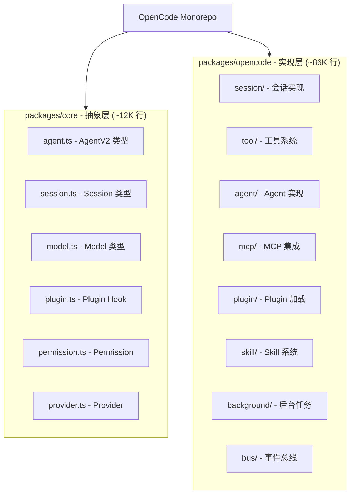
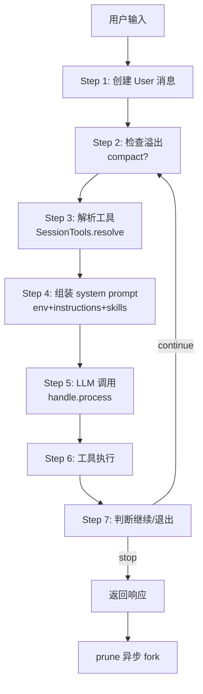

# OpenCode 整体架构：近 10 万行 TypeScript 源码全景


最近 AI Agent 火得一塌糊涂，Claude Code、Cursor、Cline 各种工具层出不穷。但有个开源项目特别值得关注——**OpenCode**。

为什么值得？因为它是**少数几个完整开源、跨厂商、生产可用的 AI Agent 框架**。更难得的是，它的代码质量非常高——用 TypeScript + Effect-TS 写的，结构清晰、模块化、可读性强。

今天这篇是「**OpenCode 源码精读**」系列的开篇，目标是让你对 OpenCode 的整体架构有个全景认知。看完能同时 get 三个问题：

- 第一，**OpenCode 是什么？和 Claude Code 什么关系？**——为什么这个项目值得研究
- 第二，**包结构怎么分层？**——Core 抽象层 + Opencode 实现层的分工
- 第三，**runLoop 7 步预览**——主循环的完整骨架

后面我会按由浅入深的顺序，把这个开源 Agent 的核心机制一个个讲清楚。这是开篇，先给你一张全景图。


## 一、OpenCode 是什么？和 Claude Code 什么关系？

### 1.1 一个让你「先别翻答案」的问题

我先抛一个问题让你估算下，**先别往下翻看答案**：

**OpenCode 的源码有多大规模？**

- A. 1 万行
- B. 5 万行
- C. 10 万行

公布答案：**B 接近 C**——核心实现包 `packages/opencode/src/` 有 **86,715 行** TypeScript，抽象层 `packages/core/src/` 有 **12,405 行**。加起来接近 **10 万行**。

这是个相当大的项目。但和 Claude Code 的代码量相比如何？CC 是闭源的，但根据泄漏分析，`query.ts` 一个文件就有 1,730 行——它的总规模应该在数十万行级别。

### 1.2 OpenCode 的定位

OpenCode 是一个开源的 AI Agent CLI 工具，定位和 Claude Code 类似——**终端里的 AI 编程助手**。但有几个关键区别：

| 维度 | Claude Code | OpenCode |
|------|-------------|----------|
| **开源** | 闭源 | ✅ 完全开源（Apache-2.0） |
| **模型厂商** | 仅 Claude | ✅ 8 家（Anthropic/OpenAI/Gemini/Codex/Trinity/Kimi/...） |
| **运行时** | Bun | Bun + Effect-TS |
| **持久化** | JSONL 文件 | SQLite + Drizzle ORM |

**OpenCode 的核心价值**：

1. **跨厂商**——你可以用任意模型，不被锁死在 Anthropic
2. **开源**——能看源码、能改、能学
3. **自部署**——数据完全在你手里
4. **可扩展**——Plugin 系统 + Skill 系统让任何人都能加新能力

### 1.3 和 Claude Code 的关系

OpenCode 在很多设计上参考了 Claude Code——比如：

- `CLAUDE.md` 指令文件兼容（OpenCode 也读 CLAUDE.md）
- 工具系统设计（Read/Edit/Write/Grep/Glob/Task 等工具命名一致）
- Compact 摘要的 9 段格式（和 CC 类似）

但 OpenCode 也做了大量**自己的设计**：

- **Provider 抽象层**——让一个代码库跑 8 家模型
- **Effect-TS DI**——用声明式依赖注入管理 ~40 个服务
- **SQLite 持久化**——比 JSONL 更结构化
- **AgentV2 Schema**——类型安全的 Agent 配置
- **Permission 三态系统**——ask/allow/deny + Doom Loop 检测

整个系列会围绕这些差异点展开，每篇都会做硬核对比。

## 二、包结构：Core 抽象层 + Opencode 实现层

OpenCode 的代码分两个核心包：

### 2.1 整体包结构



**两个核心包**：

- **`packages/core/src/`**（12,405 行）——**抽象层**，定义所有类型和接口
- **`packages/opencode/src/`**（86,715 行）——**实现层**，所有具体实现

### 2.2 Core 包：抽象层

Core 包只有 ~12K 行，但定义了所有关键类型：

| 文件 | 行数 | 作用 |
|------|------|------|
| `agent.ts` | 147 | AgentV2 类型（ID/Mode/Info/Interface/Service） |
| `session.ts` | 13 | Session 类型 |
| `model.ts` | 116 | Model 类型 |
| `plugin.ts` | 191 | Plugin Hook 规范（7 种 hook） |
| `permission.ts` | 45 | Permission 核心评估引擎 |
| `provider.ts` | 120 | Provider 抽象 |
| `schema.ts` | 112 | 基础 ID 类型 |

Core 包的代码量小，但定义了所有「**契约**」——实现层必须遵守这些接口。

### 2.3 Opencode 包：实现层

Opencode 包有 ~87K 行，是真正的实现：

| 目录 | 作用 |
|------|------|
| `src/session/` | 会话流程（runLoop / processor / llm / tools / system / instruction / compaction） |
| `src/tool/` | 18 个内置工具（Edit/Grep/Glob/Read/Write/Shell/Task/Skill/...） |
| `src/agent/` | 8 个内置 Agent（build/plan/general/explore/scout/compaction/title/summary） |
| `src/mcp/` | MCP 集成（stdio/SSE/StreamableHTTP） |
| `src/plugin/` | Plugin 加载和 hook 触发 |
| `src/skill/` | Skill 系统发现和注入 |
| `src/background/` | 后台任务调度 |
| `src/bus/` | 事件总线（pub/sub） |
| `src/config/` | 配置加载 |
| `src/provider/` | 8 个 Provider 实现 |
| `src/permission/` | Permission 服务 |
| `src/storage/` | 存储抽象 |
| `src/server/` | HTTP 服务器 |
| `src/snapshot/` | 快照系统 |

整个 `packages/opencode/src/` 目录有 42 个子目录，覆盖了一个完整 Agent 系统的所有方面。

### 2.4 技术栈

OpenCode 用了几个比较特别的技术：

| 技术 | 用途 |
|------|------|
| **TypeScript** | 主语言 |
| **Effect-TS** | 函数式 effect 系统，管理依赖注入和副作用 |
| **AI SDK (Vercel)** | 默认 LLM 调用层 |
| **Drizzle ORM** | SQLite 类型安全 ORM |
| **Bun** | JS 运行时（比 Node 快） |
| **Schema** | Effect 的运行时类型系统 |

**Effect-TS 是最大的特色**——它让 OpenCode 拥有了：

- 声明式依赖注入（~40 个 Service）
- 类型安全的错误处理（TaggedError）
- 可组合的 Effect（generator 风格）
- Stream 抽象（处理 LLM 流）

这是 OpenCode 和 Claude Code 的最大架构差异——CC 是命令式 TypeScript，OpenCode 是 Effect-TS 函数式风格。


## 三、Provider 抽象：8 家模型的统一接口


这是 OpenCode 最值得讲的设计——一个代码库跑 8 家模型。

### 3.1 8 个 Provider Prompt

不同模型厂商的 prompt 理解能力不同，OpenCode 为每个厂商准备了专用的 system prompt：

```ts
// src/session/system.ts:19-33
export function provider(model: Provider.Model) {
  if (model.api.id.includes("gpt-4") || model.api.id.includes("o1") || model.api.id.includes("o3"))
    return [PROMPT_BEAST]
  if (model.api.id.includes("gpt")) {
    if (model.api.id.includes("codex")) return [PROMPT_CODEX]
    return [PROMPT_GPT]
  }
  if (model.api.id.includes("gemini-")) return [PROMPT_GEMINI]
  if (model.api.id.includes("claude")) return [PROMPT_ANTHROPIC]
  if (model.api.id.toLowerCase().includes("trinity")) return [PROMPT_TRINITY]
  if (model.api.id.toLowerCase().includes("kimi")) return [PROMPT_KIMI]
  return [PROMPT_DEFAULT]
}
```

| Provider | Prompt 文件 |
|----------|------------|
| Claude | `anthropic.txt` |
| GPT-4/o1/o3 | `beast.txt` |
| GPT 系列 | `gpt.txt` |
| Codex | `codex.txt` |
| Gemini | `gemini.txt` |
| Trinity | `trinity.txt` |
| Kimi | `kimi.txt` |
| 其他 | `default.txt` |

### 3.2 模型路由：apply_patch vs edit/write

不仅是 prompt，连工具都按模型路由：

```ts
// src/tool/registry.ts:322-325
const usePatch =
  input.modelID.includes("gpt-") && 
  !input.modelID.includes("oss") && 
  !input.modelID.includes("gpt-4")
if (tool.id === ApplyPatchTool.id) return usePatch
if (tool.id === EditTool.id || tool.id === WriteTool.id) return !usePatch
```

GPT 非-oss 非-4 系模型用 `apply_patch` 工具，其他模型用 `edit` + `write`。这是因为不同模型对工具调用的格式偏好不同。

### 3.3 双运行时切换

OpenCode 支持两种 LLM 运行时：

| 运行时 | 触发条件 | 实现位置 |
|--------|---------|---------|
| **Native Runtime** | `OPENCODE_EXPERIMENTAL_NATIVE_LLM=true` + OpenAI/Anthropic | `src/session/llm/native-runtime.ts` |
| **AI SDK**（默认） | 默认 | `src/session/llm/ai-sdk.ts` |

Native Runtime 让 OpenCode 自己控制工具执行时机，AI SDK 让它支持任意 provider。详细对比见：[OpenCode 主循环 runLoop](/opencode/02-runloop)


## 四、Effect-TS DI 架构：~40 个 Service


OpenCode 全局使用 Effect-TS 的 Context.Service 实现依赖注入，~40 个 Service 分布在各个模块：

```ts
// 示例：AgentV2.Service 定义
export class Service extends Context.Service<Service, Interface>()("@opencode/v2/Agent") {}
```

每个 Service 是一个 Context Tag，可以通过 `yield* SomeService` 拿到。

### 4.1 主要 Service 一览

| Service | 作用 |
|---------|------|
| `AgentV2.Service` | Agent 管理 |
| `Session.Service` | Session 管理 |
| `LLM.Service` | LLM 调用 |
| `ToolRegistry.Service` | 工具注册 |
| `Permission.Service` | 权限检查 |
| `Plugin.Service` | Plugin hook |
| `Skill.Service` | Skill 加载 |
| `Config.Service` | 配置读取 |
| `Bus` | 事件总线 |
| `Truncate.Service` | 输出截断 |
| `InstanceState` | 工作目录级别状态 |
| `BackgroundJob.Service` | 后台任务 |
| `MCP.Service` | MCP 集成 |
| `Server.Service` | HTTP 服务器 |

> 以上为主要 Service，全仓实际有 ~80 个 `Context.Service` 声明，详见后续章节。

### 4.2 InstanceState 模式

OpenCode 用 `InstanceState` 实现工作目录级别的单例：

```ts
const state = InstanceState.make(() => {
  // 在工作目录级别初始化各种服务
  // 同一个工作目录的多次访问共享状态
})
```

**关键设计**：

- `ScopedCache` 让中间结果可缓存
- 同一个工作目录的多次访问共享状态
- 不同工作目录互相隔离

这让 OpenCode 可以**同时管理多个项目**，每个项目有独立的 agent、session、permission 状态。


## 五、runLoop 7 步预览

这是整个 OpenCode 的核心。runLoop 在 `src/session/prompt.ts:1244`，约 254 行。

### 5.1 主循环骨架

```ts
const runLoop: (sessionID: SessionID) => Effect.Effect<MessageV2.WithParts> = Effect.fn("SessionPrompt.run")(
  function* (sessionID: SessionID) {
    while (true) {
      // Step 1: 创建 User 消息 + filterCompacted
      // Step 2: 检查上下文溢出（compact）
      // Step 3: 解析可用工具（SessionTools.resolve）
      // Step 4: 组装 system prompt（env + instructions + skills）
      // Step 5: LLM 调用（handle.process）
      // Step 6: 工具执行 → 结果写回
      // Step 7: 判断继续/退出
    }
    yield* compaction.prune({ sessionID }).pipe(Effect.ignore, Effect.forkIn(scope))
    return yield* lastAssistant(sessionID)
  },
)
```

> 上面是骨架预览，完整实现（含 7 步逐行拆解）见：[OpenCode 主循环 runLoop](/opencode/02-runloop)

### 5.2 7 步流程图



### 5.3 关键设计点

**1. 工具循环嵌在主循环里**——通过 `finish: "tool-calls"` 信号让循环继续，避免独立工具调度循环。

**2. 双运行时切换**——Native Runtime 让 OpenCode 自己控制工具执行，AI SDK 让它支持任意 provider。

**3. Doom Loop 检测**——连续 3 次同参数工具调用触发权限询问。

**4. prune 异步执行**——runLoop 退出后立刻返回响应，prune 在后台默默跑。

详细的 7 步拆解见：[OpenCode 主循环 runLoop](/opencode/02-runloop)


## 六、OpenCode vs Claude Code：整体架构对比

这是开篇定调的对比表，整个系列每篇都会做更深度的章节级对比。

| 维度 | Claude Code | OpenCode |
|------|-------------|----------|
| **开源状态** | 闭源 | ✅ 完全开源 |
| **代码量** | 不公开（推测数十万行） | ~100K 行（87K + 12K） |
| **模型支持** | 仅 Claude | ✅ 8 家 |
| **运行时** | Bun + 命令式 TS | Bun + Effect-TS 函数式 |
| **DI 架构** | 显式 State 对象 | ✅ ~40 个 Effect Service |
| **持久化** | JSONL 文件 | ✅ SQLite + Drizzle ORM |
| **Provider 抽象** | 无（仅 Claude） | ✅ 8 个 Provider Prompt |
| **主循环** | `query.ts`（1,730 行集中编排） | `prompt.ts` runLoop（254 行）+ 分散模块 |
| **工具循环** | 流式并行（StreamingToolExecutor） | stream 后统一处理 |
| **Compact 机制** | 多级（microCompact + apiMicrocompact + autoCompact + compact） | 2 级（prune/compact） |
| **SubAgent 调度** | coordinator 并行模式 | tasks.pop() 串行 |
| **Doom Loop 检测** | ❌ 无 | ✅ 连续 3 次同参数触发 ask |
| **AST 搜索** | ❌ 无（仅 ripgrep） | ❌ 无（仅 ripgrep） |
| **自动记忆** | ✅ memdir 4 种类型 | ❌ 无 |
| **Prompt Cache** | ✅ 深度集成（`cache_control` + break detection） | ✅ 默认开启（`cache: "auto"`，跨厂商适配） |

### 6.1 两种工程哲学

**Claude Code 的哲学**：**深度优化 + 锁定 Anthropic 生态**

- 用 `cache_edits` 等 Anthropic 内部 API 做性能优化
- 5 级 Compact 策略（前 4 级零 LLM 调用）
- StreamingToolExecutor 流式并行工具执行
- 1,730 行的 query.ts 集中编排主循环（委托给 StreamingToolExecutor 等模块）

**OpenCode 的哲学**：**通用性 + 简洁**

- 跨 8 家模型厂商，不依赖任何厂商特定 API
- 2 级 Compact 策略，思路直接
- tasks.pop() 串行调度，简单可控
- Effect-TS 模块化，每个文件职责单一

**没有更好的，只有更适合的**：

- 如果你是 Anthropic 用户，CC 的优化深度无与伦比
- 如果你想跨厂商、想自部署、想看源码学——OpenCode 完胜
这就是为什么 OpenCode 值得研究——它代表了「**通用 Agent 框架**」的一种解法。


## 七、系列导航

这是「**OpenCode 源码精读**」系列的开篇，整个系列规划了 6 篇文章：

| # | 文章 | 重点 |
|---|------|------|
| 1 | **OpenCode 整体架构**（本文） | 全景认知，定调对比 |
| 2 | [OpenCode 主循环 runLoop](/opencode/02-runloop) | 7 步主循环 + Doom Loop + 双运行时 |
| 3 | [OpenCode 工具系统](/opencode/03-tools) | Tool.Def + Edit 10 策略 + Permission 三态 |
| 4 | [OpenCode 上下文压缩](/opencode/04-compact) | Compact 2 级机制 + 9 段摘要 + 锚定更新 |
| 5 | [OpenCode Agent 系统](/opencode/05-agents) | AgentV2 + SubAgent + tasks.pop() vs coordinator |
| 6 | [OpenCode 上下文架构](/opencode/06-context) | 5 层上下文注入 + 为什么不用 RAG |

**建议阅读顺序**：

- **新手**：按 1→2→3→4→5→6 顺序读
- **想直接看核心机制**：跳到 4（Compact）和 5（Agent 系统）
- **想理解整体设计**：从 1（本文）开始


## 最后

写到这里，OpenCode 的整体架构就给你过完了。

回过头看，OpenCode 不是个简单的「**调 LLM 写代码**」工具，它在**架构、循环、工具、压缩、Agent、上下文**每一个维度都做了精致的设计：

- **包结构**：Core 抽象层（12K 行）+ Opencode 实现层（87K 行），关注点分离
- **Provider 抽象**：8 家模型厂商的统一接口，跨厂商兼容
- **Effect-TS DI**：~40 个 Service 的声明式依赖注入
- **runLoop 7 步**：简洁的主循环，工具循环嵌在主循环里
- **工具系统**：18 个内置工具 + 10 种 Edit 匹配策略 + Permission 三态
- **Compact 2 级**：Prune + Compact，简洁但够用
- **Agent 系统**：8 个内置 Agent + 隔离机制 + tasks.pop() 串行
- **5 层上下文注入**：从 System Prompt 到 Messages，金字塔结构

更难得的是，OpenCode 用约 10 万行 TypeScript + Effect-TS 实现了 Claude Code 数十万行才能做到的事——**简化的代价是放弃了流式工具执行（StreamingToolExecutor）**，但换来的是**跨厂商兼容、代码可读、开源透明**。

整个系列的后续文章会逐一深入这些机制，每篇都会和 Claude Code 做硬核对比——这是我们同时拥有两份源码的独家优势。

今天分享就到这里，我们下篇见！

## 章节小测

<script setup>
const q = [
  {
    question: 'OpenCode 用 Effect-TS 做依赖注入（~40 个 Service），而 Claude Code 用显式 State 对象。这两种方式的核心 trade-off 是什么？',
    options: ['使用命令式 Promise 以降低异步理解成本', '提供声明式依赖注入与类型安全的 Effect Context', '采用显式全局状态对象以简化运行时状态查询', '依赖装饰器语法实现模块自动装配与依赖检测'],
    correct: 1,
    explanation: 'Effect-TS 的 Context.Service 让依赖声明式可组合，并通过 TypeScript 泛型提供编译期类型安全；但函数式编程范式学习曲线陡峭。CC 的显式 State 对象更接近传统命令式编程，上手简单，但缺少声明式 DI 的类型安全保障。这是「学习成本 vs 工程保障」的取舍。'
  },
  {
    question: 'OpenCode 用 SQLite + Drizzle ORM 做持久化，Claude Code 用 JSONL 文件。这个选择背后的核心设计考虑是什么？',
    options: ['选用 JSONL 以追求极致可读性与手动编辑备份便利', '选用 SQLite 以支持结构化查询与事务级一致保障', '选用 PostgreSQL 以提供分布式查询与高并发写入性能', '选用 LevelDB 以追求嵌入式键值存储的高写入吞吐'],
    correct: 1,
    explanation: 'SQLite 提供结构化查询、事务支持和级联删除，适合需要审计和程序化访问的场景。JSONL 是 append-only 的纯文本格式，可直接用文本编辑器查看，备份就是复制文件。这是「可查询性 vs 可读性」的典型取舍。'
  },
  {
    question: 'OpenCode 将代码分为 Core 抽象层（12K 行）和 Opencode 实现层（87K 行）。这种分层设计的主要目的是什么？',
    options: ['让静态类型检查在编译期自动推断跨层依赖关系', '由 Core 层定义契约并由 Opencode 层提供实现', '将运行时代码与编译时代码划为两套独立编译单元', '按团队分工将核心逻辑与辅助功能横向拆开'],
    correct: 1,
    explanation: 'Core 包定义 AgentV2、Session、Permission、Provider 等所有关键类型和接口（契约），Opencode 包提供具体实现。这种分层让接口和实现解耦——契约稳定时实现层可独立演进，也方便社区理解哪些是框架核心概念。'
  },
  {
    question: 'OpenCode 支持 8 家模型厂商，为每家准备了不同 system prompt，甚至对工具做了模型路由（GPT 系用 apply_patch，其他用 edit/write）。这反映的是什么设计决策？',
    options: ['优先确保工具接口规范在各模型之间保持完全一致', '针对模型偏好的工具格式差异进行差异化适配路由', '要求模型统一采用最小公共工具集以减少适配工作量', '通过模型端自动检测并切换自身使用的工具格式'],
    correct: 1,
    explanation: 'OpenCode 的核心理念是「适配模型差异」而不是「强制模型统一」。GPT 系对 patch 格式（统一 diff）理解更好，Claude 系对 oldString+newString 精确替换更在行。这种按模型路由的工程经验，是跨厂商框架必须面对的复杂性。'
  },
  {
    question: 'OpenCode 的 Doom Loop 检测（连续 3 次同参数工具调用触发 ask）为什么用「询问用户」而不是「直接禁止」？',
    options: ['由开发团队在编译期为每个工具预设最大连续调用次数', '将死循环判断逻辑下放到每个工具自身的执行流程中', '在轮询任务状态等合法场景下阻断循环将破坏正常流程', '通过异步超时机制强制终止连续同参数的工具调用序列'],
    correct: 2,
    explanation: '直接禁止虽然简单，但会破坏合法场景（轮询任务状态、监控文件变化等）。询问用户让用户判断「这次是真的卡住了还是正常循环」，既防死循环又不伤合法用途。这是 Permission 系统复用为 Doom Loop 检测的精妙之处。'
  }
]
</script>

<Quiz :questions="q"></Quiz>
