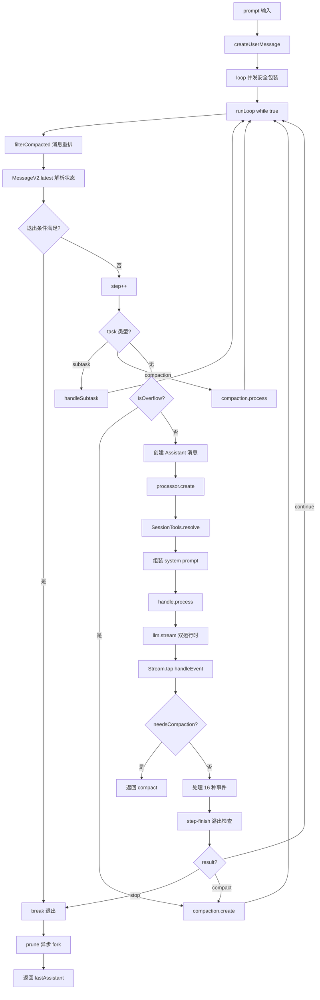

# OpenCode 主循环 runLoop

最近不少朋友跟我聊 AI Agent 实现，发现一个共同现象：**所有人都在用 Claude Code，但没人能说清「按下回车键之后那 100 毫秒内发生了什么」**。问他们 agent 怎么跑工具循环的，答不上来；问上下文什么时候被压缩的，更是一脸懵。

面试官最爱问的就是这个：「**用户发一条消息，agent 内部是怎么跑起来的？**」

今天这篇就想带你从源码视角，把 OpenCode 的主循环彻底讲明白。目标是让你看完能同时 get 三个问题：

- 第一，**runLoop 的 7 步流程**——从用户输入到响应返回，每一步干了什么
- 第二，**工具调用循环**是怎么嵌在主循环里的——为什么不是死循环
- 第三，**双运行时**（Native vs AI SDK）和 **Doom Loop 检测**这两个隐藏机制是怎么工作的

后面我会按由浅入深的顺序，一步步讲清楚。最后还会和 Claude Code 的 `query.ts`（1,730 行集中编排）做一次硬核对比，让你看清两种工程哲学。


## 一、runLoop 在哪？入口长啥样？

### 1.1 从入口函数 `prompt()` 说起

OpenCode 的对话入口是 `src/session/prompt.ts` 的 `prompt()` 函数（第 1215 行）：

```ts
// src/session/prompt.ts:1215
const prompt: (input: PromptInput) => Effect.Effect<MessageV2.WithParts, Image.Error> = Effect.fn(
  "SessionPrompt.prompt",
)(function* (input: PromptInput) {
  const session = yield* sessions.get(input.sessionID).pipe(Effect.orDie)
  yield* revert.cleanup(session)
  const message = yield* createUserMessage(input)          // ← Step 1: 创建 User 消息
  yield* sessions.touch(input.sessionID)

  // 处理工具权限覆盖
  const permissions: Permission.Rule[] = []
  for (const [t, enabled] of Object.entries(input.tools ?? {})) {
    permissions.push({ permission: t, action: enabled ? "allow" : "deny", pattern: "*" })
  }
  if (permissions.length > 0) {
    session.permission = permissions
    yield* sessions.setPermission({ sessionID: session.id, permission: permissions })
  }

  if (input.noReply === true) return message                // ← 单次调用模式，不进入循环
  return yield* loop({ sessionID: input.sessionID })       // ← 进入主循环
})
```

这一段做了三件事：

1. **创建 User 消息**：通过 `createUserMessage()` 把用户输入持久化到数据库
2. **应用工具权限**：如果调用方传了 `tools` 字段，覆盖 session 的 permission
3. **进入主循环**：调用 `loop({ sessionID })`

注意 `noReply: true` 这个分支——它允许「**只创建消息不进入循环**」，给了一些特殊场景（比如程序化写入历史消息）使用。

### 1.2 `loop()` 的并发安全包装

```ts
// src/session/prompt.ts:1500
const loop: (input: LoopInput) => Effect.Effect<MessageV2.WithParts> = Effect.fn("SessionPrompt.loop")(function* (
  input: LoopInput,
) {
  return yield* state.ensureRunning(
    input.sessionID,
    lastAssistant(input.sessionID),
    runLoop(input.sessionID),
  )
})
```

`ensureRunning` 是一个**并发安全包装器**。它的作用是：

- 如果同一个 session 已经在跑，**不会并发启动第二个 runLoop**
- 而是注册一个回调：当正在跑的那个 runLoop 完成时，把 `lastAssistant` 直接返回给新的调用方

这个设计避免了「**用户连续按两次回车导致 session 状态错乱**」的常见 bug。

### 1.3 runLoop 的整体结构

```ts
// src/session/prompt.ts:1244
const runLoop: (sessionID: SessionID) => Effect.Effect<MessageV2.WithParts> = Effect.fn("SessionPrompt.run")(
  function* (sessionID: SessionID) {
    const ctx = yield* InstanceState.context
    let structured: unknown
    let step = 0
    const session = yield* sessions.get(sessionID).pipe(Effect.orDie)

    while (true) {                                          // ← 主循环入口
      yield* status.set(sessionID, { type: "busy" })

      let msgs = yield* MessageV2.filterCompactedEffect(sessionID)
      const { user: lastUser, assistant: lastAssistant, finished: lastFinished, tasks } = MessageV2.latest(msgs)

      // ... 一堆判断和分支 ...

      step++
      // ... 7 步处理 ...
    }

    // 退出后清理
    yield* compaction.prune({ sessionID }).pipe(Effect.ignore, Effect.forkIn(scope))
    return yield* lastAssistant(sessionID)
  },
)
```

整个 runLoop 的核心结构是一个 `while (true)`，每次循环对应「**一次 LLM 调用 + 一次工具执行**」的回合。退出时执行 prune（异步 fork）然后返回最后一条 assistant 消息。

下面我们一步一步拆。


## 二、Step 1：创建 User 消息

这一步其实在 `prompt()` 入口就完成了，但 runLoop 里还会做一次「**消息过滤**」：

```ts
let msgs = yield* MessageV2.filterCompactedEffect(sessionID)
const { user: lastUser, assistant: lastAssistant, finished: lastFinished, tasks } = MessageV2.latest(msgs)
```

### 2.1 为什么要 filterCompacted？

因为如果上下文已经被压缩过，数据库里的消息顺序可能是：

```
[old-user1, old-assistant1, ...,
 compaction-user, summary-assistant,
 recent-user, recent-assistant, ...]
```

但 LLM 看到的顺序应该是：

```
[compaction-user, summary-assistant,
 recent-user, recent-assistant, ...]
```

`filterCompacted()` 函数（详见上一篇 Compact 文章）负责把这个重排做了。这一步是**每次循环开头都跑一次**——因为有可能上一轮触发了 compaction。

### 2.2 `MessageV2.latest()` 解析最新状态

```ts
const { user: lastUser, assistant: lastAssistant, finished: lastFinished, tasks } = MessageV2.latest(msgs)
```

这个函数一次性返回 4 个关键变量：

- `lastUser`：最近的 user 消息
- `lastAssistant`：最近的 assistant 消息
- `lastFinished`：最后一个**已完成**（有 finish reason）的 assistant
- `tasks`：待处理任务队列（compaction 或 subtask part）

为什么这 4 个变量重要？因为后面每一步的判断都依赖它们。

### 2.3 第一轮的特殊处理

```ts
if (step === 1)
  yield* title({ session, modelID: lastUser.model.modelID, providerID: lastUser.model.providerID, history: msgs })
    .pipe(Effect.ignore, Effect.forkIn(scope))
```

第一轮循环时，会 fork 一个 background 任务去**生成会话标题**。这个任务不影响主流程，失败也忽略，纯粹是为了 UI 上能看到会话标题。

这是个很细心的设计——标题生成用的是同一个 LLM，但完全异步，不会卡住响应。


## 三、退出条件判断：runLoop 怎么决定停下？

这一段代码看似简单，但藏着最关键的「**循环退出**」逻辑：

```ts
// src/session/prompt.ts:1268-1291
const lastAssistantMsg = msgs.findLast(
  (msg) => msg.info.role === "assistant" && msg.info.id === lastAssistant?.id,
)

const hasToolCalls =
  lastAssistantMsg?.parts.some(
    (part) => part.type === "tool" && 
    !part.metadata?.providerExecuted && 
    !isOrphanedInterruptedTool(part),
  ) ?? false

if (
  lastAssistant?.finish &&
  !["tool-calls"].includes(lastAssistant.finish) &&
  !hasToolCalls &&
  lastUser.id < lastAssistant.id
) {
  break                                                  // ← 正常退出循环
}
```

**翻译成人话**：

退出条件 = 4 个全部满足：

1. `lastAssistant?.finish` 存在 — 上一次 LLM 调用真的完成了
2. `finish` 不是 `"tool-calls"` — 模型没有要求调用工具
3. `!hasToolCalls` — 上一次 assistant 没有待处理的工具调用
4. `lastUser.id < lastAssistant.id` — assistant 是在用户之后产生的（避免空响应）

**最关键的是第 2 和第 3 条**：

- 如果模型说 `finish = "tool-calls"`，意思是「**我要调用工具，把工具结果给我我再继续**」——循环必须继续
- 如果模型说 `finish = "stop"`，意思是「**我说完了**」——循环退出

这就是 OpenCode 工具调用循环的核心：**不是单独的工具调度循环，而是融在主循环里**——模型每次说「我要调工具」就继续跑，说「我说完了」就退出。

### 3.1 为什么不是单独的工具调度循环？

我建议你先停 10 秒想想：**为什么不把工具调用做成单独的循环**？

```ts
// ❌ 假想的独立工具循环
while (hasToolCalls) {
  executeTools()
  callLLM()
}
```

答案是：**compaction、subtask 这些任务也要插队进主循环**。如果把工具调用做成单独循环，主循环就要变成「循环里嵌套循环」，状态管理会爆炸。

OpenCode 的设计是**统一的 while(true)**，把所有「需要继续跑」的情况都收敛到主循环顶部重新判断。这是个非常 Effect-TS 风格的设计——**用单一状态机处理所有事件**。


## 四、Step 2：检查上下文溢出（compact）

这是上一篇 Compact 文章讲过的内容，这里简单过一下：

```ts
// src/session/prompt.ts:1310-1329
const task = tasks.pop()

// 处理 subtask
if (task?.type === "subtask") {
  yield* handleSubtask({ task, model, lastUser, sessionID, session, msgs })
  continue
}

// 处理 compaction task（create() 后下一轮触发）
if (task?.type === "compaction") {
  const result = yield* compaction.process({
    messages: msgs,
    parentID: lastUser.id,
    sessionID,
    auto: task.auto,
    overflow: task.overflow,
  })
  if (result === "stop") break
  continue
}

// proactive 检查：上一轮结束后是否溢出
if (
  lastFinished &&
  lastFinished.summary !== true &&
  (yield* compaction.isOverflow({ tokens: lastFinished.tokens, model }))
) {
  yield* compaction.create({ sessionID, agent: lastUser.agent, model: lastUser.model, auto: true })
  continue
}
```

注意三个分支的顺序：

1. **subtask 优先**：如果有子任务（subagent 调用）在排队，先处理它
2. **compaction task 次之**：如果上一轮插入了 compaction 占位，这一轮执行 process()
3. **proactive 检查最后**：每轮都检查上一轮是否溢出，是的话插入新的 compaction task

三个分支都用 `continue` 跳过本轮的 LLM 调用——因为 compaction/subtask 本身就是要「插入消息但不调主 LLM」。

详细的 Compact 机制见上一篇：[OpenCode 上下文压缩：Compact 2 级机制](/opencode/04-compact)


## 五、Step 3：解析可用工具（SessionTools.resolve）

这一步把所有可用工具收集起来，准备传给 LLM：

```ts
// src/session/prompt.ts:1394
const tools = yield* SessionTools.resolve({
  agent,
  session,
  model,
  processor: handle,
  bypassAgentCheck,
  messages: msgs,
  promptOps,
})
```

`resolve()` 函数在 `src/session/tools.ts` 第 24-206 行，干两件事：

### 5.1 注册内置工具

```ts
// src/session/tools.ts:75-116
for (const item of yield* registry.tools({ modelID, providerID, agent: input.agent })) {
  const schema = ProviderTransform.schema(input.model, ToolJsonSchema.fromTool(item))
  tools[item.id] = tool({
    description: item.description,
    inputSchema: jsonSchema(schema),
    execute(args, options) {
      return run.promise(Effect.gen(function* () {
        const ctx = context(args, options)
        yield* plugin.trigger("tool.execute.before", { ... }, { args })
        const result = yield* item.execute(args, ctx)
        yield* plugin.trigger("tool.execute.after", { ... }, output)
        return output
      }))
    },
  })
}
```

每个工具被包装成一个 AI SDK 的 `tool()` 对象，包含：

- `description`：给 LLM 看的工具说明
- `inputSchema`：JSON Schema 描述参数
- `execute`：实际执行函数（包了一层 plugin hook）

**注意两个细节**：

1. 工具执行前后都有 plugin hook（`tool.execute.before` / `tool.execute.after`）——插件可以观察甚至修改工具行为
2. `EffectBridge.make()` 创建了一个桥接器，让 Effect 的代码能在 Promise 上下文中跑

### 5.2 混入 MCP 工具

```ts
// src/session/tools.ts:118-203
for (const [key, item] of Object.entries(yield* mcp.tools())) {
  const execute = item.execute
  item.execute = (args, opts) =>
    run.promise(Effect.gen(function* () {
      // MCP 工具需要权限询问
      yield* ctx.ask({ permission: key, ... })
      return yield* Effect.promise(() => execute(args, opts))
    }))
  tools[key] = item
}
```

MCP 工具比内置工具多一步——**权限检查**。每个 MCP 工具调用前都要 `ctx.ask()`，这是 OpenCode 的权限系统（详见工具系统篇）。

MCP 工具返回的 content（text/image/resource）需要解析为 output + attachments，然后 truncate。这部分比较琐碎，细节留到工具系统篇讲。


## 六、Step 4：组装 system prompt + 转换消息

```ts
// src/session/prompt.ts:1435-1441
const [skills, env, instructions, modelMsgs] = yield* Effect.all([
  sys.skills(agent),
  sys.environment(model),
  instruction.system().pipe(Effect.orDie),
  MessageV2.toModelMessagesEffect(msgs, model),
])
const system = [...env, ...instructions, ...(skills ? [skills] : [])]
```

### 6.1 system prompt 的三段拼接

OpenCode 的 system prompt 由 3 部分组成：

| 部分 | 来源 | 内容 |
|------|------|------|
| **env** | `sys.environment(model)` | 模型名 + 工作目录 + 平台 + 日期 |
| **instructions** | `instruction.system()` | AGENTS.md / CLAUDE.md / 全局配置 |
| **skills** | `sys.skills(agent)` | 可用技能描述（verbose 格式） |

注意这里**不包含** provider prompt——provider prompt 是在 `LLMRequestPrep.prepare()` 里另外加的。

### 6.2 environment() 注入了什么？

```ts
// src/session/system.ts:48-62
environment: Effect.fn("SystemPrompt.environment")(function* (model: Provider.Model) {
  const ctx = yield* InstanceState.context
  return [
    [
      `You are powered by the model named ${model.api.id}. The exact model ID is ${model.providerID}/${model.api.id}`,
      `Here is some useful information about the environment you are running in:`,
      `<env>`,
      `  Working directory: ${ctx.directory}`,
      `  Workspace root folder: ${ctx.worktree}`,
      `  Is directory a git repo: ${ctx.project.vcs === "git" ? "yes" : "no"}`,
      `  Platform: ${process.platform}`,
      `  Today's date: ${new Date().toDateString()}`,
      `</env>`,
    ].join("\n"),
  ]
})
```

这段 prompt 你应该很熟悉——它就是你用 OpenCode 时 system message 里看到的那段 `<env>` 块。每个字段都有用：

- `Working directory`：让 LLM 知道相对路径怎么解析
- `Workspace root folder`：让 LLM 知道 worktree 边界
- `Is directory a git repo`：决定要不要用 git 命令
- `Platform`：影响 shell 命令选择（darwin vs linux）
- `Today's date`：让 LLM 知道当前时间，避免幻觉「未来」事件

### 6.3 skills() 的 verbose 注入

```ts
// src/session/system.ts:65-77
skills: Effect.fn("SystemPrompt.skills")(function* (agent: Agent.Info) {
  if (Permission.disabled(["skill"], agent.permission).has("skill")) return
  const list = yield* skill.available(agent)
  return [
    "Skills provide specialized instructions and workflows for specific tasks.",
    "Use the skill tool to load a skill when a task matches its description.",
    Skill.fmt(list, { verbose: true }),                    // ← verbose 格式
  ].join("\n")
})
```

注意 `verbose: true`。源码注释里说：

> "the agents seem to ingest the information about skills a bit better if we present a more verbose version"

也就是说，**给 LLM 看的技能描述要比给用户的更详细**——这是个有意思的经验观察。

### 6.4 消息转换：toModelMessagesEffect

```ts
MessageV2.toModelMessagesEffect(msgs, model)
```

这一步把 OpenCode 内部的 `MessageV2.WithParts[]` 转换成 AI SDK 的 `ModelMessage[]` 格式。转换时会处理：

- 跳过 `compacted` 标记的工具输出（替换为 `[Old tool result content cleared]`）
- 截断过长的工具输出（`toolOutputMaxChars`）
- 处理媒体附件（strip media 选项）
- Provider-specific 转换（不同模型厂商的消息格式略有差异）


## 七、Step 5：LLM 调用（双运行时切换）

```ts
// src/session/prompt.ts:1454
const result = yield* handle.process({
  user: lastUser,
  agent,
  permission: session.permission,
  sessionID,
  parentSessionID: session.parentID,
  system,
  model,
  messages: [...modelMsgs, ...(isLastStep ? [{ role: "assistant", content: MAX_STEPS }] : [])],
  tools,
  toolChoice: format.type === "json_schema" ? "required" : undefined,
})
```

这是整个 runLoop 最复杂的一步。`handle.process()` 内部干了一堆事，包括 LLM 调用、流处理、工具执行、错误恢复。我们先看 LLM 调用本身。

### 7.1 双运行时：Native vs AI SDK

OpenCode 支持两种 LLM 运行时，在 `src/session/llm.ts` 的 `run()` 函数里切换：

```ts
// src/session/llm.ts:220
if (flags.experimentalNativeLlm) {                         // ← 实验开关
  const native = LLMNativeRuntime.stream({ 
    model, provider, auth, llmClient, messages, tools, ... 
  })
  if (native.type === "supported") {
    return { type: "native", stream: native.stream }       // ← 走 native 运行时
  }
  // ← 不支持就回退
}

// 默认 AI SDK 路径
return {
  type: "ai-sdk",
  result: streamText({
    model: wrapLanguageModel({ model: language, middleware: [...] }),
    tools: prepared.tools,
    messages: prepared.messages,
    temperature: ..., topP: ..., topK: ..., maxOutputTokens: ...,
    abortSignal: input.abort,
    maxRetries: input.retries ?? 0,
    experimental_repairToolCall(failed) { ... },           // ← 工具调用修复
  }),
}
```

**两种运行时的差别**：

| 维度 | Native Runtime | AI SDK |
|------|---------------|--------|
| 触发条件 | `OPENCODE_EXPERIMENTAL_NATIVE_LLM=true` + OpenAI/Anthropic provider | 默认 |
| 实现位置 | `src/session/llm/native-runtime.ts` | `src/session/llm/ai-sdk.ts` |
| 工具循环 | 自家实现 | AI SDK 内部管理 |
| 事件流 | 直接 `LLMEvent` stream | `fullStream` → `toLLMEvents` 转换 |
| 适用范围 | OpenAI、Anthropic、opencode 托管 | 任意 provider |

**为什么要有 Native Runtime**？

因为 AI SDK 的 `streamText()` 内部把工具循环也包了——你不知道工具是同步还是异步执行的，调试时不好控制。Native Runtime 让 OpenCode 自己控制工具执行时机，更灵活。

但 Native Runtime 还是实验性的，目前默认走 AI SDK 路径。

### 7.2 stream() 的事件流

无论走哪种运行时，最终都返回一个 `LLMEvent` 流。`stream()` 函数的职责是统一两种运行时的输出：

```ts
// src/session/llm.ts:343
const stream: Interface["stream"] = (input) =>
  Stream.scoped(
    Stream.unwrap(
      Effect.gen(function* () {
        const ctrl = yield* Effect.acquireRelease(
          Effect.sync(() => new AbortController()),
          (ctrl) => Effect.sync(() => ctrl.abort()),
        )

        const result = yield* run({ ...input, abort: ctrl.signal })

        if (result.type === "native") return result.stream

        // AI SDK 路径：转换 fullStream → LLMEvent
        const state = LLMAISDK.adapterState()
        return Stream.fromAsyncIterable(result.result.fullStream, (e) =>
          e instanceof Error ? e : new Error(String(e)),
        ).pipe(
          Stream.mapEffect((event) => LLMAISDK.toLLMEvents(state, event)),
          Stream.flatMap((events) => Stream.fromIterable(events)),
        )
      }),
    ),
  )
```

AI SDK 路径的转换逻辑在 `toLLMEvents()`，它把 AI SDK `fullStream` 的 23 种事件映射成 OpenCode 自己的 16 种 `LLMEvent` 类型：

| AI SDK 事件 | LLMEvent |
|---|---|
| `start-step` | `stepStart` |
| `finish-step` | `stepFinish`（含 usage、溢出检查） |
| `text-start/delta/end` | `textStart/Delta/End` |
| `reasoning-start/delta/end` | `reasoningStart/Delta/End` |
| `tool-input-start/delta/end` | `toolInputStart/Delta/End` |
| `tool-call` | `toolCall`（含 Doom Loop 检测） |
| `tool-result` | `toolResult` |
| `tool-error` | `toolError` |

这层抽象让 OpenCode 的上层代码不依赖 AI SDK 的具体事件类型，未来切换运行时更方便。


## 八、Step 6：流事件处理 → 工具执行 → 结果写回

`handle.process()` 内部用 `Stream.tap(handleEvent)` 处理每个事件：

```ts
// src/session/processor.ts:792-796
yield* stream.pipe(
  Stream.tap((event) => handleEvent(event)),              // ← 每个事件被处理
  Stream.takeUntil(() => ctx.needsCompaction),            // ← 遇到 compaction 截断
  Stream.runDrain,
)
```

### 8.1 handleEvent 处理 16 种 LLMEvent

```ts
// src/session/processor.ts:305-689
const handleEvent = Effect.fn("SessionProcessor.handleEvent")(function* (event: LLMEvent) {
  switch (event.type) {
    case "reasoning-start":     // 创建 reasoning part
    case "reasoning-delta":      // 追加 reasoning 文本
    case "reasoning-end":       // 完成 reasoning part
    case "tool-input-start":     // 创建 tool part（ensureToolCall）
    case "tool-input-delta":     // 跳过
    case "tool-input-end":       // 标记 input 结束
    case "tool-call":           // ← 核心：更新 tool input + Doom Loop 检测
    case "tool-result":         // 处理工具结果
    case "tool-error":          // 标记工具失败
    case "provider-error":      // 抛错误
    case "step-start":          // 快照 + step-start part
    case "step-finish":         // ← 核心：快照 diff + 用量统计 + 溢出判断
    case "text-start":          // 创建 text part
    case "text-delta":          // 追加文本
    case "text-end":            // 完成 text part
    case "finish":              // 忽略
  }
})
```

**关键事件**有两个：

- `tool-call`：模型决定调用工具，这里会触发 **Doom Loop 检测**（见第十节）
- `step-finish`：一个 step 结束，检查 token 用量、判断是否要 compact

### 8.2 工具是怎么执行的？

**关键洞察**：OpenCode 的工具执行**不在 stream 处理循环里**，而是在 stream 之后。

```ts
// processor.ts:process() 简化版
yield* stream.pipe(
  Stream.tap((event) => handleEvent(event)),   // 收到 tool-call 时只创建 part
  Stream.takeUntil(() => ctx.needsCompaction),
  Stream.runDrain,
)

// stream 结束后，工具可能已经被 AI SDK 内部执行了（取决于运行时）
// 如果是 Native 运行时，需要手动执行工具
```

也就是说：

- **AI SDK 运行时**：`streamText()` 内部自动执行工具，工具结果会作为 `tool-result` 事件回到 stream
- **Native 运行时**：OpenCode 自己控制工具执行时机，可能流式执行也可能批量执行

这种「**让 AI SDK 帮你跑工具循环**」的设计很聪明——省了实现工具调度循环的复杂度，但代价是失去了一些精细控制（比如流式工具执行）。

### 8.3 step-finish：溢出检查的入口

```ts
// src/session/processor.ts:610-615
if (
  !ctx.assistantMessage.summary &&
  isOverflow({ cfg: yield* config.get(), tokens: usage.tokens, model: ctx.model })
) {
  ctx.needsCompaction = true                                // ← 设标志，Stream.takeUntil 会截断
}
```

这一段是 reactive 压缩路径的源头——LLM 调用过程中 token 超了，立刻设标志位截断 stream，让 runLoop 下一轮去处理 compaction。

### 8.4 ContextOverflowError 处理

```ts
// src/session/processor.ts:751-757
const halt = Effect.fn("SessionProcessor.halt")(function* (e: unknown) {
  const error = parse(e)
  if (MessageV2.ContextOverflowError.isInstance(error)) {
    ctx.needsCompaction = true
    yield* bus.publish(Session.Event.Error, { sessionID: ctx.sessionID, error })
    return
  }
  // ... 普通错误处理
})
```

如果 LLM API 直接返回 `prompt_too_long` 错误，processor 把它转成 `ContextOverflowError`，同样设置 `needsCompaction`。


## 九、Step 7：判断继续还是退出

process() 返回一个枚举：`"compact" | "stop" | "continue"`，runLoop 根据它决定下一步：

```ts
// src/session/prompt.ts:1471-1487
if (structured !== undefined) {                             // 结构化输出场景
  handle.message.structured = structured
  handle.message.finish = handle.message.finish ?? "stop"
  yield* sessions.updateMessage(handle.message)
  return "break"
}

if (result === "stop") return "break"
if (result === "compact") {
  yield* compaction.create({
    sessionID,
    agent: lastUser.agent,
    model: lastUser.model,
    auto: true,
    overflow: !handle.message.finish,                        // ← 流被截断的标记
  })
}
return "continue"
```

**三种结果对应三种行为**：

| result | 行为 |
|---|---|
| `"stop"` | 模型说「我说完了」，break 退出主循环 |
| `"compact"` | 触发 compaction（reactive 路径），插入 compaction task 后继续 |
| `"continue"` | 工具调用还没完，下一轮接着跑 |

注意 `"compact"` 和 `"continue"` 都是**不退出**——它们的差别只在是否插入了 compaction task。

最后，主循环退出后：

```ts
// src/session/prompt.ts:1495
yield* compaction.prune({ sessionID }).pipe(Effect.ignore, Effect.forkIn(scope))
return yield* lastAssistant(sessionID)
```

**prune 异步执行**——runLoop 退出后立刻返回响应给用户，prune 在后台默默跑。这是用户体验的关键设计。


## 十、Doom Loop 检测：防止 agent 死循环

这一节是 runLoop 的隐藏大招。

### 10.1 问题场景

想象一个场景：模型陷入死循环，反复调用同一个工具，参数完全一样。比如：

```
Step 1: 调 grep("foo")
Step 2: 调 grep("foo")    ← 完全相同
Step 3: 调 grep("foo")    ← 又一次
Step 4: 调 grep("foo")    ← 无限循环...
```

这种「**Doom Loop**」会无限烧 token，用户看不到任何进展。

OpenCode 在 `tool-call` 事件处理中加入了检测：

```ts
// src/session/processor.ts:32
const DOOM_LOOP_THRESHOLD = 3
```

### 10.2 检测逻辑

```ts
// src/session/processor.ts:424-449
// 在 tool-call 事件处理中
const parts = MessageV2.parts(ctx.assistantMessage.id)
const recentParts = parts.slice(-DOOM_LOOP_THRESHOLD)       // ← 取最近 3 个 part

if (
  recentParts.length !== DOOM_LOOP_THRESHOLD ||
  !recentParts.every(
    (part) =>
      part.type === "tool" &&
      part.tool === value.name &&                          // ← 同一工具
      part.state.status !== "pending" &&
      JSON.stringify(part.state.input) === JSON.stringify(input),  // ← 完全相同参数
  )
) {
  return                                                    // ← 不满足条件，放行
}

// 触发 doom_loop 权限询问
const agent = yield* agents.get(ctx.assistantMessage.agent)
yield* permission.ask({
  permission: "doom_loop",
  patterns: [value.name],
  sessionID: ctx.assistantMessage.sessionID,
  metadata: { tool: value.name, input },
  always: [value.name],
  ruleset: agent.permission,
})
```

**触发条件**：连续 3 次调用同一工具，参数完全相同（用 `JSON.stringify` 比较）。

**触发后的行为**：调用 `permission.ask()` 询问用户——是否允许这次调用？如果用户拒绝，下一次同参数的调用会被 `always` 规则直接 deny，agent 被迫换策略。

### 10.3 这个设计的精妙之处

我建议你先停 10 秒想想：**为什么不直接 ban 掉，而是问用户？**

答案：**有些场景就是需要重复调用**。比如：

- 等待异步任务完成时轮询 `task.list`
- 监控文件变化时反复 `read`

直接 ban 会破坏这些合法场景。问用户是最稳妥的——让用户判断这次是不是真的卡住了。

### 10.4 JSON.stringify 比较的隐患

```ts
JSON.stringify(part.state.input) === JSON.stringify(input)
```

这一行有个**潜在 bug**——`JSON.stringify` 对 key 顺序敏感。如果模型把参数 `{"a": 1, "b": 2}` 和 `{"b": 2, "a": 1}` 视为相同，但 JSON.stringify 会判为不同。

不过实际场景下，模型一般会保持参数顺序一致，这个问题影响不大。如果哪天 OpenCode 想做得更鲁棒，可以改成深度比较。


## 十一、错误恢复：retry 策略

`handle.process()` 还包了一层 retry：

```ts
// src/session/processor.ts:813
.pipe(
  Effect.onInterrupt(...),
  Effect.catchCauseIf(...),
  Effect.retry(SessionRetry.policy({ provider: input.model.providerID, parse, set: ... })),
  Effect.catch(halt),
  Effect.ensuring(cleanup()),
)
```

`SessionRetry.policy` 是 OpenCode 的重试策略，根据 provider 不同有不同行为。这部分不是 runLoop 的核心，简单提一下：

- API 错误（5xx、429）会自动重试
- 解析错误会触发重试（让模型重新生成）
- ContextOverflow 不会重试，而是触发 compaction

具体的重试次数和退避策略在 `SessionRetry` 服务里，这里不展开。


## 十二、完整流程图

把上面所有步骤串起来：




## 十三、OpenCode vs Claude Code：主循环对比

这是本系列的对比章节，把两个框架的主循环放在一起看：

### 13.1 整体架构对比

| 维度 | Claude Code | OpenCode |
|------|-------------|----------|
| **入口文件** | `src/query.ts`（~1,730 行集中编排） | `src/session/prompt.ts`（~1,780 行） |
| **核心函数** | `queryLoop()`（~1,489 行） | `runLoop()`（~254 行） |
| **编程模式** | `async function*`（AsyncGenerator） | `Effect.gen(function* () {})`（Effect 系统） |
| **状态管理** | 显式 `State` 对象 + mutable 更新 | 不可变 Effect 服务 + `sessions.updateMessage()` |
| **一致性保证** | `yieldMissingToolResultBlocks()` 补齐 | Effect 系统天然提供确定性 |
| **工具循环位置** | 嵌在主循环里（边接收边执行） | 嵌在主循环里（stream 之后统一执行） |
| **代码量** | 1,730 行（集中编排，委托给 StreamingToolExecutor 等模块） | 254 行（runLoop） + processor/tools/llm 分散 |

### 13.2 工具执行模式对比

| 维度 | Claude Code | OpenCode |
|------|-------------|----------|
| **执行时机** | 流式执行（`StreamingToolExecutor`） | stream 结束后统一处理 |
| **并发策略** | concurrent-safe 工具并行（全局 max 10），非并发安全工具串行 | AI SDK 内部决定 |
| **控制粒度** | 每工具 `isConcurrencySafe(input): boolean` 标志 + 全局并发上限 | 中（依赖 AI SDK 行为） |

CC 的 `StreamingToolExecutor` 是个**工程亮点**——传统的 agent 要等模型把整个响应生成完才开始执行工具，CC 可以在工具调用块到达时就开始执行，**显著降低端到端延迟**。OpenCode 目前依赖 AI SDK 的内置行为，没有这种流式工具执行。这是个潜在的优化点。

### 13.3 退出策略对比

| 维度 | Claude Code | OpenCode |
|------|-------------|----------|
| **退出原因** | 10 种 `Terminal` discriminated union | break + outcome `"break"`/`"continue"` |
| **步数限制** | `maxTurns` + `tokenBudget` + `maxBudgetUsd` | `agent.steps`（maxSteps） |
| **用户中断** | `AbortController` → `yieldMissingToolResultBlocks()` | `Effect.onInterrupt()` → `finalizeInterruptedAssistant` |
| **Stop Hooks** | 有（外部钩子可阻塞循环继续） | 无 |

CC 的 `Terminal` 类型是个 10 种情况的 discriminated union——意思是它有 10 种不同的「为什么停下了」的原因（`completed`、`aborted_streaming`、`aborted_tools`、`prompt_too_long`、`model_error`、`max_turns`、`hook_stopped`、`stop_hook_prevented`、`blocking_limit`、`image_error`）。这种细粒度的退出原因是为外部 SDK consumer 设计的。

OpenCode 简单很多——就是 `break`/`continue`，状态都在 Effect 系统里管理。

### 13.4 重试与恢复对比

| 维度 | Claude Code | OpenCode |
|------|-------------|----------|
| **最大重试** | 10 次（可配） | `SessionRetry.policy`（未暴露具体值） |
| **退避策略** | 指数退避 + 25% jitter | 未暴露 |
| **Model Fallback** | 连续 3 个 529 后切 fallback model | 无自动 fallback |
| **Persistent 模式** | 无限重试 + 30s heartbeat（CI/CD） | 无 |
| **错误种类** | 529/429/401/403/408/409/5xx 等 9+ 类分级处理 | 主要分 ContextOverflow 和普通错误 |

CC 的 `withRetry()` 是个独立的 `async function*`（约 348 行），处理 9+ 种错误类型，还有 model fallback、persistent mode、heartbeat 这些企业级特性。**这一块 CC 完胜 OpenCode**。

### 13.5 Subagent 集成对比

| 维度 | Claude Code | OpenCode |
|------|-------------|----------|
| **Subagent 调用** | 同进程 + `AsyncLocalStorage` 隔离 | `handleSubtask` + TaskTool |
| **Fork 模式** | 实验功能（继承精确 prompt 字节） | 无 Fork 概念 |
| **并行能力** | 真·并行（AsyncLocalStorage） | `tasks.pop()` 串行调度 |
| **超时策略** | 同步超时可转后台任务 | 依赖 `agent.steps` 限制 |

CC 的 subagent 体系比 OpenCode 复杂得多——有同步/异步/fork 三种模式，还有同步转后台的策略。OpenCode 走的是更简洁的 `handleSubtask` + `TaskTool` 路径。

详细的 Agent 系统对比，留到下一篇：[OpenCode Agent 系统：SubAgent 与 Claude Code 对比](/opencode/05-agents)

### 13.6 持久化对比

| 维度 | Claude Code | OpenCode |
|------|-------------|----------|
| **格式** | JSONL（每行一个 JSON） | SQLite（Drizzle ORM） |
| **存储路径** | `~/.claude/projects/<url-encoded-path>/<uuid>.jsonl` | OpenCode 数据库文件 |
| **事件结构** | UUID-linked DAG（`parentUuid`） | `MessageID.ascending()` 顺序 |
| **增量写入** | append-only | Effect 写入 |
| **可查询性** | 需要解析 JSONL | SQL 查询直接可用 |
| **审计能力** | 文件可读，历史完整 | 同上，且支持结构化查询 |

**这是个有趣的对比**——CC 选了 JSONL（简单、可读、append-only），OpenCode 选了 SQLite（结构化、可查询、支持事务）。两种都是合理选择，差别在「**易读性 vs 可查询性**」的取舍。


## 最后

写到这里，OpenCode 的主循环机制基本就扒完了。

回过头看，这套系统不是简单的「**while(true) 调 LLM**」，它在**循环结构、退出策略、双运行时、Doom Loop 检测、错误恢复**每一个维度都做了精致的设计：

- **7 步主循环**——`filterCompacted` → `latest` → 退出判断 → 工具解析 → system prompt → LLM 调用 → 结果判断，结构清晰
- **工具循环嵌在主循环里**——通过 `finish: "tool-calls"` 信号让循环继续，避免独立工具调度循环
- **双运行时切换**——Native Runtime 让 OpenCode 自己控制工具执行，AI SDK 让它支持任意 provider
- **Doom Loop 检测**——连续 3 次同参数工具调用触发权限询问，既防死循环又不破坏合法场景
- **prune 异步执行**——runLoop 退出后立刻返回响应，prune 在后台默默跑
- **filterCompacted 每轮重跑**——保证 LLM 看到的消息顺序始终自洽

每一块拆开看都不是啥复杂技术，但组合在一起，就成了一个能稳定跑工具循环、能优雅处理上下文溢出、能防止死循环的工业级主循环。

更难得的是，OpenCode 用 254 行 runLoop + Effect-TS 服务化架构，做到了 Claude Code 1,489 行 queryLoop 的事——**简化的代价是放弃了流式工具执行和 model fallback**，但换来的是**代码可读性和跨厂商兼容**。

CC 的 `query.ts` 是个 1,730 行的集中编排文件（委托给 StreamingToolExecutor 等模块）；OpenCode 把 runLoop / processor / llm / tools 分散到多个文件，每个文件职责单一。这种「**关注点分离**」的工程哲学，值得每一个做 Agent 系统的朋友深思。

今天分享就到这里，我们下篇见！

## 章节小测

<script setup>
const q = [
  {
    question: 'OpenCode 的工具调用循环为什么嵌在主循环里（通过 finish: \"tool-calls\" 信号让循环继续），而不是做成独立的工具调度循环？',
    options: ['独立循环性能更差', '因为 compaction、subtask 等任务也要插队进主循环，独立工具循环会导致循环嵌套，状态管理变复杂', 'Effect-TS 不支持单独的工具循环', '独立循环会导致 Deadlock'],
    correct: 1,
    explanation: '如果把工具调用做成独立循环，主循环就要变成「循环里嵌套循环」，compaction、subtask 等任务的调度逻辑会散落在两个循环中，状态管理会爆炸。OpenCode 的统一 while(true) 把所有「需要继续跑」的情况都收敛到主循环顶部重新判断。'
  },
  {
    question: 'OpenCode 支持双运行时（Native Runtime 和 AI SDK），默认走 AI SDK。Native Runtime 存在的核心原因是什么？',
    options: ['Native Runtime 比 AI SDK 更快', 'AI SDK 的 streamText() 内部把工具循环也包了，开发者无法控制工具执行时机；Native Runtime 让 OpenCode 自己控制，更灵活', 'Native Runtime 只是实验性代码，没有实际用途', 'AI SDK 只支持 Anthropic 模型'],
    correct: 1,
    explanation: 'AI SDK 的 streamText() 内部自动执行工具循环，开发者不知道工具是同步还是异步执行的，调试时不好控制。Native Runtime 让 OpenCode 自己控制工具执行时机，提供更精细的控制。但目前默认走 AI SDK 路径。'
  },
  {
    question: 'runLoop 中退出条件判断的核心逻辑是什么？',
    options: ['检查 lastAssistant 是否存在', '检查 finish 不是 tool-calls 且没有待处理工具调用——模型说「要调工具」循环就继续，说「我说完了」就退出', '检查 token 数是否超过限制', '检查用户是否按了 Ctrl+C'],
    correct: 1,
    explanation: '最关键的条件是 finish 不是 tool-calls 且没有待处理工具调用。模型说「我要调工具」循环继续，说「我说完了」就退出。OpenCode 没有独立的工具调度循环，这两个条件就是天然的工具调度信号。'
  },
  {
    question: 'Doom Loop 检测中用 JSON.stringify 比较参数有一个潜在的设计隐患，是什么？',
    options: ['JSON.stringify 对 null 会报错', 'JSON.stringify 处理大对象时会栈溢出', 'JSON.stringify 对 key 顺序敏感，相同语义的不同 key 顺序会被判为不同', 'JSON.stringify 不支持嵌套对象'],
    correct: 2,
    explanation: 'JSON.stringify({a: 1, b: 2}) 和 JSON.stringify({b: 2, a: 1}) 结果不同，但模型可能认为它们是相同调用。实际场景下模型一般保持参数顺序一致，影响不大，但更鲁棒的做法是用深度比较。'
  },
  {
    question: 'Claude Code 有 10 种退出原因（Terminal discriminated union），OpenCode 只有 break/continue。这反映了什么设计差异？',
    options: ['CC 的代码更复杂，说明质量不如 OpenCode', 'CC 为外部 SDK consumer 设计，需要细粒度退出原因；OpenCode 的 Effect 系统内部已管理状态，不需要显式暴露这么多退出原因', 'CC 的错误处理比 OpenCode 差', 'OpenCode 的 break/continue 没有覆盖所有退出场景'],
    correct: 1,
    explanation: 'CC 的 10 种 Terminal（completed、aborted_streaming、max_turns、hook_stopped 等）是为外部 SDK consumer 设计的，使用者需要知道具体为什么停下。OpenCode 用 Effect 系统管理状态，内部异常通过 TaggedError 传递，主循环只需要 break/continue 两个信号。'
  }
]
</script>

<Quiz :questions="q"></Quiz>
