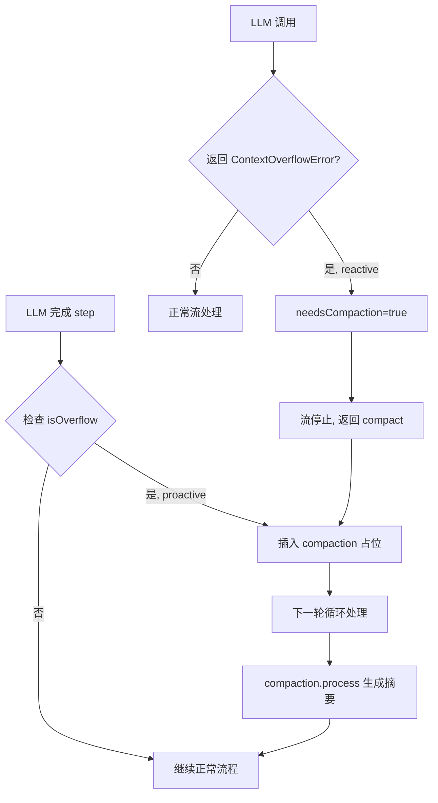
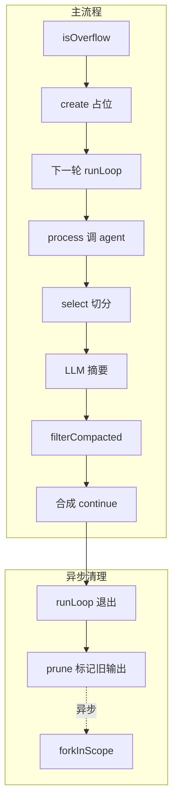

# OpenCode 上下文压缩：Compact 2 级机制

最近不少朋友跟我聊 AI Agent，发现一个共同现象：**只要上下文一长，Agent 就开始变笨**。问它前面定过的设计，它说不记得；让它接着改某个文件，它把上一次的修改给覆盖了；更有甚者，跑着跑着直接报 `context overflow` 崩了。

面试官最爱问的就是这个：「**你的 Agent 怎么扛 200K token 的上下文？**」

答案很简单 —— **压缩**。但怎么压、什么时候压、压完怎么续，每个 Agent 框架的解法都不一样。今天这篇就想带你从源码视角，把 OpenCode 的上下文压缩机制彻底讲明白。目标是让你看完能同时 get 三个问题：

- 第一，**什么时候触发压缩**？proactive 和 reactive 两条路径分别在哪儿
- 第二，**2 级压缩（Prune + Compact）**是怎么分工的？为什么只有 2 级？
- 第三，**压缩完怎么续**？锚定摘要、尾巴保留、消息重排是怎么协同的

后面我会按由浅入深的顺序，一个个讲清楚。最后还会和 Claude Code 的 5 级压缩做一次硬核对比，让你看清两种设计哲学的取舍。


## 一、为什么需要压缩？—— 上下文溢出是 Agent 的头号天敌

### 1.1 一个让你「先别翻答案」的小问题

我先抛两个问题，**建议你先停个 10 秒估算下**，再往下翻：

**问题 1**：一个 200K context 的模型，能用多少 token 来装历史对话？

- A. 200,000
- B. 192,000
- C. 180,000

**问题 2**：如果历史对话已经吃掉了 180K token，但用户又问了个新问题，Agent 应该怎么办？

公布答案：

- 问题 1：**C**。200K 上下文要扣掉输出预留（默认 `min(20_000, maxOutputTokens)`），扣完只剩 180K
- 问题 2：不能直接报错，得**主动压缩**——把旧的工具输出剪掉、把历史对话摘要化，腾出空间继续跑

这两个问题背后的机制，就是 OpenCode 的 `compaction.ts` 在干的事。

### 1.2 溢出长什么样

```ts
// src/session/overflow.ts
export function isOverflow(input) {
  if (input.cfg.compaction?.auto === false) return false     // 用户关掉自动压缩
  if (input.model.limit.context === 0) return false           // 模型不报告 limit
  
  const count =
    input.tokens.total ||                                     // 优先用 total
    input.tokens.input + input.tokens.output +
    input.tokens.cache.read + input.tokens.cache.write         // 没有就分项累加
  return count >= usable(input)                               // 达到可用上限即溢出
}
```

你看，溢出判断其实就一行：**累计 token 数 ≥ 可用 token 数**。真正的工程含量在 `usable()` 怎么算可用额度上。

### 1.3 可用额度怎么算

```ts
// src/session/overflow.ts
const COMPACTION_BUFFER = 20_000

export function usable(input) {
  const context = input.model.limit.context
  if (context === 0) return 0

  const reserved =
    input.cfg.compaction?.reserved ??                         // 用户配置优先
    Math.min(COMPACTION_BUFFER, ProviderTransform.maxOutputTokens(input.model, input.outputTokenMax))
  
  return input.model.limit.input
    ? Math.max(0, input.model.limit.input - reserved)          // 模型有 input limit 走这条
    : Math.max(0, context - ProviderTransform.maxOutputTokens(input.model, input.outputTokenMax))
}
```

翻译成人话：

- 如果模型显式报了 `limit.input`，可用额度 = `input_limit - reserved`
- 否则，可用额度 = `context - max_output_tokens`
- `reserved` 默认是 20K，但**不超过**模型的最大输出 token 数

为什么要扣这 20K？因为**下一轮 LLM 调用要留输出空间**。如果你把上下文塞到 200K 满，模型连一句话都吐不出来，等它写完一半就被截断了——这就是后面要讲的 reactive 路径。


## 二、两条触发路径：proactive vs reactive

OpenCode 的压缩触发，**不是单一时机**，而是两条互补的路径。



### 2.1 Proactive：上一轮结束后提前触发

**位置**：`src/session/prompt.ts` 第 1322-1328 行

```ts
// runLoop 中每一轮开头
if (
  lastFinished &&
  lastFinished.summary !== true &&                              // 摘要消息本身不参与溢出判断
  (yield* compaction.isOverflow({ tokens: lastFinished.tokens, model }))
) {
  yield* compaction.create({ 
    sessionID, 
    agent: lastUser.agent, 
    model: lastUser.model, 
    auto: true 
  })
  continue                                                      // 跳过这一轮，下一轮处理 compaction
}
```

**这段代码的精妙之处**在于三个细节：

1. **`lastFinished` 而不是 `lastAssistant`** — 只检查「已完成」的 assistant，避免对正在生成中的消息误判
2. **`summary !== true`** — 摘要 assistant 本身不算溢出，否则会无限触发压缩（压缩的输出又触发下一轮压缩）
3. **`create` 后立刻 `continue`** — 不在同一轮里处理，而是把 compaction 推到下一轮的 `tasks` 队列里

为什么不直接调用 `compaction.process`？因为 OpenCode 把 compaction **设计成一个 task**，走统一的任务队列（`tasks.pop()`），保持 runLoop 主循环的简洁。

### 2.2 Reactive：LLM 调用过程中被截断

**位置**：`src/session/processor.ts` 第 754-756 行

```ts
// 在 LLM 流式响应过程中
if (MessageV2.ContextOverflowError.isInstance(error)) {
  ctx.needsCompaction = true
  yield* bus.publish(Session.Event.Error, { sessionID: ctx.sessionID, error })
  return
}
```

和 step-finish 检查：

```ts
// processor.ts 大约 845 行
if (ctx.needsCompaction) return "compact"   // 优先级高于 stop/continue
```

回到 runLoop：

```ts
// prompt.ts:1477
if (result === "compact") {
  yield* compaction.create({
    sessionID,
    agent: lastUser.agent,
    model: lastUser.model,
    auto: true,
    overflow: !handle.message.finish,                            // 流被截断了！
  })
}
```

**Reactive 路径的特别之处**：

- 它会标记 `overflow: true`
- 这个标记后续会影响 compaction 的处理逻辑——会触发**重放用户消息**（见第七节）

### 2.3 两条路径怎么配合

**Proactive 是主路径**：在大多数情况下，OpenCode 会在 LLM 完成 step 后主动检查，提前一轮触发压缩，避免真的爆掉。

**Reactive 是兜底**：万一 proactive 没拦住（比如模型突然输出了超长 reasoning），API 返回 ContextOverflowError，processor 立刻掐断流，把 `compact` 信号抛回 runLoop。

这两条路径**共用同一个 `create()` 函数**，差别只在 `overflow` 参数上。设计很统一。


## 三、Compact 流程全景：create → process → select → prune

这是整个压缩机制的核心。我用一张图先给你看全貌，再逐个拆：



注意三个关键点：

1. **create 和 process 是分离的**——create 只插入一条占位 user 消息，process 在下一轮才执行
2. **prune 是异步的**——它在 runLoop 整个 while 循环退出后才 fork 出去，不阻塞响应
3. **filterCompacted 是序列化时的处理**——不是压缩的一部分，而是把压缩后的消息重排成 LLM 能理解的顺序

### 3.1 create：插一条占位消息

```ts
// compaction.ts:584-614
const create = Effect.fn("SessionCompaction.create")(function* (input) {
  // 1. 创建一条 user 消息
  const msg = yield* session.updateMessage({
    id: MessageID.ascending(),
    role: "user",
    model: input.model,
    sessionID: input.sessionID,
    agent: input.agent,
    time: { created: Date.now() },
  })
  
  // 2. 在这条 user 上挂一个 compaction part
  yield* session.updatePart({
    id: PartID.ascending(),
    messageID: msg.id,
    sessionID: msg.sessionID,
    type: "compaction",
    auto: input.auto,                                            // 是否自动触发
    overflow: input.overflow,                                   // 是否 reactive 路径
  })
  
  // 3. 发布事件
  if (flags.experimentalEventSystem) {
    yield* events.publish(SessionEvent.Compaction.Started, {
      sessionID: input.sessionID,
      timestamp: DateTime.makeUnsafe(Date.now()),
      reason: input.auto ? "auto" : "manual",
    })
  }
})
```

**为什么是「占位」**？因为这一步根本不调用 LLM，只是写一条标记消息到数据库。下一轮 runLoop 跑到 `tasks.pop()` 时，发现这是一条 compaction task，才会真正调用 `process()` 去生成摘要。

这个设计解耦了「**决定要压**」和「**真正去压**」两个动作，让 runLoop 主循环保持纯粹的「轮询 + 分发」结构。

### 3.2 process：真正执行压缩的核心

`process()` 是最长的一个函数（275 行），干 5 件事：

```ts
// compaction.ts:344
const processCompaction = Effect.fn("SessionCompaction.process")(function* (input) {
  // 1. 处理 overflow 场景：找上一条 user 消息作为 replay
  // 2. 拿到 compaction agent 和 model
  // 3. 过滤掉已完成的 compaction，select 分割 head/tail
  // 4. 构建 prompt（含 previousSummary）+ plugin hook
  // 5. 调 LLM 生成摘要，处理结果
})
```

第 3 步的 select 是这篇文章的核心，单独成节讲（第四节）。第 5 步的 prompt 构建和摘要模板，第六节细讲。

### 3.3 prune：异步标记旧工具输出

```ts
// compaction.ts:296
const prune = Effect.fn("SessionCompaction.prune")(function* (input) {
  const cfg = yield* config.get()
  if (!cfg.compaction?.prune) return                             // 用户可以关掉 prune
  
  const msgs = yield* session.messages({ sessionID: input.sessionID })
  // ...从后向前扫描...
})
```

**触发时机**（prompt.ts:1495）：

```ts
// runLoop 退出后
yield* compaction.prune({ sessionID }).pipe(Effect.ignore, Effect.forkIn(scope))
return yield* lastAssistant(sessionID)
```

注意两个细节：

1. **`Effect.forkIn(scope)`** — fork 到一个独立 fiber，**异步执行**
2. **`Effect.ignore`** — 失败也不影响主流程

也就是说，**用户拿到响应的那一刻，prune 还在后台默默跑**。这是 OpenCode 设计上的一个取舍：宁可响应慢 0.1 秒返回完整摘要，也不要为了 prune 把响应卡住。


## 四、select：计算保留的尾巴轮次

压缩不是「把全部历史塞给 LLM 让它总结」，而是要**保留最近的对话**——因为最近的上下文是最相关的，模型需要看到才能续上。

OpenCode 用 `select()` 来切分历史为 `head`（送 LLM 摘要）和 `tail`（原样保留）两部分。


### 4.1 默认保留 2 轮，可配置

```ts
// compaction.ts:245-294
const select = Effect.fn("SessionCompaction.select")(function* (input) {
  const limit = input.cfg.compaction?.tail_turns ?? DEFAULT_TAIL_TURNS    // 默认 2
  if (limit <= 0) return { head: input.messages, tail_start_id: undefined }
  
  const budget = preserveRecentBudget({ cfg: input.cfg, model: input.model })
  const all = turns(input.messages)
  if (!all.length) return { head: input.messages, tail_start_id: undefined }
  
  const recent = all.slice(-limit)                                          // 取最近 N 轮
  // 从后往前累加 token，超过 budget 就 split
})
```

**默认保留 2 轮**，但这 2 轮的总 token 不能超过 `preserveRecentBudget`：

```ts
// compaction.ts:136-141
function preserveRecentBudget(input) {
  return (
    input.cfg.compaction?.preserve_recent_tokens ??                       // 用户配置优先
    Math.min(MAX_PRESERVE_RECENT_TOKENS,                                   // 8_000
      Math.max(MIN_PRESERVE_RECENT_TOKENS,                                 // 2_000
        Math.floor(usable(input) * 0.25)))                                 // 可用额度的 25%
  )
}
```

翻译一下这个公式：

- 默认值 = `clamp(2_000, 8_000, usable * 25%)`
- 200K context 模型 → `usable ≈ 180K` → budget = `min(8_000, max(2_000, 45_000))` = **8_000**

也就是说，**最近 2 轮对话最多保留 8K token**。如果 2 轮实际加起来不到 8K，就保留全部；如果超过了，就在那一轮里再切分（`splitTurn`）。

### 4.2 为什么是 2 轮，不是 1 轮或 5 轮？

这是个有意思的取舍问题。我建议你先停 10 秒想想：

- **保留 1 轮**：太少。模型刚问完一个问题，答案在上一轮——压完模型忘了自己问过什么
- **保留 5 轮**：太多。8K budget 装不下，反而把最近的细节挤掉
- **2 轮**：刚好覆盖「**最近一次完整的问答对**」+ 一点前置上下文

这个数字是 OpenCode 工程师拍脑袋拍的，但拍得有道理。Claude Code 默认保留 3-5 个 tool results + 40K token 窗口，思路类似但更宽（代价是上下文压力大时更易触发下一轮压缩）。

### 4.3 splitTurn：在一轮内部切分

如果某一轮的 token 数已经超过 budget，select 不会简单粗暴丢弃整轮，而是调用 `splitTurn()` 在轮内找切点：

```ts
// 简化逻辑
const split = yield* splitTurn({
  messages: input.messages,
  turn,
  model: input.model,
  budget: remaining,
  estimate,
})
if (split) keep = split
```

这保证了**即使某轮特别长（比如用户一次性贴了 30K 的代码），也能保住最近的子片段**，不至于一刀切下去什么都丢。


## 五、Prune 截断：PRUNE_PROTECT 40K tokens 保护

prune 是 OpenCode 压缩机制的「**第一级**」。它不调用 LLM，纯数据结构操作，把旧的工具输出标记为 `compacted`。

### 5.1 prune 的扫描逻辑

```ts
// compaction.ts:296-342
const prune = Effect.fn("SessionCompaction.prune")(function* (input) {
  // ...省略前面...
  
  let total = 0
  let pruned = 0
  const toPrune: MessageV2.ToolPart[] = []
  let turns = 0
  
  loop: for (let msgIndex = msgs.length - 1; msgIndex >= 0; msgIndex--) {
    const msg = msgs[msgIndex]
    if (msg.info.role === "user") turns++
    if (turns < 2) continue                                        // 保护最近 2 轮
    if (msg.info.role === "assistant" && msg.info.summary) break loop  // 不越过已有摘要
    
    for (let partIndex = msg.parts.length - 1; partIndex >= 0; partIndex--) {
      const part = msg.parts[partIndex]
      if (part.type !== "tool") continue
      if (part.state.status !== "completed") continue
      if (PRUNE_PROTECTED_TOOLS.includes(part.tool)) continue      // skill 永不 prune
      if (part.state.time.compacted) break loop                    // 已修剪边界
      
      const estimate = Token.estimate(part.state.output)
      total += estimate
      if (total <= PRUNE_PROTECT) continue                         // 保留 40K tokens
      pruned += estimate
      toPrune.push(part)
    }
  }
  
  if (pruned > PRUNE_MINIMUM) {                                    // 只有超过 20K 才真正执行
    for (const part of toPrune) {
      if (part.state.status === "completed") {
        part.state.time.compacted = Date.now()                     // 标记时间戳
        yield* session.updatePart(part)
      }
    }
  }
})
```

**关键常量**：

```ts
export const PRUNE_MINIMUM = 20_000          // 最少清理 20K tokens 才值得 prune
export const PRUNE_PROTECT = 40_000          // 保留最近的 40K tokens 不受 prune
const PRUNE_PROTECTED_TOOLS = ["skill"]     // skill tool 输出永远不被 prune
```

### 5.2 三个关键保护

我从这段代码里读出三个保护机制：

**保护 1：最近 2 轮用户消息**

`if (turns < 2) continue` — 从尾部数，先跳过最近 2 个 user 消息及其之后的内容。**最近的对话不动**。

**保护 2：40K tokens 工具输出**

`if (total <= PRUNE_PROTECT) continue` — 累计到 40K tokens 之前的不动。这是一个**滑动窗口**，保证最近的工具输出大概率完整可见。

**保护 3：skill 永不修剪**

```ts
if (PRUNE_PROTECTED_TOOLS.includes(part.tool)) continue
```

为什么 skill 工具输出特殊？因为 skill 是「**按需加载的指令文件**」，一旦 prune 掉，下次 LLM 又得重新加载，浪费 token 又可能产生不一致。直接保护掉最稳。

### 5.3 「标记」而不是「删除」

注意这一行：

```ts
part.state.time.compacted = Date.now()
yield* session.updatePart(part)
```

prune **没有删除任何数据**，只是给 part 的 `state.time` 字段加了一个 `compacted` 时间戳。

真正的「隐藏」发生在序列化时：

```ts
// message-v2.ts toModelMessagesEffect
// 如果 part.state.time.compacted 为真
// → 工具输出正文变为 "[Old tool result content cleared]"
// → 附件也会清空
```

这是个非常聪明的工程决策——**数据仍在 SQLite 数据库里**，需要回溯、撤销、审计时都能拿出来。压缩和持久化解耦，互不干扰。

### 5.4 最低门槛保护

```ts
if (pruned > PRUNE_MINIMUM) {                                     // 只有超过 20K 才真正执行
  // ...
}
```

如果可剪的部分不到 20K，prune 直接放弃。**避免为了省一点 token 而引入数据库写入的开销**。


## 六、LLM 摘要生成：9 段摘要模板 + compaction Agent

压缩的核心，是让一个 LLM 把长对话总结成结构化的 9 段 Markdown。这一步用的是**专门的 compaction agent**。

### 6.1 compaction Agent 的配置

```ts
// src/agent/agent.ts:235-249
compaction: {
  name: "compaction",
  mode: "primary",
  native: true,
  hidden: true,                                                    // 对用户不可见
  prompt: PROMPT_COMPACTION,                                       // 来自 compaction.txt
  permission: Permission.merge(
    defaults,
    Permission.fromConfig({
      "*": "deny",                                                 // 不允许任何工具
    }),
    user,
  ),
  options: {},
},
```

**关键设计**：

1. **`hidden: true`** — 用户在 agent 列表里看不到它，专供内部使用
2. **`permission: { "*": "deny" }`** — **完全禁止工具调用**。摘要 agent 只能生成文本，不能搞事
3. **`native: true`** — 走 native runtime，避免 AI SDK 的中间转换开销

为什么禁止工具？我猜原因有两个：

- 防止摘要 agent 拿着工具瞎跑——它的任务就一件事：**总结**
- 控制成本——如果摘要 agent 也能调工具，万一它自己也 overflow 了，就嵌套压缩了

### 6.2 compaction Agent 的 prompt

```
# src/agent/prompt/compaction.txt
You are an anchored context summarization assistant for coding sessions.

Summarize only the conversation history you are given. The newest turns may be
kept verbatim outside your summary, so focus on the older context that still
matters for continuing the work.

If the prompt includes a <previous-summary> block, treat it as the current
anchored summary. Update it with the new history by preserving still-true
details, removing stale details, and merging in new facts.

Always follow the exact output structure requested by the user prompt. Keep
every section, preserve exact file paths and identifiers when known, and prefer
terse bullets over paragraphs.

Do not answer the conversation itself. Do not mention that you are summarizing,
compacting, or merging context. Respond in the same language as the conversation.
```

**这段 prompt 的精妙之处**在「**anchored summary**（锚定摘要）」这个词上——它不是每次从零开始总结，而是基于上一次的摘要做增量更新。

### 6.3 锚定摘要：增量更新而不是重新生成

```ts
// compaction.ts:123-134
function buildPrompt(input: { previousSummary?: string; context: string[] }) {
  const anchor = input.previousSummary
    ? [
        "Update the anchored summary below using the conversation history above.",
        "Preserve still-true details, remove stale details, and merge in the new facts.",
        "<previous-summary>",
        input.previousSummary,
        "</previous-summary>",
      ].join("\n")
    : "Create a new anchored summary from the conversation history above."
  return [anchor, SUMMARY_TEMPLATE, ...input.context].join("\n\n")
}
```

**两种模式**：

- **首次压缩**：`Create a new anchored summary from the conversation history above.`
- **后续压缩**：`Update the anchored summary below using the conversation history above.` + `<previous-summary>` 块

**为什么要锚定**？

- 第一次压缩：从原始对话生成摘要 A
- 第二次压缩：不重新读所有原始对话（太贵），而是基于摘要 A + 新对话 → 生成更新后的摘要 A'

这样每次压缩只需要处理「**新产生的对话 + 上一次摘要**」，而不是「全部历史」。**省 token 又保证摘要的连续性**。

### 6.4 9 段摘要模板

这是 `SUMMARY_TEMPLATE` 常量（compaction.ts:42-77）：

```markdown
## Goal
- [single-sentence task summary]

## Constraints & Preferences
- [user constraints, preferences, specs, or "(none)"]

## Progress
### Done
- [completed work or "(none)"]
### In Progress
- [current work or "(none)"]
### Blocked
- [blockers or "(none)"]

## Key Decisions
- [decision and why, or "(none)"]

## Next Steps
- [ordered next actions or "(none)"]

## Critical Context
- [important technical facts, errors, open questions, or "(none)"]

## Relevant Files
- [file or directory path: why it matters, or "(none)"]
```

**为什么是 9 段**？

每一段都是**精确的、结构化的、可消费的**：

| 段 | 解决什么问题 |
|---|---|
| Goal | 让 LLM 知道用户当前在做什么 |
| Constraints & Preferences | 防止违反用户的偏好 |
| Progress（3 子段） | 已完成 / 正在做 / 卡住了 |
| Key Decisions | 别覆盖已经决定的事 |
| Next Steps | 模型自己接下去应该干啥 |
| Critical Context | 错误、open question 这些关键信息 |
| Relevant Files | 涉及哪些文件，省得它再 grep 一遍 |

模板里还有几条**硬规矩**：

```
Rules:
- Keep every section, even when empty.
- Use terse bullets, not prose paragraphs.
- Preserve exact file paths, commands, error strings, and identifiers when known.
- Do not mention the summary process or that context was compacted.
```

「Keep every section, even when empty」这一条特别重要——**空段也要保留**，强制 LLM 显式地说「(none)」，而不是直接删掉。这样下次锚定更新时，结构对得上，不会乱套。

### 6.5 调用时的额外参数

```ts
const modelMessages = yield* MessageV2.toModelMessagesEffect(msgs, model, {
  stripMedia: true,                                                // 去掉图片/媒体
  toolOutputMaxChars: TOOL_OUTPUT_MAX_CHARS,                      // = 2_000
})
```

**`stripMedia: true`** — 摘要不需要图片，去掉省 token

**`toolOutputMaxChars: 2_000`** — 工具输出截断到 2K 字符。因为摘要只关心「这个工具干了什么」，不关心工具的完整输出。**这是个常量，不可配置**。


## 七、filterCompacted：消息重排的艺术

压缩完了，数据库里现在有这些消息（按时间顺序）：

```
[old-user1, old-assistant1, old-tool-result1, ...,
 compaction-user, summary-assistant,
 recent-user, recent-assistant, ...,
 continue-synthetic-user]
```

但 LLM 看到的顺序应该是：

```
[compaction-user, summary-assistant,
 recent-user, recent-assistant, ...,
 continue-synthetic-user]
```

也就是说，要把**压缩点之后的尾巴**挪到摘要后面。这就是 `filterCompacted()` 干的事。

### 7.1 重排逻辑

```ts
// message-v2.ts:1014-1037
export function filterCompacted(msgs: Iterable<WithParts>) {
  const result = [] as WithParts[]
  const completed = new Set<string>()
  let retain: MessageID | undefined
  
  for (const msg of msgs) {
    result.push(msg)
    if (retain) {
      if (msg.info.id === retain) break                          // 到达保留尾巴的起点
      continue
    }
    
    // 遇到已完成 compaction 的 user 消息，开始 retain 模式
    if (msg.info.role === "user" && completed.has(msg.info.id)) {
      const part = msg.parts.find((item): item is CompactionPart => item.type === "compaction")
      if (!part) continue
      if (!part.tail_start_id) break                             // 没保留尾巴，截断
      retain = part.tail_start_id
      if (msg.info.id === retain) break
      continue
    }
    
    // 标记已完成的 compaction assistant
    if (msg.info.role === "assistant" && msg.info.summary && msg.info.finish && !msg.info.error)
      completed.add(msg.info.parentID)
  }
  result.reverse()
  
  // 重排：[compaction-user, summary, ...tail, ...rest]
  // ...具体重排代码省略...
}
```

**核心思路**：

1. 找到最近一次完成的 compaction（有 summary assistant 的）
2. 拿到它的 `tail_start_id`（select 时算出来的）
3. 从那个 ID 开始往后的消息，**插到摘要 assistant 后面**

这样 LLM 看到的上下文是：

```
1. [compaction-user]      (空 user 消息，挂 compaction part)
2. [summary-assistant]     (LLM 生成的 9 段摘要)
3. [recent-user1]          (保留的最近对话)
4. [recent-assistant1]
5. [recent-user2]
6. ...
```

完全自洽，模型不会感到「上下文断了」。

### 7.2 overflow 场景的特殊处理：重放用户消息

如果是 reactive 路径触发的压缩（`overflow: true`），LLM 在生成时被截断了，**用户的最后一条消息没有完整响应**。这时候 process() 会做一件特别的事：

```ts
// compaction.ts process() 内部
if (result === "continue" && input.auto) {
  if (replay) {
    // overflow 场景：复制原 user message（去除媒体附件）
    // 让模型重新响应一次
  } else {
    // 非 overflow 场景：发合成 user 消息
    // "Continue if you have next steps..."
  }
}
```

这是个**很人性化的设计**：

- **reactive 触发**：用户原始问题被中断了，模型应该重答一遍 → 重放用户消息
- **proactive 触发**：上一轮已经完整结束了，让模型自己决定要不要继续 → 发「Continue if you have next steps」


## 八、为什么 CC 用 5 级压缩，OpenCode 只用 2 级？

这是这篇文章最有意思的部分。把两个框架放在一起看，你会发现它们的压缩哲学完全不同。

### 8.1 Claude Code 的 5 级压缩

CC 实际上有 5 个层级的压缩（按查询循环执行顺序）：

| 层级 | 机制 | 调用 LLM | 触发条件 |
|------|------|---------|----------|
| Level 1 | Tool Result Budget | 否 | 单条 tool result > 50K 字符 → 写磁盘留 2KB 预览 |
| Level 2 | Snip Compact | 否 | token 超（阈值 + 13K） |
| Level 3 | Microcompact | 否 | 每次 API 调用前 |
| Level 4 | Context Collapse | 否 | ~90% 利用率 |
| Level 5 | Auto-compact | **是** | 前 4 级不足时 |

**关键洞察**：CC 前 4 级都不调用 LLM，纯数据结构操作。只有第 5 级才真正调 LLM 生成摘要。**大多数会话根本走不到第 5 级**——前 4 级就把空间省出来了。

### 8.2 OpenCode 的 2 级压缩

OpenCode 简洁得多：

| 层级 | 机制 | 调用 LLM | 触发条件 |
|------|------|---------|----------|
| Level 1 | Prune | 否 | runLoop 退出后异步 fork |
| Level 2 | Compact | **是** | isOverflow()=true |

**只有 2 级**，而且 Compact 一定调 LLM。

### 8.3 两种哲学的取舍

**CC 的设计哲学**：「**能不调 LLM 就不调**」

- 5 级梯度，从最便宜的开始
- 大量依赖「替换为占位符」+「服务端 cache_edits」
- 把 LLM 调用留到最后一道防线
- **优势**：成本极低，大多数会话零 LLM 调用
- **代价**：实现复杂，5 级之间协同、缓存感知、特性开关（feature-gated）都需要工程投入

**OpenCode 的设计哲学**：「**简单 + 数据可逆**」

- 2 级梯度，思路直接
- Prune 用「时间戳标记」而不是「物理删除」
- Compact 一定调 LLM 但走锚定摘要（增量更新）
- **优势**：实现简单，代码量小（compaction.ts 639 行 vs CC 3960+ 行）
- **代价**：每次压缩都付一次 LLM 调用的钱

### 8.4 哪种更好？

**没有绝对的更好，只有更适合的场景**：

| 维度 | CC 占优 | OpenCode 占优 |
|------|---------|--------------|
| 高频长对话（成本敏感） | ✅ | |
| 中小型会话（简单优先） | | ✅ |
| 数据可逆性 | | ✅ 时间戳标记 |
| 缓存优化 | ✅ cache_edits | |
| 调试可读性 | | ✅ 639 行 vs 3960 行 |
| 跨模型厂商 | | ✅ 不依赖 Anthropic 特性 |

OpenCode 的 2 级设计有一个**意外的好处**——它不依赖 Anthropic 的 `cache_edits` API，可以跑在任意模型厂商上。CC 的 Microcompact 热路径用了 Anthropic 内部 API，**只能在 Claude 上才能享受那种性能**。

这是个非常典型的「**通用性 vs 优化深度**」的工程取舍。


## 九、OpenCode vs Claude Code：压缩机制对比表

最后用一张表把两个框架的压缩机制全面对比一遍。这张表是整个系列的「独家护城河」——基于两份源码同时分析才能写出来：

| 维度 | Claude Code | OpenCode |
|------|-------------|----------|
| **压缩层级数** | 5 级 | **2 级** |
| **LLM 调用频率** | 仅 Level 5 调用 | Level 2 必调 |
| **触发阈值** | `effectiveWindow - 13K`（约 83-89%） | `context - 20K buffer` |
| **轻量清理方式** | Microcompact: 替换占位符 + cache_edits API | Prune: 时间戳标记（**数据不删**） |
| **保护窗口** | 最后 3-5 个 tool results + 最后 40K tokens | 最后 40K tokens + 最后 2 轮用户消息 |
| **特殊工具保护** | 按工具 ID 列表（紧凑型工具） | `PRUNE_PROTECTED_TOOLS = ["skill"]` |
| **摘要结构** | 9 段 XML + `<analysis>` 草稿（后剥离） | 9 段 Markdown（Goal/Progress/...） |
| **摘要更新方式** | 每次从历史重新生成 | **锚定摘要**（增量更新） |
| **摘要 agent** | 通用 agent + NO_TOOLS_PREAMBLE | 专用 compaction agent（hidden + deny all） |
| **压缩后行为** | Continuation message + 重读最近 5 个文件 | 重放最后一条用户消息（reactive）/ 合成 continue（proactive） |
| **Post-compact 恢复** | 自动重读文件 + skills + plan 状态 | 仅重放用户消息 |
| **Reactive 路径** | 413 错误后保留最后 4 条消息重试 | ContextOverflowError → 重放用户消息 |
| **缓存感知** | 深度 Prompt Cache 集成（双路径：cache_control + cache_edits） | 有 prompt cache（`cache: "auto"`），无 cache_edits（Anthropic 专有） |
| **阻塞限制** | ~98.5% 时主动阻塞 API 请求（effectiveWindow - 3K） | 无明确阻塞限制 |
| **Circuit Breaker** | 3 次连续失败后停止 | 无明显 circuit breaker |
| **手动触发** | `/compact [instructions]`，可自定义焦点 | `summarize` HTTP API + `auto: false` |
| **操作可逆性** | 不可逆（占位符替换 / 摘要替代） | **部分可逆**（timestamp-based hiding，数据在 DB） |
| **源码规模** | ~3,960 行（11 个文件） | ~639 行（compaction.ts） + 32 行（overflow.ts） |
| **跨模型厂商** | ❌ 依赖 Anthropic cache_edits | ✅ 不依赖厂商特定 API |

**看完这张表，你应该能 get 到**：

- OpenCode 的简洁不是「做得少」，而是「做得对」——核心机制都在，但少了不必要的优化层
- CC 的复杂度也不是「过度工程」，是为其特定生态（Anthropic 模型 + Claude API）做了深度优化的结果
- 两者的保护机制（最近 N 轮 / 40K tokens）惊人地相似——这是工程经验的趋同演化


## 最后

写到这里，OpenCode 的上下文压缩机制基本就扒完了。

回过头看，这套系统不是简单的「**调个 LLM 总结一下**」，它在**触发时机、保护机制、续接策略、数据可逆性**每一个维度都做了精致的设计：

- **两条触发路径**（proactive + reactive）互补，主路径提前拦、兜底路径接住极端情况
- **2 级梯度**（Prune + Compact）分工明确，Prune 处理工具输出、Compact 处理对话历史
- **锚定摘要**让多次压缩变成增量更新，省 token 又保证连续性
- **时间戳标记**而不是物理删除，数据可回溯
- **专用 compaction agent**完全禁工具，隔离副作用
- **filterCompacted 消息重排**让 LLM 看到的上下文顺序自洽
- **reactive 路径重放用户消息**，确保最新指令不丢失

每一块拆开看都不是啥复杂技术，但组合在一起，就成了一个能在 200K 上下文压力下稳定运行的工业级压缩系统。

更难得的是，OpenCode 用 639 行 TypeScript 干了 Claude Code 3960 行才干的事——**简化的代价是放弃了 cache_edits API（Anthropic 专有的服务端缓存删除机制）**，但换来的是**跨厂商兼容**和**代码可维护性**。这种「**少即是多**」的工程哲学，值得每一个做 Agent 系统的朋友深思。

今天分享就到这里，我们下篇见！