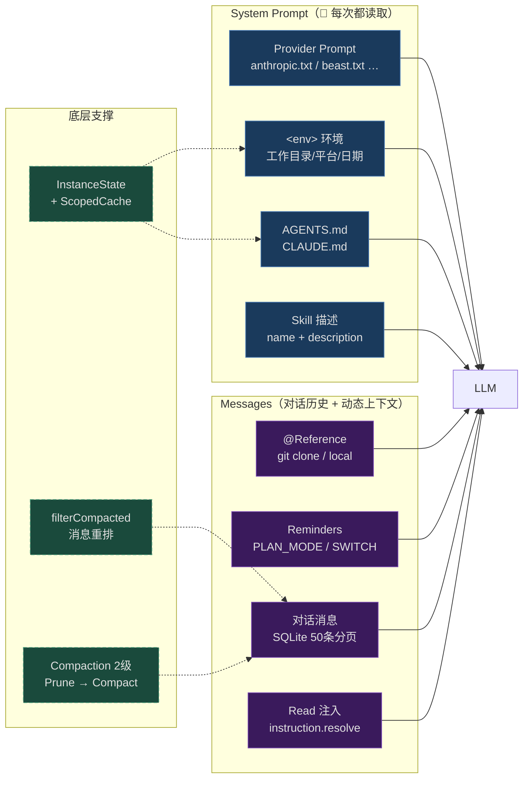

# OpenCode 上下文架构：5 层上下文注入

最近不少朋友在自建 AI Agent，被一个问题反复折磨：**Agent 怎么记住上下文？**

- 让 agent 记住项目的代码风格？写一份文档塞给 LLM，但每次都重复加载太贵
- 让 agent 记住用户偏好？存到数据库，但怎么取出来给 LLM？
- 让 agent 记住之前的对话？直接全部塞进 context，但 token 用量爆炸
- 想上 RAG？要 embedding、要向量库、要相似度搜索，工程量太大

面试官最爱问的就是这个：「**你的 Agent 记忆系统怎么设计的？为什么不用向量数据库？**」

先说结论：**OpenCode 没有传统意义上的记忆系统**——它用一套「上下文架构」替代了记忆。今天这篇就想带你从源码视角，把 OpenCode 的上下文架构彻底讲明白。目标是让你看完能同时 get 三个问题：

- 第一，**5 层上下文架构**——从最持久的 system prompt 到最临时的对话消息
- 第二，**指令文件 + Skill 系统**——怎么用文件系统做跨会话上下文
- 第三，**为什么 OpenCode 不用向量数据库**——它的替代方案是什么

后面我会按由浅入深的顺序，一个个讲清楚。这是系列的最后一篇，会综合引用前面几篇的结论，最后和 Claude Code 做一次完整对比。


## 一、5 层上下文全景：从持久到临时

OpenCode 的上下文注入到 LLM 请求有两条路径：

- **System Prompt**（每次请求的 system message）
- **Messages**（对话历史 + 动态注入）

按持久性和注入方式，可以分成 5 层，全貌如下：



| 层次 | 持久性 | 机制 | 存储 |
|------|--------|------|------|
| System Prompt | 请求级 | Provider 专属指令 + 环境注入 | 内存 |
| Instruction 文件 | 跨会话 | 文件系统，目录行走 | 项目目录 / `~/.config/opencode` |
| Skill 技能 | 跨会话 | 技能描述注入 system prompt，按需加载 | 文件系统 / 远程 URL |
| Reference 引用 | 跨会话 | Git clone 缓存 + 本地目录 | `~/.opencode/repos/` |
| 对话上下文 | 跨会话（SQLite） | 消息数组 + Compact 压缩 | SQLite 数据库 |

**关键洞察**：5 层从最持久（system prompt 每次请求都注入）到最临时（对话消息会被压缩），构成一个金字塔。

下面我们逐层拆解。


## 二、第 1 层：System Prompt

System Prompt 是每次 LLM 请求的 system message，由 `src/session/system.ts` 和 `src/session/prompt.ts` 管理。

### 2.1 最终组装

System Prompt 的拼接在 `prompt.ts` 中：

```ts
// src/session/prompt.ts:1437-1441
const system = [
  ...sys.environment(model),              // ① 环境信息
  ...instruction.system(),                 // ② 指令文件
  ...(skills ? [skills] : []),             // ③ Skill 描述清单
]
```

然后在 `handle.process()` 中传入 LLM 请求，和 agent/provider 指令、插件 transform 最终拼合：

```ts
// src/session/prompt.ts:1450-1453
const result = yield* handle.process({
  ...agent,
  system: [...(agent.prompt ?? SystemPrompt.provider(model)), ...system, ...(user.system ? [user.system] : [])],
  ...
})
// Plugin transform: experimental.chat.system.transform
```

System Prompt 由 4 部分组成：

1. **Agent/Provider 指令**——如果 agent 有自定义 prompt（如 explore、compaction），用它；否则用 Provider 专属 prompt
2. **环境信息**——`<env>` 块（工作目录、平台、日期等）
3. **指令文件**——AGENTS.md / CLAUDE.md
4. **Skill 描述清单**——可用技能的 name + description

### 2.2 Provider 专属 Prompt

不同模型厂商有不同的 system prompt 文件（`src/session/system.ts:19-33`）：

```ts
export function provider(model: Provider.Model) {
  if (model.api.id.includes("gpt-4") || model.api.id.includes("o1") || model.api.id.includes("o3"))
    return [PROMPT_BEAST]
  if (model.api.id.includes("gpt")) {
    if (model.api.id.includes("codex")) return [PROMPT_CODEX]
    return [PROMPT_GPT]
  }
  if (model.api.id.includes("gemini-")) return [PROMPT_GEMINI]
  if (model.api.id.includes("claude")) return [PROMPT_ANTHROPIC]
  if (model.api.id.toLowerCase().includes("trinity")) return [PROMPT_TRINITY]
  if (model.api.id.toLowerCase().includes("kimi")) return [PROMPT_KIMI]
  return [PROMPT_DEFAULT]
}
```

| 模型 | Prompt 文件 |
|------|------------|
| Claude 系列 | `anthropic.txt` |
| GPT 系列 | `gpt.txt` |
| GPT-4/o1/o3 系列 | `beast.txt` |
| Gemini 系列 | `gemini.txt` |
| Codex 系列 | `codex.txt` |
| Trinity | `trinity.txt` |
| Kimi | `kimi.txt` |
| 其他 | `default.txt` |

**8 个 Provider Prompt**——这是 OpenCode 跨厂商支持的关键。每个厂商的模型对 prompt 的理解能力不同，需要不同的指令风格。

### 2.3 环境信息注入

```ts
// src/session/system.ts:48-62
environment: Effect.fn("SystemPrompt.environment")(function* (model: Provider.Model) {
  const ctx = yield* InstanceState.context
  return [
    [
      `You are powered by the model named ${model.api.id}. The exact model ID is ${model.providerID}/${model.api.id}`,
      `Here is some useful information about the environment you are running in:`,
      `<env>`,
      `  Working directory: ${ctx.directory}`,
      `  Workspace root folder: ${ctx.worktree}`,
      `  Is directory a git repo: ${ctx.project.vcs === "git" ? "yes" : "no"}`,
      `  Platform: ${process.platform}`,
      `  Today's date: ${new Date().toDateString()}`,
      `</env>`,
    ].join("\n"),
  ]
})
```

这段 prompt 你应该很熟悉——就是你用 OpenCode 时 system message 里看到的那段 `<env>` 块。每个字段都有用：

- `Working directory`：让 LLM 知道相对路径怎么解析
- `Workspace root folder`：worktree 边界（影响 external_directory 权限）
- `Is directory a git repo`：决定要不要用 git 命令
- `Platform`：影响 shell 命令选择（darwin vs linux）
- `Today's date`：让 LLM 知道当前时间，避免幻觉「未来」事件


## 三、第 2 层：Instruction 指令文件

这一层是**跨会话持久**的项目/用户指令文件，由 `src/session/instruction.ts` 管理。

### 3.1 文件类型

| 文件名 | 说明 |
|--------|------|
| `AGENTS.md` | 始终加载（OpenCode 原生格式） |
| `CLAUDE.md` | 仅在 `OPENCODE_DISABLE_CLAUDE_CODE_PROMPT` 未设置时加载（兼容 Claude Code） |
| `CONTEXT.md` | 已废弃，仍支持 |

### 3.2 文件查找路径

OpenCode 会从两个地方查找指令文件：

**全局文件**：

- `~/.config/opencode/AGENTS.md`
- `~/.claude/CLAUDE.md`（除非禁用 Claude Code 兼容）

**项目文件**（`systemPaths()` 函数）：

1. 从 CWD 向上遍历到 worktree 根目录（`fs.findUp`）
2. 找到**第一个匹配**的 AGENTS.md/CLAUDE.md/CONTEXT.md 即停止
3. **不叠加祖先目录**——只加载最近的一个

**自定义指令**：

- `config.instructions` 数组支持本地文件路径（glob、绝对路径、`~/`）
- 也支持远程 URL（`https://`/`http://`）

### 3.3 格式：每个文件作为一个块注入

每个指令文件被注入为：

```
Instructions from: {filepath}
{content}
```

格式很简洁——文件路径作为「**出处**」，内容原样注入。这让 LLM 知道指令的来源，便于引用。

### 3.4 动态注入：Read 工具的关联机制

这是 OpenCode 最有意思的上下文注入设计之一——**读文件时自动注入附近的指令文件**。

`instruction.resolve()` 函数：

- 当 Read 工具读取文件时，从被读取文件的目录开始向上行走
- 发现附近的指令文件（AGENTS.md/CLAUDE.md）就注入
- 注入到 Read 工具输出的 `<system-reminder>` 块中（不是 system prompt）
- 每个指令文件对同一 assistant 消息只注入一次（`claims` Map 去重）
- 已在 systemPaths 中或已通过 read 工具加载过的路径不重复注入

**这是个非常聪明的「上下文相关」的注入机制**：

- 不在 system prompt 里塞所有指令文件（太贵）
- 只在 LLM 实际读文件时，注入**和那个文件相关的指令**
- 比如读 `src/auth/` 下的文件，自动注入 `src/auth/AGENTS.md`（如果有）

这是**按需加载上下文**——只在需要时才注入，省 token 又精准。


## 四、第 3 层：Skill 技能描述

Skill 是 OpenCode 的「**可加载工作流**」机制，由 `src/skill/` 模块管理。

### 4.1 Skill 的格式

Skill 是一个 Markdown 文件（`**/SKILL.md`），带 YAML frontmatter：

```yaml

name: my-skill
description: What this skill does

# Skill Content
...instructions, workflows, etc.
```

### 4.2 5 种搜索路径

OpenCode 从 5 个地方搜索 Skill：

1. **`~/.claude/skills/**/SKILL.md`**——全局 Claude 风格
2. **`~/.agents/skills/**/SKILL.md`**——全局 OpenCode 风格
3. **项目级**：`.claude/skills/` 或 `.agents/skills/`
4. **配置路径**：`opencode.json` 中 `skills.paths` 配置的目录
5. **远程 URL**：`skills.urls` 通过 `Discovery` 从远程拉取
6. **内置 skill**：`customize-opencode`（代码中硬编码）

### 4.3 两种注入方式

Skill 有两种注入时机：

**1. System Prompt 注入（技能描述）**

```ts
// src/session/system.ts:65-77
skills: Effect.fn("SystemPrompt.skills")(function* (agent: Agent.Info) {
  if (Permission.disabled(["skill"], agent.permission).has("skill")) return
  const list = yield* skill.available(agent)
  return [
    "Skills provide specialized instructions and workflows for specific tasks.",
    "Use the skill tool to load a skill when a task matches its description.",
    Skill.fmt(list, { verbose: true }),                       // ← verbose 格式
  ].join("\n")
})
```

每次 LLM 调用前，把所有可用 skill 的描述注入 system prompt。但**只注入描述，不注入完整内容**——避免 system prompt 爆炸。

注意 `verbose: true`——源码注释说：

> "the agents seem to ingest the information about skills a bit better if we present a more verbose version"

**给 LLM 看的技能描述要比给用户的更详细**——这是个经验观察。

**2. Skill 工具按需加载（完整内容）**

LLM 通过调用 `skill` 工具，加载某个 skill 的完整内容到对话上下文。加载后的 skill 内容注入到后续对话中。

这种「**两阶段加载**」的设计非常聪明：

- **第一阶段**：system prompt 里只有描述（轻量，告诉 LLM 有哪些 skill 可用）
- **第二阶段**：LLM 决定需要时调用 skill 工具，加载完整内容（按需）

避免了「**所有 skill 都塞进 system prompt**」的浪费。

**额外保护**：在上下文裁剪（pruning）时，skill 工具的调用结果被 `PRUNE_PROTECTED_TOOLS = ["skill"]` 明确列入保护名单——不会被 prune 阶段标记为 `compacted`，因此 skill 的完整内容会一直在上下文中保留，不会被 `"[Old tool result content cleared]"` 替代。


## 五、第 4 层：Reference 引用 + Reminders

这一层是注入到 user message 中的上下文，不是 system prompt。

### 5.1 Reference 引用系统

Reference 是 OpenCode 的**外部知识引用**机制——把项目依赖/文档库自动 clone 到本地，LLM 可以直接读它的源码。

```jsonc
// src/config/reference.ts
{
  "reference": {
    "mylib": "github.com/org/repo",         // git 仓库，自动 clone 到缓存
    "mylib": { "repository": "...", "branch": "main" },
    "localdocs": "./docs",                   // 本地目录
    "localdocs": { "path": "~/projects/docs" }
  }
}
```

**三种引用类型**：

- `local`：本地目录路径
- `git`：自动 clone 到 `~/.opencode/repos/` 缓存目录
- `invalid`：无法解析的引用

**使用方式**：在 prompt 中直接引用配置中定义的名称，如 `docs` 会令 `resolvePromptParts()` 将该引用的元数据（路径、文件列表等）注入到 user message parts 中。这让 LLM 知道「**项目引用了哪些外部知识库**」，可以直接用 Read/Grep 工具访问这些目录下的文件。

注意：Reference 是**配置驱动**的——用户在 `opencode.jsonc` 中预先配置好引用，OpenCode 在每次对话前自动将引用信息注入到 context 中，不需要在 prompt 中写 `@` 前缀。

### 5.2 Reminders

`src/session/reminders.ts` 在特定场景下注入提示：

- **Plan mode 提醒**：注入 `PLAN_MODE` 文本到 user message 尾部
- **Build switch 提醒**：从 plan agent 切换到 build agent 时注入 `BUILD_SWITCH`
- **计划文件存在性检查**

这些 reminder 不是 system prompt 的一部分，而是 user message 的合成 part。让 LLM 在合适的时机注意到状态变化。

### 5.3 Read 工具动态指令注入

第 2 层提到的 `instruction.resolve()` 机制——Read 工具读取文件时，从该文件向 project root 遍历，发现 AGENTS.md/CLAUDE.md 就注入到 `<system-reminder>` 块中。

这个注入属于**第 4 层**——它注入到 tool result（属于 messages），不在 system prompt 中。

### 5.4 中间用户消息的 system-reminder

`prompt.ts` 第 1415-1431 行（`step > 1` 时的处理）：当主循环跑了几轮后，如果还有未处理的用户消息（比如用户中途又追加了一条），OpenCode 会把这条消息包裹在 `<system-reminder>` 中，提示 LLM 继续处理。

这是个保障**连续输入不丢失**的设计——用户输入不被中断覆盖。


## 六、第 5 层：对话上下文 Messages

这是最核心的上下文层——运行时的对话历史消息数组。

### 6.1 持久化：SQLite + Drizzle ORM

OpenCode 用 SQLite 持久化对话（`src/session/session.sql.ts`）：

| 表名 | 用途 |
|------|------|
| `SessionTable` | 会话元数据（cost, tokens, model, agent, summary diff 等） |
| `MessageTable` | 消息元数据（JSON 序列化的 `InfoData`） |
| `PartTable` | 消息部分（text, tool, file, reasoning, compaction, step-start/finish, patch 等） |
| `TodoTable` | 待办事项 |

**所有表通过外键级联删除**——删 session 自动删 messages，删 messages 自动删 parts。

### 6.2 消息加载

```ts
// src/session/session.ts:767-786
Session.messages() — 分页查询，一次 50 条，拼装成 MessageV2.WithParts[]
```

**分页加载**——一次 50 条消息，避免一次性把整个会话塞进内存。

### 6.3 写入：实时增量

每段文本增量、每个工具状态变化都通过 `Session.updatePart()` 即时写入 SQLite。

**这是个非常重要的设计**——即使 process 被 kill，对话也不会丢。下次启动 OpenCode，能从上次中断的地方继续。

### 6.4 消息过滤：filterCompacted

```ts
// src/session/message-v2.ts:1071-
export function filterCompacted(msgs: Iterable<WithParts>) {
  // 从最新消息向前遍历 → 遇到有 tail_start_id 的 compaction 时记录 retain 目标
  // → 到达 retain 目标时停止收集 → 反向（恢复时间顺序）
  // → 重排为：[compaction-user, summary-assistant, ...tail..., ...后续]
}
```

这个函数处理的是压缩后的消息重排。核心逻辑：

1. 从最新消息向前遍历，遇到带 `tail_start_id` 的 compaction user 消息时，记录 retention 起点
2. 到达起点后停止，反向恢复时间顺序
3. 最终重排为：`[compaction-user][summary-assistant][...tail...][...后续消息...]`

**关键洞察**：消息过滤不是「**删除旧消息**」，而是「**按 compacted 标记重排**」——数据库里的消息都还在，只调整了 LLM 看到的顺序。


### 6.5 上下文压缩：Compact 2 级机制

详细的 Compact 机制见：[OpenCode 上下文压缩：Compact 2 级机制](/opencode/04-compact)

简单回顾：

- **Prune**：标记旧 tool output 为 `compacted`（数据不删，序列化后变为 `"[Old tool result content cleared]"`）
- **Compact**：用 LLM 生成 9 段锚定摘要，替换旧对话

**关键常量**：

```ts
export const PRUNE_PROTECT = 40_000          // 保留最近 40K tokens 不剪
export const PRUNE_MINIMUM = 20_000          // 最少 20K 才值得 prune
const TOOL_OUTPUT_MAX_CHARS = 2_000          // compact 时 tool output 截断到 2K
const DEFAULT_TAIL_TURNS = 2                   // 默认保留最近 2 个完整的 user→assistant 轮次
```

`DEFAULT_TAIL_TURNS = 2` 的含义：compaction 时保留**最近的 2 个完整对话轮次**（user 发消息 → assistant 回复完成），包括其中的工具调用结果。超出 2 轮的旧对话被压缩为 9 段锚定摘要。

注意：**Prune 对 skill 工具的输出有特殊保护**——`PRUNE_PROTECTED_TOOLS = ["skill"]`，所以 skill 的完整内容不会被 pruning 剪掉。

### 6.6 Compaction 的隔轮执行

compaction 不是立即执行的，而是**分两步隔一轮完成**：

1. `compaction.create()`：在 DB 中插入一个带 `compaction` part 的 user 消息（占位）
2. 下一轮 `prompt.ts` 的 `while (true)` 循环中，`latest().tasks` 检测到这个 compaction part → 调用 `compaction.process()` 真正执行 LLM 摘要

这种「隔一轮」的设计确保了 compaction 不会在用户消息的同一轮中抢占执行——先占位，下一轮再处理。

两套触发路径：

- **主动（proactive）**：上一轮 assistant 正常 finish 后，`isOverflow(lastFinished.tokens)` 为真 → `create(auto:true)` → continue
- **被动（reactive）**：流中 `step-finish` 检测到 overflow，或 LLM 返回 `ContextOverflowError` → `ctx.needsCompaction = true` → 流被打断 → `create(auto:true, overflow:true)` → continue


## 七、代码检索：Grep / Glob / Read + ScopedCache

这是「**代码上下文怎么取出来**」的关键部分。

### 7.1 Grep 工具

```ts
// src/tool/grep.ts
const result = yield* rg.search({
  cwd,
  pattern: params.pattern,
  glob: params.include ? [params.include] : undefined,
  file,
  signal: ctx.abort,
})
```

底层包装的是 **Ripgrep**——非常快。结果按文件 mtime 排序（最新修改的优先），最多 100 条匹配，每行最长 2000 字符。

### 7.2 Glob 工具

```ts
// src/tool/glob.ts
const files = yield* rg.files({ cwd, glob: [params.pattern], signal: ctx.abort })
```

也用 Ripgrep 的 glob 能力，加 `fs.stat` 获取元数据。

### 7.3 Read 工具

```ts
// src/tool/read.ts (~341 行)
```

Read 工具的几个关键设计：

- **流式读取**（`Stream.splitLines`）避免内存溢出
- **50KB 输出上限**（`MAX_BYTES`）
- **自动检测二进制文件**
- **支持图片/PDF 以 base64 附件输出**
- **读取文件时会自动关联指令文件**（`instruction.resolve()`）

### 7.4 ScopedCache + InstanceState 模式

OpenCode 用 `InstanceState` 实现工作目录级别的单例：

```ts
const state = InstanceState.make(() => {
  // 在工作目录级别初始化各种服务
  // 同一个工作目录的多次访问共享状态
})
```

`ScopedCache` 让工具的中间结果可以缓存——比如 Grep 的结果在短时间内可以复用，避免重复搜索。


## 八、Prompt Caching 优化

OpenCode 的上下文架构在多个维度自然地完成了 Prompt Caching 优化——即使用户不主动配置，以下设计也在减少每次 LLM 请求中"新增"的 token 量：

**1. System Prompt 不变 → Cache Hit**

`system.ts` 返回的 system prompt 内容在对话过程中基本不变（模型名、工作目录、指令文件、skill 描述只在切换项目或模型时变化）。支持 system prompt caching 的 LLM（如 Anthropic 的 `cache_control`）可以缓存这部分，每次请求几乎零成本复用。

**2. Tail 保留 → 请求间高度重叠**

Compaction 默认保留最近 2 轮对话 verbatim，再加上 compaction summary。这意味着每次 loop 迭代发给 LLM 的 messages 数组结构是 `[system][summary][tail]`——相邻两次请求间重叠区域极大（tail 几乎不变，只新增了当前轮的 tool calls 和 responses）。

**3. Prune 的 payload 压缩**

旧 tool output 被标记 `time.compacted` 后：
- 输出文本缩减为 `"[Old tool result content cleared]"`（约 40 字符 vs 可能几万字符）
- 附件（图片、PDF）被清空

这不仅让每次请求的 body 变小，也让后续 compaction 传给 compact agent 的输入更轻量。

**4. Compact 输入中的 `stripMedia: true`**

`processCompaction` 调用 `toModelMessagesEffect(msgs, model, { stripMedia: true, toolOutputMaxChars: 2000 })`——compact agent 收到的消息剥离了媒体附件，工具输出截断到 2K 字符。这既减少了 compact 调用的 token 消耗，也规避了图片 base64 导致的缓存不命中。

这些优化不是独立实现的 cache 层，而是上下文架构本身设计的结果——system prompt 稳定、tail 保留、prune 截断、compact 精简，**每一步都在自然地减少冗余 token 传输**。


## 九、为什么不用向量数据库？

这是这篇文章最关键的问题。

### 10.1 RAG 的标准做法

传统 RAG（Retrieval-Augmented Generation）的标准流程：

```
1. 把所有文档/代码 chunk 化
2. 每个 chunk 用 embedding 模型转向量
3. 向量存到向量数据库（Pinecone、Weaviate、Chroma...）
4. 用户问题时，把问题也转向量
5. 在向量库做相似度搜索，找 top-K 相关 chunk
6. 把 chunk 注入到 LLM context
```

这套流程在「**海量文档问答**」场景下很有效。但 OpenCode **完全没用**。为什么？

### 10.2 OpenCode 的替代方案：3 个机制

OpenCode 用 3 个机制替代了 RAG：

**机制 1：Agent 主动搜索（Grep/Glob/Read）**

让 LLM 自己用 Grep/Glob/Read 工具搜索代码。LLM 比 embedding 模型更擅长理解「**用户的真实意图**」：

- 用户问「**这个 bug 怎么修**」——RAG 可能找出一堆相关文件，但 LLM 不知道哪个是关键
- LLM 用 Grep 搜索 `error` 关键词，看上下文，自己判断哪个文件相关

**LLM 自己搜索比 embedding 搜索更精准**——因为 LLM 理解代码的语义，不只是字面相似度。

**机制 2：指令文件按需注入**

`instruction.resolve()` 机制让指令文件在「**LLM 读相关文件时**」自动注入。这比 RAG 更精准：

- RAG 把所有文档先 chunk 化，可能丢失上下文
- 指令文件保持完整，按需加载，上下文清晰

**机制 3：filterCompacted 消息过滤**

对话历史不需要向量检索——它本来就在 SQLite 里，按时间排序。`filterCompacted()` 把压缩后的消息重排，让 LLM 看到的对话是自洽的。

### 10.3 为什么 RAG 在 Agent 场景下不合适？

我建议你先停 10 秒想想：**RAG 在 AI Agent 场景下有哪些问题？**

我的分析是 4 个：

**问题 1：实时性差**

RAG 要预先 embedding。但代码库是**实时变化**的——你刚改的代码，向量库里还没更新。Agent 搜出来的可能是过期内容。

Grep 是**实时搜索**——直接搜文件系统，永远是最新内容。

**问题 2：上下文丢失**

RAG 把文档 chunk 化，每个 chunk 独立。但代码的上下文非常重要——一个函数的实现要看它在哪个类里、被谁调用。

Grep 找到行号后用 Read 工具读完整文件，上下文完整。

**问题 3：成本高**

Embedding 每个 chunk 都要调一次 embedding API。大代码库可能几万个 chunk，成本不低。

Grep 完全本地，零 API 成本。

**问题 4：Agent 不需要「相似度」**

RAG 的核心是「**找相似**」。但 Agent 经常需要的是「**找特定**」——找一个函数定义、找一个 import、找一个 error 字符串。

这种场景下，**精确匹配（Grep）比相似度搜索（embedding）更合适**。

### 10.4 OpenCode 的设计哲学

OpenCode 选择「**让 LLM 自己搜索**」而不是「**预先 embedding 让 RAG 找**」，反映了一个深层的设计哲学：

> **Agent 的智能应该来自 LLM 本身，而不是基础设施**

LLM 是个强大的推理引擎，它能理解代码、能规划搜索策略、能判断结果相关性。给它好用的工具（Grep/Glob/Read），它能比 RAG 做得更好。

基础设施应该尽量轻量——只提供基础工具，让 LLM 自己决定怎么用。**这是 Agent 工程的核心信条**。


## 十、OpenCode vs Claude Code：上下文架构对比

上图已经揭示了两个框架的核心差异——Claude Code 有独立的记忆层（memdir），OpenCode 则完全用上下文装配替代了记忆系统。下面是完整的维度对比：

| 维度 | Claude Code | OpenCode |
|------|-------------|----------|
| **上下文层数** | 5 层 | 5 层 |
| **架构定位** | 记忆系统 + 上下文系统（双独立层） | **仅上下文架构**（无独立记忆层） |
| **System Prompt** | 无独立层（混在 system context） | Provider 专属 + 环境信息（独立层） |
| **Provider 数量** | 1（Anthropic） | 8（anthropic/gpt/beast/gemini/codex/trinity/kimi/default） |
| **指令文件** | CLAUDE.md（目录行走 + @include + rules） | AGENTS.md/CLAUDE.md（目录行走，首个匹配） |
| **技能系统** | 无独立层 | Skill 描述注入（独立层） |
| **自动记忆** | 有（memdir，4 种类型，LLM 检索） | 无 |
| **引用系统** | 无 | 有（Reference，git/local 自动 clone） |
| **Compact 机制** | 4-5 级（snip → microcompact → collapse → autocompact） | 2 级（prune → compact） |
| **Prune 方式** | Microcompact（cache_edits / 直接改内容） | Prune（标记 compacted 时间戳，数据不删） |
| **Compact Agent** | 内置专用 agent（工具白名单限制） | 专用 compaction agent（hidden + deny all） |
| **摘要格式** | 9 段（CC 专用） | 9 段（Goal/Progress/Decisions/Next Steps/Critical Context/Relevant Files） |
| **摘要更新** | 每次从对话历史重新生成 | 锚定摘要（`<previous-summary>` 增量更新） |
| **Tail 保留** | 固定 token 数（3-5 个 tool results + 40K） | 可配置 tail_turns + preserve_recent_tokens |
| **Post-Compact** | 清理大量缓存（CLAUDE.md/memory/session） | 自动 continue（合成 user 消息） |
| **代码检索** | 内置 grep + AST search | Grep + Glob + Read（Ripgrep 底层） |
| **AST 搜索** | 有（ast_grep_search 工具） | 无（依赖 LLM 自己用 shell 工具） |
| **持久化** | JSONL 文件 | SQLite（drizzle-orm） |
| **Doom Loop** | 无专门检测 | 同一 tool+args 连续 3 次触发 ask |
| **配置方式** | env + settings | opencode.json(c) + env |

### 10.1 关键差异点

**1. Provider 抽象：OpenCode 跨厂商，CC 锁定 Anthropic**

OpenCode 支持 8 个 Provider Prompt，让一个代码库跑 8 家模型。CC 只支持 Claude——它的很多优化（cache_edits、microcompact 热路径）依赖 Anthropic 内部 API。

**OpenCode 的优势**：跨厂商兼容、部署灵活。**CC 的优势**：性能优化深度。

**2. 指令文件：OpenCode 用首个匹配，CC 用多层叠加**

OpenCode 用 `findUp` 找第一个匹配的 AGENTS.md，不叠加祖先目录。CC 支持多层 CLAUDE.md（managed → user → project → local → auto-mem）。

**OpenCode 的优势**：简单直接，行为可预测。**CC 的优势**：支持多层级配置（用户级 + 项目级 + 子目录级）。

**3. 持久化：OpenCode 用 SQLite，CC 用 JSONL**

这是个有意思的取舍。OpenCode 的 SQLite 支持结构化查询、事务、级联删除。CC 的 JSONL 简单可读、append-only、易于备份。

**OpenCode 的优势**：可查询（比如「找出所有用了 webfetch 工具的消息」）。**CC 的优势**：可读性好（直接打开文件就能看历史）。

**4. 自动记忆：CC 有独立的记忆系统，OC 没有**

CC 有独立的「**记忆系统**」（memdir）——LLM 自动把重要信息写到 4 种类型的记忆文件里，下次会话时 LLM 检索这些记忆。OpenCode **没有记忆系统**——它所有的"记忆"都是上下文装配：指令文件按需注入 + filterCompacted 重排 + SQLite 持久化。

**CC 的优势**：跨会话记忆能力更强。**OpenCode 的设计哲学**：不引入"记忆"这个抽象层——既然指令文件已能按需加载，对话历史用 SQLite 持久化，再叠加一个 memdir 反而增加复杂度。

**5. 代码检索：CC 多了 AST 搜索**

CC 内置 `ast_grep_search` 工具，支持 AST 级别的代码搜索（比如「找出所有 console.log 调用」）。OpenCode 没有这个工具，依赖 LLM 自己用 shell 工具间接实现。

**CC 的优势**：代码搜索能力更强。**OpenCode 的优势**：实现简单（只用 Ripgrep）。


## 最后

写到这里，OpenCode 的上下文架构基本就扒完了。

回过头看，这套系统不是简单的「**给 LLM 塞一堆信息**」，它在**5 层上下文注入、指令文件、Skill 系统、对话压缩、代码检索**每一个维度都做了精致的设计：

- **5 层上下文注入**从最持久的 system prompt 到最临时的对话消息，金字塔结构清晰
- **指令文件**用 `findUp` 找首个匹配，简单直接，还支持 Read 工具的关联注入
- **Skill 系统**两阶段加载（描述 + 完整内容），按需注入，省 token
- **Provider 专属 Prompt**让 OpenCode 跨 8 家模型厂商
- **SQLite 持久化**支持结构化查询和事务
- **filterCompacted**让压缩后的消息顺序自洽
- **Compact 2 级机制**（prune + compact）配合锚定摘要，省 token 又保持连续性
- **Grep/Glob/Read + ScopedCache**让 LLM 自己搜索代码，替代了 RAG

更难得的是，OpenCode 用「**让 LLM 自己搜索**」替代了 RAG——这反映了一个深层的设计哲学：

> **Agent 的智能应该来自 LLM 本身，而不是基础设施**

LLM 是个强大的推理引擎，给它好用的工具（Grep/Glob/Read），它能比 RAG 做得更好。基础设施应该尽量轻量——只提供基础工具，让 LLM 自己决定怎么用。

**这是 Agent 工程的核心信条**，也是 OpenCode 整个设计的灵魂。

今天分享就到这里，我们下篇见！

## 章节小测

<script setup>
const q = [
  {
    question: 'OpenCode 用 3 个机制替代了向量数据库（RAG），最核心的一个是什么？为什么这个机制比 RAG 更适合 Agent 场景？',
    options: ['Grep/Glob/Read 让 LLM 自己搜索——LLM 理解代码语义，比 embedding 相似度搜索更精准；且 Grep 是实时搜索，RAG 需要预先 embedding 跟不上代码变化', 'SQLite 存储了所有对话历史', '指令文件系统替代了 RAG', 'filterCompacted 消息重排替代了向量检索'],
    correct: 0,
    explanation: 'OpenCode 选择「让 LLM 自己搜索」而不是「预先 embedding 让 RAG 找」。LLM 理解代码的语义，比 embedding 相似度搜索更精准（特别是找函数定义、error 字符串等精确匹配场景）。Grep 实时搜索文件系统，代码永远是最新的，而 RAG 需要预先 embedding，跟不上代码变化。这是 OpenCode 最重要的设计哲学：Agent 的智能应该来自 LLM 本身，而不是基础设施。'
  },
  {
    question: 'Read 工具读取文件时自动注入附近的指令文件（instruction.resolve）。这个「按需注入」机制解决了什么问题？',
    options: ['省去了用户手动配置指令文件', '避免在 system prompt 里塞所有指令文件（太贵），只在 LLM 实际读文件时注入和那个文件相关的指令——省 token 又精准', '让指令文件只能被读一次', '让指令文件可以被自动编辑'],
    correct: 1,
    explanation: '如果把所有指令文件都塞进 system prompt，token 消耗太大。instruction.resolve() 在 LLM 读文件时才注入相关指令——比如读 src/auth/ 下的文件自动注入 src/auth/AGENTS.md。这种按需加载省 token 又保证 LLM 拿到精准上下文。'
  },
  {
    question: 'Skill 系统采用「两阶段加载」设计（system prompt 只注入描述，完整内容通过 skill 工具按需加载）。为什么这样设计？',
    options: ['skill 工具不支持传参', '避免所有 skill 的完整内容都塞进 system prompt（爆炸）——先给 LLM 轻量描述，LLM 需要时才加载完整内容', '描述已经在 system prompt 中，不需要再加载完整内容', '两阶段加载是为了调试方便'],
    correct: 1,
    explanation: '第一阶段 system prompt 只有 name + description（轻量，告诉 LLM 有哪些 skill 可用）。第二阶段 LLM 决定需要时调用 skill 工具加载完整内容（按需）。避免了「所有 skill 完整内容都塞进 system prompt」的浪费。'
  },
  {
    question: 'OpenCode 的 Compaction 采用「隔一轮执行」的设计（create 只插占位，下一轮才 process）。为什么不是直接执行 compaction？',
    options: ['直接执行有 bug', '解耦「决定要压」和「真正去压」两个动作，让 runLoop 主循环保持纯粹的轮询+分发结构', '因为需要用户确认', 'LLM 一次只能做一件事'],
    correct: 1,
    explanation: 'create 只插入一条占位 user 消息到数据库，process 在下一轮的 tasks.pop() 中执行。这个设计解耦了两个动作，让 runLoop 主循环保持简洁，compaction 作为 task 走统一的任务队列。'
  },
  {
    question: 'Claude Code 有独立的记忆系统（memdir，4 种记忆类型），OpenCode 没有。OpenCode 的设计哲学是什么？',
    options: ['OpenCode 技术能力不够实现记忆系统', '不引入「记忆」这个抽象层——指令文件按需加载、对话历史 SQLite 持久化、filterCompacted 重排，已足够覆盖记忆需求，加 memdir 反而增加复杂度', 'OpenCode 用数据库查询替代了记忆', '记忆系统在 OpenCode 中是可选插件'],
    correct: 1,
    explanation: 'OpenCode 的设计哲学是不引入「记忆」作为独立抽象层。指令文件按需注入已覆盖项目知识，SQLite 持久化已覆盖会话历史，filterCompacted 重排已保证上下文自洽。再叠加一个 memdir 增加复杂度，收益有限。这是「功能完备性 vs 架构简洁」的取舍。'
  }
]
</script>

<Quiz :questions="q"></Quiz>
