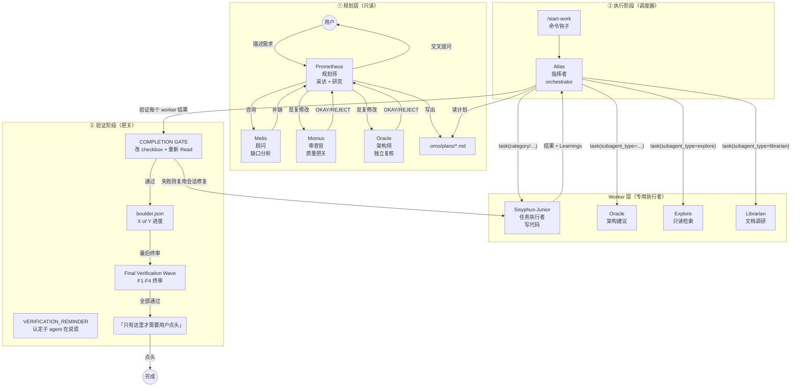

# OpenCode 魔法开关：plan-execute-verify 编排机制解剖

被面试官追问「**你的 Agent 是怎么防止它瞎改代码的？怎么保证它跑的每一步都是对的？**」的时候，很多人只能答出「我们让 LLM 自己链式思考、一步步改、然后用眼睛 review」。

但当你真的面对一个几万行的代码库，单靠一个主循环里的模型上下文去推，很快就会撞上三个墙：

- **上下文溢出**——对话历史越来越长，模型开始「忘掉」前面的范围与约束
- **认知漂移**——主 agent 一边读代码、一边写代码、一边查文档，角色混乱，越改越偏
- **验证缺口**——模型说「完成了」，但你没有任何机制去证明它真完成了，只能无脑相信它的「我测过了」

本系列前几篇已经把 OpenCode 的底子扒干净了：runLoop（[02-runLoop](/opencode/02-runloop)）、工具系统（[03-tools](/opencode/03-tools)）、Agent 系统（[05-agents](/opencode/05-agents)）、上下文架构（[06-context](/opencode/06-context)）。这一篇我们要回答一个更「工程化」的问题：

> **OpenCode 是怎么把「规划 → 执行 → 验证」组织成一个可落地、可恢复、可对抗模型幻觉的编排机制的？**

答案不只在 OpenCode 内核里，更在一个**基于 OpenCode 构建的开源插件——`oh-my-openagent`** 里被推到了极致。

这是一个把「一个单体 agent」重构成「一支有分工、有状态、有验证关卡的小团队」的完整案例。

看完这篇，你会 get 到四个问题：

- 第一，**plan / execute / verify 三个角色是怎么被拆成独立 Agent 的**——Prometheus 只做规划，Atlas 只做调度，Sisyphus-Junior 只做执行
- 第二，**「只读规划」是怎么被硬强制实施的**——不是靠提示词，而是靠 `tool.execute.before` 钩子 throw
- 第三，**「模型说做完了」怎么被验证的**——COMPLETION GATE + VERIFICATION_REMINDER 的对抗性验证协议
- 第四，**OpenCode 原生给了什么，插件又补了什么**——你能在原生 API 上实现同样的东西吗

我们会逐个拆，这次照旧不藏着掖着。


## 零、先认识一下这支队伍的成员

在直奔机制之前，值得先给这个插件的 agent 名片认一眼——因为它是理解后面所有分工的「人设表」，而且命名**中二到让人会心一笑**：它把一整支希腊神话天团塞进了 IDE 里。

`oh-my-openagent` 一共定义了 **11 个 agent**，主 primary 有 4 个、subagent 有 7 个：

| Agent | 定位 |
|-------|------|
| **Sisyphus** | 主 agent · 默认执行者 |
| **Hephaestus** | 主 agent · deep worker |
| **Prometheus** | 主 agent · **规划师** |
| **Atlas** | 主 agent · **指挥者 / dispatcher** |
| **Sisyphus-Junior** | subagent · 任务执行 worker |
| **Oracle** | subagent · 架构顾问 |
| **Explore** | subagent · 只读代码搜索 |
| **Librarian** | subagent · 文档 / OSS 调研 |
| **Metis** | subagent · 顾问 / 缺口分析 |
| **Momus** | subagent · 评审官 |
| **Multimodal-looker** | subagent · 视觉 / UI 审查 |

分工的逻辑其实很简洁：**Prometheus 只负责「策划」不负责「动手」，Atlas 一个人扛起整个计划的执行，Sisyphus-Junior 是埋头干活的 worker**。按使用的是「哪一类模型用在哪个角色」来配套（强的给规划 / 评审，轻量的给检索等），但这不是本节的要点——记住分工，后面看源码时就能对上号。

---

## 一、问题定义：为什么单循环 Agent 会撞墙

先想清楚一个问题：OpenCode 的 runLoop 本身已经是个「**感知→推理→行动→反馈**」的闭环了。那为什么还需要一个更外层的「plan-execute 编排」？

随便引一个典型翻车现场：

```
用户：给我把 auth 模块重构一下，顺便加个限流。
Agent：好，我先看一下代码...（读了 30 个文件）
Agent：我准备这样改：（写了一段计划）
Agent：开始改...（直接 Edit 了 10 个文件）
Agent：我加了个限流中间件，还写了个测试，应该没问题了。（结束）
```

问题在哪？

**1. 规划没有独立成「可签名、可复用、可持续」的工件。** 上面的「计划」只存在于模型自己的上下文里，用户没有机会逐条 review、修改、拦截。任务一长，计划就飘。

**2. 执行和规划挤在同一个上下文里。** 模型读代码、写计划、改代码、跑测试全在一个 session 里发生。上下文一长，最开始的「不要动数据库 schema」这种约束就被挤掉了——这就是**认知漂移**。

**3. 「验证」只靠模型自说自话。** 模型说「测过了」，但它没有独立于自己的动作来证明。一个被 prompt 固有偏置影响的模型，会不自觉地高估自己改的代码的质量。

所以真正工程化的解法是：**把「想」「做」「验」三个本来就不同的脑力负担，拆成三个不同的上下文/角色/agent，并用一个持久化的状态机把它们组装起来。** 这正是 `oh-my-openagent` 的整个产品内核。

它的核心抽象就一句话（来自官方调研文档 `docs/guide/orchestration.md`）：

> 把简单的 AI agent 变成一个协调的开发团队——**通过「规划与执行分离」**。

## 二、整体架构：三阶段 + 三角色

让我们画一张总图，先把「谁在什么阶段干什么」看清楚。



图里最值得注意的有两点：

1. **流程是「单向的、分层的」**：规划层只产出一个文件（`.omo/plans/*.md`），执行层只消费这个文件，验证层只认这个文件里的 checkbox。三层的「契约」是个**磁盘上的 Markdown 文件**，而不是进程间的内存对象。
2. **验证层存在一个「模型完成即说谎」的默认怀疑假设**——这个假设我们在第五节细讲。

下面按三个阶段，从源码逐行拆。

---

## 三、Plan 阶段：把「规划权」从执行权里剥出来

### 3.1 Prometheus：一个「只读 + 只能写 .omo/plans/*.md」的心智

在 `oh-my-openagent` 里，规划者是叫 **Prometheus** 的 agent（寓意「盗火者」）。它的定位在 `packages/prompts-core/prompts/prometheus/default.md` 里被写死：

> You are Prometheus, a planning consultant… You are a **PLANNER**. You read, search, and write only plan artifacts under `.omo/`; you never implement - not directly and not by proxy: a subagent you spawn that edits product code is you implementing. Plan mode is sticky: 'do X' / 'fix X' / 'just do it' all mean 'plan X' — execution belongs to a separate worker that only the user starts (such as `/start-work`), and no subagent you dispatch is ever that worker.

翻译过来：**规划师绝不能实现**。这种「实现必须由执行工作流来」的硬隔离，是整套编排的基石。它的权限配置（`packages/omo-opencode/src/agents/prometheus/system-prompt.ts:3-8`）：

```ts
PROMETHEUS_PERMISSION = { edit: "allow", bash: "allow", webfetch: "allow", question: "allow" }
```

注意，这里 `edit: "allow"` 是**全局**开放的——你光靠这个字段根本无法约束它只能写 plan 文件。真正的约束在**钩子（hook）**，也就是下一节那个会 throw 的 `prometheus-md-only` 钩子。

### 3.2 硬边界：`tool.execute.before` 钩子 throw，而不是「提示词劝退」

这是整套编排里「最狠」的地方，也是源码精读必须看的一行。`packages/omo-opencode/src/hooks/prometheus-md-only/hook.ts` 给每一个 `tool.execute.before` 挂了逻辑：

```ts
// packages/omo-opencode/src/hooks/prometheus-md-only/hook.ts
"tool.execute.before": async (input, output) => {
  const agentName = await getAgentFromSession(input.sessionID, ctx.directory, ctx.client)
  if (!isPrometheusAgent(agentName)) return            // 只有 Prometheus 才管

  if (TASK_TOOLS.includes(input.tool)) {
    // 若是 task/call_omo_agent → 给子 agent 注入"只读规划"警告
    ...
  }

  if (!BLOCKED_TOOLS.includes(input.tool)) return      // 非 Write/Edit 放行
  const filePath = output.args.filePath ?? ...          // 取要写的文件
  if (!isAllowedFile(filePath, ctx.directory)) {
    throw new Error(
      "[prometheus-md-only] Prometheus is a planning agent. "
      + "File operations restricted to .omo/*.md plan files only. "
      + "Do NOT route this change through a subagent either - "
      + "delegated implementation is still implementation."
    )
  }
  ...
}
```

关键点：

- **它是硬裁决，不是软约束。** 一旦 Prometheus 试图写 `.omo/plans/*.md` 之外的任何文件，钩子直接 `throw`。OpenCode 的工具执行会把这个异常当作该次工具调用的失败，写不出去。
- **它的范围判断在独立的 `path-policy.ts`**：`isAllowedFile()` 解析绝对路径，拒绝逃出工作区（`rel.startsWith("..")`），只允许路径含 `.omo` 段，且扩展名必须在 `ALLOWED_EXTENSIONS = [".md"]` 里。
- **它连「派子 agent 去改代码」也堵死了。** `TASK_TOOLS = ["task", "call_omo_agent"]`，任何 Prometheus 发起的委托，都会被打上 PLANNING_CONSULT_WARNING，提示子 agent「你在被一个只读规划师调用，请只提供规划建议，不要实现」。

这就把「规划只读」从「提示词劝告」升格成了「进程级硬约束」——这是每一个把 Agent 当产品做的工程师都该学的。

### 3.3 计划的「工件格式」：Markdown + 一串严格的 checkbox

一个好的规划，必须能被「机器判读」。`oh-my-openagent` 对 `.omo/plans/*.md` 的解析/验证逻辑在同一串正则里（`packages/boulder-state/src/plan-checklist.ts:5-12`）：

```ts
const TODO_HEADING_PATTERN = /^##[ \t]+TODOs(?:[ \t]+#+)?[ \t]*$/i
const FINAL_VERIFICATION_HEADING_PATTERN = /^##[ \t]+Final Verification Wave(?:[ \t]+#+)?[ \t]*$/i
const TODO_CHECKBOX_PATTERN = /^- \[([ xX])\] ([1-9]\d*\. .+)$/            // - [ ] 1. 限流
const FINAL_WAVE_CHECKBOX_PATTERN = /^- \[([ xX])\] (F[1-9]\d*\. .+)$/i   // - [ ] F1. 计划合规审查
```

所以一份「合法」的 `.omo/plans/*.md` 至少要有两大块（大小写不敏感）：

```markdown
# auth-refactor - Work Plan

## TL;DR
（给人看的一句话）

## Scope
## Verification strategy
## Execution strategy

## TODOs
- [ ] 1. 抽出认证服务
- [ ] 2. 加限流中间件        ← 每个实现任务，裸数字编号 `N.`

## Final Verification Wave
- [ ] F1. 计划合规审查
- [ ] F2. 安全边界审查
- [ ] F3. 回归风险审查   ← 终审任务，前缀 `F<n>.`
```

两个细节特别妙：

1. **`Progress` 不是单独一张数据库表**。`X of Y` 进度是实时解析 Markdown 里 checkbox 数出来的（`getPlanProgress()` → `parsePlanChecklist()`）。所以「Plan 文件本身就是唯一事实源（source of truth）」，任何钩子都强制重新 `Read` 计划文件来判断进度，而不是看图。

2. **每个实现任务还可以带一行 `Recommended task executor category`**，用来告诉调度器该用哪一类 worker 去做（`quick`/`unspecified-low`/`deep`/…）。这就是「计划」（策略）和「执行委派」（战术）通过文件形成松耦合的衔接。

### 3.4 规划不是一次过的：采访 + 顾问 + 双评审

`oh-my-openagent` 把「把清楚的计划写出来」拆成了更细的面试式流程：

- **Prometheus（规划师）**：先采访用户、先读代码，把需求模糊点问清楚，产出计划草案。
- **Metis（顾问）**：强制做缺口分析——它专门抓规划师的 **ADHD 工作记忆** 里没落到纸面上的隐形假设、缺失验收标准、AI-slop（过度设计、范围蔓延）。
- **Momus + Oracle（评审）**：在高精度模式下，两人独立 review 计划。Momus 负责「计划的质量门」（只拒绝已证实的拦路虎），Oracle 负责「最强推理模型的独立复核」。任何一位说 REJECT，Prometheus 都要修完问题再重新提交，没有重试上限。

> 这也是一个很实际的工程取舍：**Prometheus / Metis 等规划角色可以配对「强推理或多模态」的中坚模型来压低成本，而评审环节的 Momus / Oracle 才值得上最强推理模型**。花钱买清楚，而不是买蛮力。规划阶段多磨一个字的边界，执行阶段就能少返工十行代码。

**Plan 阶段的产出永远只有一个东西：一个通过校验的 `.omo/plans/*.md` 文件。** 它像一个契约，把「想清楚了」这件事物化了，交给下一阶段。

---

## 四、Execute 阶段：/start-work → boulder → Atlas 指挥 + worker 执行

规划完了，但**谁去执行、按什么顺序、怎么恢复中途崩溃**？这是 execute 阶段的核心。

### 4.1 `/start-work` 钩子：把 session agent 切成 Atlas

执行有一个跨会话的入口命令 `/start-work`（`packages/omo-opencode/src/hooks/start-work/start-work-hook.ts`）。它一旦识别到命令文本里带 `You are starting an Atlas work session.` 这类标记，就会：

```ts
// start-work-hook.ts（节选，关键 4 行）
const activeAgent = isAgentRegistered("atlas") ? "atlas" : "sisyphus"
updateSessionAgent(input.sessionId, activeAgent)          // ① 把 session agent 切换成 Atlas
...
const existingState = readBoulderState(ctx.directory)      // ② 读 boulder 状态
const { planName, ... } = parseUserRequest(promptText)     // ③ 解析 --worktree/--make-pr/--ship 等 flag
```

这个钩子里还做了「INIT vs RESUME」的双分支（`/start-util` / `plan-discovery-context.ts`）：

- **INIT**（没有现存工作）：找 `.omo/plans/` 里最近的计划 → 调 `createBoulderState()` 建一个新 `boulder.json` → 从任务 1 开始执行。
- **RESUME**（已有 boulder.json 且没做完）：读出 `Progress`（X/Y 完成）→ 注入「RESUMING existing work」提示 → Atlas 从断点继续。

> **为什么「崩了能续上」这么重要？** 因为 LLM 会话极其脆弱（进程崩、关机、token 超限被截断都算）。你不可能接受「刚写了一半的代码，因为重启就全部重讲一遍」。把进度持久化在磁盘的 `boulder.json` 里，就是一种「工程式的状态恢复」。

### 4.2 boulder.json：编排的状态机

`boulder.json` 是 execute/verify 阶段的状态中枢（`packages/boulder-state/src/storage/write-state.ts`）：

```ts
createBoulderState(...)     // => { schema_version: 2, works: { <workId>: { status: "active",
                           //      session_ids, started_at, plan_name, task_sessions: {} } } }
```

- `works` 是一个 map，键是 `work_id`，值描述一次工作：**状态（active）、参与的 session、开始时间、对应计划名、每个任务和 session 的映射**。
- 它同时还自动在 `.omo/` 下生成一个 `.omo/.gitignore`（`*`，只放行 `rules/`），既保护状态文件不被拖进 git，也标注「这是一片独立的工作区」。

这样一来，「现在做哪件事、做了几件、谁在做」就是**可查询、可恢复**的，而不是藏在某个 LLM 的上下文里。

### 4.3 Atlas：指挥者，从不亲自动手

`Atlas` 是 execute 阶段的主 orchestrator。强调「**指挥者不干活**」，看它的职责清单（`docs/guide/orchestration.md`）：

| Atlas 可以（直接做） | Atlas 必须委派（不能碰） |
|---|---|
| 读文件理解上下文 | 写/编辑代码文件 |
| 跑命令验证结果 | 修 bug |
| 用 `lsp` 查错误 | 创建测试 |
| grep/glob/ast-grep 检索 | git commit |

它靠一个工具箱 `task()` 把工作分发给 worker（`packages/omo-opencode/src/tools/delegate-task/`）：

- `task(category="deep")` → 走 **Sisyphus-Junior**，按「意图」的语义类别路由模型
- `task(subagent_type="explore")` → 派那个只读检索 agent
- `task(subagent_type="oracle")` → 架构咨询

**Category 是本插件最有意思的设计之一**。它不叫「用 gpt-5 跑这种任务」，而是「**描述意图**」（`docs/guide/orchestration.md`）：

```ts
// OLD：模型名带来分布偏误
task({ agent: "gpt-5.6-sol", prompt: "..." })     // 模型知道自己的"身份"
// NEW：category 描述意图
task({ category: "ultrabrain", prompt: "..." })  // "战略性思考"
task({ category: "visual-engineering", prompt: "..." }) // "交给会做 UI 的"
task({ category: "quick", prompt: "..." })       // "快点搞定"
```

`category` → 模型 的映射在 `categories.ts` 里按「user override > 内置默认」解析——比如 `visual-engineering` 走多模态模型、`deep` 走强推理模型、`quick` 走低延迟模型。这实现了「**一处声明意图，多路模型路由**」的解耦。

一条更狠的限制：`sisyphus-junior` 是**不能自己再委派的**（preflight 里会拒绝 `task(subagent_type="sisyphus-junior")` 这种请求）。这样 worker 是「单层」的——执行者没有递归，也就没有递归爆炸。

### 4.4 Sisyphus-Junior：执行、专注、但用 todo 续命

worker 主力叫 `Sisyphus-Junior`（西西弗斯，推石头——命名暗示「如果不 push，石头就滚回山脚」，系统会提醒它把活干完）：

- `Focused`：不能委派（被 task 工具挡住）
- `Disciplined`：被迫 obsessively 跟踪 todo
- `Verified`：完成前必须过 `lsp_diagnostics`
- `Constrained`：不能改计划文件（只读）

它的「不要半途而废」靠一个系统提示（来自公开文档的 `System Reminder` 机制）去「推石头」：

```
[SYSTEM REMINDER - TODO CONTINUATION]
You have incomplete todos! Complete ALL before responding:
- [ ] Implement user service  ← IN PROGRESS
- [ ] Add validation
- [ ] Write tests
DO NOT respond until all todos are marked completed.
```

这一整套「规划者只写、调度者只指派、执行者只实现」的分权，就是 **plan-execute**（第二阶段应用）的骨血。

---

## 五、Verify 阶段：如何不被「模型说完成了」骗到

Execute 只解决「按计划做」，但无法保证「做的对」。Verify 阶段是 `oh-my-openagent` 里最出彩、也最反直觉的部分——**它默认模型会撒谎（或者至少会高估自己）**。

### 5.1 COMPLETION GATE：进度不是「子 agent 说完了」就算

每次一个 worker 干完一个任务，Atlas 都会给它一个 **COMPLETION GATE**（`verification-reminders.ts` `buildCompletionGate`），核心是：

```
你的完成度只有在完成以下全部时才会被记录：
1) Edit 计划文件 .omo/plans/<name>.md：把该任务 - [ ] → - [x]
2) 再 Read 一次计划文件：确认 checkbox 数真变了
3)（在完成 1、2 之前）不允许再调 task()
```

看出来了吗？**「成功」的唯一证据，是一个磁盘文件里的 checkbox 从「未勾选」变成「已勾选」**。它故意不让你拿「我改完代码了」这种话当完成，而强迫你去戳更新那个全局事实。任何失败都用 `task(task_id=...)` 复用同一个子会话去修，而不是开新会话（保持上下文，省 token）。

### 5.2 VERIFICATION_REMINDER：默认模型在说谎

这才是验证的灵魂。在 `system-reminder-templates.ts` 里，`VERIFICATION_REMINDER` 的开头是：

> **THE SUBAGENT JUST CLAIMED THIS TASK IS DONE. THEY ARE PROBABLY LYING.**
> Assume the work is broken until YOU prove otherwise.

跟着是四段「证明机制」：

- **PHASE 1: READ THE CODE** — `git diff --stat -- ':!node_modules'`、Read 每个被改的文件、Grep 找 TODO/FIXME/HACK、`as any`、`@ts-ignore`、空 catch……
- **PHASE 2: RUN AUTOMATED CHECKS + lsp_diagnostics**（每个改动文件 0 新增错误）、跑测试、build/typecheck 退出码 0
- **PHASE 3: HANDS-ON QA** — 前端跑 /playwright、TUI/CLI 用交互 bash、后端用 curl
- **PHASE 4: GATE DECISION** —「我能解释每个改动行的作用？我真的用眼睛看到它工作了吗？有把握没破坏别的吗？全部 YES 才算过，否则 REJECT。」

它用一种强对抗的姿态，把「验证」从一个选项变成了**关卡**。而这一切都不是靠另一个模型二次审查，而是靠同一个 Atlas 用**确定性工具**（diff + 读 + 跑 lsp/测试）去获取证据。

> 这里体现了本系列的一个反复主题：**真正安全的「验证」不是靠「更强模型」看一遍，而是靠「会跑的确定性工具」去亲手把证据链抓在手里。** ——这跟 OpenCode 对 `bash` 的信任是一脉相承的。

### 5.3 终审 Final Wave + 唯一的用户审批点

计划文件里开头那个 `## Final Verification Wave`（就是那些以 `F1.`、`F2.` 开头的终审勾选行）就是**终审任务**。当所有实现 todo 都完成后，Atlas 才会转入 F1-F4 终审。

而且，`buildFinalWaveFinalApprovalReminder` 明确说：这是整套流程里**唯一需要用户交互审批**的时刻——

> This is the ONLY point where approval-style user interaction is required…
> Ask for explicit user approval before editing any remaining final-wave checkboxes or marking the plan complete.
> **DO NOT mark the final-wave checkbox complete until the user explicitly says okay.**

所以整个流程的「人机协同点」是非常克制的：**前面的执行、自动验证都不打扰你；只在 Final Wave 收尾时，把终审结论 + 剩余风险交给你做最终裁决。** 这就避免了两端的问题——既不让机器脱离人判断，也不让人反复被打断。

### 5.4 防跑飞的第三重保险：Anti-runaway

执行阶段还有一个防「停不下来」的hook（`atlas/tool-progress.ts`）：

- `MAX_BOULDER_CONTINUATION_NO_TOOL_PROGRESS = 3`：如果连续 3 次 idle 自动续跑都没有真正的 `bash/edit/write` 进度，就判定 `stalled` 并中断续跑。

这避免了 Atlas「假装在干活、实际上只是在转圈补 token」的死循环。

---

## 六、OpenCode 原生 vs oh-my-openagent：到底谁补了谁

现在把「插件做的高级编排」和「OpenCode 原生能力」对着比——这能回答一个最常见的困惑：**单靠 OpenCode 你能不能自己做 plan-execute-verify？**

研究员档（librarian）已结合 opencode 官方文档和 `anomalyco/opencode`（dev 分支）核实了原生的机制：

| 能力点 | OpenCode 原生能做什么 | oh-my-openagent 补了什么 |
|---|---|---|
| **Plan 阶段** | `plan` agent（`permission.edit: "*": "deny"` 仅 `.opencode/plans/*.md` 放行）| 把「规划权」进一步隔离到 Prometheus，并用 `prometheus-md-only` 钩子**硬 throw** 杜绝任何产品代码写入 |
| **Plan 工件** | `plan_exit` 后把 `.opencode/plans/*.md` 切回 build agent | 计划文件有规范格式（TODOs + Final Verification Wave）+ 校验钩子 | 
| **Execute** | `AgentLoop`（`SessionProcessor.process` → `LLMEvent` 流）+ `plan`/`tool` | `/start-work` 钩子 + boulder 状态机 + Atlas 委派 + worker 不可递归 |
| **上下文恢复** | Snapshot（`snapshot.track `/`patch`）支持 step 级 diff / revert | Continue 崩溃后读 boulder.json 「断点续命」 |
| **验证** | `lsp` 工具（原生工具名是 `lsp`，诊断是 LSP event）、模型自发跑 bash test | 强化「Completion Gate + Verifier」的硬性过程证明——用 `lsp_diagnostics` 等确定性工具做一次性验证，而不是只靠模型自说自话 |
| **插件挂点** | 官方钩子 30+（`tool.execute.before/after`、`session.idle`、`session.compacted`……）|全部编排都挂在同这些原生 hook 上 |

翻译成一句话：

> OpenCode 原生把「能不能做成」的**底层能力**（工具、Agent、快照、钩子）都准备好了，但它本身「**不替你决定要不要严格分离规划/执行/验证**」。`-plugin` 的价值，是在原生钩子上把「会跑、能恢复、能被证明」编排成一整套开箱即用的能力层。

如果你要自己照着实现一遍，你需要的 OpenCode 原生三样：

1. 一个**只读 plan agent**（原生就能做，但你要自己用钩子去硬约束写入范围）；
2. 一套 `tool.execute.before / after` 钩子（原生的），用来当「守门员」；
3. 一个**持久化**状态载体（比如你自己的 `.json`，或者直接复用 `Session` 的 snapshot）。

换句话说：**机制是原生给的，编排是插件定的。** 这正是可拓展性最好的证明——插件并不是修改 OpenCode 内核，而是在它公开的 hook 面上叠加策略。

---

## 七、工程哲学：为什么「拆角色」能对抗认知漂移

回顾整篇文章，最值得记住的不是某一个实现，而是三条工程哲学：

1. **角色分离 = 对抗上下文污染。** 规划者只读、执行者只写、验证者只认证据。每种角色在自己的「小头」里工作是清晰的，不会因为上下文里杂糅了「我既要设计又要写又要测」而崩塌。
2. **磁盘上的文件是「多 agent 之间的通信协议」。** plan 用 Markdown、progress 用 checkbox、进度在 boulder.json。这不是「为了让 agent 能解析」，更多是为了**人能 review、机器能校验、崩溃能恢复**——信息的载体是文本而不是内存，天然可审计、可复用。
3. **验证要「可证明」，不只「可相信」。** 用 diff + 读源码 + 跑测试 + 看退出码来证明「做了且做对了」，而不是「模型说做完了」。「最终用户一个审批」放在终审后，是最克制的关注点。

这套设计的本质是：**用一个可测试的状态机，去给一个不可靠的 LLM 当脚手架。** 它的骨架（规划-执行-验证）是通用的，哪怕你不装插件，也能在原生 OpenCode 上用我们第六节提到的钩子最小复刻一个玩。

而它给我们的现实启发是：**当你发现「连自己都信不过 agent 的一次性输出」的时候，正确答案不是「换更强模型」，而是「构建一个能自我验证的角色编排」。**

## 章节小测

<script setup>
const q = [
  {
    question: 'Prometheus「只读规划」到底靠哪一层机制真正闭环？',
    options: [
      '靠 permission 把 Write/Edit 的 action 全部设为 deny，并在插件注册时彻底摘除这两个工具',
      '挂 tool.execute.before：凡写入路径不含 `.omo/*.md` 即 throw，子 agent 代写也拦截',
      '让规划师换用几乎不具备代码修改倾向的保守小型模型，从能力端压制其写代码冲动',
      '`plan_exit` 工具并不真正限制写入，它只是让规划期结束时把写权限交回 build agent，从而在形式上保证规划期间绝不落盘任何产品代码'
    ],
    correct: 1,
    explanation: '钩子 + 委托拦截：`prometheus-md-only` 在 tool.execute.before 里用 `isAllowedFile()` 裁定，非 `.omo/*.md` 直接 throw；并对 `task`/`call_omo_agent` 注入规划警告，堵死派子 agent 代写。'
  },
  {
    question: 'boulder.json 在 plan-execute-verify 里承担的核心职责是什么？',
    options: [
      '持久化 active 计划、session_ids 与任务进度，使 /start-work 能按 INIT 或 RESUME 双分支续跑',
      '把每次触发 /start-work 前的完整对话归档，供事后进行逐字的全量回放与审计追踪核对',
      '为每个 worker 的每一次提交都建立文件 hash 索引，供 step 级 revert 在发生意外误覆盖之后，能依据此精确地把现场回滚到上一个可用状态',
      '将整份计划文件拷入独立索引，并为每一条 checkbox 进度再单独建一张计数统计表来做'
    ],
    correct: 0,
    explanation: '记录 active 计划、session_ids、进度等，是 /start-work 判断 INIT vs RESUME 的事实源。进度本身不另存表，实时解析计划文件 checkbox 得出。'
  },
  {
    question: 'VERIFICATION_REMINDER 对 worker 完成度的默认假设是什么？',
    options: [
      '假定子 Agent 始终诚实可信，其完成度仅凭口头声明即可被直接放行，并推进到队列里的下一项任务',
      '默认子 Agent 高估完成度，须以 diff/读码/lsp/跑测试等确定性证据过了关卡才算完成',
      '触发一个更强推理的独立模型，对该输出再做一次更高成本的语义审查来兜底判断',
      '同一轮 turn 反复执行到退出码全部归零，用重试轮数来折算其所声称的证据质量'
    ],
    correct: 1,
    explanation: '开头即假设「THE SUBAGENT IS PROBABLY LYING」，须用确定性工具（git diff、读码、lsp_diagnostics、跑测试）取舍，而非二次模型审查或模型自述。'
  },
  {
    question: '这套编排里唯一需要用户交互审批的时刻在哪？',
    options: [
      '每个 worker 交付后都得更用户逐条手动勾选确认对应 checkbox 的完成状态与细节',
      '每次把变更写入目标文件之前，对疑似「风险」的输出路径都即时申请授权才放行',
      '等全部 Final Verification Wave 终审通过、准备标记 F 项并整体完成的那一刻',
      '在每次正式执行 /start-work 之前，都要重新读取一次 boulder 的进度，并将其当作本次新的授权依据'
    ],
    correct: 2,
    explanation: '规划、执行与自动验证全程不打扰；唯独 Final Wave 收尾时才把终审结论 + 剩余风险交用户最终确认，再动 checkbox 或标记整体完成。'
  },
  {
    question: 'OpenCode 原生能力与插件的分工关系，哪个描述最准确？',
    options: [
      'OpenCode 本身缺乏工具与钩子能力，因此这个插件必须 fork 内核源码，才能完整补齐这一整套编排',
      '原生 plan/AgentLoop/snapshot/lsp 与钩子提供底层，插件叠加策略成为一个状态机',
      '插件会替换并接管 runLoop，因此它与原生不兼容、不能在同一个运行时共存并行',
      'OpenCode 内置了三阶段编排，上面的插件无非是给这早已存在的机制套了一层皮肤'
    ],
    correct: 1,
    explanation: '原生有 plan agent、AgentLoop、snapshot、lsp 及 30+ 钩子；插件不侵内核，仅在公开 hook 叠「角色分离 + 持久化 + 验证关卡」。'
  },
  {
    question: 'Sisyphus-Junior 为何被设计成「不能递归委派 task」？',
    options: [
      '纯粹为了省 token，因递归会让每次调用反复命中过期的 cached-prefix 从而白白多耗开销',
      '防 subagent 递归爆炸：执行者被委派一次即只做实现，递归调度权由 Atlas 单一持有',
      '受运行时 proxied 通道限制，task 工具本身并不支持子任务再对子任务做嵌套委派调用',
      '避免多个 worker 相互复用同名 Session，使其各自的编辑上下文随之互相污染而错乱状态'
    ],
    correct: 1,
    explanation: 'preflight 拒绝再调 task。执行层保持单层，杜绝递归 subagent，使状态管理与错误恢复复杂度不呈指数级上升，调度权集中于 Atlas。'
  }
]
</script>

<Quiz :questions="q"></Quiz>
```